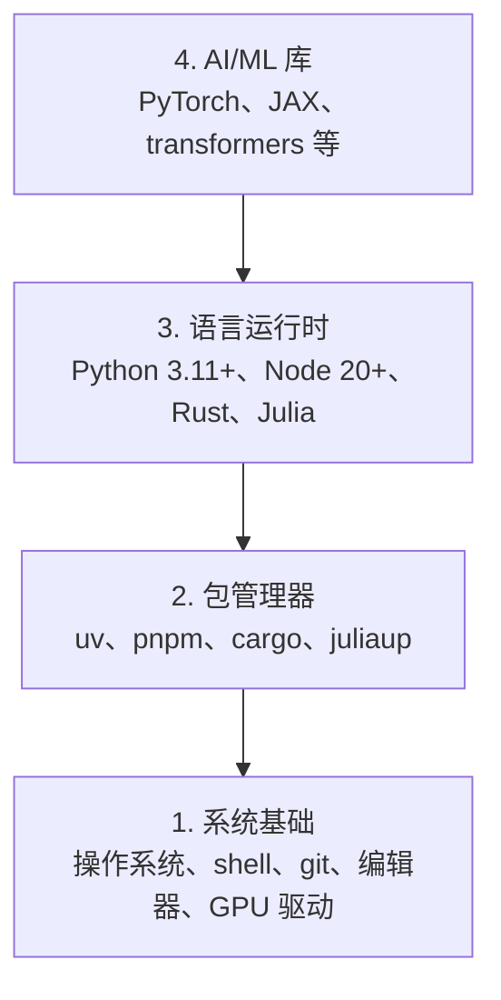

# 开发环境 (Dev Environment)

> 你的工具塑造你的思维。一次设置好，正确设置。

**类型：** 构建 (Build)
**语言：** Python、Node.js、Rust
**前置要求：** 无
**时间：** 约 45 分钟

## 学习目标

- 从零搭建 Python 3.11+、Node.js 20+ 和 Rust 工具链
- 配置虚拟环境 (virtual environments) 和包管理器以实现可复现构建
- 通过 CUDA/MPS 验证 GPU 访问并运行测试张量操作
- 理解四层技术栈：系统层、包层、运行时层、AI 库层

## 问题

你即将通过 200 多节课学习 AI 工程，涉及 Python、TypeScript、Rust 和 Julia。如果你的环境有问题，每节课都会变成与工具的斗争，而不是学习。

大多数人跳过环境设置。然后花数小时调试导入错误、版本冲突和缺失的 CUDA 驱动。我们要一次性正确地完成这件事。

## 概念

AI 工程环境有四个层次：



我们自底向上安装。每一层都依赖于它下面的层。

## 构建

### 步骤 1：系统基础

检查你的系统并安装基础工具。

```bash
# macOS
xcode-select --install
brew install git curl wget

# Ubuntu/Debian
sudo apt update && sudo apt install -y build-essential git curl wget

# Windows（使用 WSL2）
wsl --install -d Ubuntu-24.04
```

### 步骤 2：使用 uv 安装 Python

我们使用 `uv`——它比 pip 快 10-100 倍，并能自动处理虚拟环境。

```bash
curl -LsSf https://astral.sh/uv/install.sh | sh

uv python install 3.12

uv venv
source .venv/bin/activate  # Windows 上使用 .venv\Scripts\activate

uv pip install numpy matplotlib jupyter
```

验证：

```python
import sys
print(f"Python {sys.version}")

import numpy as np
print(f"NumPy {np.__version__}")
a = np.array([1, 2, 3])
print(f"Vector: {a}, dot product with itself: {np.dot(a, a)}")
```

### 步骤 3：使用 pnpm 安装 Node.js

用于 TypeScript 课程（智能体 (agents)、MCP 服务器、Web 应用）。

```bash
curl -fsSL https://fnm.vercel.app/install | bash
fnm install 22
fnm use 22

npm install -g pnpm

node -e "console.log('Node', process.version)"
```

### 步骤 4：Rust

用于性能关键的课程（推理、系统编程）。

```bash
curl --proto '=https' --tlsv1.2 -sSf https://sh.rustup.rs | sh

rustc --version
cargo --version
```

### 步骤 5：Julia（可选）

用于 Julia 擅长的数学密集型课程。

```bash
curl -fsSL https://install.julialang.org | sh

julia -e 'println("Julia ", VERSION)'
```

### 步骤 6：GPU 设置（如果你有 GPU）

```bash
# NVIDIA
nvidia-smi

# 安装带 CUDA 的 PyTorch
uv pip install torch torchvision torchaudio --index-url https://download.pytorch.org/whl/cu124
```

```python
import torch
print(f"CUDA available: {torch.cuda.is_available()}")
if torch.cuda.is_available():
    print(f"GPU: {torch.cuda.get_device_name(0)}")
```

没有 GPU？没问题。大多数课程可以在 CPU 上运行。对于训练密集型的课程，使用 Google Colab 或云 GPU。

### 步骤 7：验证一切

运行验证脚本：

```bash
python phases/00-setup-and-tooling/01-dev-environment/code/verify.py
```

## 使用

你的环境现在已经为本课程中的每一节课做好了准备。以下是各语言的使用场景：

| 语言 | 使用阶段 | 包管理器 |
|------|---------|----------|
| Python | 阶段 1-12（机器学习、深度学习、NLP、视觉、音频、LLM） | uv |
| TypeScript | 阶段 13-17（工具、智能体、群体智能、基础设施） | pnpm |
| Rust | 阶段 12、15-17（性能关键系统） | cargo |
| Julia | 阶段 1（数学基础） | Pkg |

## 交付

本课产出一个验证脚本，任何人都可以运行它来检查自己的环境设置。

参见 `outputs/prompt-env-check.md`，其中包含一个帮助 AI 助手诊断环境问题的提示词。

## 练习

1. 运行验证脚本并修复所有失败项
2. 为本课程创建一个 Python 虚拟环境并安装 PyTorch
3. 用四种语言各写一个 "hello world" 并分别运行
