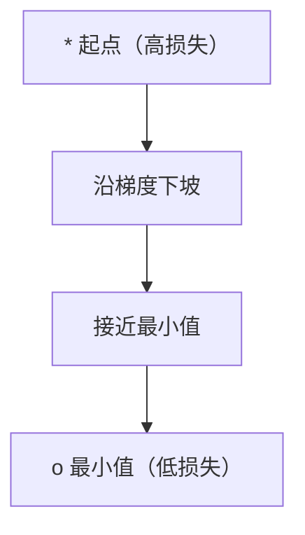
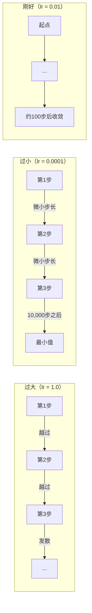
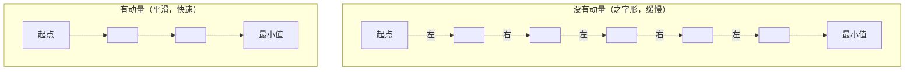
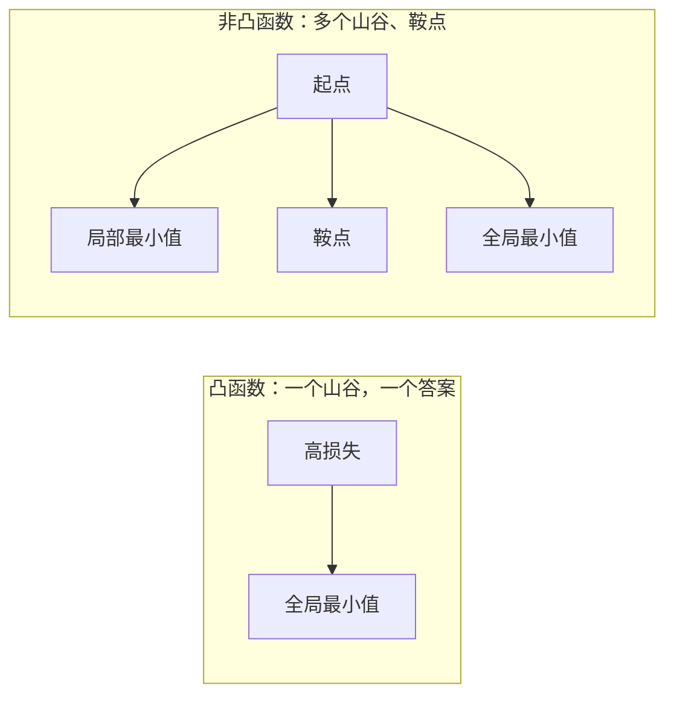
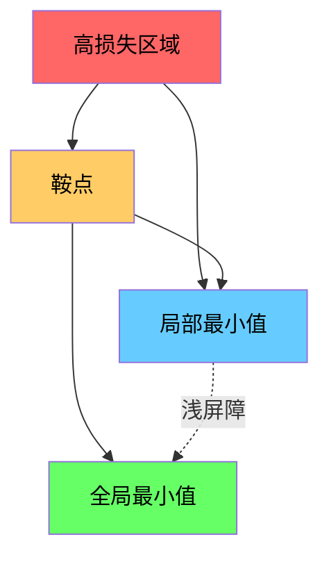

# 优化 (Optimization)

> 训练一个神经网络不过是在寻找山谷的谷底。

**类型：** 构建 (Build)
**语言：** Python
**前置要求：** 第一阶段，第04-05课（导数、梯度 (Derivatives, Gradients)）
**时间：** 约75分钟

## 学习目标

- 从零实现普通梯度下降、带动量的随机梯度下降 (SGD with momentum) 以及 Adam (Adaptive Moment Estimation)
- 在 Rosenbrock (罗森布罗克) 函数上比较优化器的收敛性能，并解释为什么 Adam 对每个权重使用自适应学习率
- 区分凸 (convex) 损失地形和非凸 (non-convex) 损失地形，并解释高维空间中鞍点 (saddle point) 的作用
- 配置学习率调度策略（阶梯衰减 (step decay)、余弦退火 (cosine annealing)、预热 (warmup)）以实现训练稳定性

## 问题

你有一个损失函数。它告诉你你的模型有多错误。你有梯度。它们告诉你哪个方向会让损失变得更糟。现在你需要一个下坡的策略。

朴素的方案很简单：沿着梯度的反方向走。步长由一个称为学习率的数值来控制。重复。这就是梯度下降，并且它确实有效。但“有效”有很多前提条件。学习率太大，你会直接越过谷底，在两侧墙壁之间弹跳。学习率太小，你会爬行数千步才到达答案。碰到一个鞍点，即使你还没找到最小值，也会停止前进。

深度学习中的每一个优化器都在回答同一个问题：你如何更快、更可靠地到达山谷的谷底？

## 概念

### 优化是什么

优化是寻找最大（或最小）化某个函数的输入值的过程。在机器学习中，这个函数就是损失函数。输入值就是模型的权重。训练就是优化。

```
minimize L(w) 其中：
  L = 损失函数
  w = 模型权重（可能有数百万个参数）
```

### 梯度下降（vanilla / 普通版）

最简单的优化器。计算损失对每个权重的梯度。沿着梯度反方向移动每个权重。步长由学习率控制。

```
w = w - lr * gradient
```

这就是整个算法。一行代码。



### 学习率：最重要的超参数

学习率控制步长大小。它决定了收敛的一切。



没有一个公式可以算出正确的学习率。你需要通过实验来寻找。常见的起始值：Adam 用 0.001，带动量的 SGD 用 0.01。

### SGD vs 批量 vs 小批量

vanilla 梯度下降在计算整个数据集的梯度后才迈出一步。这叫做批量梯度下降。它稳定但慢。

随机梯度下降 (Stochastic Gradient Descent, SGD) 在单个随机样本上计算梯度，然后立即迈出一步。它充满噪声但快。

小批量梯度下降 (Mini-batch Gradient Descent) 取折衷。先在一小批样本（32、64、128、256个样本）上计算梯度，然后迈出一步。这是实际中大家都在使用的方式。

| 变体 | 批量大小 | 梯度质量 | 每步速度 | 噪声 |
|---------|-----------|-----------------|---------------|-------|
| 批量 GD | 整个数据集 | 精确 | 慢 | 无 |
| SGD | 1个样本 | 非常嘈杂 | 快 | 高 |
| 小批量 | 32-256 | 良好估计 | 平衡 | 中等 |

SGD 和小批量中的噪声并不是缺陷。它有助于逃离浅的局部最小值 (local minima) 和鞍点 (saddle points)。

### 动量 (Momentum)：滚下山坡的球

vanilla 梯度下降只关注当前梯度。如果梯度呈之字形（在狭窄的山谷中很常见），前进速度就会很慢。动量通过将过去的梯度累积到一个速度项中来解决这个问题。

```
v = beta * v + gradient
w = w - lr * v
```

类比：一个球滚下山坡。它不会在每一个小凸起处停下再重新开始。它在一致的方向上积累速度，并抑制振荡。



`beta`（通常为0.9）控制保留多少历史信息。更大的 beta 意味着更多的动量，路径更平滑，但对方向变化的响应更慢。

### Adam：自适应学习率

不同的权重需要不同的学习率。一个很少得到大幅梯度的权重在最终得到梯度时应该迈出更大的步伐。一个持续得到大幅梯度的权重应该迈出更小的步伐。

Adam (Adaptive Moment Estimation，自适应矩估计) 对每个权重跟踪两个量：

1. 一阶矩 (m)：梯度的运行平均值（类似动量）
2. 二阶矩 (v)：梯度平方的运行平均值（梯度幅度）

```
m = beta1 * m + (1 - beta1) * gradient
v = beta2 * v + (1 - beta2) * gradient^2

m_hat = m / (1 - beta1^t)    偏置校正 (bias correction)
v_hat = v / (1 - beta2^t)    偏置校正 (bias correction)

w = w - lr * m_hat / (sqrt(v_hat) + epsilon)
```

除以 `sqrt(v_hat)` 是关键洞察。梯度大的权重会被一个很大的数值除（有效步长小）。梯度小的权重会被一个很小的数值除（有效步长大）。每个权重都获得自己的自适应学习率。

默认超参数：`lr=0.001, beta1=0.9, beta2=0.999, epsilon=1e-8`。这些默认值对大多数问题都能很好地工作。

### 学习率调度

固定的学习率是一种折衷。在训练早期，你希望迈大步以快速前进。在训练后期，你希望迈小步以在最小值附近进行精细调节。

常见调度策略：

| 调度 | 公式 | 使用场景 |
|----------|---------|----------|
| 阶梯衰减 (Step decay) | lr = lr * factor 每 N epochs | 简单，手动控制 |
| 指数衰减 (Exponential decay) | lr = lr_0 * decay^t | 平滑下降 |
| 余弦退火 (Cosine annealing) | lr = lr_min + 0.5 * (lr_max - lr_min) * (1 + cos(pi * t / T)) | Transformer、现代训练 |
| 预热 + 衰减 (Warmup + decay) | 线性上升，然后衰减 | 大模型，防止早期不稳定 |

### 凸 vs 非凸

一个凸函数 (convex function) 只有一个最小值。梯度下降总能找到它。像 `f(x) = x^2` 这样的二次函数是凸的。

神经网络的损失函数是非凸的。它们有许多局部最小值、鞍点和平坦区域。



实际上，高维神经网络中的局部最小值极少成为问题。大多数局部最小值的损失值都接近全局最小值。鞍点（在某些方向平坦，在另一些方向弯曲）才是真正的障碍。动量和来自小批量的噪声有助于逃离它们。

### 损失地形可视化

损失是所有权重的函数。对于有100万个权重的模型，损失地形存在于1,000,001维空间中。我们通过选择权重空间中的两个随机方向，沿这些方向绘制损失值来可视化它，得到一个2D曲面。



尖锐最小值泛化能力差。平坦最小值泛化能力好。这就是为什么带动量的 SGD 在最终测试准确率上往往优于 Adam 的原因之一：其噪声阻止了收敛到尖锐的最小值。

## 构建它

### 步骤1：定义测试函数

Rosenbrock (罗森布罗克) 函数是一个经典的优化基准测试函数。它的最小值在 (1, 1)，位于一个狭窄弯曲的山谷中——容易找到但很难沿着山谷前进。

```
f(x, y) = (1 - x)^2 + 100 * (y - x^2)^2
```

```python
def rosenbrock(params):
    x, y = params
    return (1 - x) ** 2 + 100 * (y - x ** 2) ** 2

def rosenbrock_gradient(params):
    x, y = params
    df_dx = -2 * (1 - x) + 200 * (y - x ** 2) * (-2 * x)
    df_dy = 200 * (y - x ** 2)
    return [df_dx, df_dy]
```

### 步骤2：vanilla 梯度下降

```python
class GradientDescent:
    def __init__(self, lr=0.001):
        self.lr = lr

    def step(self, params, grads):
        return [p - self.lr * g for p, g in zip(params, grads)]
```

### 步骤3：带动量的 SGD

```python
class SGDMomentum:
    def __init__(self, lr=0.001, momentum=0.9):
        self.lr = lr
        self.momentum = momentum
        self.velocity = None

    def step(self, params, grads):
        if self.velocity is None:
            self.velocity = [0.0] * len(params)
        self.velocity = [
            self.momentum * v + g
            for v, g in zip(self.velocity, grads)
        ]
        return [p - self.lr * v for p, v in zip(params, self.velocity)]
```

### 步骤4：Adam

```python
class Adam:
    def __init__(self, lr=0.001, beta1=0.9, beta2=0.999, epsilon=1e-8):
        self.lr = lr
        self.beta1 = beta1
        self.beta2 = beta2
        self.epsilon = epsilon
        self.m = None
        self.v = None
        self.t = 0

    def step(self, params, grads):
        if self.m is None:
            self.m = [0.0] * len(params)
            self.v = [0.0] * len(params)

        self.t += 1

        self.m = [
            self.beta1 * m + (1 - self.beta1) * g
            for m, g in zip(self.m, grads)
        ]
        self.v = [
            self.beta2 * v + (1 - self.beta2) * g ** 2
            for v, g in zip(self.v, grads)
        ]

        m_hat = [m / (1 - self.beta1 ** self.t) for m in self.m]
        v_hat = [v / (1 - self.beta2 ** self.t) for v in self.v]

        return [
            p - self.lr * mh / (vh ** 0.5 + self.epsilon)
            for p, mh, vh in zip(params, m_hat, v_hat)
        ]
```

### 步骤5：运行并比较

```python
def optimize(optimizer, func, grad_func, start, steps=5000):
    params = list(start)
    history = [params[:]]
    for _ in range(steps):
        grads = grad_func(params)
        params = optimizer.step(params, grads)
        history.append(params[:])
    return history

start = [-1.0, 1.0]

gd_history = optimize(GradientDescent(lr=0.0005), rosenbrock, rosenbrock_gradient, start)
sgd_history = optimize(SGDMomentum(lr=0.0001, momentum=0.9), rosenbrock, rosenbrock_gradient, start)
adam_history = optimize(Adam(lr=0.01), rosenbrock, rosenbrock_gradient, start)

for name, history in [("GD", gd_history), ("SGD+M", sgd_history), ("Adam", adam_history)]:
    final = history[-1]
    loss = rosenbrock(final)
    print(f"{name:6s} -> x={final[0]:.6f}, y={final[1]:.6f}, loss={loss:.8f}")
```

预期输出：Adam 收敛最快。带动量的 SGD 沿着更平滑的路径。vanilla GD 在狭窄的山谷中前进缓慢。

## 使用它

实践中，使用 PyTorch 或 JAX 的优化器。它们处理参数组、权重衰减 (weight decay)、梯度裁剪 (gradient clipping) 和 GPU 加速。

```python
import torch

model = torch.nn.Linear(784, 10)

sgd = torch.optim.SGD(model.parameters(), lr=0.01, momentum=0.9)
adam = torch.optim.Adam(model.parameters(), lr=0.001)
adamw = torch.optim.AdamW(model.parameters(), lr=0.001, weight_decay=0.01)

scheduler = torch.optim.lr_scheduler.CosineAnnealingLR(adam, T_max=100)
```

经验法则：

- 从 Adam (lr=0.001) 开始。对大多数问题无需调参就能工作。
- 当你需要最好的最终准确率并且能负担更多调参时，切换到带动量的 SGD (lr=0.01, momentum=0.9)。
- 对 Transformer 使用 AdamW（带有解耦权重衰减的 Adam）。
- 对于运行超过几个 epoch 的训练，始终使用学习率调度。
- 如果训练不稳定，降低学习率。如果训练太慢，提学习率。

## 交付

本课生成一个关于选择合适优化器的提示词。参见 `outputs/prompt-optimizer-guide.md`。

这里构建的优化器类将在第三阶段——我们从零开始训练神经网络——中再次出现。

## 练习

1. **学习率扫描。** 在 Rosenbrock 函数上以学习率 [0.00001, 0.0001, 0.001, 0.01, 0.1] 运行 vanilla 梯度下降，每个5000步。哪些发散了？哪些收敛了？找到该函数与 StochasDientOpt 大致相比的最大学习率。

2. **动量贝塔扫描。** 使用带动量的 SGD (lr=0.0001) 优化 Rosenbrock 函数。尝试 momentum = [0, 0.5, 0.9, 0.99, 0.999]。绘制每个贝塔值下的损失曲线。解释极端值下会发生什么。

3. **优化路径可视化。** 绘制三个优化器（GD、SGD+M、Adam）在 Rosenbrock 函数上的完整优化路径，采用等高线图。注意 Adam 对弯曲山谷的适应有多快。

4. **Adam 贝塔调试。** 在 Rosenbrock 函数上运行 beta2 = 0.9 的 Adam。解释为什么它不能很好地工作。（提示：思考二阶矩估计对于震荡问题意味着什么。）

## 现实世界的连接

Adam 于 2015 年推出后迅速成为深度学习中的默认优化器。如今，它仍然是最广泛使用的优化器，尤其是在初始实验阶段。根据 Papers With Code 的调查，2024年被引用最多的论文中超过 85% 在研究实现中使用了某种形式的 Adam 或 AdamW。

"SGD + 动量 + 余弦退火" 的组合仍然能产生最好的最终表现，但它需要更多的调参。这就是为什么许多框架现在默认使用 AdamW 的原因：它从首次尝试就能获得好结果。

权重衰减与 L2 正则化在 SGD 中不相等——但人们对这两者不加区分地讨论了很多年。直到 2017 年的 "Decoupled Weight Decay Regularization" (Loshchilov & Hutter) 论文才澄清了这一区别，并催生了 AdamW。该论文现在被引用了 10,000 多次。