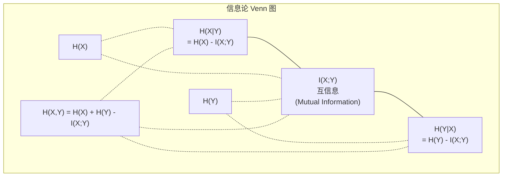

# 信息论 (Information Theory)

> 信息论衡量惊讶的程度。损失函数建立在它之上。

**类型：** 学习 (Learn)
**语言：** Python
**前置要求：** 第一阶段，第06课（概率 (Probability)）
**时间：** 约60分钟

## 学习目标

- 从零计算熵 (entropy)、交叉熵 (cross-entropy) 和 KL 散度 (KL divergence)，并解释它们之间的关系
- 推导为什么最小化交叉熵损失等价于最大化对数似然 (log-likelihood)
- 计算特征与目标之间的互信息 (mutual information) 以对特征重要性进行排序
- 将困惑度 (perplexity) 解释为语言模型在有效选项中选择的词汇大小

## 问题

你在每个分类模型中都调用 `CrossEntropyLoss()`。你在每篇语言模型论文中都看到"困惑度 (perplexity)"。你在 VAE (Variational Autoencoder)、知识蒸馏 (knowledge distillation) 和 RLHF (Reinforcement Learning from Human Feedback) 中读到 KL 散度。这些并不是不相干的概念。它们是同一个想法戴着不同的帽子。

信息论 (Information Theory) 为你提供了关于不确定性、压缩和预测的推理语言。克劳德·香农 (Claude Shannon) 在1948年发明了它来解决通信问题。事实证明，训练一个神经网络就是一个通信问题：模型试图通过一个由学习到的权重构成的噪声信道来传输正确的标签。

本课从零开始构建每一个公式，让你看清它们从何而来以及为什么有效。

## 概念

### 信息量（惊讶度 / Surprise）

当不太可能的事情发生时，它携带更多的信息。一枚硬币正面朝上？不足为奇。彩票中奖？非常令人惊讶。

一个概率为 p 的事件的信息量 (information content) 是：

```
I(x) = -log(p(x))
```

以2为底的对数给出比特 (bits)。以自然对数给出纳特 (nats)。同一个想法，不同的单位。

```
事件              概率        惊讶度（比特）
公平硬币正面      0.5         1.0
掷出6             0.167       2.58
千分之一事件      0.001       9.97
确定性事件         1.0         0.0
```

确定性事件携带零信息。你早就知道它会发生。

### 熵（平均惊讶度）

熵 (Entropy) 是分布中所有可能结果的期望惊讶度。

```
H(P) = -sum( p(x) * log(p(x)) )  对所有 x
```

一枚公平硬币对于二元变量具有最大熵：1比特。一枚偏置硬币（99%正面）具有低熵：0.08比特。你已经知道会发生什么，所以每次投掷几乎不告诉你任何新信息。

```
公平硬币：    H = -(0.5 * log2(0.5) + 0.5 * log2(0.5)) = 1.0 比特
偏置硬币：    H = -(0.99 * log2(0.99) + 0.01 * log2(0.01)) = 0.08 比特
```

熵衡量一个分布中不可约的不确定性。你不能压缩到熵以下。

### 交叉熵（你每天使用的损失函数）

交叉熵 (Cross-Entropy) 衡量当你使用分布 Q 来编码实际来自分布 P 的事件时的平均惊讶度。

```
H(P, Q) = -sum( p(x) * log(q(x)) )  对所有 x
```

P 是真实分布（标签）。Q 是你模型的预测。如果 Q 完美匹配 P，交叉熵等于熵。任何不匹配都会使其变大。

在分类中，P 是独热向量 (one-hot vector)（真实类别的概率为 1，其余为 0）。这将交叉熵简化为：

```
H(P, Q) = -log(q(true_class))
```

这就是分类任务交叉熵损失的全部公式。最大化正确类别的预测概率。

### KL 散度（分布之间的距离）

KL 散度 (Kullback-Leibler Divergence) 测量使用 Q 而非 P 得到的额外惊讶度。

```
D_KL(P || Q) = sum( p(x) * log(p(x) / q(x)) )  对所有 x
             = H(P, Q) - H(P)
```

交叉熵是熵加上 KL 散度。由于真实分布的熵在训练期间是常数，最小化交叉熵等同于最小化 KL 散度。你在将模型的分布推向真实分布。

KL 散度不是对称的：D_KL(P || Q) != D_KL(Q || P)。它不是真正的距离度量。

### 互信息

互信息 (Mutual Information) 衡量了解一个变量能在多大程度上告诉你关于另一个变量的信息。

```
I(X; Y) = H(X) - H(X|Y)
        = H(X) + H(Y) - H(X, Y)
```

如果 X 和 Y 独立，互信息为零。了解一个变量不会告诉你任何关于另一个变量的信息。如果它们完全相关，互信息等于任一变量的熵。

在特征选择中，特征与目标之间高互信息意味着该特征是有用的。低互信息意味着它是噪声。

### 条件熵

H(Y|X) 衡量在观察到 X 之后，关于 Y 还剩余多少不确定性。

```
H(Y|X) = H(X,Y) - H(X)
```

两个极端：
- 如果 X 完全确定 Y，那么 H(Y|X) = 0。了解 X 消除了关于 Y 的所有不确定性。例子：X = 摄氏温度，Y = 华氏温度。
- 如果 X 不能告诉你关于 Y 的任何信息，那么 H(Y|X) = H(Y)。了解 X 根本不减少你的不确定性。例子：X = 抛硬币，Y = 明天的天气。

条件熵永远非负且永远不会超过 H(Y)：

```
0 <= H(Y|X) <= H(Y)
```

在机器学习中，条件熵出现在决策树 (decision trees) 中。在每个分割点，算法选择使 H(Y|X) 最小化的特征 X——即最能消除关于标签 Y 的不确定性的特征。

### 联合熵

H(X,Y) 是 X 和 Y 联合分布的熵。

```
H(X,Y) = -sum sum p(x,y) * log(p(x,y))   对所有 x, y
```

关键性质：

```
H(X,Y) <= H(X) + H(Y)
```

当 X 和 Y 独立时等号成立。如果它们共享信息，联合熵小于各个熵之和。"缺失"的熵正好就是互信息。



关系：
- H(X,Y) = H(X) + H(Y|X) = H(Y) + H(X|Y)
- I(X;Y) = H(X) - H(X|Y) = H(Y) - H(Y|X)
- H(X,Y) = H(X) + H(Y) - I(X;Y)

### 互信息（深入探讨）

互信息 I(X;Y) 量化了了解一个变量可以在多大程度上减少对另一个变量的不确定性。

```
I(X;Y) = H(X) - H(X|Y)
       = H(Y) - H(Y|X)
       = H(X) + H(Y) - H(X,Y)
       = sum sum p(x,y) * log(p(x,y) / (p(x) * p(y)))
```

性质：
- 永远 I(X;Y) >= 0。你永远不会因为观察到某事物而丢失信息。
- 当且仅当 X 和 Y 独立时，I(X;Y) = 0。
- I(X;Y) = I(Y;X)。它是对称的，与 KL 散度不同。
- I(X;X) = H(X)。一个变量与自己共享其全部信息。

**互信息用于特征选择。** 在机器学习中，你希望对目标变量有信息量的特征。互信息为你提供了一种原则性的特征排序方法：

1. 对每个特征 X_i，计算 I(X_i; Y)，其中 Y 是目标变量。
2. 按 MI 分数对特征排序。
3. 保留前 k 个特征。

这对特征与目标之间的任何关系都有效——线性的、非线性的、单调的，或不是单调的。相关系数只能捕捉线性关系。MI 能捕捉一切。

| 方法 | 检测内容 | 计算成本 | 处理类别变量？ |
|--------|---------|-------------------|---------------------|
| 皮尔逊相关系数 (Pearson correlation) | 线性关系 | O(n) | 否 |
| 斯皮尔曼相关系数 (Spearman correlation) | 单调关系 | O(n log n) | 否 |
| 互信息 (Mutual information) | 任何统计依赖 | O(n log n) 带分箱 | 是 |

### 标签平滑与交叉熵

标准分类使用硬目标 (hard targets)：[0, 0, 1, 0]。真实类别获得概率 1，其余一切为 0。标签平滑 (Label Smoothing) 将其替换为软目标 (soft targets)：

```
soft_target = (1 - epsilon) * hard_target + epsilon / num_classes
```

以 epsilon = 0.1 和 4 个类别为例：
- 硬目标： [0, 0, 1, 0]
- 软目标： [0.025, 0.025, 0.925, 0.025]

从信息论的角度看，标签平滑增加了目标分布的熵。硬独热 (one-hot) 目标的熵为 0——没有不确定性。软目标具有正熵。

为什么这有帮助：
- 阻止模型将 logit 驱向极端值（要完美匹配交叉熵下的独热目标，logit 需要趋向无穷）
- 充当正则化：模型不可能 100% 自信
- 改善校准 (calibration)：预测概率更好地反映真实不确定性
- 缩小训练和推理行为之间的差距

具有标签平滑的交叉熵损失变为：

```
L = (1 - epsilon) * CE(hard_target, prediction) + epsilon * H_uniform(prediction)
```

第二项惩罚那些远离均匀分布的预测——直接对置信度进行正则化。

### 为什么交叉熵是分类的标准损失函数

三种视角，同一个结论。

**信息论视角。** 交叉熵衡量你使用模型分布而不是真实分布浪费了多少比特。最小化它使你的模型成为现实最有效的编码器。

**最大似然视角。** 对于 N 个具有真实类别 y_i 的训练样本：

```
似然 (Likelihood)      = product( q(y_i) )
对数似然 (Log-likelihood) = sum( log(q(y_i)) )
负对数似然 (Negative log-likelihood) = -sum( log(q(y_i)) )
```

最后一行就是交叉熵损失。最小化交叉熵 = 最大化训练数据在模型下的似然。

**梯度视角。** 交叉熵对 logit 的梯度就是 (predicted - true)。干净、稳定且计算快速。这就是为什么它与 softmax 完美配对。

### 比特 vs 纳特

唯一的区别是对数的底数。

```
以2为底   -> 比特 (bits)     （信息论传统）
以e为底   -> 纳特 (nats)     （机器学习惯例）
以10为底  -> 哈特莱 (hartleys)（很少使用）
```

1 nat = 1/ln(2) bits = 1.4427 bits。PyTorch 和 TensorFlow 默认使用自然对数（纳特）。

### 困惑度

困惑度 (Perplexity) 是交叉熵的指数。它告诉你模型在选择时感到不确定的有效等可能选项数量。

```
Perplexity = 2^H(P,Q)   （如果使用比特）
Perplexity = e^H(P,Q)   （如果使用纳特）
```

一个困惑度为 50 的语言模型，平均而言，与必须从 50 个可能的下一 token 中均匀选择同样困惑。越低越好。

GPT-2 在常见基准测试上的困惑度约 30。现代模型在表现良好的领域中已达到个位数。

## 构建它

### 步骤1：信息量和熵

```python
import math

def information_content(p, base=2):
    if p <= 0 or p > 1:
        return float('inf') if p <= 0 else 0.0
    return -math.log(p) / math.log(base)

def entropy(probs, base=2):
    return sum(
        p * information_content(p, base)
        for p in probs if p > 0
    )

fair_coin = [0.5, 0.5]
biased_coin = [0.99, 0.01]
fair_die = [1/6] * 6

print(f"公平硬币熵:   {entropy(fair_coin):.4f} 比特")
print(f"偏置硬币熵:   {entropy(biased_coin):.4f} 比特")
print(f"公平骰子熵:   {entropy(fair_die):.4f} 比特")
```

### 步骤2：交叉熵和 KL 散度

```python
def cross_entropy(p, q, base=2):
    total = 0.0
    for pi, qi in zip(p, q):
        if pi > 0:
            if qi <= 0:
                return float('inf')
            total += pi * (-math.log(qi) / math.log(base))
    return total

def kl_divergence(p, q, base=2):
    return cross_entropy(p, q, base) - entropy(p, base)

true_dist = [0.7, 0.2, 0.1]
good_model = [0.6, 0.25, 0.15]
bad_model = [0.1, 0.1, 0.8]

print(f"真实分布的熵:     {entropy(true_dist):.4f} 比特")
print(f"交叉熵（好模型）:  {cross_entropy(true_dist, good_model):.4f} 比特")
print(f"交叉熵（差模型）:  {cross_entropy(true_dist, bad_model):.4f} 比特")
print(f"KL 散度（好）:     {kl_divergence(true_dist, good_model):.4f} 比特")
print(f"KL 散度（差）:     {kl_divergence(true_dist, bad_model):.4f} 比特")
```

### 步骤3：作为分类损失的交叉熵

```python
def softmax(logits):
    max_logit = max(logits)
    exps = [math.exp(z - max_logit) for z in logits]
    total = sum(exps)
    return [e / total for e in exps]

def cross_entropy_loss(true_class, logits):
    probs = softmax(logits)
    return -math.log(probs[true_class])

logits = [2.0, 1.0, 0.1]
true_class = 0
loss = cross_entropy_loss(true_class, logits)
print(f"交叉熵损失: {loss:.4f}")
```

### 步骤4：互信息用于特征选择

```python
from sklearn.feature_selection import mutual_info_classif, mutual_info_regression
import numpy as np

# 分类问题：
#   mi_scores = mutual_info_classif(X, y, random_state=42)
#   高分 = 重要特征；低分或零分 = 噪声特征
#
# 回归问题：
#   mi_scores = mutual_info_regression(X, y, random_state=42)
#
# 与基于相关系数的排序不同，MI 能捕捉任何类型的依赖关系。
```

### 步骤5：困惑度

```python
def perplexity(cross_entropy_value, base=2):
    """将交叉熵转换为困惑度"""
    return base ** cross_entropy_value

# 一个交叉熵为 5.64 比特的语言模型：
ce = 5.64
print(f"困惑度: {perplexity(ce):.2f}")
# 输出大约为: 困惑度: 49.87
# 该模型平均而言在约 50 个下一个 token 之间犹豫。
```

## 使用它

在实践中，你几乎从不从零开始实现这些内容。PyTorch 提供了经过良好测试、数值稳定的实现。

特征选择的互信息：

```python
from sklearn.feature_selection import mutual_info_classif

mi = mutual_info_classif(X_train, y_train, random_state=42)
# 高 MI 的特征是好的预测因子
```

交叉熵损失：

```python
# PyTorch
import torch.nn as nn
loss_fn = nn.CrossEntropyLoss(label_smoothing=0.1)

# TensorFlow / Keras
import tensorflow as tf
loss_fn = tf.keras.losses.CategoricalCrossentropy(label_smoothing=0.1)
```

困惑度通常作为评估指标而非损失函数来计算：

```python
import torch
# 给定交叉熵损失值（以纳特为单位）：
perplexity = torch.exp(avg_cross_entropy_loss)
```

## 交付

本课中的公式形成了一份文档：`outputs/prompt-information-theory.md` —— 一份可以供参考的信息论公式速查表 (cheat sheet)，涵盖熵、交叉熵、KL 散度、互信息、条件熵和困惑度。

## 练习

1. **熵极值。** 计算一个 K 面公平骰子的熵。随着 K → ∞ 熵会怎样？在 K=2, 10, 100, 1000 时计算熵。为什么熵随着可能的等概率结果数量而增长？

2. **KL 散度不对称性。** 令 P = [0.5, 0.5]，Q = [0.99, 0.01]。分别计算 KL(P||Q) 和 KL(Q||P)。为什么这个结果展示了 KL 散度不对称性——也就是说，使用 Q 来近似 P 的代价与使用 P 来近似 Q 的代价高度不同？

3. **困惑度计算。** 一个语言模型在测试集上实现了 3.2 比特的交叉熵。其困惑度是多少？如果一个模型在词汇表大小为 50,000 的情况下实现了困惑度 100，这是好还是坏？为什么？

4. **交叉熵梯度。** 使用微积分推导交叉熵 + softmax 的梯度是 (predicted - true)。首先写出交叉熵（真实标签 y 和 softmax(q)），然后计算对 logit q_j 的导数。展示该梯度是 (predicted_j - true_j)。

## 现实世界的连接

- 每个分类模型中的交叉熵：当你训练一个图像分类器、一个情感分析模型或任何一个分类器时——你正在最小化交叉熵。
- VAE (Variational Autoencoder) 和扩散模型 (diffusion models) 中的 KL 散度：VAE 损失 = 重建损失 + KL(后验 || 先验)。KL 项保持潜在空间结构良好。
- RLHF (Reinforcement Learning from Human Feedback) 中的 KL 散度：RLHF 增加一个 KL 惩罚项 KL(π_θ || π_ref)，以防止策略偏离基础模型太远。
- 评估指标：困惑度仍然是语言模型最广泛引用的评估指标。GPT-2：困惑度 ~30；GPT-3：困惑度 ~20；Gemini 2.5 Pro 在某些领域接近 5。每次减半大约代表所需计算量减少 10 倍，以匹配同等困惑度的朴素模型。