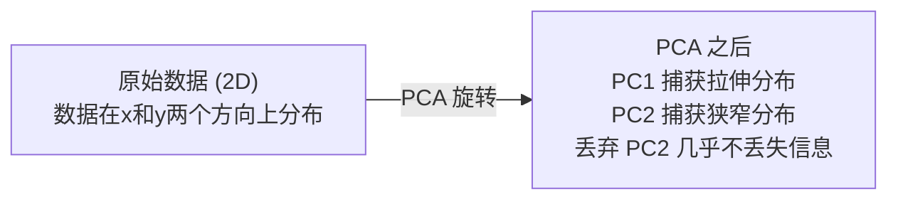

# 降维 (Dimensionality Reduction)

> 高维数据有内在结构。从正确的角度去看，你就能发现它。

**类型：** 构建 (Build)
**语言：** Python
**前置要求：** 第一阶段，第01课（线性代数直觉 (Linear Algebra Intuition)）、第02课（向量、矩阵与运算 (Vectors, Matrices & Operations)）、第03课（特征值与特征向量 (Eigenvalues & Eigenvectors)）、第06课（概率与分布 (Probability & Distributions)）
**时间：** 约90分钟

## 学习目标

- 从零实现 PCA (Principal Component Analysis)：中心化数据、计算协方差矩阵 (covariance matrix)、特征分解 (eigendecomposition) 并投影
- 使用解释方差比率 (explained variance ratio) 和拐点法 (elbow method) 选择主成分的数量
- 比较 PCA、t-SNE (t-Distributed Stochastic Neighbor Embedding) 和 UMAP (Uniform Manifold Approximation and Projection) 在 MNIST 数字的二维可视化上的表现，并解释它们之间的权衡
- 应用带有 RBF (Radial Basis Function) 核的核 PCA (Kernel PCA) 来分离标准 PCA 无法处理的非线性数据结构

## 问题

你有一个每个样本784个特征的数据集。也许是手写数字的像素值。也许是基因表达水平。也许是用户行为信号。你无法可视化784个维度。你无法绘制它们。你甚至无法想象它们。

但这784个特征中大部分是冗余的。实际信息存在于一个远更小的表面上。一个手写的"7"不需要784个独立的数字来描述它。它只需要几个：笔画的角度、横线的长度、倾斜程度。其余的都是噪声。

降维找到那个更小的表面。它将你的784维数据压缩到2维、10维或50维，同时保留重要的结构。

## 概念

### 维度灾难 (Curse of Dimensionality)

高维空间违反直觉。随着维度增长，三件事会瓦解。

**距离变得无意义。** 在高维空间中，任意两个随机点之间的距离收敛到相同的值。如果每个点到其他点的距离大致相同，最近邻搜索就会失效。

```
维度    平均距离比（随机点之间的最大值/最小值）
2       ~5.0
10      ~1.8
100     ~1.2
1000    ~1.02
```

**体积集中在角落。** d维空间中的单位超立方体有 2^d 个角。在100维空间中，几乎所有体积都在角落，远离中心。数据点分散到边缘，模型在内部缺乏数据。

**你需要指数级更多的数据。** 要在空间中保持相同的样本密度，从 2D 到 20D 意味着你需要 10^18 倍的数据。你永远不会有足够的数据。降低维度使数据密度恢复到可以处理的程度。

### PCA：找到重要的方向

主成分分析 (Principal Component Analysis, PCA) 找到数据变化最大的轴。它旋转你的坐标系，使第一个轴捕获最大的方差，第二个轴捕获次大的方差，以此类推。

算法：

```
1. 中心化数据       （从每个特征中减去均值）
2. 计算协方差       （特征如何共同变化）
3. 特征分解         （找到主方向）
4. 按特征值排序      （最大方差优先）
5. 投影             （保留前 k 个特征向量，丢弃其余）
```

为什么用特征分解？协方差矩阵是对称且半正定的 (positive semi-definite)。它的特征向量是特征空间中的正交方向。特征值告诉你每个方向捕获了多少方差。最大特征值对应的特征向量指向最大方差的方向。



- **PCA 之前：** 数据云沿 x 和 y 轴对角分布
- **PCA 之后：** 坐标系被旋转，使 PC1 与最大方差的方向对齐（拉伸分布），PC2 与最小方差的方向对齐（狭窄分布）
- **降维：** 丢弃 PC2 将数据投影到 PC1 上，丢失极少信息

### 解释方差比率

每个主成分捕获总方差的一部分。解释方差比率 (explained variance ratio) 告诉你捕获了多少。

```
主成分    特征值    解释比率    累积
PC1       4.73      0.473       0.473
PC2       2.51      0.251       0.724
PC3       1.12      0.112       0.836
PC4       0.89      0.089       0.925
...
```

当累积解释方差达到 0.95 时，你就知道那么多个成分捕获了 95% 的信息。之后的一切基本上是噪声。

### 选择成分的数量

三种策略：

1. **阈值法。** 保留足够多的成分以解释 90-95% 的方差。
2. **拐点法 (elbow method)。** 绘制每个成分的解释方差。寻找急剧下降的点。
3. **下游任务表现。** 将 PCA 作为预处理步骤。扫描 k 并测量模型准确率。最佳 k 是准确率趋于平稳的位置。

### t-SNE：保留邻域

t-分布随机邻域嵌入 (t-Distributed Stochastic Neighbor Embedding, t-SNE) 专为可视化设计。它将高维数据映射到 2D（或 3D），同时保留哪些点彼此接近。

直觉：在原始空间中，基于点对之间的距离计算一个概率分布。近的点获得高概率。远的点获得低概率。然后找到一个 2D 的排列，使相同的概率分布成立。在 784 维中互为邻居的点在 2D 中仍然保持为邻居。

t-SNE 的关键属性：
- 非线性。它可以展开 PCA 无法处理的复杂流形 (manifold)。
- 随机性。不同的运行产生不同的布局。
- 困惑度 (perplexity) 参数控制考虑多少邻居（典型范围：5-50）。
- 输出中簇之间的距离没有意义。只有簇本身有意义。
- 在大数据集上很慢。默认 O(n^2)。

### UMAP：更快，更好的全局结构

统一流形近似与投影 (Uniform Manifold Approximation and Projection, UMAP) 工作方式与 t-SNE 类似，但有两个优势：
- 更快。它使用近似最近邻图而不是计算所有成对距离。
- 更好的全局结构。输出中簇的相对位置往往比 t-SNE 更有意义。

UMAP 在高维空间中构建一个加权图（"模糊拓扑表示"），然后找到一个尽可能保存该图的低维布局。

关键参数：
- `n_neighbors`：有多少邻居定义局部结构（类似于困惑度）。较高的值保留更多的全局结构。
- `min_dist`：输出中点之间打包的紧密程度。较低的值创建更密集的簇。

### 何时使用哪种方法

| 方法 | 使用场景 | 保留什么 | 速度 |
|--------|----------|-----------|-------|
| PCA | 训练之前的预处理 | 全局方差 | 快（精确），适用于数百万样本 |
| PCA | 快速探索性可视化 | 线性结构 | 快 |
| t-SNE | 发表质量的 2D 图 | 局部邻域 | 慢（理想 < 10k 样本） |
| UMAP | 大规模 2D 可视化 | 局部 + 部分全局结构 | 中等（处理数百万） |
| PCA | 模型的特征降维 | 按方差排序的特征 | 快 |
| t-SNE / UMAP | 理解聚类结构 | 簇分离 | 中等到慢 |

经验法则：使用 PCA 进行预处理和数据压缩。当需要以 2D 可视化结构时，使用 t-SNE 或 UMAP。

### 核 PCA (Kernel PCA)

标准 PCA 寻找线性子空间。它旋转你的坐标系并丢弃轴。但如果数据位于非线性流形上呢？2D 中的一个圆不能被任何直线分开。标准 PCA 不会提供帮助。

核 PCA 在由核函数 (kernel function) 引导的高维特征空间中应用 PCA，而无需显式计算该空间中的坐标。这就是核技巧 (kernel trick)——支持向量机 (SVM) 背后的相同思想。

算法：
1. 计算核矩阵 K，其中 K_ij = k(x_i, x_j)
2. 在特征空间中对核矩阵进行中心化
3. 对中心化的核矩阵进行特征分解
4. 前几个特征向量（按 1/sqrt(特征值) 缩放）就是投影

常见核函数：

| 核函数 | 公式 | 适用场景 |
|--------|---------|----------|
| RBF（高斯核） | exp(-gamma * \|\|x - y\|\|^2) | 大多数非线性数据，平滑流形 |
| 多项式核 (Polynomial) | (x . y + c)^d | 多项式关系 |
| Sigmoid 核 | tanh(alpha * x . y + c) | 类似神经网络的映射 |

何时使用核 PCA vs 标准 PCA：

| 标准 | 标准 PCA | 核 PCA |
|-----------|-------------|------------|
| 数据结构 | 线性子空间 | 非线性流形 |
| 速度 | O(min(n^2 d, d^2 n)) | O(n^2 d + n^3) |
| 可解释性 | 成分是特征的线性组合 | 成分缺乏直接的特征解释 |
| 可扩展性 | 适用于数百万样本 | 核矩阵是 n x n 的，受内存限制 |
| 重建 | 直接逆变换 | 需要原像近似 (pre-image approximation) |

经典示例：2D 中的同心圆。两个点环，一个在另一个内部。标准 PCA 将两者投影到同一条线上——对分类无用。带有 RBF 核的核 PCA 将内圆和外圆映射到不同区域，使它们线性可分。

### 重建误差

你的降维效果有多好？你将 784 维压缩到 50 维。你丢失了什么？

测量重建误差 (Reconstruction Error)：
1. 将数据投影到 k 维：X_reduced = X @ W_k
2. 重建：X_hat = X_reduced @ W_k^T
3. 计算 MSE：mean((X - X_hat)^2)

对于 PCA，重建误差与解释方差有简洁的关系：

```
重建误差 = 未包含的特征值之和
总方差 = 所有特征值之和
丢失比例 = (丢弃的特征值之和) / (所有特征值之和)
```

每个成分的解释方差比率为：

```
explained_ratio_k = eigenvalue_k / sum(all eigenvalues)
```

绘制累积解释方差与成分数量的关系图可以得到"拐点"曲线。正确的主成分数量是满足以下条件的位置：
- 曲线趋于平坦（边际回报递减）
- 累积方差超过你的阈值（通常为 0.90 或 0.95）
- 下游任务表现趋于平稳

重建误差在选择 k 之外也很有用。你可以用它来进行异常检测 (anomaly detection)：重建误差高的样本是不符合学习到的子空间的离群点。这是生产系统中基于 PCA 的异常检测的基础。

## 构建它

### 步骤1：从零实现 PCA

```python
import numpy as np

class PCA:
    def __init__(self, n_components):
        self.n_components = n_components
        self.components = None
        self.mean = None
        self.eigenvalues = None
        self.explained_variance_ratio_ = None

    def fit(self, X):
        self.mean = np.mean(X, axis=0)
        X_centered = X - self.mean

        cov_matrix = np.cov(X_centered, rowvar=False)

        eigenvalues, eigenvectors = np.linalg.eigh(cov_matrix)

        sorted_idx = np.argsort(eigenvalues)[::-1]
        eigenvalues = eigenvalues[sorted_idx]
        eigenvectors = eigenvectors[:, sorted_idx]

        self.components = eigenvectors[:, :self.n_components].T
        self.eigenvalues = eigenvalues[:self.n_components]
        total_var = np.sum(eigenvalues)
        self.explained_variance_ratio_ = self.eigenvalues / total_var

        return self

    def transform(self, X):
        X_centered = X - self.mean
        return X_centered @ self.components.T

    def fit_transform(self, X):
        self.fit(X)
        return self.transform(X)
```

### 步骤2：在合成数据上测试

```python
np.random.seed(42)
n_samples = 500

t = np.random.uniform(0, 2 * np.pi, n_samples)
x1 = 3 * np.cos(t) + np.random.normal(0, 0.2, n_samples)
x2 = 3 * np.sin(t) + np.random.normal(0, 0.2, n_samples)
x3 = 0.5 * x1 + 0.3 * x2 + np.random.normal(0, 0.1, n_samples)

X_synthetic = np.column_stack([x1, x2, x3])

pca = PCA(n_components=2)
X_reduced = pca.fit_transform(X_synthetic)

print(f"原始形状: {X_synthetic.shape}")
print(f"降维后形状:  {X_reduced.shape}")
print(f"解释方差比率: {pca.explained_variance_ratio_}")
print(f"总方差捕获: {sum(pca.explained_variance_ratio_):.4f}")
```

### 步骤3：MNIST 数字的 2D 可视化

```python
from sklearn.datasets import fetch_openml

mnist = fetch_openml("mnist_784", version=1, as_frame=False, parser="auto")
X_mnist = mnist.data[:5000].astype(float)
y_mnist = mnist.target[:5000].astype(int)

pca_mnist = PCA(n_components=50)
X_pca50 = pca_mnist.fit_transform(X_mnist)
print(f"50 个成分捕获了 {sum(pca_mnist.explained_variance_ratio_):.2%} 的方差")

pca_2d = PCA(n_components=2)
X_pca2d = pca_2d.fit_transform(X_mnist)
print(f"2 个成分捕获了 {sum(pca_2d.explained_variance_ratio_):.2%} 的方差")
```

### 步骤4：与 sklearn 比较

```python
from sklearn.decomposition import PCA as SklearnPCA
from sklearn.manifold import TSNE

sklearn_pca = SklearnPCA(n_components=2)
X_sklearn_pca = sklearn_pca.fit_transform(X_mnist)

print(f"\n我们的 PCA 解释方差:     {pca_2d.explained_variance_ratio_}")
print(f"Sklearn PCA 解释方差: {sklearn_pca.explained_variance_ratio_}")

diff = np.abs(np.abs(X_pca2d) - np.abs(X_sklearn_pca))
print(f"最大绝对差异: {diff.max():.10f}")

tsne = TSNE(n_components=2, perplexity=30, random_state=42)
X_tsne = tsne.fit_transform(X_mnist)
print(f"\nt-SNE 输出形状: {X_tsne.shape}")
```

### 步骤5：UMAP 比较

```python
try:
    from umap import UMAP

    reducer = UMAP(n_components=2, n_neighbors=15, min_dist=0.1, random_state=42)
    X_umap = reducer.fit_transform(X_mnist)
    print(f"UMAP 输出形状: {X_umap.shape}")
except ImportError:
    print("安装 umap-learn: pip install umap-learn")
```

## 使用它

PCA 作为分类器的预处理步骤：

```python
from sklearn.decomposition import PCA as SklearnPCA
from sklearn.linear_model import LogisticRegression
from sklearn.model_selection import train_test_split
from sklearn.metrics import accuracy_score

X_train, X_test, y_train, y_test = train_test_split(
    X_mnist, y_mnist, test_size=0.2, random_state=42
)

results = {}
for k in [10, 30, 50, 100, 200]:
    pca_k = SklearnPCA(n_components=k)
    X_tr = pca_k.fit_transform(X_train)
    X_te = pca_k.transform(X_test)

    clf = LogisticRegression(max_iter=1000, random_state=42)
    clf.fit(X_tr, y_train)
    acc = accuracy_score(y_test, clf.predict(X_te))
    var_captured = sum(pca_k.explained_variance_ratio_)
    results[k] = (acc, var_captured)
    print(f"k={k:>3d}  准确率={acc:.4f}  方差={var_captured:.4f}")
```

性能在远未达到 784 维之前就已经趋于平稳。那个平稳点就是你的操作点。

## 交付

本课产出：
- `outputs/skill-dimensionality-reduction.md` —— 一个为给定任务选择正确降维技术的 skill

## 练习

1. 修改 PCA 类以支持 `inverse_transform`。从 10、50 和 200 个成分重建 MNIST 数字。打印每个的重建误差（与原始数据之间的均方误差）。

2. 在相同的 MNIST 子集上以困惑度值 5、30 和 100 运行 t-SNE。描述输出如何变化。为什么困惑度影响簇的紧密程度？

3. 取一个具有 50 个特征但只有 5 个具有信息量的数据集（使用 `sklearn.datasets.make_classification` 生成）。应用 PCA，检查解释方差曲线是否正确识别出数据实际上是 5 维的。

## 关键术语

| 术语 | 人们怎么说 | 实际含义 |
|------|----------------|----------------------|
| 维度灾难 | "特征太多了" | 随着维度增长，距离、体积和数据密度都表现出违反直觉的行为。模型需要指数级更多的数据来补偿。 |
| PCA | "降维" | 旋转坐标系使轴与最大方差的方向对齐，然后丢弃低方差轴。 |
| 主成分 (Principal component) | "一个重要方向" | 协方差矩阵的特征向量。数据沿其变化最大的特征空间方向。 |
| 解释方差比率 | "这个成分有多少信息" | 一个主成分捕获的总方差比例。将前 k 个比率相加可以看到 k 个成分保留了多少信息。 |
| 协方差矩阵 | "特征如何相关" | 一个对称矩阵，其中第 (i,j) 项衡量特征 i 和特征 j 如何共同变化。对角线条目是各自方差。 |
| t-SNE | "那个聚类图" | 一种通过保留成对邻域概率将高维数据映射到 2D 的非线性方法。适合可视化，不适合预处理。 |
| UMAP | "更快的 t-SNE" | 一种基于拓扑数据分析的非线性方法。保留局部和部分全局结构。比 t-SNE 扩展性更好。 |
| 困惑度 (Perplexity) | "一个 t-SNE 旋钮" | 控制每个点考虑的有效邻居数量。低困惑度聚焦于非常局部的结构。高困惑度捕获更广泛的模式。 |
| 流形 (Manifold) | "数据所在的表面" | 嵌入在高维空间中的低维表面。在 3D 中被揉皱的一张纸是一个 2D 流形。 |

## 进一步阅读

- [A Tutorial on Principal Component Analysis](https://arxiv.org/abs/1404.1100) (Shlens) —— 从零开始的清晰 PCA 推导
- [How to Use t-SNE Effectively](https://distill.pub/2016/misread-tsne/) (Wattenberg 等) —— 关于 t-SNE 陷阱和参数选择的互动指南
- [UMAP 文档](https://umap-learn.readthedocs.io/) —— UMAP 作者的理论和实践指导