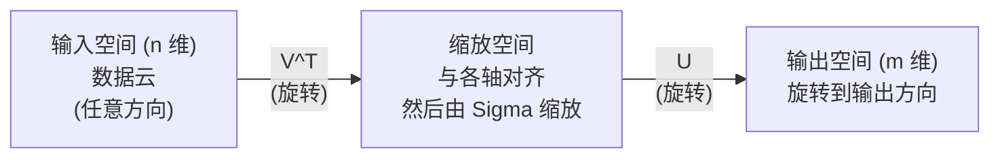
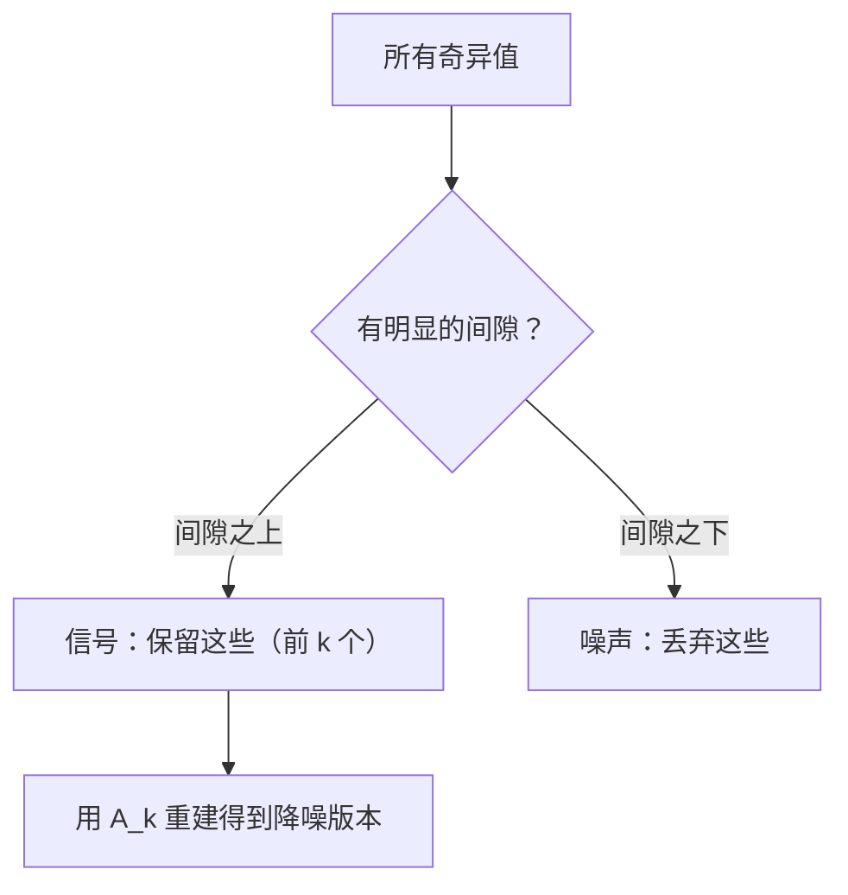

# 奇异值分解 (Singular Value Decomposition)

> SVD 是线性代数的瑞士军刀。每个矩阵都有 SVD。每个数据科学家都需要它。

**类型：** 构建 (Build)
**语言：** Python, Julia
**前置要求：** 第一阶段，第01课（线性代数直觉 (Linear Algebra Intuition)）、第02课（向量与矩阵运算 (Vectors & Matrices Operations)）、第03课（矩阵变换 (Matrix Transformations)）
**时间：** 约120分钟

## 学习目标

- 通过幂迭代 (power iteration) 实现 SVD，并解释 U、Sigma 和 V^T 的几何意义
- 应用截断 SVD (truncated SVD) 进行图像压缩，并衡量压缩比 vs 重建误差
- 通过 SVD 计算 Moore-Penrose 伪逆 (pseudoinverse) 以解决超定最小二乘方程组
- 将 SVD 与 PCA、推荐系统（潜在因子 / latent factors）和 NLP 中的潜在语义分析 (Latent Semantic Analysis) 联系起来

## 问题

你有一个 1000x2000 的矩阵。也许是用户-电影评分。也许是文档-词频表。也许是图像的像素值。你需要压缩它，去噪它，发现其中的隐藏结构，或用它解一个最小二乘方程组。特征分解 (eigendecomposition) 只适用于方阵。即便如此，它还要求矩阵具有一组完整的线性无关特征向量。

SVD 适用于任何矩阵。任何形状。任何秩。没有条件限制。它将矩阵分解为三个因子，这些因子揭示了矩阵对空间做了什么。它是整个线性代数中最通用、最有用的分解。

## 概念

### SVD 在几何上做了什么

每一个矩阵，无论形状如何，按顺序执行三个操作：旋转、缩放、旋转。SVD 使这一分解显式化。

```
A = U * Sigma * V^T

      m x n     m x m    m x n    n x n
     (任意)    (旋转)    (缩放)    (旋转)
```

给定任意矩阵 A，SVD 将其分解为：
- V^T 旋转输入空间中的向量（n 维）
- Sigma 沿每个轴进行缩放（拉伸或压缩）
- U 将结果旋转到输出空间（m 维）



这样思考：你给 SVD 一个矩阵。它会告诉你："这个矩阵接收一个输入的球体，首先通过 V^T 旋转它，然后通过 Sigma 将它拉伸成一个椭球体，然后通过 U 旋转这个椭球体。"奇异值 (singular values) 就是椭球体各轴的长度。

### 完整分解

对于形状为 m x n 的矩阵 A：

```
A = U * Sigma * V^T

其中：
  U     是 m x m 的，正交的 (U^T U = I)
  Sigma 是 m x n 的，对角的（对角线上是奇异值）
  V     是 n x n 的，正交的 (V^T V = I)

奇异值 sigma_1 >= sigma_2 >= ... >= sigma_r > 0
其中 r = rank(A)
```

U 的列称为左奇异向量 (left singular vectors)。V 的列称为右奇异向量 (right singular vectors)。Sigma 的对角线条目称为奇异值 (singular values)。它们永远非负，惯例上按降序排列。

### 左奇异向量、奇异值、右奇异向量

SVD 的每个分量都有独特的几何意义。

**右奇异向量（V 的列）：** 这些构成输入空间 (R^n) 的一组正交归一基。它们是输入空间中矩阵映射到输出空间中正交方向的方向。可以将其视为定义域的自然坐标系。

**奇异值（Sigma 的对角线）：** 这些是缩放因子。第 i 个奇异值告诉你矩阵沿第 i 个右奇异向量拉伸向量的程度。奇异值为零意味着矩阵完全压缩该方向。

**左奇异向量（U 的列）：** 这些构成输出空间 (R^m) 的一组正交归一基。第 i 个左奇异向量是输出空间中第 i 个右奇异向量（缩放后）的落点方向。

它们之间的关系：

```
A * v_i = sigma_i * u_i

矩阵 A 接收第 i 个右奇异向量 v_i，
将其缩放 sigma_i 倍，并映射到第 i 个左奇异向量 u_i。
```

这为你提供了任意矩阵在每个坐标上的行为图景。

### 外积形式

SVD 可以写成秩-1 矩阵 (rank-1 matrix) 之和：

```
A = sigma_1 * u_1 * v_1^T + sigma_2 * u_2 * v_2^T + ... + sigma_r * u_r * v_r^T

每一项 sigma_i * u_i * v_i^T 是一个秩-1 矩阵（一个外积 / outer product）。
完整矩阵是 r 个这样矩阵的和，其中 r 是秩。
```

这种形式是低秩近似 (low-rank approximation) 的基础。每一项添加一层结构。第一项捕获了最重要的单一模式。第二项捕获了次重要的模式。以此类推。截断这个求和可以在任何给定秩下得到最佳可能的近似。

```
秩-1 近似:    A_1 = sigma_1 * u_1 * v_1^T
              （捕获主导模式）

秩-2 近似:    A_2 = sigma_1 * u_1 * v_1^T + sigma_2 * u_2 * v_2^T
              （捕获两个最重要的模式）

秩-k 近似:    A_k = 前 k 项之和
              （根据 Eckart-Young 定理是最优的）
```

### 与特征分解的关系

SVD 和特征分解 (eigendecomposition) 有深刻的联系。A 的奇异值和奇异向量直接来自 A^T A 和 A A^T 的特征值和特征向量。

```
A^T A = V * Sigma^T * U^T * U * Sigma * V^T
      = V * Sigma^T * Sigma * V^T
      = V * D * V^T

其中 D = Sigma^T * Sigma 是一个对角矩阵，对角线上是 sigma_i^2。

因此：
- 右奇异向量 (V) 是 A^T A 的特征向量
- 奇异值的平方 (sigma_i^2) 是 A^T A 的特征值

类似地：
A A^T = U * Sigma * V^T * V * Sigma^T * U^T
      = U * Sigma * Sigma^T * U^T

因此：
- 左奇异向量 (U) 是 A A^T 的特征向量
- A A^T 的特征值也是 sigma_i^2
```

这个联系告诉你三件事：
1. 奇异值永远是实数且非负的（它们是半正定矩阵特征值的平方根）。
2. 你可以通过 A^T A 的特征分解来计算 SVD，但这样做会平方条件数 (condition number) 并损失数值精度。专门的 SVD 算法会避免这一点。
3. 当 A 是方形且对称半正定时，SVD 和特征分解是同一回事。

### 截断 SVD：低秩近似

Eckart-Young-Mirsky 定理指出，对 A 的最佳秩-k 近似（在 Frobenius 范数和谱范数下）通过仅保留前 k 个奇异值及其对应向量来获得：

```
A_k = U_k * Sigma_k * V_k^T

其中：
  U_k     是 m x k 的（U 的前 k 列）
  Sigma_k 是 k x k 的（Sigma 的左上 k x k 块）
  V_k     是 n x k 的（V 的前 k 列）

近似误差 = sigma_{k+1}    (在谱范数下)
         = sqrt(sigma_{k+1}^2 + ... + sigma_r^2)   (在 Frobenius 范数下)
```

这不仅仅是"一个不错"的近似。它在可证明的意义下是秩 k 的最佳可能近似。没有任何其他秩-k 矩阵比 A_k 更接近 A。

| 分量 | 相对大小 | 在秩-3 近似中保留？ |
|-----------|-------------------|------------------------|
| sigma_1 | 最大 | 是 |
| sigma_2 | 大 | 是 |
| sigma_3 | 中大 | 是 |
| sigma_4 | 中等 | 否（误差） |
| sigma_5 | 中小 | 否（误差） |
| sigma_6 | 小 | 否（误差） |
| sigma_7 | 非常小 | 否（误差） |
| sigma_8 | 微小 | 否（误差） |

保留前 3 项：A_3 捕获了三个最大的奇异值。误差 = 其余的值（sigma_4 到 sigma_8）。

如果奇异值衰减快，一个小的 k 就能捕获矩阵的大部分。如果它们衰减慢，矩阵就没有低秩结构。

### 使用 SVD 进行图像压缩

一个灰度图像是一个像素强度的矩阵。一个 800x600 的图像有 480,000 个值。SVD 让你用少得多的值来近似它。

```
原始图像: 800 x 600 = 480,000 个值

使用秩 k 的 SVD:
  U_k:      800 x k 个值
  Sigma_k:  k 个值
  V_k:      600 x k 个值
  总计:     k * (800 + 600 + 1) = k * 1401 个值

  k=10:   14,010 个值   (原始的 2.9%)
  k=50:   70,050 个值   (原始的 14.6%)
  k=100: 140,100 个值   (原始的 29.2%)

  压缩比随着 k 变小而提高，
  但视觉质量会下降。
```

关键洞察：自然图像具有快速衰减的奇异值。前几个奇异值捕获了广泛的结构（形状、渐变）。后面的那些捕获细节和噪声。在秩 50 处截断通常产生的图像看起来几乎与原始图像相同，而使用的存储空间减少了 85%。

### SVD 用于推荐系统

Netflix Prize 使这一应用著名起来。你有一个用户-电影评分矩阵，其中大多数条目是缺失的。

```
             电影1   电影2   电影3   电影4   电影5
  用户1      [  5      ?       3       ?       1  ]
  用户2      [  ?      4       ?       2       ?  ]
  用户3      [  3      ?       5       ?       ?  ]
  用户4      [  ?      ?       ?       4       3  ]

  ? = 未知评分
```

核心思想：这个评分矩阵具有低秩。用户的口味并不是完全独立的。有少数潜在因子 (latent factors)（动作 vs. 剧情、老片 vs. 新片、烧脑 vs. 感官）可以解释大多数偏好。

对（填充后的）评分矩阵进行 SVD 将其分解为：
- U：潜在因子空间中的用户画像 (user profiles)
- Sigma：每个潜在因子的重要性
- V^T：潜在因子空间中的电影画像 (movie profiles)

用户对一部电影的预测评分是其用户画像与电影画像的内积（由奇异值加权）。低秩近似填补了缺失的条目。

在实践中，你使用像 Simon Funk 的增量 SVD 或 ALS（交替最小二乘法 / Alternating Least Squares）这样的变体，它们直接处理缺失数据。但核心思想是相同的：通过 SVD 进行潜在因子分解。

### 自然语言处理中的 SVD：潜在语义分析

潜在语义分析 (Latent Semantic Analysis, LSA)，也称为潜在语义索引 (Latent Semantic Indexing, LSI)，将 SVD 应用于词项-文档矩阵 (term-document matrix)。

```
             文档1   文档2   文档3   文档4
  "cat"      [  3      0      1      0  ]
  "dog"      [  2      0      0      1  ]
  "fish"     [  0      4      1      0  ]
  "pet"      [  1      1      1      1  ]
  "ocean"    [  0      3      0      0  ]

经过秩 k=2 的 SVD 之后：

  每个文档成为 2D "概念空间"中的一个点。
  每个词项成为相同 2D 空间中的一个点。
  关于相似主题的文档聚在一起。
  具有相似含义的词项聚在一起。

  "cat" 和 "dog" 最终靠近彼此（陆地宠物）。
  "fish" 和 "ocean" 最终靠近彼此（水相关的概念）。
  如果 Doc1 和 Doc3 分享相似的主题，它们会聚在一起。
```

LSA 是从原始文本中捕获语义相似性的首批成功方法之一。它的工作原理是同义词倾向于出现在相似的文档中，所以 SVD 将它们分组到相同的潜在维度中。现代词嵌入（Word2Vec、GloVe）可以看作这一思想的后继者。

### SVD 用于降噪

含噪声的数据中信号集中在前几个奇异值上，而噪声分布在整个奇异值谱上。截断可以去除噪声底。

**干净信号的奇异值：**

| 分量 | 大小 | 类型 |
|-----------|-----------|------|
| sigma_1 | 非常大 | 信号 |
| sigma_2 | 大 | 信号 |
| sigma_3 | 中等 | 信号 |
| sigma_4 | 接近零 | 可忽略 |
| sigma_5 | 接近零 | 可忽略 |

**含噪信号的奇异值（噪声加到所有奇异值上）：**

| 分量 | 大小 | 类型 |
|-----------|-----------|------|
| sigma_1 | 非常大 | 信号 |
| sigma_2 | 大 | 信号 |
| sigma_3 | 中等 | 信号 |
| sigma_4 | 小 | 噪声 |
| sigma_5 | 小 | 噪声 |
| sigma_6 | 小 | 噪声 |
| sigma_7 | 小 | 噪声 |



这被用于信号处理、科学测量和数据清洗。任何时候你有一个被加性噪声破坏的矩阵，截断 SVD 都是一种有原则的信号与噪声分离方法。

### 通过 SVD 求伪逆

Moore-Penrose 伪逆 (Pseudoinverse) A+ 将矩阵求逆推广到非方阵和奇异矩阵上。SVD 使计算变得简单。

```
如果 A = U * Sigma * V^T，则：

A+ = V * Sigma+ * U^T

其中 Sigma+ 通过以下步骤形成：
  1. 转置 Sigma（交换行和列）
  2. 将每个非零对角线条目 sigma_i 替换为 1/sigma_i
  3. 让零保持为零

对于 A (m x n):      A+ 是 (n x m)
对于 Sigma (m x n):  Sigma+ 是 (n x m)
```

伪逆解决最小二乘问题。如果 Ax = b 没有精确解（超定方程组 / overdetermined system），那么 x = A+ b 就是最小二乘解（最小化 ||Ax - b||）。

```
超定方程组（方程多于未知数）：

  [1  1]         [3]
  [2  1] x   =   [5]       没有精确解存在。
  [3  1]         [6]

  x_ls = A+ b = V * Sigma+ * U^T * b

  这得到最小化残差平方和的 x。
  与正规方程 (normal equations) (A^T A)^(-1) A^T b 的结果相同，
  但在数值上更稳定。
```

### 数值稳定性优势

计算 A^T A 的特征分解会平方奇异值（A^T A 的特征值是 sigma_i^2）。这会平方条件数，放大数值误差。

```
示例：
  A 的奇异值为 [1000, 1, 0.001]
  A 的条件数: 1000 / 0.001 = 10^6

  A^T A 的特征值为 [10^6, 1, 10^{-6}]
  A^T A 的条件数: 10^6 / 10^{-6} = 10^{12}

  直接计算 SVD:     对条件数 10^6 进行运算
  通过 A^T A 计算:  对条件数 10^{12} 进行运算
                   （损失 6 位额外的精度）
```

现代 SVD 算法（Golub-Kahan 双对角化 / bidiagonalization）直接在 A 上操作，从不生成 A^T A。这就是为什么你应该始终优先使用 `np.linalg.svd(A)` 而非 `np.linalg.eig(A.T @ A)`。

### 与 PCA 的联系

PCA 就是对中心化数据进行 SVD。这不是一个类比。它字面上就是同一个计算。

```
给定数据矩阵 X (n_samples x n_features)，中心化后（减去均值）：

协方差矩阵: C = (1/(n-1)) * X^T X

PCA 找到 C 的特征向量。但是：

  X = U * Sigma * V^T    (SVD of X)

  X^T X = V * Sigma^2 * V^T

  C = (1/(n-1)) * V * Sigma^2 * V^T

所以主成分 (principal components) 就是右奇异向量 V。
每个成分的解释方差是 sigma_i^2 / (n-1)。

在 sklearn 中，PCA 是使用 SVD 实现的，而不是特征分解。
它更快并且在数值上更稳定。
```

这意味着你在第10课学到的关于降维的一切背后都是 SVD。PCA 是机器学习中 SVD 最常见的应用。

## 构建它

### 步骤1：使用幂迭代从零实现 SVD

核心思想：要找到最大的奇异值和对应的向量，在 A^T A（或 A A^T）上使用幂迭代 (power iteration)。然后对矩阵进行收缩 (deflate)，再对下一个奇异值重复。

```python
import numpy as np

def power_iteration(M, num_iters=100):
    n = M.shape[1]
    v = np.random.randn(n)
    v = v / np.linalg.norm(v)

    for _ in range(num_iters):
        Mv = M @ v
        v = Mv / np.linalg.norm(Mv)

    eigenvalue = v @ M @ v
    return eigenvalue, v

def svd_from_scratch(A, k=None):
    m, n = A.shape
    if k is None:
        k = min(m, n)

    sigmas = []
    us = []
    vs = []

    A_residual = A.copy().astype(float)

    for _ in range(k):
        AtA = A_residual.T @ A_residual
        eigenvalue, v = power_iteration(AtA, num_iters=200)

        if eigenvalue < 1e-10:
            break

        sigma = np.sqrt(eigenvalue)
        u = A_residual @ v / sigma

        sigmas.append(sigma)
        us.append(u)
        vs.append(v)

        A_residual = A_residual - sigma * np.outer(u, v)

    U = np.column_stack(us) if us else np.empty((m, 0))
    S = np.array(sigmas)
    V = np.column_stack(vs) if vs else np.empty((n, 0))

    return U, S, V
```

### 步骤2：测试并与 NumPy 比较

```python
np.random.seed(42)
A = np.random.randn(5, 4)

U_ours, S_ours, V_ours = svd_from_scratch(A)
U_np, S_np, Vt_np = np.linalg.svd(A, full_matrices=False)

print("我们的奇异值:", np.round(S_ours, 4))
print("NumPy 奇异值:", np.round(S_np, 4))

A_reconstructed = U_ours @ np.diag(S_ours) @ V_ours.T
print(f"重建误差: {np.linalg.norm(A - A_reconstructed):.8f}")
```

### 步骤3：图像压缩演示

```python
def compress_image_svd(image_matrix, k):
    U, S, Vt = np.linalg.svd(image_matrix, full_matrices=False)
    compressed = U[:, :k] @ np.diag(S[:k]) @ Vt[:k, :]
    return compressed

np.random.seed(42)
rows, cols = 200, 300
image = np.random.randn(rows, cols)

for k in [1, 5, 10, 20, 50]:
    compressed = compress_image_svd(image, k)
    error = np.linalg.norm(image - compressed) / np.linalg.norm(image)
    original_size = rows * cols
    compressed_size = k * (rows + cols + 1)
    ratio = compressed_size / original_size
    print(f"k={k:>3d}  误差={error:.4f}  存储={ratio:.1%}")
```

### 步骤4：降噪

```python
np.random.seed(42)
clean = np.outer(np.sin(np.linspace(0, 4*np.pi, 100)),
                 np.cos(np.linspace(0, 2*np.pi, 80)))
noise = 0.3 * np.random.randn(100, 80)
noisy = clean + noise

U, S, Vt = np.linalg.svd(noisy, full_matrices=False)
denoised = U[:, :5] @ np.diag(S[:5]) @ Vt[:5, :]

print(f"含噪误差:    {np.linalg.norm(noisy - clean):.4f}")
print(f"降噪后误差:  {np.linalg.norm(denoised - clean):.4f}")
print(f"改善:        {(1 - np.linalg.norm(denoised - clean) / np.linalg.norm(noisy - clean)):.1%}")
```

### 步骤5：伪逆

```python
A = np.array([[1, 1], [2, 1], [3, 1]], dtype=float)
b = np.array([3, 5, 6], dtype=float)

U, S, Vt = np.linalg.svd(A, full_matrices=False)
S_inv = np.diag(1.0 / S)
A_pinv = Vt.T @ S_inv @ U.T

x_svd = A_pinv @ b
x_lstsq = np.linalg.lstsq(A, b, rcond=None)[0]
x_pinv = np.linalg.pinv(A) @ b

print(f"SVD 伪逆解:   {x_svd}")
print(f"np.linalg.lstsq 解:   {x_lstsq}")
print(f"np.linalg.pinv 解:    {x_pinv}")
```

## 使用它

完整的可运行演示在 `code/svd.py` 中。运行它可以看到 SVD 应用于图像压缩、推荐系统、潜在语义分析和降噪。

```bash
python svd.py
```

`code/svd.jl` 中的 Julia 版本使用 Julia 的原生 `svd()` 函数和 `LinearAlgebra` 包演示了相同的概念。

```bash
julia svd.jl
```

## 交付

本课产出：
- `outputs/skill-svd.md` —— 一个用于了解在真实项目中何时以及如何应用 SVD 的 skill

## 练习

1. 不使用幂迭代从零实现完整的 SVD。改为计算 A^T A 的特征分解以获得 V 和奇异值，然后计算 U = A V Sigma^{-1}。与幂迭代版本和 NumPy 比较数值精度。

2. 加载一张真实的灰度图像（或将一张图像转换为灰度）。在秩 1、5、10、25、50、100 处压缩它。对每个秩，计算压缩比和相对误差。找到图像视觉上可接受的秩。

3. 构建一个小型推荐系统。创建一个 10x8 的用户-电影评分矩阵，其中包含一些已知条目。用行均值填充缺失的条目。计算 SVD 并重建秩-3 近似。使用重建矩阵预测缺失的评分。验证预测是否合理。

4. 创建一个 100x50 的词项-文档矩阵，包含 3 个合成主题。每个主题关联 5 个词项。添加噪声。应用 SVD 并验证前 3 个奇异值远大于其余值。将文档投影到 3D 潜在空间中，检查来自同一主题的文档是否聚在一起。

5. 生成一个干净的秩-3 矩阵（大小 50x40）并添加不同级别的高斯噪声（sigma = 0.1, 0.5, 1.0, 2.0）。对于每个噪声级别，通过从 1 到 40 扫描 k 并测量相对于干净矩阵的重建误差来找到最优截断秩。绘制最优 k 随噪声级别的变化。

## 关键术语

| 术语 | 人们怎么说 | 实际含义 |
|------|----------------|----------------------|
| SVD | "分解任何矩阵" | 将 A 分解为 U Sigma V^T，其中 U 和 V 是正交的，Sigma 是对角的且条目非负。适用于任何形状的任意矩阵。 |
| 奇异值 (Singular value) | "这个成分有多重要" | Sigma 的第 i 个对角线条目。衡量矩阵沿第 i 个主方向拉伸的程度。永远非负，按降序排列。 |
| 左奇异向量 (Left singular vector) | "输出方向" | U 的一列。输出空间中第 i 个右奇异向量（缩放 sigma_i 倍后）映射到的方向。 |
| 右奇异向量 (Right singular vector) | "输入方向" | V 的一列。输入空间中矩阵（缩放 sigma_i 倍后）映射到第 i 个左奇异向量的方向。 |
| 截断 SVD (Truncated SVD) | "低秩近似" | 仅保留前 k 个奇异值及其向量。产生对原始矩阵在可证明意义下的最佳秩-k 近似（Eckart-Young 定理）。 |
| 秩 (Rank) | "真正的维度" | 非零奇异值的数量。告诉你矩阵实际使用了多少个独立方向。 |
| 伪逆 (Pseudoinverse) | "广义逆" | V Sigma+ U^T。将非零奇异值取倒数，零保持为零。解决非方阵或奇异矩阵的最小二乘问题。 |
| 条件数 (Condition number) | "对误差有多敏感" | sigma_max / sigma_min。大的条件数意味着小的输入变化导致大的输出变化。SVD 直接揭示了这一点。 |
| 潜在因子 (Latent factor) | "隐藏变量" | SVD 发现的低秩空间中的一个维度。在推荐系统中，一个潜在因子可能对应类型偏好。在 NLP 中，它可能对应一个主题。 |
| Frobenius 范数 | "矩阵的总大小" | 所有条目平方和的平方根。等于奇异值平方和的平方根。用于衡量近似误差。 |
| Eckart-Young 定理 | "SVD 给出最佳压缩" | 对于任何目标秩 k，截断 SVD 在所有可能的秩-k 矩阵中最小化近似误差。 |
| 幂迭代 (Power iteration) | "找到最大的特征向量" | 重复地将一个随机向量乘以矩阵并归一化。收敛到具有最大特征值的特征向量。许多 SVD 算法的构建模块。 |

## 进一步阅读

- [Gilbert Strang: Linear Algebra and Its Applications, 第7章](https://math.mit.edu/~gs/linearalgebra/) —— 对 SVD 及其应用的详尽论述
- [3Blue1Brown: 但 SVD 是什么？](https://www.youtube.com/watch?v=vSczTbgc8Rc) —— SVD 的几何直觉
- [我们推荐奇异值分解](https://www.ams.org/publicoutreach/feature-column/fcarc-svd) —— 来自美国数学会的易懂概述
- [Netflix Prize 与矩阵分解](https://sifter.org/~simon/journal/20061211.html) —— Simon Funk 关于 SVD 用于推荐的原始博客文章
- [潜在语义分析](https://en.wikipedia.org/wiki/Latent_semantic_analysis) —— SVD 在 NLP 中的原始应用
- [Trefethen 与 Bau 的数值线性代数](https://people.maths.ox.ac.uk/trefethen/text.html) —— 理解 SVD 算法及其数值性质的黄金标准