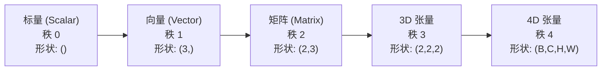
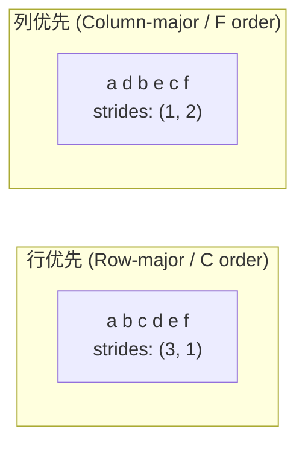
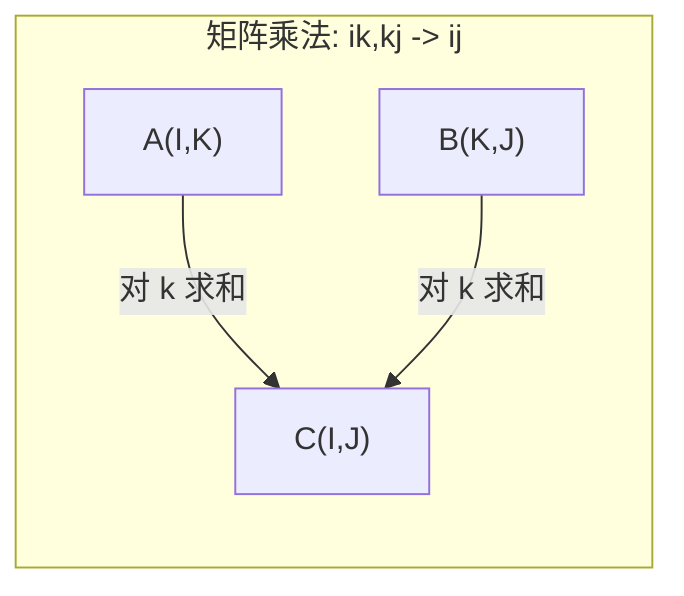

# 张量运算 (Tensor Operations)

> 张量 (Tensors) 是数据和深度学习之间的共同语言。每一张图像、每一个句子、每一个梯度都流过它们。

**类型：** 构建 (Build)
**语言：** Python
**前置要求：** 第一阶段，第01课（线性代数直觉 (Linear Algebra Intuition)）、第02课（向量、矩阵与运算 (Vectors, Matrices & Operations)）
**时间：** 约90分钟

## 学习目标

- 从零实现一个带有形状 (shape)、步长 (strides)、重塑 (reshape)、转置 (transpose) 和逐元素运算的张量类
- 应用广播 (broadcasting) 规则在不同形状的张量上运算，无需复制数据
- 为点积、矩阵乘法、外积 (outer product) 和批处理操作编写 einsum 表达式
- 追踪多头注意力 (multi-head attention) 中每一步的精确张量形状

## 问题

你构建了一个 Transformer。前向传播看起来没问题。运行后得到：`RuntimeError: mat1 and mat2 shapes cannot be multiplied (32x768 and 512x768)`。你盯着这些形状看。你尝试了一个转置。现在说 `Expected 4D input (got 3D input)`。你加了一个 unsqueeze。又别的东西出错了。

形状错误是深度学习代码中最常见的 bug。它们在概念上并不难——每个操作都有一个形状契约——但它们会迅速成倍增加。一个 Transformer 有几十个重塑、转置和广播操作串在一起。一个错误的轴就能让错误级联传递。更糟的是，有些形状错误根本不会抛出错误。它们通过在错误的维度上广播或在错误的轴上求和来悄无声息地产生垃圾结果。

矩阵处理两组事物之间的成对关系。真实数据不适合放在两个维度中。一批 32 张 224x224 的 RGB 图像是一个 4D 张量：`(32, 3, 224, 224)`。带有 12 个头的自注意力也是 4D 的：`(batch, heads, seq_len, head_dim)`。你需要一种可以泛化到任意数量维度的数据结构，其操作能在所有维度上干净地组合。这种结构就是张量。掌握了它的操作后，形状错误就变得很容易调试了。

## 概念

### 张量是什么

张量 (Tensor) 是统一数据类型的多维数字数组。维度的数量称为**秩 (rank)**（或**阶 (order)**）。每个维度是一个**轴 (axis)**。**形状 (shape)** 是一个列出每个轴大小的元组。



元素总数 = 所有大小的乘积。形状 `(2, 3, 4)` 包含 `2 * 3 * 4 = 24` 个元素。

### 深度学习中的张量形状

不同的数据类型在惯例上映射到特定的张量形状。

```mermaid
graph TD
    subgraph 计算机视觉 (Vision)
        V1["(B, C, H, W)<br/>32, 3, 224, 224"]
    end
    subgraph 自然语言处理 (NLP)
        N1["(B, T, D)<br/>16, 128, 768"]
    end
    subgraph 注意力机制 (Attention)
        A1["(B, H, T, D)<br/>16, 12, 128, 64"]
    end
    subgraph 权重 (Weights)
        W1["线性层: (out, in)<br/>Conv2D: (out_c, in_c, kH, kW)<br/>嵌入: (vocab, dim)"]
    end
```

PyTorch 使用 NCHW（通道优先）。TensorFlow 默认使用 NHWC（通道最后）。不匹配的布局会导致悄无声息的减速或错误。

### 内存布局如何工作

内存中的 2D 数组是一个 1D 的字节序列。**步长 (Strides)** 告诉你要跳过多少元素才能沿每个轴移动一步。



转置 (Transpose) 不会移动数据。它交换步长，使张量变为**非连续 (non-contiguous)**——一行中的元素在内存中不再相邻。

### 广播规则

广播 (Broadcasting) 让你在不同形状的张量上运算，无需复制数据。从右对齐形状。两个维度在相等或其中一个为 1 时是兼容的。较少维度的张量在左侧用 1 补齐。

```
张量 A:     (8, 1, 6, 1)
张量 B:        (7, 1, 5)
B 补齐后:    (1, 7, 1, 5)
结果:       (8, 7, 6, 5)
```

### Einsum：通用张量运算

爱因斯坦求和 (Einstein Summation) 用一个字母标记每个轴。在输入中出现但不在输出中出现的轴会被求和。在两者中都出现的轴会被保留。



关键模式：`i,i->`（点积），`i,j->ij`（外积），`ii->`（迹 / trace），`ij->ji`（转置），`bij,bjk->bik`（批次矩阵乘法），`bhtd,bhsd->bhts`（注意力分数）。

## 构建它

代码位于 `code/tensors.py` 中。每个步骤对应那里的实现。

### 步骤1：张量存储和步长

一个张量存储一个扁平的数字列表加上形状元数据。步长告诉索引逻辑如何将多维索引映射到扁平位置。

```python
class Tensor:
    def __init__(self, data, shape=None):
        if isinstance(data, (list, tuple)):
            self._data, self._shape = self._flatten_nested(data)
        elif isinstance(data, np.ndarray):
            self._data = data.flatten().tolist()
            self._shape = tuple(data.shape)
        else:
            self._data = [data]
            self._shape = ()

        if shape is not None:
            total = reduce(lambda a, b: a * b, shape, 1)
            if total != len(self._data):
                raise ValueError(
                    f"Cannot reshape {len(self._data)} elements into shape {shape}"
                )
            self._shape = tuple(shape)

        self._strides = self._compute_strides(self._shape)

    @staticmethod
    def _compute_strides(shape):
        if len(shape) == 0:
            return ()
        strides = [1] * len(shape)
        for i in range(len(shape) - 2, -1, -1):
            strides[i] = strides[i + 1] * shape[i + 1]
        return tuple(strides)
```

对于形状 `(3, 4)`，步长为 `(4, 1)`——跳过 4 个元素前进一行，跳过 1 个元素前进一列。

### 步骤2：重塑 (Reshape)、压缩 (Squeeze)、扩展 (Unsqueeze)

重塑改变形状而不改变元素顺序。元素总数必须保持不变。用一个 `-1` 来推断一个维度的大小。

```python
t = Tensor(list(range(12)), shape=(2, 6))
r = t.reshape((3, 4))
r = t.reshape((-1, 3))
```

压缩 (Squeeze) 移除大小为 1 的轴。扩展 (Unsqueeze) 插入一个。Unsqueeze 对广播至关重要——要加到批次 `(B, T, D)` 上的偏置向量 `(D,)` 需要 unsqueeze 到 `(1, 1, D)`。

```python
t = Tensor(list(range(6)), shape=(1, 3, 1, 2))
s = t.squeeze()
v = Tensor([1, 2, 3])
u = v.unsqueeze(0)
```

### 步骤3：转置 (Transpose) 和维度置换 (Permute)

转置交换两个轴。维度置换重新排列所有轴。这是你在 NCHW 和 NHWC 之间转换的方法。

```python
mat = Tensor(list(range(6)), shape=(2, 3))
tr = mat.transpose(0, 1)

t4d = Tensor(list(range(24)), shape=(1, 2, 3, 4))
perm = t4d.permute((0, 2, 3, 1))
```

转置或维度置换后，张量在内存中是非连续的。在 PyTorch 中，`view` 会在非连续张量上失败——使用 `reshape` 或先调用 `.contiguous()`。

### 步骤4：逐元素运算和规约

逐元素运算（加法、乘法、减法）独立应用于每个元素并保留形状。规约（求和、均值、最大值）折叠一个或多个轴。

```python
a = Tensor([[1, 2], [3, 4]])
b = Tensor([[10, 20], [30, 40]])
c = a + b
d = a * 2
s = a.sum(axis=0)
```

CNN 中的全局平均池化：`(B, C, H, W).mean(axis=[2, 3])` 产生 `(B, C)`。NLP 中的序列均值池化：`(B, T, D).mean(axis=1)` 产生 `(B, D)`。

### 步骤5：使用 NumPy 进行广播

`tensors.py` 中的 `demo_broadcasting_numpy()` 函数展示了核心模式。

```python
activations = np.random.randn(4, 3)
bias = np.array([0.1, 0.2, 0.3])
result = activations + bias

images = np.random.randn(2, 3, 4, 4)
scale = np.array([0.5, 1.0, 1.5]).reshape(1, 3, 1, 1)
result = images * scale

a = np.array([1, 2, 3]).reshape(-1, 1)
b = np.array([10, 20, 30, 40]).reshape(1, -1)
outer = a * b
```

通过广播计算成对距离：将 `(M, 2)` 重塑为 `(M, 1, 2)`，将 `(N, 2)` 重塑为 `(1, N, 2)`，相减，平方，沿最后一个轴求和，取平方根。结果：`(M, N)`。

### 步骤6：Einsum 运算

`demo_einsum()` 和 `demo_einsum_gallery()` 函数遍历了每种常见模式。

```python
a = np.array([1.0, 2.0, 3.0])
b = np.array([4.0, 5.0, 6.0])
dot = np.einsum("i,i->", a, b)

A = np.array([[1, 2], [3, 4], [5, 6]], dtype=float)
B = np.array([[7, 8, 9], [10, 11, 12]], dtype=float)
matmul = np.einsum("ik,kj->ij", A, B)

batch_A = np.random.randn(4, 3, 5)
batch_B = np.random.randn(4, 5, 2)
batch_mm = np.einsum("bij,bjk->bik", batch_A, batch_B)
```

一次缩并 (contraction) 的计算成本是所有索引大小（保留和求和）的乘积。对于 `bij,bjk->bik`，B=32, I=128, J=64, K=128：`32 * 128 * 64 * 128 = 33,554,432` 次乘加运算。

### 步骤7：通过 einsum 实现注意力机制

`demo_attention_einsum()` 函数端到端地实现了多头注意力。

```python
B, H, T, D = 2, 4, 8, 16
E = H * D

X = np.random.randn(B, T, E)
W_q = np.random.randn(E, E) * 0.02

Q = np.einsum("bte,ek->btk", X, W_q)
Q = Q.reshape(B, T, H, D).transpose(0, 2, 1, 3)

scores = np.einsum("bhtd,bhsd->bhts", Q, K) / np.sqrt(D)
weights = softmax(scores, axis=-1)
attn_output = np.einsum("bhts,bhsd->bhtd", weights, V)

concat = attn_output.transpose(0, 2, 1, 3).reshape(B, T, E)
output = np.einsum("bte,ek->btk", concat, W_o)
```

每一步都是张量运算：投影（通过 einsum 进行矩阵乘法），头分割（重塑 + 转置），注意力分数（通过 einsum 进行批次矩阵乘法），加权求和（通过 einsum 进行批次矩阵乘法），头合并（转置 + 重塑），输出投影（通过 einsum 进行矩阵乘法）。

## 使用它

### 从零实现 vs NumPy

| 操作 | 从零实现 (Tensor 类) | NumPy |
|---|---|---|
| 创建 | `Tensor([[1,2],[3,4]])` | `np.array([[1,2],[3,4]])` |
| 重塑 | `t.reshape((3,4))` | `a.reshape(3,4)` |
| 转置 | `t.transpose(0,1)` | `a.T` 或 `a.transpose(0,1)` |
| 压缩 | `t.squeeze(0)` | `np.squeeze(a, 0)` |
| 求和 | `t.sum(axis=0)` | `a.sum(axis=0)` |
| Einsum | 无 | `np.einsum("ij,jk->ik", a, b)` |

### 从零实现 vs PyTorch

```python
import torch

t = torch.tensor([[1, 2, 3], [4, 5, 6]], dtype=torch.float32)
t.shape
t.stride()
t.is_contiguous()

t.reshape(3, 2)
t.unsqueeze(0)
t.transpose(0, 1)
t.transpose(0, 1).contiguous()

torch.einsum("ik,kj->ij", A, B)
```

PyTorch 增加了自动求导 (autograd)、GPU 支持和优化的 BLAS 内核。形状语义是相同的。如果你理解了从零实现的版本，PyTorch 的形状错误就变得可读了。

### 每个神经网络层作为张量运算

| 操作 | 张量形式 | Einsum |
|---|---|---|
| 线性层 (Linear layer) | `Y = X @ W.T + b` | `"bd,od->bo"` + 偏置 |
| 注意力 QKV | `Q = X @ W_q` | `"btd,dh->bth"` |
| 注意力分数 (Attention scores) | `Q @ K.T / sqrt(d)` | `"bhtd,bhsd->bhts"` |
| 注意力输出 (Attention output) | `softmax(scores) @ V` | `"bhts,bhsd->bhtd"` |
| 批次归一化 (Batch norm) | `(X - mu) / sigma * gamma` | 逐元素 + 广播 |
| Softmax | `exp(x) / sum(exp(x))` | 逐元素 + 规约 |

## 交付

本课产出两个可复用的提示词：

1. **`outputs/prompt-tensor-shapes.md`** —— 一个调试张量形状不匹配的系统化提示词。包含每个常见操作（矩阵乘法、广播、拼接 (cat)、线性层、Conv2d、BatchNorm、softmax）的决策表和一个修复查找表。

2. **`outputs/prompt-tensor-debugger.md`** —— 一个逐步调试的提示词，当形状错误困扰你时可以粘贴到任何 AI 助手中。输入错误消息和张量形状，得到精确的修复方案。

## 练习

1. **简单——重塑往返。** 取一个形状为 `(2, 3, 4)` 的张量。将其重塑为 `(6, 4)`，然后重塑为 `(24,)`，然后再回到 `(2, 3, 4)`。在每一步通过打印扁平数据验证元素顺序被保留。

2. **中等——实现广播。** 扩展 `Tensor` 类，添加一个 `broadcast_to(shape)` 方法，将大小为 1 的维度扩展以匹配目标形状。然后修改 `_elementwise_op` 以在运算前自动进行广播。用形状 `(3, 1)` 和 `(1, 4)` 测试，产生 `(3, 4)`。

3. **困难——从零实现 einsum。** 实现一个基本的 `einsum(subscripts, *tensors)` 函数，至少处理：点积 (`i,i->`)、矩阵乘法 (`ij,jk->ik`)、外积 (`i,j->ij`) 和转置 (`ij->ji`)。解析下标字符串，识别缩并索引，并遍历所有索引组合。将你的结果与 `np.einsum` 比较。

4. **困难——注意力形状追踪器。** 编写一个函数，接收 `batch_size`、`seq_len`、`embed_dim` 和 `num_heads` 作为输入，并打印多头注意力每一步的精确形状：输入、Q/K/V 投影、头的分割、注意力分数、softmax 权重、加权求和、头的合并、输出投影。与 `demo_attention_einsum()` 的输出进行验证。

## 关键术语

| 术语 | 人们怎么说 | 实际含义 |
|---|---|---|
| 张量 (Tensor) | "一个矩阵但有更多维度" | 一个具有统一类型和定义的形状、步长及运算的多维数组 |
| 秩 (Rank) | "维度的数量" | 轴的数量。一个矩阵的秩是 2，而不是其矩阵秩 (matrix rank) |
| 形状 (Shape) | "张量的大小" | 列出每个轴大小的元组。`(2, 3)` 表示 2 行 3 列 |
| 步长 (Stride) | "内存如何布局" | 沿每个轴前进一个位置需要跳过的元素数量 |
| 广播 (Broadcasting) | "形状不同时它就可以用" | 一组严格的规则：从右对齐，维度必须相等或其中一个为 1 |
| 连续 (Contiguous) | "张量是正常的" | 元素在内存中按顺序存储，与逻辑布局之间没有间隙或重排 |
| Einsum | "一种花哨的矩阵乘法写法" | 一种通用记号，用一行代码表达任何张量缩并、外积、迹或转置 |
| View | "和 reshape 一样" | 一个共享相同内存缓冲区但具有不同形状/步长元数据的张量。在非连续数据上会失败 |
| 缩并 (Contraction) | "对索引求和" | 将张量之间共享索引相乘并求和以产生较低秩结果的通用操作 |
| NCHW / NHWC | "PyTorch vs TensorFlow 格式" | 图像张量的内存布局惯例。NCHW 将通道放在空间维度之前，NHWC 放在之后 |

## 进一步阅读

- [NumPy 广播](https://numpy.org/doc/stable/user/basics.broadcasting.html) —— 带可视化示例的规范规则
- [PyTorch 张量视图](https://pytorch.org/docs/stable/tensor_view.html) —— 何时视图有效，何时它们会复制
- [einops](https://github.com/arogozhnikov/einops) —— 一个使张量重塑可读且安全的库
- [图解 Transformer](https://jalammar.github.io/illustrated-transformer/) —— 可视化流经注意力的张量形状
- [NumPy 中的爱因斯坦求和](https://numpy.org/doc/stable/reference/generated/numpy.einsum.html) —— 包含示例的完整 einsum 文档