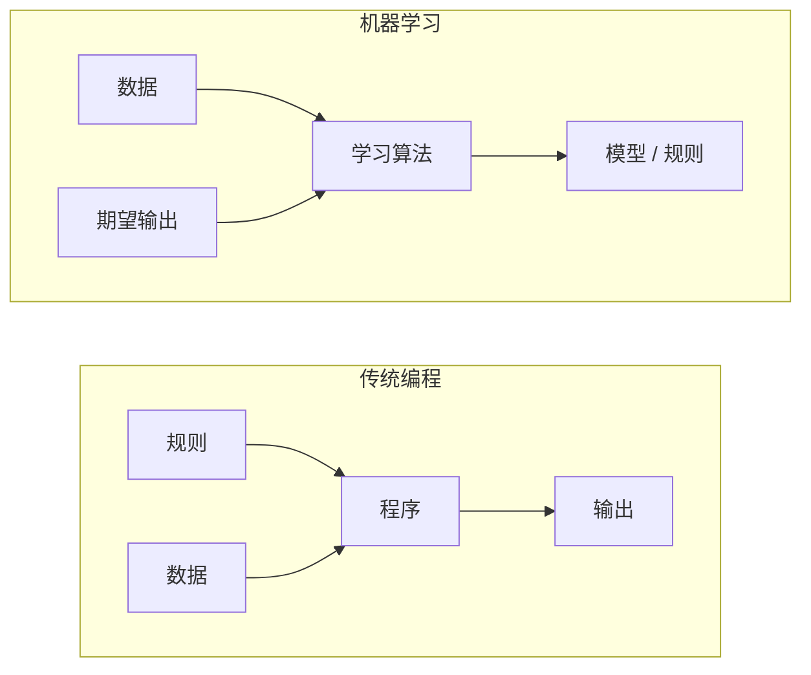
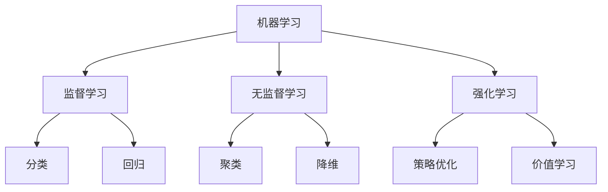
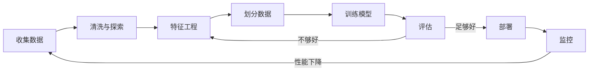
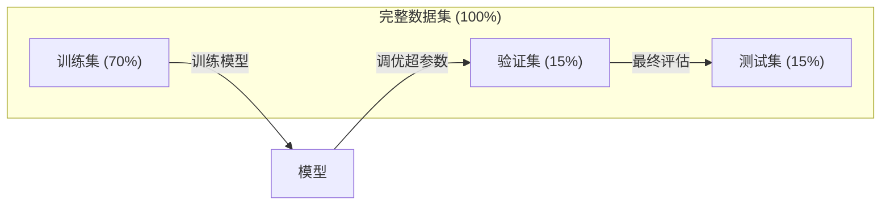
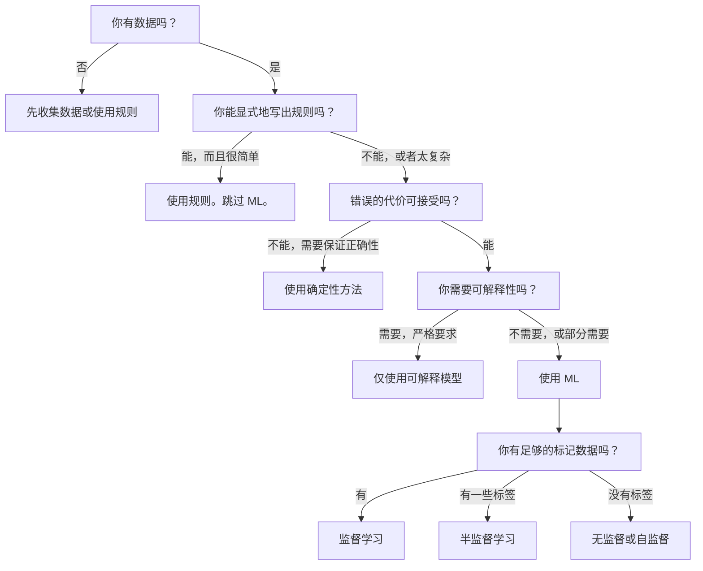

# 什么是机器学习 (What Is Machine Learning)

> 机器学习是教计算机在数据中寻找模式，而不是手工编写规则。

**类型：** 学习 (Learn)
**语言：** Python
**前置要求：** 第一阶段（数学基础）
**时间：** 约 45 分钟

## 学习目标 (Learning Objectives)

- 解释监督学习、无监督学习和强化学习的区别，并识别给定问题适用哪种类型
- 从零实现最近质心分类器 (Nearest Centroid Classifier)，并与随机基线进行比较评估
- 区分分类和回归任务，并为每种任务选择合适的损失函数
- 评估给定的业务问题是否适合机器学习，还是更适合用确定性规则解决

## 问题 (The Problem)

你想构建一个垃圾邮件过滤器。传统方法：坐下来编写数百条规则。"如果邮件包含'免费金钱'，标记为垃圾邮件。如果超过 3 个感叹号，标记为垃圾邮件。"你花了几周时间编写规则。然后垃圾邮件发送者改变了措辞。你的规则失效了。你编写更多规则。这个循环永无止境。

机器学习颠覆了这一点。你不编写规则，而是给计算机数千封已标记的邮件（"垃圾邮件"或"非垃圾邮件"），让它自己找出规则。计算机会发现你从未想到的模式。当垃圾邮件发送者改变策略时，你在新数据上重新训练，而不是重写代码。

这种从"编写规则"到"从数据中学习"的转变是机器学习的核心。每个推荐引擎、语音助手、自动驾驶汽车和语言模型都是这样工作的。

## 概念 (The Concept)

### 从数据中学习，而非从规则中学习

传统编程和机器学习以相反的方向解决问题。



传统编程：你编写规则。程序将规则应用于数据以产生输出。

机器学习：你提供数据和期望输出。算法发现规则。

训练出来的"模型"就是规则，以数字（权重、参数）的形式编码。它从见过的示例中泛化，对从未见过的数据做出预测。

### 机器学习的三种类型



**监督学习 (Supervised Learning)**：你有输入-输出对。模型学习将输入映射到输出。
- "这里有 10,000 张标记为猫或狗的照片。学会区分它们。"
- "这里有房屋特征和价格。学会预测价格。"

**无监督学习 (Unsupervised Learning)**：你只有输入。没有标签。模型自己找到结构。
- "这里有 10,000 条客户购买历史。找到自然的分组。"
- "这里有 1000 维的数据点。在保持结构的同时降到 2 维。"

**强化学习 (Reinforcement Learning)**：智能体在环境中采取行动，并收到奖励或惩罚。它学习一个策略 (Policy) 来最大化总奖励。
- "玩这个游戏。赢了 +1，输了 -1。找出一个策略。"
- "控制这个机器人手臂。捡起物体 +1，每秒浪费 -0.01。"

你在实践中构建的大部分内容使用监督学习。无监督学习常用于预处理和探索。强化学习驱动游戏 AI、机器人技术和语言模型的 RLHF。

### 三大类型之外

以上三个类别是清晰的，但现实世界的机器学习常常模糊这些界限。

**半监督学习 (Semi-supervised Learning)** 使用少量标记数据和大量未标记数据。你可能只有 100 张标记的医学图像和 100,000 张未标记的图像。技术包括：

- **标签传播 (Label Propagation)：** 构建连接相似数据点的图。标签通过图从标记节点传播到未标记邻居。
- **伪标签 (Pseudo-labeling)：** 在标记数据上训练模型，用它预测未标记数据的标签，然后在所有数据上重新训练。模型自举自己的训练集。
- **一致性正则化 (Consistency Regularization)：** 模型应该对输入和该输入的轻微扰动版本给出相同的预测。即使没有标签，这也能工作。

**自监督学习 (Self-supervised Learning)** 从数据本身创建监督信号。完全不需要人工标签。模型从数据的结构中创建自己的预测任务。

- **掩码语言建模 (Masked Language Modeling, BERT)：** 隐藏句子中 15% 的单词，训练模型预测缺失的单词。"标签"来自原始文本。
- **对比学习 (Contrastive Learning, SimCLR)：** 取一张图像，创建两个增强版本。训练模型识别它们来自同一张图像，同时将它们与其他图像的增强版本区分开来。
- **下一个 token 预测 (Next-token Prediction, GPT)：** 给定所有前面的单词，预测下一个单词。每个文本文档都成为一个训练样本。

这些不是与三大类型分离的类别。它们是结合了监督和无监督思想的策略。自监督学习在技术上是监督的（模型预测某些东西），但标签是自动生成的，而不是由人类生成的。

### 分类 vs 回归

这是两种主要的监督学习任务。

| 方面 | 分类 (Classification) | 回归 (Regression) |
|--------|---------------|------------|
| 输出 | 离散类别 | 连续数值 |
| 示例 | "这封邮件是垃圾邮件吗？" | "房价会是多少？" |
| 输出空间 | {猫, 狗, 鸟} | 任意实数 |
| 损失函数 | 交叉熵、准确率 | 均方误差、MAE |
| 决策 | 类别之间的边界 | 拟合数据的曲线 |

分类回答"哪个类别？"回归回答"多少？"

有些问题可以用两种方式表述。预测股票涨跌是分类。预测确切价格是回归。

### 机器学习工作流

每个机器学习项目都遵循相同的流程，无论使用什么算法。



**收集数据 (Collect Data)**：收集原始数据。更多数据几乎总是更好，但质量比数量更重要。

**清洗与探索 (Clean & Explore)**：处理缺失值、删除重复项、可视化分布、发现异常。这一步通常占项目总时间的 60-80%。

**特征工程 (Feature Engineering)**：将原始数据转换为模型可以使用的特征。将日期转换为星期几。归一化数值列。编码分类变量。好的特征比花哨的算法更重要。

**划分数据 (Split Data)**：分为训练集、验证集和测试集。模型在训练数据上训练，你在验证数据上调优超参数，在测试数据上报告最终性能。

**训练模型 (Train Model)**：将训练数据输入算法。算法调整内部参数以最小化损失函数。

**评估 (Evaluate)**：在验证/测试数据上衡量性能。如果性能不可接受，返回并尝试不同的特征、算法或超参数。

**部署 (Deploy)**：将模型投入生产，对新数据做出预测。

**监控 (Monitor)**：随时间跟踪性能。数据分布会变化（数据漂移，Data Drift），模型会退化。当性能下降时，重新训练。

### 训练集、验证集和测试集划分

这是初学者最容易搞错的最重要概念。你必须在模型从未见过的数据上评估它。否则你衡量的是记忆，而不是学习。



| 划分 | 用途 | 何时使用 | 典型大小 |
|-------|---------|-----------|-------------|
| 训练集 (Training) | 模型从此数据中学习 | 训练期间 | 60-80% |
| 验证集 (Validation) | 调优超参数、比较模型 | 每次训练运行后 | 10-20% |
| 测试集 (Test) | 最终无偏性能估计 | 一次，在最后 | 10-20% |

测试集是神圣的。你只看它一次。如果你不断根据测试性能调整模型，你实际上是在测试集上训练，你报告的数字毫无意义。

对于小数据集，使用 k 折交叉验证 (k-fold Cross-validation)：将数据分成 k 份，在 k-1 份上训练，在剩余的一份上验证，轮换，并平均结果。

### 过拟合 vs 欠拟合


**欠拟合 (Underfitting)**：模型太简单，无法捕捉数据中的模式。一条直线试图拟合曲线关系。训练误差高。测试误差高。

**过拟合 (Overfitting)**：模型太复杂，记忆了训练数据，包括其中的噪声。一条弯曲的曲线穿过每个训练点，但在新数据上失败。训练误差低。测试误差高。

**良好拟合 (Good Fit)**：模型捕捉真实模式而不记忆噪声。训练误差和测试误差都合理低。

过拟合的迹象：
- 训练准确率远高于验证准确率
- 模型在训练数据上表现良好，但在新数据上表现差
- 添加更多训练数据能提高性能（模型在记忆，而不是学习）

过拟合的修复方法：
- 获取更多训练数据
- 降低模型复杂度（更少的参数、更简单的架构）
- 正则化 (Regularization)（对大的权重添加惩罚）
- Dropout（训练期间随机将神经元置零）
- 早停 (Early Stopping)（当验证误差开始增加时停止训练）

欠拟合的修复方法：
- 使用更复杂的模型
- 添加更多特征
- 减少正则化
- 训练更长时间

### 偏差-方差权衡 (The Bias-Variance Tradeoff)

这是过拟合和欠拟合背后的数学框架。

**偏差 (Bias)**：来自模型中错误假设的误差。当真实关系是非线性时，线性模型具有高偏差。高偏差导致欠拟合。

**方差 (Variance)**：来自对训练数据中小波动敏感的误差。高方差的模型在不同数据子集上训练时给出非常不同的预测。高方差导致过拟合。

| 模型复杂度 | 偏差 | 方差 | 结果 |
|-----------------|------|----------|--------|
| 太低（线性模型拟合曲线数据） | 高 | 低 | 欠拟合 |
| 刚好 | 中 | 中 | 良好泛化 |
| 太高（10 个点的 20 次多项式） | 低 | 高 | 过拟合 |

总误差 = 偏差^2 + 方差 + 不可约噪声

你无法减少不可约噪声（它是数据本身的随机性）。你想找到偏差^2 + 方差最小化的最佳点。

### 没有免费午餐定理 (No Free Lunch Theorem)

没有单一算法对每个问题都表现最好。在一类问题上表现良好的算法在另一类问题上会表现差。这就是为什么数据科学家尝试多种算法并比较结果。

在实践中，选择取决于：
- 你有多少数据
- 有多少特征
- 关系是线性的还是非线性的
- 你是否需要可解释性
- 你能负担多少计算资源

### 什么时候不应该使用机器学习

机器学习很强大，但不总是正确的工具。在伸手拿模型之前，先问自己是否真的需要。

**在以下情况下不要使用机器学习：**

- **规则简单且定义明确。** 税务计算、排序算法、单位转换。如果你能用几个 if 语句写出逻辑，模型只会增加复杂度而没有好处。
- **你没有数据或数据很少。** 机器学习需要示例来学习。只有 10 个数据点，你无法训练任何有意义的东西。先收集数据。
- **错误的代价是灾难性的，你需要保证正确性。** 医疗剂量计算、核反应堆控制、密码学验证。机器学习模型是概率性的。它们有时会出错。如果"有时出错"是不可接受的，使用确定性方法。
- **查找表或启发式方法能解决问题。** 如果一个简单的阈值或表格覆盖了 99% 的情况，添加机器学习会增加维护成本而没有有意义的改进。
- **你无法解释决策，而可解释性是必需的。** 受监管的行业（贷款、保险、刑事司法）有时要求每个决策都完全可解释。一些机器学习模型是可解释的（线性回归、小型决策树）。大多数不是。
- **问题变化的速度比你重新训练的速度快。** 如果规则每天变化而重新训练需要一周，模型总是过时的。

使用这个决策流程图：



## 构建 (Build It)

`code/ml_intro.py` 中的代码从零实现了一个最近质心分类器，这是最简单的机器学习算法。它展示了核心思想：从数据中学习，然后对新数据进行预测。

### 步骤 1：从零实现最近质心分类器

最近质心分类器计算训练数据中每个类别的中心（均值）。为了预测，它将每个新点分配给中心最近的类别。

```python
class NearestCentroid:
    def fit(self, X, y):
        self.classes = np.unique(y)
        self.centroids = np.array([
            X[y == c].mean(axis=0) for c in self.classes
        ])

    def predict(self, X):
        distances = np.array([
            np.sqrt(((X - c) ** 2).sum(axis=1))
            for c in self.centroids
        ])
        return self.classes[distances.argmin(axis=0)]
```

这就是整个算法。Fit 计算两个均值。Predict 计算距离。没有梯度下降，没有迭代，没有超参数。

### 步骤 2：在合成数据上训练

我们生成一个有两个类别且略有重叠的 2D 分类数据集。质心分类器在类别中心之间画出一条线性决策边界。

```python
rng = np.random.RandomState(42)
X_class0 = rng.randn(100, 2) + np.array([1.0, 1.0])
X_class1 = rng.randn(100, 2) + np.array([-1.0, -1.0])
X = np.vstack([X_class0, X_class1])
y = np.array([0] * 100 + [1] * 100)
```

### 步骤 3：与基线比较

每个机器学习模型都应该与一个平凡的基线进行比较。这里，基线预测一个随机类别。如果你的机器学习模型不能击败随机猜测，那就有问题了。

```python
baseline_preds = rng.choice([0, 1], size=len(y_test))
baseline_acc = np.mean(baseline_preds == y_test)
```

在这个干净的数据集上，质心分类器应该获得约 90%+ 的准确率。随机基线约为 50%。

### 为什么这很重要

最近质心分类器极其简单。它没有超参数，没有迭代，没有梯度下降。然而它捕捉了基本的机器学习模式：

1. **学习 (Learn)** 训练数据的表示（质心）
2. **预测 (Predict)** 使用该表示对新数据进行预测（最近距离）
3. **评估 (Evaluate)** 与基线比较（随机猜测）

每个机器学习算法，从逻辑回归到 Transformer，都遵循相同的三步模式。表示变得更复杂，但工作流保持不变。

### 步骤 4：质心分类器不能做什么

最近质心分类器假设每个类别形成一个单一的团。它画出线性决策边界。它在以下情况下失败：

- 类别有多个聚类（例如，数字"1"可以用几种不同的方式书写）
- 决策边界是非线性的（例如，一个类别包围另一个类别）
- 特征有非常不同的尺度（距离被最大尺度的特征主导）

这些限制驱动了你将学习的每个其他算法。K 近邻处理多个聚类。决策树处理非线性边界。特征缩放修复尺度问题。每节课都建立在前一节课的限制之上。

## 使用 (Use It)

sklearn 提供了 `NearestCentroid` 和合成数据生成器：

```python
from sklearn.neighbors import NearestCentroid
from sklearn.datasets import make_classification
from sklearn.model_selection import train_test_split

X, y = make_classification(
    n_samples=500, n_features=2, n_redundant=0,
    n_clusters_per_class=1, random_state=42
)
X_train, X_test, y_train, y_test = train_test_split(X, y, test_size=0.3)

clf = NearestCentroid()
clf.fit(X_train, y_train)
print(f"Accuracy: {clf.score(X_test, y_test):.3f}")
```

## 产出 (Ship It)

本课产出 `outputs/prompt-ml-problem-framer.md`——一个将模糊的业务问题转化为具体机器学习任务的提示词。给它一个问题描述（"我们想减少流失"或"预测下个季度的需求"），它会识别学习类型、定义预测目标、列出候选特征、选择成功指标、建立基线，并标记数据泄漏或类别不平衡等陷阱。在任何机器学习项目开始时使用它，以避免构建错误的东西。

## 关键术语 (Key Terms)

| 术语 | 人们怎么说 | 实际含义 |
|------|----------------|----------------------|
| 模型 (Model) | "AI" | 一个具有可学习参数的数学函数，将输入映射到输出 |
| 训练 (Training) | "教 AI" | 运行优化算法调整模型参数，使预测与已知输出匹配 |
| 特征 (Feature) | "输入列" | 数据的一个可测量属性，模型用它来做预测 |
| 标签 (Label) | "答案" | 训练样本的已知输出，用于计算误差信号 |
| 超参数 (Hyperparameter) | "你调整的设置" | 训练前设置的参数，控制学习过程（学习率、层数） |
| 损失函数 (Loss function) | "模型有多错" | 衡量预测输出与实际输出之间差距的函数，训练试图最小化它 |
| 过拟合 (Overfitting) | "它记住了考试" | 模型学习了训练特定的噪声而不是一般模式，因此在新数据上失败 |
| 欠拟合 (Underfitting) | "它什么都没学到" | 模型太简单，无法捕捉数据中的真实模式 |
| 泛化 (Generalization) | "它在新数据上有效" | 模型对未训练过的数据做出准确预测的能力 |
| 交叉验证 (Cross-validation) | "在不同块上测试" | 反复将数据分成训练/测试折并平均结果，给出更稳健的性能估计 |
| 正则化 (Regularization) | "保持权重小" | 向损失函数添加惩罚项，阻止过于复杂的模型 |
| 数据漂移 (Data drift) | "世界变了" | 传入数据的统计分布随时间变化，降低模型性能 |

## 练习 (Exercises)

1. 取任意数据集（例如 Iris、Titanic）。将其按 70/15/15 划分为训练/验证/测试。解释为什么不应该在测试集上调优超参数。
2. 列出三个现实世界的问题。对每个问题，识别它是分类、回归还是聚类，以及是监督的还是无监督的。
3. 一个模型在训练数据上获得 99% 的准确率，但在测试数据上只有 60%。诊断问题并列出你会尝试修复它的三件事。

## 进一步阅读 (Further Reading)

- [An Introduction to Statistical Learning](https://www.statlearning.com/) - 涵盖所有经典机器学习方法的免费教材，附有实际示例
- [Google's Machine Learning Crash Course](https://developers.google.com/machine-learning/crash-course) - 机器学习概念的简洁可视化入门
- [Scikit-learn User Guide](https://scikit-learn.org/stable/user_guide.html) - 在 Python 中实现机器学习的实用参考
