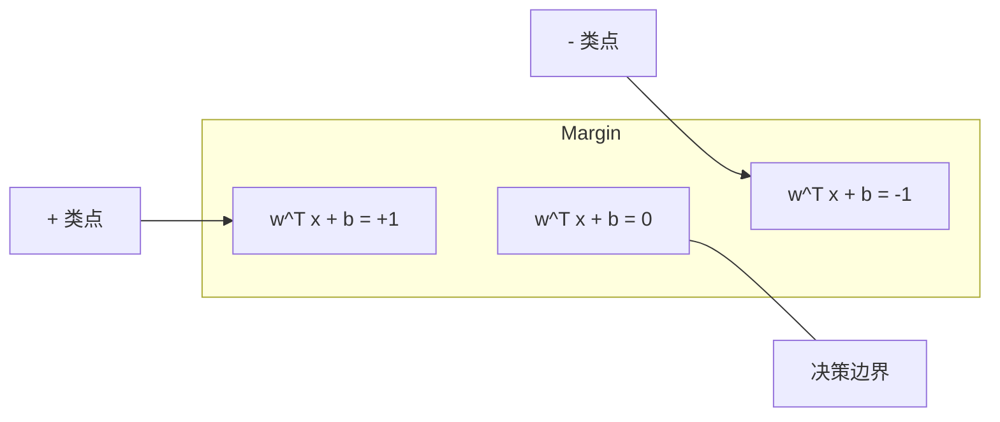
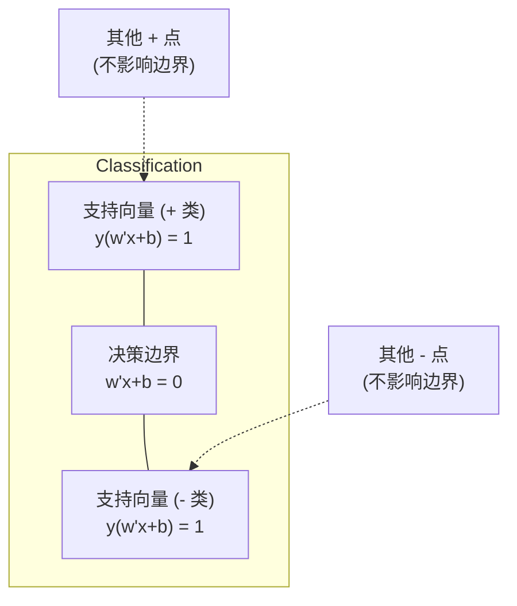
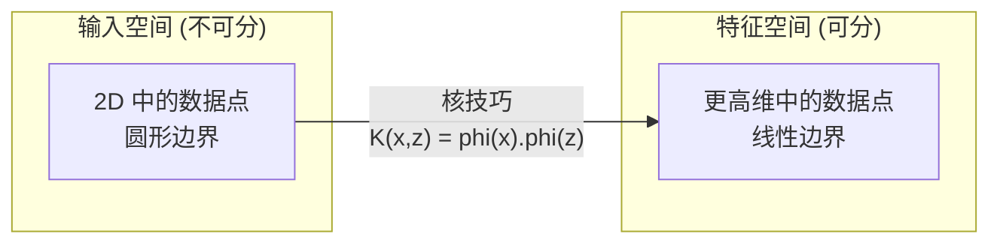

# 支持向量机 (Support Vector Machines)

> 在两个类别之间找到最宽的街道。这就是整个思想。

**类型：** 构建 (Build)
**语言：** Python
**前置要求：** 第一阶段（第 08 课优化、第 14 课范数与距离、第 18 课凸优化）
**时间：** 约 90 分钟

## 学习目标 (Learning Objectives)

- 使用合页损失 (Hinge Loss) 和原始形式上的梯度下降从零实现线性 SVM
- 解释最大间隔 (Maximum Margin) 原理，并从训练好的模型中识别支持向量 (Support Vectors)
- 比较线性、多项式和 RBF 核 (Kernel)，并解释核技巧 (Kernel Trick) 如何避免显式高维映射
- 评估 C 参数控制的间隔宽度与分类错误之间的权衡

## 问题 (The Problem)

你有两类数据点，需要画一条线（或超平面）将它们分开。无限多条线都可以工作。你应该选哪一条？

具有最大间隔的那条。间隔是决策边界与每侧最近数据点之间的距离。更宽的间隔意味着分类器更自信，对未见数据的泛化更好。

这种直觉引出了支持向量机 (Support Vector Machines, SVMs)，这是机器学习中数学上最优雅的算法之一。SVM 在深度学习之前是主导的分类方法，并且对于小数据集、高维数据以及需要具有理论保证的原则性、深入理解的模型的问题，仍然是最佳选择。

SVM 直接连接到第一阶段：优化是凸的（第 18 课），间隔用范数衡量（第 14 课），核技巧利用点积处理非线性边界，而无需在高维空间中计算。

## 概念 (The Concept)

### 最大间隔分类器

给定线性可分数据，标签 y_i 在 {-1, +1} 中，特征向量 x_i，我们想要一个分离类别的超平面 w^T x + b = 0。

点 x_i 到超平面的距离是：

```
distance = |w^T x_i + b| / ||w||
```

对于正确分类的点：y_i * (w^T x_i + b) > 0。间隔是超平面到每侧最近点距离的两倍。



优化问题：

```
maximize    2 / ||w||     (间隔宽度)
subject to  y_i * (w^T x_i + b) >= 1  for all i
```

等价地（最小化 ||w||^2 更容易优化）：

```
minimize    (1/2) ||w||^2
subject to  y_i * (w^T x_i + b) >= 1  for all i
```

这是一个凸二次规划。它有唯一的全局解。恰好位于间隔边界上的数据点（其中 y_i * (w^T x_i + b) = 1）是支持向量。它们是唯一决定决策边界的点。移动或移除任何非支持向量点，边界不会改变。

### 支持向量：关键的少数



大多数训练点是不相关的。只有支持向量重要。这就是为什么 SVM 在预测时内存高效：你只需要存储支持向量，而不是整个训练集。

支持向量的数量也给出了泛化误差的界限。相对于数据集大小，更少的支持向量意味着更好的泛化。

### 软间隔：用 C 参数处理噪声

真实数据很少完全可分。有些点可能在边界的错误一侧，或在间隔内部。软间隔 (Soft Margin) 形式通过引入松弛变量 (Slack Variables) 允许违反。

```
minimize    (1/2) ||w||^2 + C * sum(xi_i)
subject to  y_i * (w^T x_i + b) >= 1 - xi_i
            xi_i >= 0  for all i
```

松弛变量 xi_i 衡量点 i 违反间隔的程度。C 控制权衡：

| C 值 | 行为 |
|---------|----------|
| 大 C | 严重惩罚违反。窄间隔，更少错误分类。过拟合 |
| 小 C | 允许更多违反。宽间隔，更多错误分类。欠拟合 |

C 是正则化强度，反转的。大 C = 更少正则化。小 C = 更多正则化。

### 合页损失：SVM 损失函数

软间隔 SVM 可以重写为无约束优化：

```
minimize    (1/2) ||w||^2 + C * sum(max(0, 1 - y_i * (w^T x_i + b)))
```

项 max(0, 1 - y_i * f(x_i)) 是合页损失 (Hinge Loss)。当点被正确分类且在间隔之外时为零。当点在间隔内部或被错误分类时是线性的。

```
单个点的合页损失：

loss
  |
  | \
  |  \
  |   \
  |    \
  |     \_______________
  |
  +-----|-----|-------->  y * f(x)
       0     1

当 y*f(x) >= 1 时损失为零（正确分类，在间隔外）。
当 y*f(x) < 1 时线性惩罚。
```

与逻辑损失（逻辑回归）比较：

```
合页损失:     max(0, 1 - y*f(x))          在间隔处硬截止
逻辑损失:  log(1 + exp(-y*f(x)))        平滑，从不精确为零
```

合页损失产生稀疏解（只有支持向量有非零贡献）。逻辑损失使用所有数据点。这使得 SVM 在预测时更内存高效。

### 使用梯度下降训练线性 SVM

你可以使用梯度下降在合页损失加 L2 正则化上训练线性 SVM，无需解约束 QP：

```
L(w, b) = (lambda/2) * ||w||^2 + (1/n) * sum(max(0, 1 - y_i * (w^T x_i + b)))

关于 w 的梯度：
  If y_i * (w^T x_i + b) >= 1:  dL/dw = lambda * w
  If y_i * (w^T x_i + b) < 1:   dL/dw = lambda * w - y_i * x_i

关于 b 的梯度：
  If y_i * (w^T x_i + b) >= 1:  dL/db = 0
  If y_i * (w^T x_i + b) < 1:   dL/db = -y_i
```

这称为原始形式 (Primal Formulation)。它每轮运行 O(n * d)，其中 n 是样本数，d 是特征数。对于大型、稀疏、高维数据（文本分类），这很快。

### 对偶形式和核技巧

SVM 问题的拉格朗日对偶（来自第一阶段第 18 课，KKT 条件）是：

```
maximize    sum(alpha_i) - (1/2) * sum_ij(alpha_i * alpha_j * y_i * y_j * (x_i . x_j))
subject to  0 <= alpha_i <= C
            sum(alpha_i * y_i) = 0
```

对偶只涉及数据点之间的点积 x_i . x_j。这是关键洞察。将每个点积替换为核函数 K(x_i, x_j)，SVM 可以学习非线性边界，而无需显式计算变换。

```
线性核 (Linear kernel):      K(x, z) = x . z
多项式核 (Polynomial kernel):  K(x, z) = (x . z + c)^d
RBF (高斯) 核:     K(x, z) = exp(-gamma * ||x - z||^2)
```

RBF 核将数据映射到无限维空间。在输入空间中接近的点具有接近 1 的核值。相距很远的点具有接近 0 的核值。它可以学习任何平滑的决策边界。



核技巧计算高维空间中的点积而无需实际去那里。对于 D 维中的 d 次多项式核，显式特征空间有 O(D^d) 维。但 K(x, z) 在 O(D) 时间内计算。

### 回归 SVM (SVR)

支持向量回归 (Support Vector Regression) 在数据周围拟合一个宽度为 epsilon 的管道。管道内的点损失为零。管道外的点被线性惩罚。

```
minimize    (1/2) ||w||^2 + C * sum(xi_i + xi_i*)
subject to  y_i - (w^T x_i + b) <= epsilon + xi_i
            (w^T x_i + b) - y_i <= epsilon + xi_i*
            xi_i, xi_i* >= 0
```

epsilon 参数控制管道宽度。更宽的管道 = 更少的支持向量 = 更平滑的拟合。更窄的管道 = 更多的支持向量 = 更紧密的拟合。

### 为什么 SVM 输给了深度学习（以及它们何时仍然胜出）

SVM 从 1990 年代末到 2010 年代初主导了机器学习。深度学习在几个方面超越了它们：

| 因素 | SVM | 深度学习 |
|--------|------|---------------|
| 特征工程 | 需要它 | 学习特征 |
| 可扩展性 | 核对 O(n^2) 到 O(n^3) | SGD 每轮 O(n) |
| 图像/文本/音频 | 需要手工特征 | 从原始数据学习 |
| 大数据集 (>100k) | 慢 | 扩展良好 |
| GPU 加速 | 有限收益 | 大幅加速 |

SVM 在以下情况下仍然胜出：
- 小数据集（数百到低数千个样本）
- 高维稀疏数据（带有 TF-IDF 特征的文本）
- 当你需要数学保证时（间隔界限）
- 当训练时间必须最小时（线性 SVM 非常快）
- 具有清晰间隔结构的二元分类
- 异常检测（单类 SVM）

## 构建 (Build It)

### 步骤 1：合页损失和梯度

基础。计算一批数据的合页损失及其梯度。

```python
def hinge_loss(X, y, w, b):
    n = len(X)
    total_loss = 0.0
    for i in range(n):
        margin = y[i] * (dot(w, X[i]) + b)
        total_loss += max(0.0, 1.0 - margin)
    return total_loss / n
```

### 步骤 2：通过梯度下降的线性 SVM

通过最小化正则化合页损失来训练。不需要 QP 求解器。

```python
class LinearSVM:
    def __init__(self, lr=0.001, lambda_param=0.01, n_epochs=1000):
        self.lr = lr
        self.lambda_param = lambda_param
        self.n_epochs = n_epochs
        self.w = None
        self.b = 0.0

    def fit(self, X, y):
        n_features = len(X[0])
        self.w = [0.0] * n_features
        self.b = 0.0

        for epoch in range(self.n_epochs):
            for i in range(len(X)):
                margin = y[i] * (dot(self.w, X[i]) + self.b)
                if margin >= 1:
                    self.w = [wj - self.lr * self.lambda_param * wj
                              for wj in self.w]
                else:
                    self.w = [wj - self.lr * (self.lambda_param * wj - y[i] * X[i][j])
                              for j, wj in enumerate(self.w)]
                    self.b -= self.lr * (-y[i])

    def predict(self, X):
        return [1 if dot(self.w, x) + self.b >= 0 else -1 for x in X]
```

### 步骤 3：核函数

实现线性、多项式和 RBF 核。

```python
def linear_kernel(x, z):
    return dot(x, z)

def polynomial_kernel(x, z, degree=3, c=1.0):
    return (dot(x, z) + c) ** degree

def rbf_kernel(x, z, gamma=0.5):
    diff = [xi - zi for xi, zi in zip(x, z)]
    return math.exp(-gamma * dot(diff, diff))
```

### 步骤 4：间隔和支持向量识别

训练后，识别哪些点是支持向量并计算间隔宽度。

```python
def find_support_vectors(X, y, w, b, tol=1e-3):
    support_vectors = []
    for i in range(len(X)):
        margin = y[i] * (dot(w, X[i]) + b)
        if abs(margin - 1.0) < tol:
            support_vectors.append(i)
    return support_vectors
```

完整实现见 `code/svm.py`。

## 使用 (Use It)

使用 scikit-learn：

```python
from sklearn.svm import SVC, LinearSVC, SVR
from sklearn.preprocessing import StandardScaler
from sklearn.pipeline import Pipeline

clf = Pipeline([
    ("scaler", StandardScaler()),
    ("svm", SVC(kernel="rbf", C=1.0, gamma="scale")),
])
clf.fit(X_train, y_train)
print(f"Accuracy: {clf.score(X_test, y_test):.4f}")
print(f"Support vectors: {clf['svm'].n_support_}")
```

重要：在训练 SVM 之前始终缩放你的特征。SVM 对特征大小敏感，因为间隔取决于 ||w||，未缩放的特征会扭曲几何。

对于大数据集，使用 `LinearSVC`（原始形式，每轮 O(n)）而不是 `SVC`（对偶形式，O(n^2) 到 O(n^3)）：

```python
from sklearn.svm import LinearSVC

clf = Pipeline([
    ("scaler", StandardScaler()),
    ("svm", LinearSVC(C=1.0, max_iter=10000)),
])
```

## 练习 (Exercises)

1. 生成一个 2D 线性可分数据集。训练你的 LinearSVM 并识别支持向量。验证支持向量是离决策边界最近的点。

2. 在噪声数据集上从 0.001 到 1000 变化 C。为每个 C 值绘制决策边界。观察从宽间隔（欠拟合）到窄间隔（过拟合）的过渡。

3. 创建一个类别边界是圆形（非线性）的数据集。展示线性 SVM 失败。计算 RBF 核矩阵，展示类别在核诱导的特征空间中变得可分。

4. 在相同数据集上比较合页损失与逻辑损失。训练线性 SVM 和逻辑回归。计算每个模型的决策边界有多少训练点有贡献（支持向量 vs 所有点）。

5. 实现 SVR（epsilon 不敏感损失）。将其拟合到 y = sin(x) + noise。在预测周围绘制 epsilon 管道，并高亮支持向量（管道外的点）。

## 关键术语 (Key Terms)

| 术语 | 实际含义 |
|------|----------------------|
| 支持向量 (Support vectors) | 离决策边界最近的训练点。唯一决定超平面的点 |
| 间隔 (Margin) | 决策边界与最近支持向量之间的距离。SVM 最大化这个 |
| 合页损失 (Hinge loss) | max(0, 1 - y*f(x))。当正确分类且在间隔外时为零。否则线性惩罚 |
| C 参数 | 间隔宽度与分类错误之间的权衡。大 C = 窄间隔，小 C = 宽间隔 |
| 软间隔 (Soft margin) | 通过松弛变量允许间隔违反的 SVM 形式。处理不可分数据 |
| 核技巧 (Kernel trick) | 在高维特征空间中计算点积而无需显式映射到该空间 |
| 线性核 (Linear kernel) | K(x, z) = x . z。等价于标准点积。用于线性可分数据 |
| RBF 核 | K(x, z) = exp(-gamma * \|\|x-z\|\|^2)。映射到无限维。学习任何平滑边界 |
| 多项式核 (Polynomial kernel) | K(x, z) = (x . z + c)^d。映射到多项式组合的特征空间 |
| 对偶形式 (Dual formulation) | SVM 问题的重新表述，只依赖于数据点之间的点积。使核成为可能 |
| SVR | 支持向量回归。在数据周围拟合 epsilon 管道。管道内的点损失为零 |
| 松弛变量 (Slack variables) | xi_i：衡量点违反间隔的程度。对间隔外正确分类的点为零 |
| 最大间隔 (Maximum margin) | 选择最大化到每类最近点距离的超平面的原则 |
