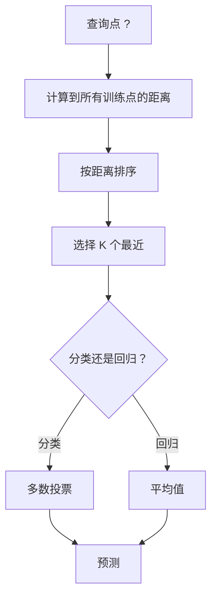
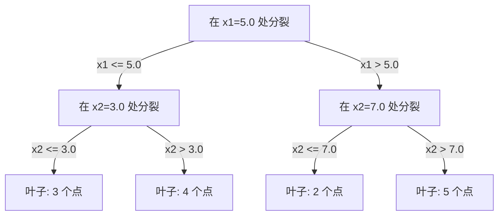

# K 近邻与距离 (K-Nearest Neighbors and Distances)

> 存储一切。通过看你的邻居来预测。最简单且实际有效的算法。

**类型：** 构建 (Build)
**语言：** Python
**前置要求：** 第一阶段（第 14 课范数与距离）
**时间：** 约 90 分钟

## 学习目标 (Learning Objectives)

- 从零实现 KNN 分类和回归，具有可配置的 K 和距离加权投票
- 比较 L1、L2、余弦和 Minkowski 距离度量，并为给定数据类型选择合适的度量
- 解释维度灾难 (Curse of Dimensionality)，并演示为什么 KNN 在高维空间中退化
- 构建 KD 树 (KD-Tree) 用于高效最近邻搜索，并分析它何时优于暴力搜索

## 问题 (The Problem)

你有一个数据集。一个新数据点到达。你需要对它进行分类或预测它的值。你不是从数据中学习参数（像线性回归或 SVM），而是找到离新点最近的 K 个训练点，让它们投票。

这就是 K 近邻 (K-Nearest Neighbors)。没有训练阶段。没有要学习的参数。没有要最小化的损失函数。你存储整个训练集，在预测时计算距离。

这听起来太简单了，不像是有效的。但 KNN 对许多问题出乎意料地有竞争力，特别是小到中等数据集，深入理解它揭示了基本概念：距离度量的选择（连接到第一阶段第 14 课）、维度灾难，以及惰性学习 (Lazy Learning) 与急切学习 (Eager Learning) 的区别。

KNN 也出现在现代 AI 的各个地方，只是名字不同。向量数据库对嵌入做 KNN 搜索。检索增强生成 (RAG) 找到 K 个最近的文档块。推荐系统找相似的用户或物品。算法是相同的。规模和数据结构不同。

## 概念 (The Concept)

### KNN 如何工作

给定一个标记点的数据集和一个新查询点：

1. 计算查询点到数据集中每个点的距离
2. 按距离排序
3. 取 K 个最近的点
4. 对于分类：K 个邻居中的多数投票
5. 对于回归：K 个邻居值的平均（或加权平均）



这就是整个算法。没有拟合。没有梯度下降。没有轮次。

### 选择 K

K 是唯一的超参数。它控制偏差-方差权衡：

| K | 行为 |
|---|----------|
| K = 1 | 决策边界跟随每个点。零训练误差。高方差。过拟合 |
| 小 K (3-5) | 对局部结构敏感。可以捕捉复杂边界 |
| 大 K | 更平滑的边界。对噪声更鲁棒。可能欠拟合 |
| K = N | 对每个点预测多数类。最大偏差 |

对于 N 个点的数据集，常见的起点是 K = sqrt(N)。对于二元分类使用奇数 K 以避免平局。


### 距离度量

距离函数定义了"近"的含义。不同的度量产生不同的邻居、不同的预测。

**L2（欧几里得）** 是默认值。直线距离。

```
d(a, b) = sqrt(sum((a_i - b_i)^2))
```

对特征尺度敏感。在使用 L2 的 KNN 之前始终标准化特征。

**L1（曼哈顿）** 求和绝对差。比 L2 对异常值更鲁棒，因为它不平方差值。

```
d(a, b) = sum(|a_i - b_i|)
```

**余弦距离** 衡量向量之间的角度，忽略大小。对文本和嵌入数据至关重要。

```
d(a, b) = 1 - (a . b) / (||a|| * ||b||)
```

**Minkowski** 用参数 p 推广 L1 和 L2。

```
d(a, b) = (sum(|a_i - b_i|^p))^(1/p)

p=1: 曼哈顿
p=2: 欧几里得
p->inf: 切比雪夫 (最大绝对差)
```

使用哪种度量取决于数据：

| 数据类型 | 最佳度量 | 原因 |
|-----------|------------|-----|
| 数值特征，相似尺度 | L2 (欧几里得) | 默认，适用于空间数据 |
| 数值特征，有异常值 | L1 (曼哈顿) | 鲁棒，不放大大的差异 |
| 文本嵌入 | 余弦 | 大小是噪声，方向是含义 |
| 高维稀疏 | 余弦或 L1 | L2 受维度灾难影响 |
| 混合类型 | 自定义距离 | 按特征类型组合度量 |

### 加权 KNN

标准 KNN 对所有 K 个邻居赋予相等的权重。但距离为 0.1 的邻居应该比距离为 5.0 的邻居更重要。

**距离加权 KNN** 按距离倒数加权每个邻居：

```
weight_i = 1 / (distance_i + epsilon)

对于分类: 加权投票
对于回归:     加权平均 = sum(w_i * y_i) / sum(w_i)
```

epsilon 防止查询点与训练点完全匹配时除以零。

加权 KNN 对 K 的选择不那么敏感，因为远处的邻居无论如何贡献很小。

### 维度灾难 (The Curse of Dimensionality)

KNN 性能在高维中退化。这不是模糊的担忧。这是一个数学事实。

**问题 1：距离收敛。** 随着维度增加，最大距离与最小距离的比率趋近于 1。所有点变得与查询点同样"远"。

```
在 d 维中，对于随机均匀点：

d=2:    max_dist / min_dist = 变化很大
d=100:  max_dist / min_dist ~ 1.01
d=1000: max_dist / min_dist ~ 1.001

当所有距离几乎相等时，"最近"就毫无意义了。
```

**问题 2：体积爆炸。** 要在数据的固定比例内捕获 K 个邻居，你需要将搜索半径扩展到覆盖特征空间的更大比例。高维中的"邻域"包含了大部分空间。

**问题 3：角落主导。** 在 d 维单位超立方体中，大部分体积集中在角落附近，而不是中心。随着 d 增长，内切于立方体中的球体包含的体积比例趋近于零。

实际后果：KNN 在最多约 20-50 个特征时工作良好。超过这个范围，你需要在应用 KNN 之前进行降维（PCA、UMAP、t-SNE），或者你需要使用利用数据固有较低维度的基于树的搜索结构。

### KD 树：快速最近邻搜索

暴力 KNN 计算查询点到每个训练点的距离。每次查询是 O(n * d)。对于大数据集，这太慢了。

KD 树沿特征轴递归划分空间。在每一层，它沿一个维度在中位数值处分裂。



要找到最近邻，遍历树到包含查询的叶子，然后回溯，只有在可能包含更近点的情况下才检查相邻分区。

平均查询时间：低维是 O(log n)。但 KD 树在高维 (d > 20) 退化到 O(n)，因为回溯消除的分支越来越少。

### 球树 (Ball Trees)：中等维更好

球树将数据划分为嵌套超球体而不是轴对齐的盒子。每个节点定义一个包含该子树中所有点的球（中心 + 半径）。

相对 KD 树的优势：
- 在中等维度（最多 ~50）工作更好
- 处理非轴对齐结构
- 更紧密的包围体意味着搜索期间修剪更多分支

KD 树和球树都是精确算法。对于真正的大规模搜索（数百万点，数百维），改用近似最近邻方法（HNSW、IVF、乘积量化）。这些在第一阶段第 14 课中涵盖。

### 惰性学习 vs 急切学习

KNN 是惰性学习者 (Lazy Learner)：它在训练时不做任何工作，在预测时做所有工作。大多数其他算法（线性回归、SVM、神经网络）是急切学习者 (Eager Learner)：它们在训练时做大量计算以构建紧凑模型，然后预测很快。

| 方面 | 惰性 (KNN) | 急切 (SVM, 神经网络) |
|--------|------------|------------------------|
| 训练时间 | O(1) 仅存储数据 | O(n * epochs) |
| 预测时间 | 每次查询 O(n * d) | O(d) 或 O(参数) |
| 预测时内存 | 存储整个训练集 | 仅存储模型参数 |
| 适应新数据 | 即时添加点 | 重新训练模型 |
| 决策边界 | 隐式，即时计算 | 显式，训练后固定 |

惰性学习在以下情况下理想：
- 数据集频繁变化（添加/移除点无需重新训练）
- 你只需要为很少的查询做预测
- 你想要零训练时间
- 数据集足够小，暴力搜索很快

### KNN 回归

KNN 回归不是多数投票，而是平均 K 个邻居的目标值。

```
prediction = (1/K) * sum(y_i for i in K nearest neighbors)

或使用距离加权:
prediction = sum(w_i * y_i) / sum(w_i)
where w_i = 1 / distance_i
```

KNN 回归产生分段常数（或加权分段平滑）预测。它不能外推到训练数据范围之外。如果训练目标都在 0 到 100 之间，KNN 永远不会预测 200。

## 构建 (Build It)

### 步骤 1：距离函数

实现 L1、L2、余弦和 Minkowski 距离。这些直接连接到第一阶段第 14 课。

```python
import math

def l2_distance(a, b):
    return math.sqrt(sum((ai - bi) ** 2 for ai, bi in zip(a, b)))

def l1_distance(a, b):
    return sum(abs(ai - bi) for ai, bi in zip(a, b))

def cosine_distance(a, b):
    dot_val = sum(ai * bi for ai, bi in zip(a, b))
    norm_a = math.sqrt(sum(ai ** 2 for ai in a))
    norm_b = math.sqrt(sum(bi ** 2 for bi in b))
    if norm_a == 0 or norm_b == 0:
        return 1.0
    return 1.0 - dot_val / (norm_a * norm_b)

def minkowski_distance(a, b, p=2):
    if p == float('inf'):
        return max(abs(ai - bi) for ai, bi in zip(a, b))
    return sum(abs(ai - bi) ** p for ai, bi in zip(a, b)) ** (1 / p)
```

### 步骤 2：KNN 分类器和回归器

构建完整的 KNN，具有可配置的 K、距离度量和可选的距离加权。

```python
class KNN:
    def __init__(self, k=5, distance_fn=l2_distance, weighted=False,
                 task="classification"):
        self.k = k
        self.distance_fn = distance_fn
        self.weighted = weighted
        self.task = task
        self.X_train = None
        self.y_train = None

    def fit(self, X, y):
        self.X_train = X
        self.y_train = y

    def predict(self, X):
        return [self._predict_one(x) for x in X]
```

### 步骤 3：用于高效搜索的 KD 树

从零构建一个 KD 树，在每维的中位数上递归分裂。

```python
class KDTree:
    def __init__(self, X, indices=None, depth=0):
        # 递归划分数据
        self.axis = depth % len(X[0])
        # 在当前轴的中位数上分裂
        ...

    def query(self, point, k=1):
        # 遍历到叶子，然后回溯
        ...
```

完整实现见 `code/knn.py`。

### 步骤 4：特征缩放

KNN 需要特征缩放，因为距离对特征大小敏感。范围从 0 到 1000 的特征将主导范围从 0 到 1 的特征。

```python
def standardize(X):
    n = len(X)
    d = len(X[0])
    means = [sum(X[i][j] for i in range(n)) / n for j in range(d)]
    stds = [
        max(1e-10, (sum((X[i][j] - means[j]) ** 2 for i in range(n)) / n) ** 0.5)
        for j in range(d)
    ]
    return [[((X[i][j] - means[j]) / stds[j]) for j in range(d)] for i in range(n)], means, stds
```

## 使用 (Use It)

使用 scikit-learn：

```python
from sklearn.neighbors import KNeighborsClassifier
from sklearn.preprocessing import StandardScaler
from sklearn.pipeline import Pipeline

clf = Pipeline([
    ("scaler", StandardScaler()),
    ("knn", KNeighborsClassifier(n_neighbors=5, metric="euclidean")),
])
clf.fit(X_train, y_train)
print(f"Accuracy: {clf.score(X_test, y_test):.4f}")
```

当数据集足够大且维度足够低时，Scikit-learn 自动使用 KD 树或球树。对于高维数据，它回退到暴力搜索。你可以用 `algorithm` 参数控制这一点。

对于大规模最近邻搜索（数百万向量），使用 FAISS、Annoy 或向量数据库：

```python
import faiss

index = faiss.IndexFlatL2(dimension)
index.add(embeddings)
distances, indices = index.search(query_vectors, k=5)
```

## 练习 (Exercises)

1. 在具有 3 个类别的 2D 数据集上实现 KNN 分类。为 K=1、K=5、K=15 和 K=N 绘制决策边界。观察从过拟合到欠拟合的过渡。

2. 在 2、5、10、50、100 和 500 维中生成 1000 个随机点。对于每个维度，计算最大成对距离与最小成对距离的比率。绘制比率与维度的关系以可视化维度灾难。

3. 在文本分类问题上比较 L1、L2 和余弦距离用于 KNN（使用 TF-IDF 向量）。哪种度量给出最佳准确率？为什么余弦对文本往往胜出？

4. 实现 KD 树并在 2D、10D 和 50D 中测量 1k、10k 和 100k 点数据集的查询时间 vs 暴力搜索。在什么维度下 KD 树不再比暴力搜索快？

5. 为 y = sin(x) + noise 构建加权 KNN 回归器。与 K=3、10、30 的非加权 KNN 比较。展示加权产生更平滑的预测，特别是对于大 K。

## 关键术语 (Key Terms)

| 术语 | 实际含义 |
|------|----------------------|
| K 近邻 (K-nearest neighbors) | 通过找到离查询点最近的 K 个训练点来预测的非参数算法 |
| 惰性学习 (Lazy learning) | 训练时不做计算。所有工作在预测时发生。KNN 是典型例子 |
| 急切学习 (Eager learning) | 训练时做大量计算以构建紧凑模型。大多数 ML 算法是急切的 |
| 维度灾难 (Curse of dimensionality) | 在高维中，距离收敛且邻域扩展到覆盖大部分空间，使 KNN 失效 |
| KD 树 (KD-tree) | 沿特征轴递归划分空间的二叉树。低维 O(log n) 查询 |
| 球树 (Ball tree) | 嵌套超球体的树。在中等维度（最多 ~50）比 KD 树工作更好 |
| 加权 KNN (Weighted KNN) | 邻居按距离倒数加权。更近的邻居对预测有更大影响 |
| 特征缩放 (Feature scaling) | 将特征归一化到可比较的范围。对基于距离的方法如 KNN 是必需的 |
| 多数投票 (Majority vote) | 通过统计 K 个邻居中哪个类别最常见进行分类 |
| 暴力搜索 (Brute force search) | 计算到每个训练点的距离。每次查询 O(n*d)。精确但对大 n 慢 |
| 近似最近邻 (Approximate nearest neighbor) | 比精确搜索快得多地找到近似最近点的算法（HNSW、LSH、IVF） |
| Voronoi 图 (Voronoi diagram) | 空间的划分，其中每个区域包含比任何其他训练点更靠近一个训练点的所有点。K=1 KNN 产生 Voronoi 边界 |