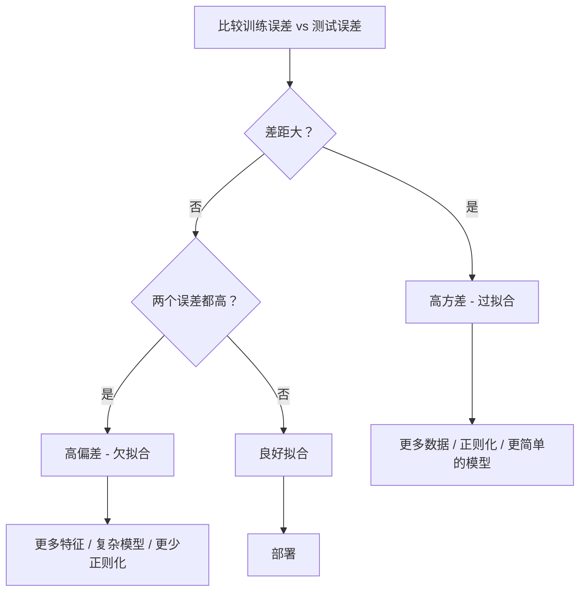
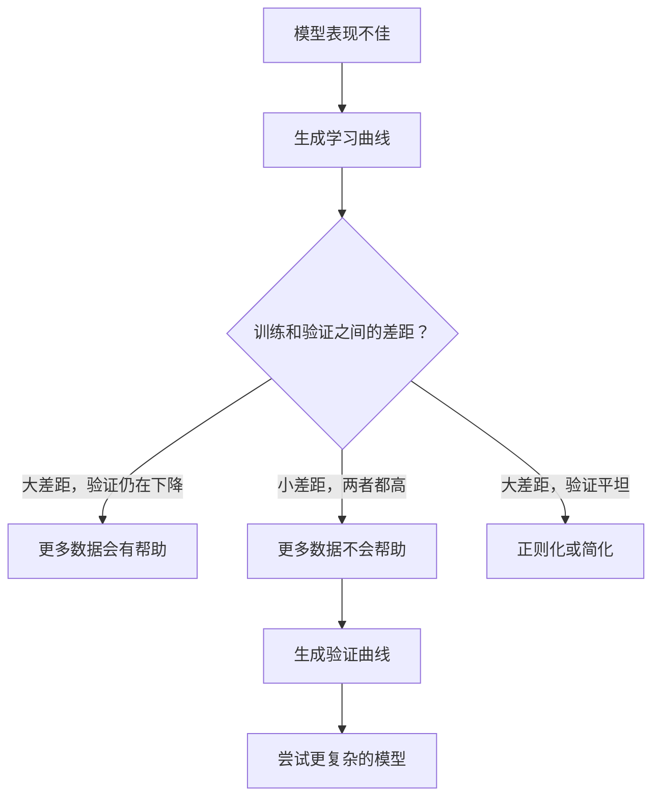

# 偏差-方差权衡 (Bias-Variance Tradeoff)

> 每个模型误差来自三个来源之一：偏差、方差或噪声。你只能控制前两个。

**类型：** 学习 (Learn)
**语言：** Python
**前置知识：** 第二阶段，第 01-09 课（ML 基础、回归、分类、评估）
**时间：** 约 75 分钟

## 学习目标 (Learning Objectives)

- 推导期望预测误差的偏差-方差分解 (bias-variance decomposition)，并解释不可约噪声 (irreducible noise) 的作用
- 使用训练和测试误差模式诊断模型是否遭受高偏差 (high bias) 或高方差 (high variance)
- 解释正则化技术（L1、L2、dropout、早停 early stopping）如何用偏差换取方差
- 实现实验，在复杂度递增的模型上可视化偏差-方差权衡

## 问题 (The Problem)

你训练了一个模型。它在测试数据上有一些误差。这个误差来自哪里？

如果你的模型太简单（在曲线数据集上做线性回归），它将持续错过真实模式。这就是偏差 (bias)。如果你的模型太复杂（在 15 个数据点上拟合 20 次多项式），它将完美拟合训练数据，但在新数据上给出截然不同的预测。这就是方差 (variance)。

对于固定的模型容量，你不能同时最小化两者。降低偏差，方差就上升。降低方差，偏差就上升。理解这种权衡是机器学习中最有用的诊断技能。它告诉你应该让模型更复杂还是更简单，应该获取更多数据还是工程化更好的特征，应该更多还是更少地正则化。

## 概念 (The Concept)

### 偏差：系统性误差 (Bias: Systematic Error)

偏差衡量你的模型平均预测与真实值之间的差距。如果你在从相同分布中抽取的许多不同训练集上训练相同的模型并平均预测，偏差就是该平均值与真实值之间的差距。

高偏差意味着模型太僵硬，无法捕捉真实模式。拟合到抛物线上的直线总是会错过曲线，无论你给它多少数据。这就是欠拟合 (underfitting)。

```
高偏差（欠拟合）：
  模型总是预测大致相同的错误结果。
  训练误差：高 (HIGH)
  测试误差：高 (HIGH)
  两者之间的差距：小 (SMALL)
```

### 方差：对训练数据的敏感性 (Variance: Sensitivity to Training Data)

方差衡量当你在不同数据子集上训练时，预测变化有多大。如果训练集的微小变化导致模型的巨大变化，方差就很高。

高方差意味着模型在拟合训练数据中的噪声，而不是底层信号。一个 20 次多项式将穿过每个训练点，但在它们之间剧烈振荡。这就是过拟合 (overfitting)。

```
高方差（过拟合）：
  模型完美拟合训练数据但在新数据上失败。
  训练误差：低 (LOW)
  测试误差：高 (HIGH)
  两者之间的差距：大 (LARGE)
```

### 分解 (The Decomposition)

对于任意点 x，平方损失下的期望预测误差精确分解为：

```
期望误差 = 偏差^2 + 方差 + 不可约噪声

其中：
  偏差^2   = (E[f_hat(x)] - f(x))^2
  方差     = E[(f_hat(x) - E[f_hat(x)])^2]
  噪声     = E[(y - f(x))^2]             (sigma^2)
```

- `f(x)` 是真实函数
- `f_hat(x)` 是你的模型的预测
- `E[...]` 是对不同训练集的期望
- `y` 是观察到的标签（真实函数加噪声）

噪声项是不可约的。没有模型能在噪声数据上做得比 sigma^2 更好。你的工作是找到偏差^2 和方差之间的正确平衡。

### 模型复杂度 vs 误差 (Model Complexity vs Error)

```mermaid
graph LR
    A[简单模型 (Simple Model)] -->|增加复杂度| B[最佳点 (Sweet Spot)]
    B -->|增加复杂度| C[复杂模型 (Complex Model)]

    style A fill:#f9f,stroke:#333
    style B fill:#9f9,stroke:#333
    style C fill:#f99,stroke:#333
```

经典的 U 形曲线：

| 复杂度 | 偏差 | 方差 | 总误差 |
|-----------|------|----------|-------------|
| 太低 | 高 (HIGH) | 低 (LOW) | 高 (HIGH)（欠拟合） |
| 刚好 | 中等 (MODERATE) | 中等 (MODERATE) | 最低 (LOWEST) |
| 太高 | 低 (LOW) | 高 (HIGH) | 高 (HIGH)（过拟合） |

### 正则化作为偏差-方差控制 (Regularization as Bias-Variance Control)

正则化故意增加偏差以减少方差。它约束模型使其不能追逐噪声。

- **L2 (Ridge)：** 将所有权重向零收缩。保留所有特征但减少它们的影响。
- **L1 (Lasso)：** 将一些权重推到恰好为零。执行特征选择。
- **Dropout：** 在训练期间随机禁用神经元。强制冗余表示。
- **早停 (Early stopping)：** 在模型完全拟合训练数据之前停止训练。

正则化强度（lambda、dropout 率、epoch 数）直接控制你在偏差-方差曲线上的位置。更多正则化意味着更多偏差，更少方差。

### 双重下降：现代视角 (Double Descent: The Modern Perspective)

经典理论说：在最佳点之后，更多复杂度总是有害的。但自 2019 年以来的研究显示了意想不到的事情。如果你继续将模型容量增加到远远超过插值阈值 (interpolation threshold)（模型有足够参数完美拟合训练数据的地方），测试误差可以再次下降。

```mermaid
graph LR
    A[欠拟合区 (Underfit Zone)] --> B[经典最佳点 (Classical Sweet Spot)]
    B --> C[插值阈值 (Interpolation Threshold)]
    C --> D[双重下降 - 误差再次下降 (Double Descent)]

    style A fill:#fdd,stroke:#333
    style B fill:#dfd,stroke:#333
    style C fill:#fdd,stroke:#333
    style D fill:#dfd,stroke:#333
```

这种"双重下降 (double descent)"现象解释了为什么大规模过参数化的神经网络（参数远多于训练样本）仍然能很好地泛化。经典的偏差-方差权衡并非错误，但对于现代体系来说是不完整的。

关于双重下降的关键观察：
- 它发生在线性模型、决策树和神经网络中
- 在插值区域，更多数据实际上可能有害（样本级双重下降 sample-wise double descent）
- 更多训练 epoch 也可能导致它（epoch 级双重下降 epoch-wise double descent）
- 正则化平滑了峰值但不会消除它

为什么会发生？在插值阈值处，模型刚好有足够的容量来拟合所有训练点。它被迫进入一个非常特定的解决方案，穿过每个点，数据中的小扰动会导致拟合的巨大变化。这是方差达到峰值的地方。超过阈值后，模型有许多可能的解决方案可以完美拟合数据。学习算法（例如，具有隐式正则化的梯度下降）倾向于选择其中最简单的。这种对简单解决方案的隐式偏差 (implicit bias) 是过参数化模型能够泛化的原因。

| 体系 | 参数 vs 样本 | 行为 |
|--------|----------------------|----------|
| 欠参数化 (Underparameterized) | p << n | 经典权衡适用 |
| 插值阈值 (Interpolation threshold) | p ~ n | 方差达到峰值，测试误差飙升 |
| 过参数化 (Overparameterized) | p >> n | 隐式正则化启动，测试误差下降 |

出于实际目的：如果你使用神经网络或大型树集成，不要在插值阈值处停止。要么保持在远低于它的位置（使用显式正则化），要么远远超过它。最糟糕的位置就是恰好在阈值处。

### 诊断你的模型 (Diagnosing Your Model)



| 症状 | 诊断 | 修复 |
|---------|-----------|-----|
| 高训练误差，高测试误差 | 偏差 (Bias) | 更多特征，复杂模型，更少正则化 |
| 低训练误差，高测试误差 | 方差 (Variance) | 更多数据，正则化，更简单的模型，dropout |
| 低训练误差，低测试误差 | 良好拟合 (Good fit) | 发布它 |
| 训练误差下降，测试误差上升 | 正在过拟合 (Overfitting in progress) | 早停 (Early stopping) |

### 实用策略 (Practical Strategies)

**当偏差是问题时：**
- 添加多项式或交互特征
- 使用更灵活的模型（树集成而不是线性）
- 减少正则化强度
- 训练更长时间（如果尚未收敛）

**当方差是问题时：**
- 获取更多训练数据
- 使用 bagging（随机森林）
- 增加正则化（更高的 lambda，更多的 dropout）
- 特征选择（移除噪声特征）
- 使用交叉验证及早发现

### 集成方法与方差减少 (Ensemble Methods and Variance Reduction)

集成方法是对抗方差最实用的工具。

**Bagging（自助聚合 Bootstrap Aggregating）** 在训练数据的不同自助样本上训练多个模型，然后平均它们的预测。每个单独的模型具有高方差，但平均值具有低得多的方差。随机森林是应用于决策树的 bagging。

为什么它在数学上有效：如果你平均 N 个独立预测，每个具有方差 sigma^2，平均值的方差是 sigma^2 / N。模型并非真正独立（它们都看到相似的数据），所以减少小于 1/N，但仍然很显著。

**Boosting** 通过顺序构建模型来减少偏差，每个新模型专注于集成到目前为止的错误。梯度提升 (Gradient boosting) 和 AdaBoost 是主要示例。Boosting 如果添加太多模型可能会过拟合，因此你需要早停或正则化。

| 方法 | 主要效果 | 偏差变化 | 方差变化 |
|--------|---------------|-------------|-----------------|
| Bagging | 减少方差 | 不变 | 减少 |
| Boosting | 减少偏差 | 减少 | 可能增加 |
| Stacking | 减少两者 | 取决于元学习器 | 取决于基模型 |
| Dropout | 隐式 bagging | 轻微增加 | 减少 |

**实用规则：** 如果你的基模型具有高方差（深树、高次多项式），使用 bagging。如果你的基模型具有高偏差（浅树桩、简单线性模型），使用 boosting。

### 学习曲线 (Learning Curves)

学习曲线绘制训练和验证误差作为训练集大小的函数。它们是你拥有的最实用的诊断工具。与单次训练/测试比较不同，学习曲线向你展示模型的轨迹，并告诉你更多数据是否有帮助。


如何解读它们：

| 场景 | 训练误差 | 验证误差 | 差距 | 含义 | 该做什么 |
|----------|---------------|-----------------|-----|---------------|------------|
| 高偏差 | 高 | 高 | 小 | 模型无法捕捉模式 | 更多特征，复杂模型，更少正则化 |
| 高方差 | 低 | 高 | 大 | 模型记住训练数据 | 更多数据，正则化，更简单的模型 |
| 良好拟合 | 中等 | 中等 | 小 | 模型泛化良好 | 发布它 |
| 高方差，正在改善 | 低 | 随更多数据下降 | 缩小中 | 数据可以修复的方差问题 | 收集更多数据 |
| 高偏差，平坦 | 高 | 高且平坦 | 小且平坦 | 更多数据不会帮助 | 改变模型架构 |

关键洞察：如果两条曲线已经趋于平稳，差距很小但两个误差都很高，更多数据是无用的。你需要一个更好的模型。如果差距很大且仍在缩小，更多数据会有帮助。

### 如何生成学习曲线 (How to Generate Learning Curves)

有两种方法：

**方法 1：变化训练集大小，固定模型。** 保持模型和超参数不变。在越来越大的训练数据子集上训练。在每个大小处测量训练误差和验证误差。这是标准的学习曲线。

**方法 2：变化模型复杂度，固定数据。** 保持数据不变。扫描一个复杂度参数（多项式次数、树深度、层数）。在每个复杂度处测量训练误差和验证误差。这是验证曲线 (validation curve)，直接展示偏差-方差权衡。

两种方法互补。第一种告诉你更多数据是否有帮助。第二种告诉你不同的模型是否有帮助。在做下一步决策之前运行两者。



## 构建它 (Build It)

`code/bias_variance.py` 中的代码运行完整的偏差-方差分解实验。以下是逐步方法。

### 步骤 1：从已知函数生成合成数据

我们使用 `f(x) = sin(1.5x) + 0.5x` 加上高斯噪声。知道真实函数让我们能够计算精确的偏差和方差。

```python
def true_function(x):
    return np.sin(1.5 * x) + 0.5 * x

def generate_data(n_samples=30, noise_std=0.5, x_range=(-3, 3), seed=None):
    rng = np.random.RandomState(seed)
    x = rng.uniform(x_range[0], x_range[1], n_samples)
    y = true_function(x) + rng.normal(0, noise_std, n_samples)
    return x, y
```

### 步骤 2：自助采样和多项式拟合

对于每个多项式次数，我们抽取许多自助训练集，拟合多项式，并在固定测试网格上记录预测。这给了我们在每个测试点上的预测分布。

```python
def fit_polynomial(x_train, y_train, degree, lam=0.0):
    X = np.column_stack([x_train ** d for d in range(degree + 1)])
    if lam > 0:
        penalty = lam * np.eye(X.shape[1])
        penalty[0, 0] = 0
        w = np.linalg.solve(X.T @ X + penalty, X.T @ y_train)
    else:
        w = np.linalg.lstsq(X, y_train, rcond=None)[0]
    return w
```

我们在 200 个不同的自助样本上拟合。每个自助样本从相同的底层分布中抽取，但包含不同的点。

### 步骤 3：计算偏差^2、方差分解

在每个测试点上有 200 组预测，我们可以直接从定义计算分解：

```python
mean_pred = predictions.mean(axis=0)
bias_sq = np.mean((mean_pred - y_true) ** 2)
variance = np.mean(predictions.var(axis=0))
total_error = np.mean(np.mean((predictions - y_true) ** 2, axis=1))
```

- `mean_pred` 是从自助样本估计的 E[f_hat(x)]
- `bias_sq` 是平均预测与真实值之间的平方差距
- `variance` 是跨自助样本的预测平均散布
- `total_error` 应约等于 bias^2 + variance + noise

### 步骤 4：学习曲线

学习曲线在保持模型复杂度固定的情况下扫描训练集大小。它们显示你的模型是数据受限还是容量受限。

```python
def demo_learning_curves():
    sizes = [10, 15, 20, 30, 50, 75, 100, 150, 200, 300]
    degree = 5

    for n in sizes:
        train_errors = []
        test_errors = []
        for seed in range(50):
            x_train, y_train = generate_data(n_samples=n, seed=seed * 100)
            w = fit_polynomial(x_train, y_train, degree)
            train_pred = predict_polynomial(x_train, w)
            train_mse = np.mean((train_pred - y_train) ** 2)
            test_pred = predict_polynomial(x_test, w)
            test_mse = np.mean((test_pred - y_test) ** 2)
            train_errors.append(train_mse)
            test_errors.append(test_mse)
        # 在运行中平均给出学习曲线点
```

对于高方差模型（小数据上的 5 次多项式），你会看到：
- 训练误差从低开始，随着更多数据使记忆变得更困难而增加
- 测试误差从高开始，随着模型获得更多信号而下降
- 差距随着更多数据而缩小

对于高偏差模型（1 次），两个误差快速收敛到相同的高值，更多数据没有帮助。

### 步骤 5：正则化扫描

代码还包括 `demo_regularization_sweep()`，它固定一个高次多项式（15 次）并将 Ridge 正则化强度从 0.001 扫描到 100。这从不同角度展示了偏差-方差权衡：不是变化模型复杂度，而是变化约束强度。

```python
def demo_regularization_sweep():
    alphas = [0.001, 0.005, 0.01, 0.05, 0.1, 0.5, 1.0, 5.0, 10.0, 50.0, 100.0]
    for alpha in alphas:
        results = bias_variance_decomposition([15], lam=alpha)
        r = results[15]
        print(f"alpha={alpha:.3f}  bias={r['bias_sq']:.4f}  var={r['variance']:.4f}")
```

在低 alpha 时，15 次多项式几乎不受约束。方差占主导，因为模型在每个自助样本中追逐噪声。在高 alpha 时，惩罚如此之强，以至于模型实际上变成了一个接近常数的函数。偏差占主导。最优 alpha 位于这些极端之间。

这与变化多项式次数的 U 形曲线相同，但由连续旋钮而不是离散旋钮控制。在实践中，正则化是控制权衡的首选方式，因为它允许细粒度控制而不改变特征集。

## 使用它 (Use It)

sklearn 提供 `learning_curve` 和 `validation_curve` 来自动化这些诊断，无需编写自助循环。

### 验证曲线：扫描模型复杂度

```python
from sklearn.model_selection import validation_curve
from sklearn.pipeline import make_pipeline
from sklearn.preprocessing import PolynomialFeatures
from sklearn.linear_model import Ridge

degrees = list(range(1, 16))
train_scores_all = []
val_scores_all = []

for d in degrees:
    pipe = make_pipeline(PolynomialFeatures(d), Ridge(alpha=0.01))
    train_scores, val_scores = validation_curve(
        pipe, X, y, param_name="polynomialfeatures__degree",
        param_range=[d], cv=5, scoring="neg_mean_squared_error"
    )
    train_scores_all.append(-train_scores.mean())
    val_scores_all.append(-val_scores.mean())
```

这直接给你偏差-方差权衡曲线。验证分数相对于训练分数最差的地方，方差占主导。两者都差的地方，偏差占主导。

### 学习曲线：扫描训练集大小

```python
from sklearn.model_selection import learning_curve

pipe = make_pipeline(PolynomialFeatures(5), Ridge(alpha=0.01))
train_sizes, train_scores, val_scores = learning_curve(
    pipe, X, y, train_sizes=np.linspace(0.1, 1.0, 10),
    cv=5, scoring="neg_mean_squared_error"
)
train_mse = -train_scores.mean(axis=1)
val_mse = -val_scores.mean(axis=1)
```

将 `train_mse` 和 `val_mse` 相对于 `train_sizes` 绘图。形状告诉你关于模型的一切。

### 带正则化扫描的交叉验证

```python
from sklearn.model_selection import cross_val_score

alphas = [0.001, 0.01, 0.1, 1.0, 10.0, 100.0]
for alpha in alphas:
    pipe = make_pipeline(PolynomialFeatures(10), Ridge(alpha=alpha))
    scores = cross_val_score(pipe, X, y, cv=5, scoring="neg_mean_squared_error")
    print(f"alpha={alpha:>7.3f}  MSE={-scores.mean():.4f} +/- {scores.std():.4f}")
```

这为固定模型复杂度扫描正则化强度。你会看到相同的偏差-方差权衡：低 alpha 意味着高方差，高 alpha 意味着高偏差。

### 综合起来：完整的诊断工作流

在实践中，你按顺序运行这些诊断：

1. 训练你的模型。计算训练和测试误差。
2. 如果两者都高：你有偏差问题。跳到步骤 4。
3. 如果训练低但测试高：你有方差问题。生成学习曲线看看更多数据是否有帮助。如果没有，正则化。
4. 生成验证曲线，扫描你的主要复杂度参数。找到最佳点。
5. 在最佳点，生成学习曲线。如果差距仍然很大，你需要更多数据或正则化。
6. 使用 `cross_val_score` 尝试不同 alpha 值的 Ridge/Lasso。选择交叉验证误差最低的 alpha。

对于大多数表格数据集，这需要 10-15 分钟的计算时间，节省数小时的猜测。

## 产出 (Ship It)

本课产出：`outputs/prompt-model-diagnostics.md`

## 练习 (Exercises)

1. 使用 `noise_std=0`（无噪声）运行分解。不可约误差项会发生什么？最优复杂度会改变吗？

2. 将训练集大小从 30 增加到 300。这如何影响方差分量？最优多项式次数会移动吗？

3. 向实验中添加 L2 正则化（Ridge 回归）。对于固定的高次多项式（15 次），将 lambda 从 0 扫描到 100。绘制偏差^2 和方差作为 lambda 的函数。

4. 将真实函数从多项式修改为 `sin(x)`。偏差-方差分解如何变化？是否仍然存在明确的最优次数？

5. 实现一个简单的自助聚合 (bagging) 包装器：在自助样本上训练 10 个模型并平均预测。展示这在不增加太多偏差的情况下减少了方差。

## 关键术语 (Key Terms)

| 术语 | 人们怎么说 | 实际含义 |
|------|----------------|----------------------|
| 偏差 (Bias) | "模型太简单了" | 来自错误假设的系统性误差。平均模型预测与真实值之间的差距。 |
| 方差 (Variance) | "模型过拟合了" | 来自对训练数据敏感性的误差。预测在不同训练集之间变化多少。 |
| 不可约误差 (Irreducible error) | "数据中的噪声" | 来自真实数据生成过程中随机性的误差。没有模型可以消除它。 |
| 欠拟合 (Underfitting) | "学习不够" | 模型具有高偏差。即使在训练数据上也错过真实模式。 |
| 过拟合 (Overfitting) | "记住数据" | 模型具有高方差。它拟合训练数据中不能泛化的噪声。 |
| 正则化 (Regularization) | "约束模型" | 添加惩罚以减少模型复杂度，用偏差换取更低的方差。 |
| 双重下降 (Double descent) | "更多参数可能有帮助" | 当模型容量远远超过插值阈值时，测试误差再次下降。 |
| 模型复杂度 (Model complexity) | "模型有多灵活" | 模型拟合任意模式的能力。由架构、特征或正则化控制。 |

## 进一步阅读 (Further Reading)

- [Hastie, Tibshirani, Friedman: Elements of Statistical Learning, Ch. 7](https://hastie.su.domains/ElemStatLearn/) -- 偏差-方差分解的权威论述
- [Belkin et al., Reconciling modern machine learning practice and the bias-variance trade-off (2019)](https://arxiv.org/abs/1812.11118) -- 双重下降论文
- [Nakkiran et al., Deep Double Descent (2019)](https://arxiv.org/abs/1912.02292) -- epoch 级和样本级双重下降
- [Scott Fortmann-Roe: Understanding the Bias-Variance Tradeoff](http://scott.fortmann-roe.com/docs/BiasVariance.html) -- 清晰的可视化解释
