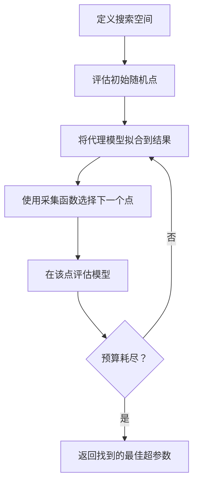
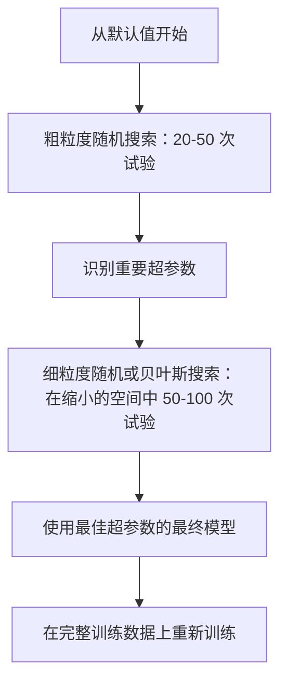

# 超参数调优 (Hyperparameter Tuning)

> 超参数是你在训练开始前转动的旋钮。调好它们是平庸模型和优秀模型之间的区别。

**类型：** 构建 (Build)
**语言：** Python
**前置知识：** 第二阶段，第 11 课（集成方法）
**时间：** 约 90 分钟

## 学习目标 (Learning Objectives)

- 从零实现网格搜索 (grid search)、随机搜索 (random search) 和贝叶斯优化 (Bayesian optimization)，并比较它们的样本效率
- 解释为什么当大多数超参数具有低有效维度时，随机搜索优于网格搜索
- 使用代理模型 (surrogate model) 和采集函数 (acquisition function) 构建贝叶斯优化循环来指导搜索
- 设计一个通过适当的交叉验证避免对验证集过拟合的超参数调优策略

## 问题 (The Problem)

你的梯度提升模型有学习率、树的数量、最大深度、每叶最小样本数、子采样率和列采样率。这是六个超参数。如果每个有 5 个合理的值，网格有 5^6 = 15,625 种组合。训练每个需要 10 秒。那就是 43 小时的计算时间来尝试所有组合。

网格搜索是显而易见的方法，也是大规模下最差的方法。随机搜索用更少的计算做得更好。贝叶斯优化通过从过去的评估中学习做得更好。知道使用哪种策略，以及哪些超参数真正重要，可以节省数天浪费的 GPU 时间。

## 概念 (The Concept)

### 参数 vs 超参数 (Parameters vs Hyperparameters)

参数 (parameters) 在训练期间学习（权重、偏差、分裂阈值）。超参数 (hyperparameters) 在训练开始前设置，控制学习如何发生。

| 超参数 | 控制什么 | 典型范围 |
|---------------|-----------------|---------------|
| 学习率 (Learning rate) | 每次更新的步长 | 0.001 到 1.0 |
| 树的数量/epoch 数 | 训练多长时间 | 10 到 10,000 |
| 最大深度 (Max depth) | 模型复杂度 | 1 到 30 |
| 正则化 (lambda) | 过拟合预防 | 0.0001 到 100 |
| 批次大小 (Batch size) | 梯度估计噪声 | 16 到 512 |
| Dropout 率 | 丢弃的神经元比例 | 0.0 到 0.5 |

### 网格搜索 (Grid Search)

网格搜索评估指定值的每种组合。它是穷举的且易于理解，但随着超参数数量呈指数级扩展。

```
2 个超参数的网格：

  learning_rate: [0.01, 0.1, 1.0]
  max_depth:     [3, 5, 7]

  评估次数：3 x 3 = 9 种组合

  (0.01, 3)  (0.01, 5)  (0.01, 7)
  (0.1,  3)  (0.1,  5)  (0.1,  7)
  (1.0,  3)  (1.0,  5)  (1.0,  7)
```

网格搜索有一个根本缺陷：如果一个超参数重要而另一个不重要，大多数评估都被浪费了。从 9 次评估中，你只获得重要参数的 3 个唯一值。

### 随机搜索 (Random Search)

随机搜索从分布中采样超参数而不是网格。在相同的 9 次评估预算下，你获得每个超参数的 9 个唯一值。

```mermaid
flowchart LR
    subgraph 网格搜索 (Grid Search)
        G1[3 个唯一学习率]
        G2[3 个唯一最大深度]
        G3[9 次总评估]
    end

    subgraph 随机搜索 (Random Search)
        R1[9 个唯一学习率]
        R2[9 个唯一最大深度]
        R3[9 次总评估]
    end
```

为什么随机优于网格 (Bergstra & Bengio, 2012)：

- 大多数超参数具有低有效维度。对于给定问题，6 个超参数中通常只有 1-2 个真正重要。
- 网格搜索在不重要的维度上浪费评估。
- 随机搜索在相同预算下更密集地覆盖重要维度。
- 在 60 次随机试验中，你有 95% 的机会在最优值的 5% 范围内找到一个点（如果在搜索空间中存在的话）。

### 贝叶斯优化 (Bayesian Optimization)

随机搜索忽略结果。它不会学习到高学习率导致发散或深度 3 始终优于深度 10。贝叶斯优化使用过去的评估来决定下一步搜索哪里。



两个关键组件：

**代理模型 (Surrogate model)：** 一个评估成本低的模型（通常是高斯过程 Gaussian process），近似昂贵的客观函数。它在搜索空间中的任何点给出预测和不确定性估计。

**采集函数 (Acquisition function)：** 通过平衡利用 (exploitation)（在已知好点附近搜索）和探索 (exploration)（在不确定性高的地方搜索）来决定下一步评估哪里。常见选择：

- **期望改进 (Expected Improvement, EI)：** 在这一点上我们期望比当前最佳改进多少？
- **上置信界 (Upper Confidence Bound, UCB)：** 预测加上不确定性的倍数。更高的 UCB 意味着有希望或未探索。
- **改进概率 (Probability of Improvement, PI)：** 这一点击败当前最佳的概率是多少？

贝叶斯优化通常以 2-5 倍更少的评估找到比随机搜索更好的超参数。拟合代理模型的开销与训练实际模型相比可以忽略不计。

### 早停 (Early Stopping)

并非每个训练运行都需要完成。如果一个配置在 10 个 epoch 后明显很差，停止它并继续。这是在超参数搜索上下文中的早停。

策略：
- **基于耐心 (Patience-based)：** 如果验证损失连续 N 个 epoch 没有改善则停止
- **中位数剪枝 (Median pruning)：** 如果试验的中间结果比同一步骤已完成试验的中位数差则停止
- **Hyperband：** 为许多配置分配小预算，然后逐步为最好的配置增加预算

Hyperband 特别有效。它以每个配置 1 个 epoch 开始 81 个配置，保留前三分之一，给它们 3 个 epoch，保留前三分之一，依此类推。这比评估所有配置的完整预算快 10-50 倍找到好的配置。

### 学习率调度器 (Learning Rate Schedulers)

学习率几乎总是最重要的超参数。调度器在训练期间调整它，而不是保持固定。

| 调度器 | 公式 | 何时使用 |
|-----------|---------|-------------|
| 阶梯衰减 (Step decay) | 每 N 个 epoch 乘以 0.1 | 经典 CNN 训练 |
| 余弦退火 (Cosine annealing) | lr * 0.5 * (1 + cos(pi * t / T)) | 现代默认 |
| 预热 + 衰减 (Warmup + decay) | 线性增加然后余弦衰减 | Transformers |
| 单周期 (One-cycle) | 在一个周期内先增加后减少 | 快速收敛 |
| 平台期减少 (Reduce on plateau) | 当指标停滞时按因子减少 | 安全默认 |

### 超参数重要性 (Hyperparameter Importance)

并非所有超参数同等重要。对随机森林 (Probst et al., 2019) 和梯度提升的研究显示出一致的模式：

**高重要性：**
- 学习率（总是首先调优）
- 估计器数量 / epoch 数（使用早停而不是调优）
- 正则化强度

**中等重要性：**
- 最大深度 / 层数
- 每叶最小样本数 / 权重衰减
- 子采样率

**低重要性：**
- 最大特征数（对于随机森林）
- 特定激活函数选择
- 批次大小（在合理范围内）

首先调优重要的，其余的保持默认值。

### 实用策略 (Practical Strategy)



具体工作流：

1. **从库默认值开始。** 它们由经验丰富的从业者选择，通常已经达到 80% 的效果。
2. **粗粒度随机搜索。** 宽范围，20-50 次试验。使用早停快速终止不好的运行。
3. **分析结果。** 哪些超参数与性能相关？缩小搜索空间。
4. **细粒度搜索。** 在缩小的空间中进行贝叶斯优化或聚焦的随机搜索。50-100 次试验。
5. **使用找到的最佳超参数在全部训练数据上重新训练。**

### 交叉验证集成 (Cross-Validation Integration)

在单个验证分割上调优超参数是有风险的。最佳超参数可能对特定的验证折过拟合。嵌套交叉验证 (nested cross-validation) 通过使用两个循环来解决这个问题：

- **外层循环**（评估）：将数据分成 train+val 和 test。报告无偏性能。
- **内层循环**（调优）：将 train+val 分成 train 和 val。找到最佳超参数。

```mermaid
flowchart TD
    D[完整数据集 (Full Dataset)] --> O1[外层折 1：测试 (Outer Fold 1: Test)]
    D --> O2[外层折 2：测试 (Outer Fold 2: Test)]
    D --> O3[外层折 3：测试 (Outer Fold 3: Test)]
    D --> O4[外层折 4：测试 (Outer Fold 4: Test)]
    D --> O5[外层折 5：测试 (Outer Fold 5: Test)]

    O1 --> I1[在剩余数据上进行内层 5 折 CV]
    I1 --> T1[折 1 的最佳超参数]
    T1 --> E1[在外层测试折 1 上评估]

    O2 --> I2[在剩余数据上进行内层 5 折 CV]
    I2 --> T2[折 2 的最佳超参数]
    T2 --> E2[在外层测试折 2 上评估]
```

每个外层折独立地找到自己的最佳超参数。外层分数是泛化性能的无偏估计。

使用 sklearn：

```python
from sklearn.model_selection import cross_val_score, GridSearchCV
from sklearn.ensemble import GradientBoostingRegressor

inner_cv = GridSearchCV(
    GradientBoostingRegressor(),
    param_grid={
        "learning_rate": [0.01, 0.05, 0.1],
        "max_depth": [2, 3, 5],
        "n_estimators": [50, 100, 200],
    },
    cv=5,
    scoring="neg_mean_squared_error",
)

outer_scores = cross_val_score(
    inner_cv, X, y, cv=5, scoring="neg_mean_squared_error"
)

print(f"Nested CV MSE: {-outer_scores.mean():.4f} +/- {outer_scores.std():.4f}")
```

这很昂贵（5 个外层折 x 5 个内层折 x 27 个网格点 = 675 次模型拟合），但它给你一个可信的性能估计。在论文中报告最终结果或决策风险很高时使用它。

### 实用技巧 (Practical Tips)

**从学习率开始。** 对于基于梯度的方法，它总是最重要的超参数。不好的学习率使其他一切都无关紧要。将其他超参数固定在默认值，首先扫描学习率。

**对学习率和正则化使用对数均匀分布。** 0.001 和 0.01 之间的差异与 0.1 和 1.0 之间的差异一样重要。线性搜索在大端浪费预算。

**使用早停而不是调优 n_estimators。** 对于 boosting 和神经网络，将 n_estimators 或 epochs 设置得很高，让早停决定何时停止。这从搜索中移除了一个超参数。

**预算分配。** 将 60% 的调优预算花在前 2 个最重要的超参数上。将剩余的 40% 花在其他所有东西上。前 2 个占了大部分性能变化。

**尺度很重要。** 永远不要在对数尺度上搜索批次大小（16、32、64 就可以）。总是在对数尺度上搜索学习率。将搜索分布与超参数如何影响模型相匹配。

| 模型类型 | 顶级超参数 | 推荐搜索 | 预算 |
|-----------|--------------------|--------------------|--------|
| 随机森林 | n_estimators, max_depth, min_samples_leaf | 随机搜索，50 次试验 | 低（训练快） |
| 梯度提升 | learning_rate, n_estimators, max_depth | 贝叶斯，100 次试验 + 早停 | 中等 |
| 神经网络 | learning_rate, weight_decay, batch_size | 贝叶斯或随机，100+ 次试验 | 高（训练慢） |
| SVM | C, gamma（RBF 核） | 对数尺度网格，25-50 次试验 | 低（2 个参数） |
| Lasso/Ridge | alpha | 对数尺度 1D 搜索，20 次试验 | 非常低 |
| XGBoost | learning_rate, max_depth, subsample, colsample | 贝叶斯，100-200 次试验 + 早停 | 中等 |

**不确定时：** 使用超参数数量 2 倍的随机搜索试验次数（例如，6 个超参数 = 至少 12 次试验）。你会惊讶于 50 次试验的随机搜索经常击败精心设计的网格搜索。

## 构建它 (Build It)

### 步骤 1：从零实现网格搜索

`code/tuning.py` 中的代码从零实现了网格搜索、随机搜索和一个简单的贝叶斯优化器。

```python
def grid_search(model_fn, param_grid, X_train, y_train, X_val, y_val):
    keys = list(param_grid.keys())
    values = list(param_grid.values())
    best_score = -float("inf")
    best_params = None
    n_evals = 0

    for combo in itertools.product(*values):
        params = dict(zip(keys, combo))
        model = model_fn(**params)
        model.fit(X_train, y_train)
        score = evaluate(model, X_val, y_val)
        n_evals += 1

        if score > best_score:
            best_score = score
            best_params = params

    return best_params, best_score, n_evals
```

### 步骤 2：从零实现随机搜索

```python
def random_search(model_fn, param_distributions, X_train, y_train,
                  X_val, y_val, n_iter=50, seed=42):
    rng = np.random.RandomState(seed)
    best_score = -float("inf")
    best_params = None

    for _ in range(n_iter):
        params = {k: sample(v, rng) for k, v in param_distributions.items()}
        model = model_fn(**params)
        model.fit(X_train, y_train)
        score = evaluate(model, X_val, y_val)

        if score > best_score:
            best_score = score
            best_params = params

    return best_params, best_score, n_iter
```

### 步骤 3：贝叶斯优化（简化版）

核心思想：将高斯过程拟合到观察到的（超参数，分数）对，然后使用采集函数决定下一步查看哪里。

```python
class SimpleBayesianOptimizer:
    def __init__(self, search_space, n_initial=5):
        self.search_space = search_space
        self.n_initial = n_initial
        self.X_observed = []
        self.y_observed = []

    def _kernel(self, x1, x2, length_scale=1.0):
        dists = np.sum((x1[:, None, :] - x2[None, :, :]) ** 2, axis=2)
        return np.exp(-0.5 * dists / length_scale ** 2)

    def _fit_gp(self, X_new):
        X_obs = np.array(self.X_observed)
        y_obs = np.array(self.y_observed)
        y_mean = y_obs.mean()
        y_centered = y_obs - y_mean

        K = self._kernel(X_obs, X_obs) + 1e-4 * np.eye(len(X_obs))
        K_star = self._kernel(X_new, X_obs)

        L = np.linalg.cholesky(K)
        alpha = np.linalg.solve(L.T, np.linalg.solve(L, y_centered))
        mu = K_star @ alpha + y_mean

        v = np.linalg.solve(L, K_star.T)
        var = 1.0 - np.sum(v ** 2, axis=0)
        var = np.maximum(var, 1e-6)

        return mu, var

    def _expected_improvement(self, mu, var, best_y):
        sigma = np.sqrt(var)
        z = (mu - best_y) / (sigma + 1e-10)
        ei = sigma * (z * norm_cdf(z) + norm_pdf(z))
        return ei

    def suggest(self):
        if len(self.X_observed) < self.n_initial:
            return sample_random(self.search_space)

        candidates = [sample_random(self.search_space) for _ in range(500)]
        X_cand = np.array([to_vector(c) for c in candidates])
        mu, var = self._fit_gp(X_cand)
        ei = self._expected_improvement(mu, var, max(self.y_observed))
        return candidates[np.argmax(ei)]

    def observe(self, params, score):
        self.X_observed.append(to_vector(params))
        self.y_observed.append(score)
```

GP 代理在每个候选点给出两样东西：预测分数 (mu) 和不确定性 (var)。期望改进平衡这两者：它倾向于模型预测高分或不确定性高的点。早期，大多数点具有高不确定性，因此优化器探索。后期，它专注于最有希望的区域。

### 步骤 4：比较所有方法

在相同的合成目标上运行所有三种方法并比较。此比较使用一个简化的包装器，用直接的客观函数（无模型训练）调用每个优化器，因此 API 与上述基于模型的实现不同：

```python
def synthetic_objective(params):
    lr = params["learning_rate"]
    depth = params["max_depth"]
    return -(np.log10(lr) + 2) ** 2 - (depth - 4) ** 2 + 10

param_grid = {
    "learning_rate": [0.001, 0.01, 0.1, 1.0],
    "max_depth": [2, 3, 4, 5, 6, 7, 8],
}

grid_best = None
grid_score = -float("inf")
grid_history = []
for combo in itertools.product(*param_grid.values()):
    params = dict(zip(param_grid.keys(), combo))
    score = synthetic_objective(params)
    grid_history.append((params, score))
    if score > grid_score:
        grid_score = score
        grid_best = params

param_dist = {
    "learning_rate": ("log_float", 0.001, 1.0),
    "max_depth": ("int", 2, 8),
}

rand_best = None
rand_score = -float("inf")
rand_history = []
rng = np.random.RandomState(42)
for _ in range(28):
    params = {k: sample(v, rng) for k, v in param_dist.items()}
    score = synthetic_objective(params)
    rand_history.append((params, score))
    if score > rand_score:
        rand_score = score
        rand_best = params

optimizer = SimpleBayesianOptimizer(param_dist, n_initial=5)
bayes_history = []
for _ in range(28):
    params = optimizer.suggest()
    score = synthetic_objective(params)
    optimizer.observe(params, score)
    bayes_history.append((params, score))
bayes_score = max(s for _, s in bayes_history)

print(f"{'Method':<20} {'Best Score':>12} {'Evaluations':>12}")
print("-" * 50)
print(f"{'Grid Search':<20} {grid_score:>12.4f} {len(grid_history):>12}")
print(f"{'Random Search':<20} {rand_score:>12.4f} {len(rand_history):>12}")
print(f"{'Bayesian Opt':<20} {bayes_score:>12.4f} {len(bayes_history):>12}")
```

在相同预算下，贝叶斯优化通常最快找到最佳分数，因为它不会在明显不好的区域浪费评估。随机搜索比网格搜索覆盖更多领域。网格搜索仅在你只有很少的超参数且可以承受穷举时才胜出。

## 使用它 (Use It)

### Optuna 实践

Optuna 是严肃超参数调优的推荐库。它开箱即用地支持剪枝、分布式搜索和可视化。

```python
import optuna

def objective(trial):
    lr = trial.suggest_float("learning_rate", 1e-4, 1e-1, log=True)
    n_est = trial.suggest_int("n_estimators", 50, 500)
    max_depth = trial.suggest_int("max_depth", 2, 10)

    model = GradientBoostingRegressor(
        learning_rate=lr,
        n_estimators=n_est,
        max_depth=max_depth,
    )
    model.fit(X_train, y_train)
    return mean_squared_error(y_val, model.predict(X_val))

study = optuna.create_study(direction="minimize")
study.optimize(objective, n_trials=100)

print(f"Best params: {study.best_params}")
print(f"Best MSE: {study.best_value:.4f}")
```

关键 Optuna 特性：
- `suggest_float(..., log=True)` 用于最好在对数尺度上搜索的参数（学习率、正则化）
- `suggest_int` 用于整数参数
- `suggest_categorical` 用于离散选择
- 内置 MedianPruner 用于不好试验的早停
- `study.trials_dataframe()` 用于分析

### 带剪枝的 Optuna

剪枝提前停止没有希望的试验，节省大量计算。以下是模式：

```python
import optuna
from sklearn.model_selection import cross_val_score

def objective(trial):
    params = {
        "learning_rate": trial.suggest_float("lr", 1e-4, 0.5, log=True),
        "max_depth": trial.suggest_int("max_depth", 2, 10),
        "n_estimators": trial.suggest_int("n_estimators", 50, 500),
        "subsample": trial.suggest_float("subsample", 0.5, 1.0),
    }

    model = GradientBoostingRegressor(**params)
    scores = cross_val_score(model, X_train, y_train, cv=3,
                             scoring="neg_mean_squared_error")
    mean_score = -scores.mean()

    trial.report(mean_score, step=0)
    if trial.should_prune():
        raise optuna.TrialPruned()

    return mean_score

pruner = optuna.pruners.MedianPruner(n_startup_trials=10, n_warmup_steps=5)
study = optuna.create_study(direction="minimize", pruner=pruner)
study.optimize(objective, n_trials=200)
```

`MedianPruner` 如果试验的中间值比同一步骤所有已完成试验的中位数差，则停止该试验。剪枝需要调用 `trial.report()` 报告中间指标和 `trial.should_prune()` 检查试验是否应该停止。`n_startup_trials=10` 确保在剪枝启动前至少有 10 个试验完全完成。这通常节省 40-60% 的总计算量。

### sklearn 的内置调优器

对于快速实验，sklearn 提供 `GridSearchCV`、`RandomizedSearchCV` 和 `HalvingRandomSearchCV`：

```python
from sklearn.model_selection import RandomizedSearchCV
from scipy.stats import loguniform, randint

param_dist = {
    "learning_rate": loguniform(1e-4, 0.5),
    "max_depth": randint(2, 10),
    "n_estimators": randint(50, 500),
}

search = RandomizedSearchCV(
    GradientBoostingRegressor(),
    param_dist,
    n_iter=100,
    cv=5,
    scoring="neg_mean_squared_error",
    random_state=42,
    n_jobs=-1,
)
search.fit(X_train, y_train)
print(f"Best params: {search.best_params_}")
print(f"Best CV MSE: {-search.best_score_:.4f}")
```

对学习率和正则化使用 scipy 的 `loguniform`。对整数超参数使用 `randint`。`n_jobs=-1` 标志在所有 CPU 核心上并行化。

### 超参数调优中的常见错误

**通过预处理导致数据泄露。** 如果你在交叉验证前在整个数据集上拟合缩放器，来自验证折的信息会泄露到训练中。始终将预处理放在 `Pipeline` 中，使其仅在训练折上拟合。

**对验证集过拟合。** 运行数千次试验实际上是在验证集上训练。使用嵌套交叉验证进行最终性能估计，或保留一个在调优期间永远不接触的单独测试集。

**搜索范围太窄。** 如果你的最佳值在搜索空间的边界上，你搜索得不够广。最优值可能在你的范围之外。始终检查最佳参数是否在边缘。

**忽略交互效应。** 学习率和估计器数量在 boosting 中强烈交互。低学习率需要更多估计器。独立调优它们比一起调优得到更差的结果。

**不对迭代模型使用早停。** 对于梯度提升和神经网络，将 n_estimators 或 epochs 设置为高值并使用早停。这严格优于将迭代次数作为超参数调优。

## 练习 (Exercises)

1. 使用相同的总预算（例如，50 次评估）运行网格搜索和随机搜索。比较找到的最佳分数。使用不同种子运行实验 10 次。随机搜索赢的频率是多少？

2. 从零实现 Hyperband。从 81 个配置开始，每个训练 1 个 epoch。在每轮保留前 1/3 并将其预算增加三倍。比较总计算量（所有配置的所有 epoch 之和）与运行 81 个配置的完整预算。

3. 向第 11 课的梯度提升实现添加学习率调度器（余弦退火）。与固定学习率相比有帮助吗？

4. 使用 Optuna 在真实数据集（例如，sklearn 的乳腺癌数据集）上调优 RandomForestClassifier。使用 `optuna.visualization.plot_param_importances(study)` 查看哪些超参数最重要。它与本课的重要性排名匹配吗？

5. 实现一个简单的采集函数（期望改进）并演示探索 vs 利用。绘制代理模型的均值和不确定性，并显示 EI 选择下一步评估的位置。

## 关键术语 (Key Terms)

| 术语 | 人们怎么说 | 实际含义 |
|------|----------------|----------------------|
| 超参数 (Hyperparameter) | "你选择的设置" | 在训练前设置的值，控制学习过程，不从数据中学习 |
| 网格搜索 (Grid search) | "尝试每种组合" | 在指定参数网格上的穷举搜索。指数级成本。 |
| 随机搜索 (Random search) | "只是随机采样" | 从分布中采样超参数。比网格搜索更好地覆盖重要维度。 |
| 贝叶斯优化 (Bayesian optimization) | "智能搜索" | 使用目标的代理模型来决定下一步评估哪里，平衡探索和利用 |
| 代理模型 (Surrogate model) | "廉价近似" | 一个模型（通常是高斯过程），从观察到的评估中近似昂贵的客观函数 |
| 采集函数 (Acquisition function) | "下一步看哪里" | 通过平衡期望改进和不确定性来评分候选点。EI 和 UCB 是常见选择。 |
| 早停 (Early stopping) | "停止浪费时间" | 当验证性能停止改善时提前终止训练 |
| Hyperband | "配置的锦标赛分组" | 自适应资源分配：以小额预算开始许多配置，保留最好的并增加其预算 |
| 学习率调度器 (Learning rate scheduler) | "在训练期间改变 lr" | 在训练过程中调整学习率以获得更好收敛的函数 |

## 进一步阅读 (Further Reading)

- [Bergstra & Bengio: Random Search for Hyper-Parameter Optimization (2012)](https://jmlr.org/papers/v13/bergstra12a.html) -- 证明随机优于网格的论文
- [Snoek et al., Practical Bayesian Optimization of Machine Learning Algorithms (2012)](https://arxiv.org/abs/1206.2944) -- 用于 ML 的贝叶斯优化
- [Li et al., Hyperband: A Novel Bandit-Based Approach (2018)](https://jmlr.org/papers/v18/16-558.html) -- Hyperband 论文
- [Optuna: A Next-generation Hyperparameter Optimization Framework](https://arxiv.org/abs/1907.10902) -- Optuna 论文
- [Probst et al., Tunability: Importance of Hyperparameters (2019)](https://jmlr.org/papers/v20/18-444.html) -- 哪些超参数重要
