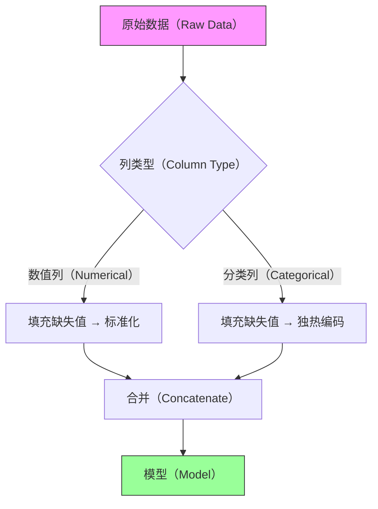

# 机器学习流水线（ML Pipelines）

> 流水线（Pipeline）将混乱的预处理步骤变成可重复的工程。

**类型：** 构建（Build）
**语言：** Python
**前置要求：** 第 2 阶段，第 01-09 课
**时间：** 约 75 分钟

## 学习目标（Learning Objectives）

- 从零实现 scikit-learn 风格的流水线（Pipeline）和列转换器（ColumnTransformer）
- 解释为什么在交叉验证（Cross-Validation）之前进行预处理会导致数据泄露（Data Leakage），并演示其对性能的影响
- 构建一个包含数值和分类预处理步骤的完整流水线，并在留出测试集上评估
- 比较流水线化工作流与手动预处理在代码复杂度、可复现性和错误风险方面的差异

## 问题（The Problem）

你构建了一个模型。它在训练集上表现完美。在测试集上表现糟糕。你检查了代码，逻辑看起来没问题。你检查了数据，没有明显的错误。

问题出在预处理上。你在拆分数据之前对数据进行了标准化（Standardization）。训练集的均值和标准差泄露到了测试集中。你的模型在测试时看到了它不应该看到的信息。这不是作弊——这是工程上的疏忽。

随着预处理步骤的增加，这个问题会变得更严重。缺失值填充（Imputation）、特征缩放（Scaling）、编码（Encoding）、特征选择（Feature Selection）——每一步都可能泄露信息。手动管理这些步骤意味着每次都要记住正确的顺序。一次失误，你的评估就不再可信。

流水线（Pipeline）解决了这个问题。它将预处理和建模封装成一个对象。调用 `fit()` 时，它只从训练数据中学习参数。调用 `predict()` 时，它将学习到的变换应用到新数据上。不会泄露。不会遗忘。不会出错。

## 概念（The Concept）

### 什么是流水线（Pipeline）

流水线是一系列步骤的序列。每一步要么是一个变换器（Transformer，有 `fit` 和 `transform` 方法），要么是一个估计器（Estimator，有 `fit` 和 `predict` 方法）。最后一步必须是估计器。


当调用 `pipeline.fit(X_train, y_train)` 时：
1. 在 `X_train` 上调用 `step1.fit_transform()`，得到变换后的数据
2. 在变换后的数据上调用 `step2.fit_transform()`
3. 在最终变换后的数据上调用 `model.fit()`

当调用 `pipeline.predict(X_test)` 时：
1. 在 `X_test` 上调用 `step1.transform()`（使用从训练数据学到的参数）
2. 在变换后的数据上调用 `step2.transform()`
3. 调用 `model.predict()`

关键区别：`fit_transform` 在训练时学习参数并应用变换。`transform` 在测试时只应用已学到的变换。这就是防止数据泄露的机制。

### 数据泄露（Data Leakage）问题

考虑这个常见的错误：

```python
# 错误：在拆分前标准化
scaler = StandardScaler()
X_scaled = scaler.fit_transform(X)  # 在整个数据集上拟合
X_train, X_test = train_test_split(X_scaled, y)

# 正确：在拆分后标准化
X_train, X_test = train_test_split(X, y)
scaler = StandardScaler()
X_train_scaled = scaler.fit_transform(X_train)  # 只在训练集上拟合
X_test_scaled = scaler.transform(X_test)         # 使用训练集的参数
```

在错误版本中，`scaler` 看到了测试数据来计算均值和标准差。测试数据的信息泄露到了预处理中。模型在交叉验证中看起来比实际更好，因为测试数据影响了训练数据的缩放。

流水线强制正确的顺序。你无法在流水线内部意外地先拟合后拆分。

### 列转换器（ColumnTransformer）

真实数据包含混合类型：数值列需要标准化，分类列需要独热编码（One-Hot Encoding），文本列需要向量化。列转换器对不同的列子集应用不同的变换。



列转换器本身是一个变换器。你可以将它作为流水线的第一步，后面接模型。

### 完整流水线架构

```mermaid
flowchart TD
    A[原始数据（Raw Data）] --> B[列转换器（ColumnTransformer）]
    B --> C[特征选择（Feature Selection）]
    C --> D[模型（Model）]
    D --> E[预测（Predictions）]

    subgraph 列转换器（ColumnTransformer）
        B1[数值流水线（Numerical Pipeline）] --> B2[填充缺失值 → 标准化 → 多项式特征]
        B3[分类流水线（Categorical Pipeline）] --> B4[填充缺失值 → 独热编码]
    end

    style A fill:#f9f,stroke:#333
    style E fill:#9f9,stroke:#333
```

### 流水线的好处

| 方面 | 手动预处理 | 流水线 |
|------|-----------|--------|
| 数据泄露风险 | 高（容易忘记顺序） | 无（顺序由结构强制执行） |
| 代码行数 | 多（每个步骤单独变量） | 少（一个对象） |
| 可复现性 | 低（步骤可能遗漏） | 高（流水线可序列化） |
| 超参数调优 | 困难（手动协调） | 简单（GridSearchCV 原生支持） |
| 部署 | 需要重新实现预处理 | 导出流水线即可 |
| 调试 | 容易（逐步检查） | 较难（需要访问命名步骤） |

### 超参数调优与流水线

流水线与网格搜索（Grid Search）天然兼容。流水线中每个步骤的参数可以通过 `stepname__paramname` 语法访问：

```
pipeline = Pipeline([
    ('imputer', SimpleImputer()),
    ('scaler', StandardScaler()),
    ('model', LogisticRegression())
])

param_grid = {
    'imputer__strategy': ['mean', 'median'],
    'model__C': [0.1, 1.0, 10.0]
}

grid_search = GridSearchCV(pipeline, param_grid, cv=5)
```

网格搜索在每一折交叉验证中正确地拟合流水线。预处理参数（如填充策略）与模型超参数一起调优，且不会泄露数据。

### 常见陷阱

1. **在流水线外进行预处理。** 如果你在流水线外填充缺失值或编码分类变量，你就绕过了泄露保护。所有预处理必须在流水线内部。

2. **在测试时调用 `fit_transform`。** 测试数据上只能调用 `transform`。`fit_transform` 会从测试数据中学习参数，导致泄露。流水线自动处理这一点。

3. **忘记分类列。** 默认情况下，列转换器中未指定的列会被丢弃。确保所有需要的列都被分配了一个变换器，或者使用 `remainder='passthrough'` 保留未指定的列。

4. **变换后特征名称丢失。** 独热编码和多项式特征会改变列的数量和名称。在需要特征名称进行解释时，使用 `get_feature_names_out()`。

## 构建它（Build It）

### 步骤 1：生成混合类型数据

```python
import numpy as np


def make_mixed_data(n_samples=500, seed=42):
    rng = np.random.RandomState(seed)

    # 数值特征
    age = rng.normal(40, 12, n_samples)
    income = rng.lognormal(10.5, 0.5, n_samples)
    score = rng.normal(70, 15, n_samples)

    # 添加缺失值
    age[rng.choice(n_samples, 20, replace=False)] = np.nan
    income[rng.choice(n_samples, 15, replace=False)] = np.nan

    # 分类特征
    education = rng.choice(['high_school', 'bachelors', 'masters', 'phd'],
                           n_samples, p=[0.3, 0.4, 0.2, 0.1])
    city = rng.choice(['Beijing', 'Shanghai', 'Shenzhen', 'Other'],
                      n_samples, p=[0.3, 0.25, 0.2, 0.25])

    # 目标：基于年龄、收入和学历
    logit = (0.03 * age + 0.00001 * income + 0.05 * score
             + (education == 'masters') * 1.0
             + (education == 'phd') * 1.5
             - 3.0)
    prob = 1.0 / (1.0 + np.exp(-logit))
    y = (prob > 0.5).astype(int)

    return age, income, score, education, city, y
```

### 步骤 2：从零实现流水线

```python
class SimplePipeline:
    def __init__(self, steps):
        self.steps = steps
        self._validate_steps()

    def _validate_steps(self):
        # 除最后一步外，所有步骤必须有 transform 方法
        for name, step in self.steps[:-1]:
            if not (hasattr(step, 'fit') and hasattr(step, 'transform')):
                raise ValueError(f"步骤 '{name}' 必须实现 fit 和 transform")
        # 最后一步必须有 fit 方法
        if not hasattr(self.steps[-1][1], 'fit'):
            raise ValueError(f"最后一步 '{self.steps[-1][0]}' 必须实现 fit")

    def fit(self, X, y=None):
        X_transformed = X
        for name, step in self.steps[:-1]:
            X_transformed = step.fit_transform(X_transformed, y)
        self.steps[-1][1].fit(X_transformed, y)
        return self

    def predict(self, X):
        X_transformed = X
        for name, step in self.steps[:-1]:
            X_transformed = step.transform(X_transformed)
        return self.steps[-1][1].predict(X_transformed)

    def transform(self, X):
        X_transformed = X
        for name, step in self.steps[:-1]:
            X_transformed = step.transform(X_transformed)
        return X_transformed
```

### 步骤 3：从零实现列转换器

```python
class SimpleColumnTransformer:
    def __init__(self, transformers, remainder='drop'):
        self.transformers = transformers
        self.remainder = remainder

    def fit(self, X, y=None):
        self._fitted_transformers = []
        self._column_indices = []

        for name, transformer, columns in self.transformers:
            X_subset = X[:, columns]
            transformer.fit(X_subset, y)
            self._fitted_transformers.append((name, transformer, columns))
            self._column_indices.append(columns)

        # 处理剩余列
        all_transformed = set()
        for cols in self._column_indices:
            all_transformed.update(cols)
        self._remainder_cols = [i for i in range(X.shape[1])
                                if i not in all_transformed]

        return self

    def transform(self, X):
        parts = []
        for name, transformer, columns in self._fitted_transformers:
            X_subset = X[:, columns]
            parts.append(transformer.transform(X_subset))

        if self.remainder == 'passthrough' and self._remainder_cols:
            parts.append(X[:, self._remainder_cols])

        return np.column_stack(parts) if len(parts) > 1 else parts[0]

    def fit_transform(self, X, y=None):
        self.fit(X, y)
        return self.transform(X)
```

### 步骤 4：构建变换器

```python
class SimpleImputer:
    def __init__(self, strategy='mean'):
        self.strategy = strategy

    def fit(self, X, y=None):
        if self.strategy == 'mean':
            self.fill_values_ = np.nanmean(X, axis=0)
        elif self.strategy == 'median':
            self.fill_values_ = np.nanmedian(X, axis=0)
        elif self.strategy == 'most_frequent':
            self.fill_values_ = np.array([
                np.bincount(X[:, i][~np.isnan(X[:, i])].astype(int)).argmax()
                if np.any(~np.isnan(X[:, i])) else 0
                for i in range(X.shape[1])
            ])
        return self

    def transform(self, X):
        X_out = X.copy()
        for i in range(X.shape[1]):
            mask = np.isnan(X[:, i])
            X_out[mask, i] = self.fill_values_[i]
        return X_out

    def fit_transform(self, X, y=None):
        return self.fit(X, y).transform(X)


class SimpleStandardScaler:
    def fit(self, X, y=None):
        self.mean_ = np.mean(X, axis=0)
        self.std_ = np.std(X, axis=0)
        self.std_[self.std_ == 0] = 1.0
        return self

    def transform(self, X):
        return (X - self.mean_) / self.std_

    def fit_transform(self, X, y=None):
        return self.fit(X, y).transform(X)


class SimpleOneHotEncoder:
    def fit(self, X, y=None):
        self.categories_ = []
        for i in range(X.shape[1]):
            self.categories_.append(np.unique(X[:, i]))
        return self

    def transform(self, X):
        parts = []
        for i, cats in enumerate(self.categories_):
            encoded = np.zeros((X.shape[0], len(cats)))
            for j, cat in enumerate(cats):
                encoded[:, j] = (X[:, i] == cat).astype(float)
            parts.append(encoded)
        return np.column_stack(parts)

    def fit_transform(self, X, y=None):
        return self.fit(X, y).transform(X)
```

### 步骤 5：组装完整流水线

```python
# 创建列转换器
column_transformer = SimpleColumnTransformer([
    ('num', SimplePipeline([
        ('imputer', SimpleImputer(strategy='median')),
        ('scaler', SimpleStandardScaler()),
    ]), [0, 1, 2]),  # age, income, score
    ('cat', SimplePipeline([
        ('encoder', SimpleOneHotEncoder()),
    ]), [3, 4]),  # education, city
])

# 完整流水线
pipeline = SimplePipeline([
    ('preprocessor', column_transformer),
    ('model', SimpleLogisticRegression(lr=0.1, epochs=500)),
])

# 拟合
pipeline.fit(X_train, y_train)

# 预测
predictions = pipeline.predict(X_test)
```

### 步骤 6：演示数据泄露

```python
def demonstrate_leakage(X, y):
    """展示有泄露和无泄露的交叉验证分数差异。"""
    from sklearn.model_selection import cross_val_score
    from sklearn.linear_model import LogisticRegression
    from sklearn.preprocessing import StandardScaler

    # 错误方式：在交叉验证前标准化（泄露）
    scaler = StandardScaler()
    X_scaled_all = scaler.fit_transform(X)
    leaked_scores = cross_val_score(
        LogisticRegression(), X_scaled_all, y, cv=5
    )

    # 正确方式：使用流水线（无泄露）
    from sklearn.pipeline import Pipeline
    pipeline = Pipeline([
        ('scaler', StandardScaler()),
        ('model', LogisticRegression()),
    ])
    clean_scores = cross_val_score(pipeline, X, y, cv=5)

    print(f"有泄露的 CV 分数: {leaked_scores.mean():.4f} (+/- {leaked_scores.std():.4f})")
    print(f"无泄露的 CV 分数: {clean_scores.mean():.4f} (+/- {clean_scores.std():.4f})")
    print(f"差异: {leaked_scores.mean() - clean_scores.mean():.4f}")
    print("泄露导致分数虚高。")
```

## 你构建了什么（What You Built）

你从零实现了一个 scikit-learn 风格的流水线系统。你的实现：

1. **流水线（Pipeline）** 将多个变换器和一个估计器串联起来，在训练时调用 `fit_transform`，在预测时调用 `transform`
2. **列转换器（ColumnTransformer）** 对不同的列子集应用不同的变换，处理混合数据类型
3. **变换器（Transformers）** 包括缺失值填充（Imputer）、标准化（StandardScaler）和独热编码（OneHotEncoder），每个都有正确的 `fit`/`transform`/`fit_transform` 接口
4. **泄露演示** 展示了在交叉验证前进行预处理如何导致过于乐观的性能估计

关键要点：流水线不仅仅是便利性——它们是正确性的保障。它们强制执行预处理步骤的正确顺序，防止数据泄露，并使你的工作流可复现和可部署。

## 反思问题（Reflection Questions）

1. 为什么在交叉验证循环内部拟合填充器（Imputer）很重要，而不是在整个数据集上拟合一次？如果填充器在整个数据集上拟合，会泄露什么信息？
2. 列转换器（ColumnTransformer）如何处理在训练数据中存在但在测试数据中缺失的分类类别？你的实现会崩溃还是优雅地处理？
3. 如果你在流水线中添加一个特征选择步骤，它应该放在标准化之前还是之后？为什么？
