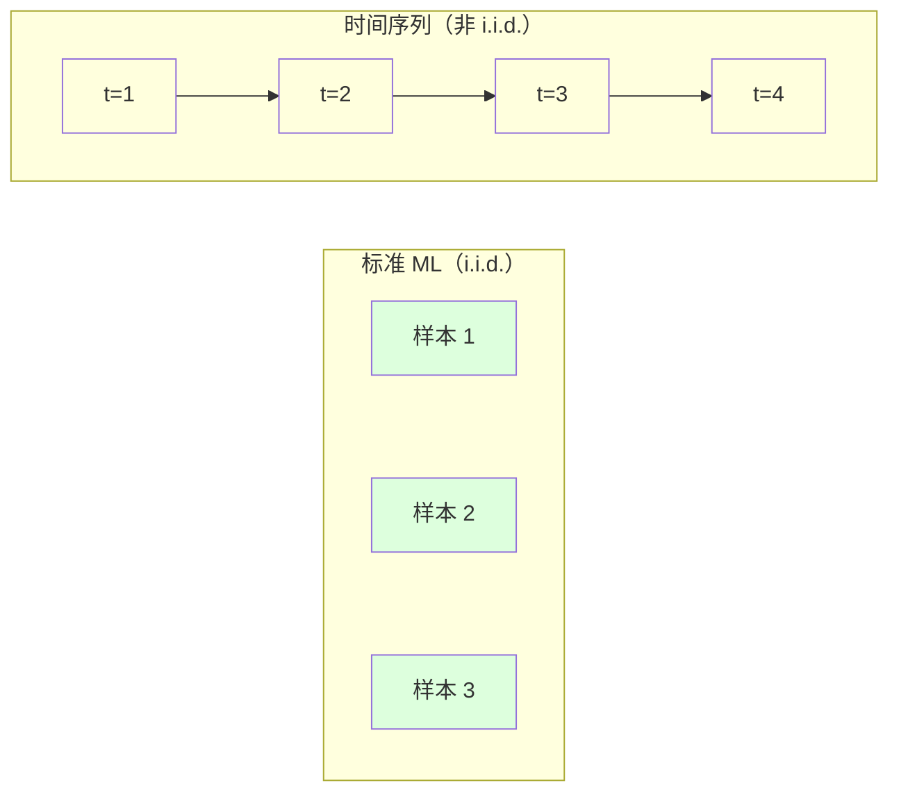
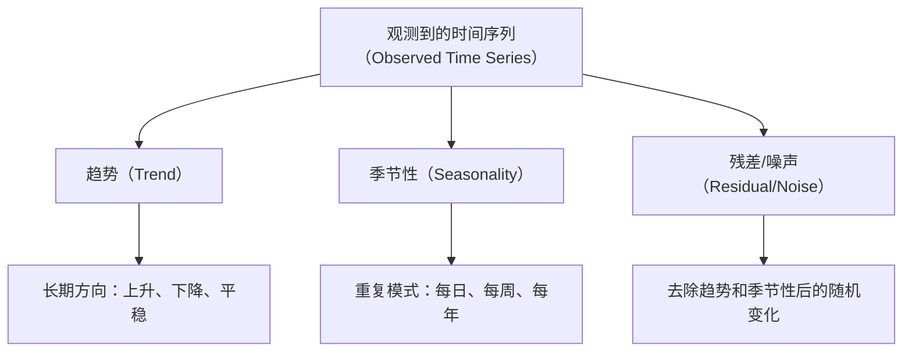
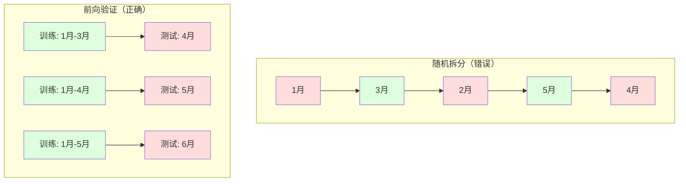

# 时间序列基础（Time Series Fundamentals）

> 过去的表现确实能预测未来的结果——前提是你先检查平稳性（Stationarity）。

**类型：** 构建（Build）
**语言：** Python
**前置要求：** 第 2 阶段，第 01-09 课
**时间：** 约 90 分钟

## 学习目标（Learning Objectives）

- 将时间序列分解为趋势（Trend）、季节性（Seasonality）和残差（Residual）分量，并检验平稳性
- 实现滞后特征（Lag Features）和滚动统计量（Rolling Statistics），将时间序列转化为监督学习问题
- 构建一个前向验证（Walk-Forward Validation）框架，防止未来数据泄露到训练中
- 解释为什么随机训练/测试拆分对时间序列无效，并演示与正确时间拆分的性能差距

## 问题（The Problem）

你有按时间排序的数据。每日销售额、每小时温度、每分钟 CPU 使用率、每周股票价格。你想预测下一个值、下一周、下一季度。

你拿起标准的机器学习工具箱：随机训练/测试拆分、交叉验证（Cross-Validation）、特征矩阵输入、预测输出。每一步都是错的。

时间序列打破了标准机器学习所依赖的假设。样本不是独立的——今天的温度取决于昨天的温度。随机拆分会将未来信息泄露到过去。在回测中看起来很好的特征在生产中失败，因为它们依赖的模式会随时间变化。

一个在随机交叉验证中获得 95% 准确率的模型，在正确的基于时间的评估中可能只获得 55%。这个差异不是技术细节。它是纸上有效的模型和生产中有效的模型之间的区别。

本课涵盖基础知识：时间数据有何不同，如何诚实地评估模型，以及如何将时间序列转化为标准机器学习模型可以消费的特征。

## 概念（The Concept）

### 时间序列有何不同

标准机器学习假设 i.i.d.——独立同分布（Independent and Identically Distributed）。每个样本从同一分布中独立抽取。时间序列违反了两者：

- **不独立。** 今天的股票价格取决于昨天的。本周的销售额与上周的相关。
- **不同分布。** 分布随时间变化。12 月的销售额看起来与 3 月的不同。

这些违反不是小事。它们改变了你构建特征的方式、评估模型的方式以及哪些算法有效。



在标准机器学习中，样本是可互换的。打乱它们不会改变任何东西。在时间序列中，顺序就是一切。打乱会破坏信号。

### 时间序列的组成分量

每个时间序列是以下各项的组合：



- **趋势（Trend）**：长期方向。收入每年增长 10%。全球气温上升。
- **季节性（Seasonality）**：固定间隔的重复模式。零售销售额在 12 月激增。空调使用量在 7 月达到峰值。
- **残差（Residual）**：去除趋势和季节性后剩下的部分。如果残差看起来像白噪声（White Noise），则分解捕获了信号。

### 平稳性（Stationarity）

如果一个时间序列的统计属性（均值、方差、自相关）不随时间变化，则它是平稳的。大多数预测方法假设平稳性。

**为什么重要：** 非平稳序列的均值会漂移。在 1 月数据上训练的模型学到的均值与 2 月将显示的均值不同。它会系统性地出错。

**如何检查：** 在窗口上计算滚动均值和滚动标准差。如果它们漂移，序列是非平稳的。

**如何修复：** 差分（Differencing）。与其对原始值建模，不如对连续值之间的变化建模：

```
diff[t] = value[t] - value[t-1]
```

如果一轮差分不能使序列平稳，再次应用（二阶差分）。大多数现实世界的序列最多需要两轮。

**示例：**

原始序列：[100, 102, 106, 112, 120]
一阶差分：[2, 4, 6, 8]（仍在上升）
二阶差分：[2, 2, 2]（常数——平稳）

原始序列具有二次趋势。一阶差分将其变为线性趋势。二阶差分使其变平。在实践中，你很少需要超过两轮。

**形式化检验：** 增广迪基-富勒检验（Augmented Dickey-Fuller Test，ADF）是平稳性的标准统计检验。原假设是"序列是非平稳的"。p 值低于 0.05 意味着你可以拒绝原假设并得出平稳的结论。我们不从零实现 ADF（它需要渐近分布表），但我们代码中的滚动统计方法提供了实用的可视化检查。

### 自相关（Autocorrelation）

自相关衡量时间 t 的值与时间 t-k（过去 k 步）的值之间的相关程度。自相关函数（ACF）为每个滞后 k 绘制这种相关性。

**ACF 告诉你：**
- 序列的记忆有多远。如果 ACF 在滞后 5 后降至零，则超过 5 步之前的值是无关的。
- 是否存在季节性。如果 ACF 在滞后 12（月度数据）处出现峰值，则存在年度季节性。
- 创建多少个滞后特征。使用 ACF 变得可忽略之前的滞后。

**PACF（偏自相关函数，Partial Autocorrelation Function）** 去除间接相关性。如果今天与 3 天前相关仅仅是因为两者都与昨天相关，则 PACF 在滞后 3 处为零，而 ACF 在滞后 3 处不为零。

### 滞后特征：将时间序列转化为监督学习

标准机器学习模型需要特征矩阵 X 和目标 y。时间序列只给你一列值。桥梁是滞后特征。

取序列 [10, 12, 14, 13, 15] 并创建滞后-1 和滞后-2 特征：

| lag_2 | lag_1 | target |
|-------|-------|--------|
| 10    | 12    | 14     |
| 12    | 14    | 13     |
| 14    | 13    | 15     |

现在你有了一个标准的回归问题。任何机器学习模型（线性回归、随机森林、梯度提升）都可以从滞后值预测目标。

你可以工程化的额外特征：
- **滚动统计量：** 过去 k 个值的均值、标准差、最小值、最大值
- **日历特征：** 星期几、月份、是否节假日、是否周末
- **差分值：** 相对于前一步的变化
- **扩展统计量：** 累积均值、累积和
- **比率特征：** 当前值 / 滚动均值（偏离近期平均值的程度）
- **交互特征：** lag_1 * day_of_week（工作日对动量的影响）

**多少个滞后？** 使用自相关函数。如果 ACF 在滞后 10 之前显著，则至少使用 10 个滞后。如果存在周季节性，包含滞后 7（可能还有 14）。更多滞后给模型更多历史信息，但也增加了需要拟合的特征数量，增加了过拟合的风险。

**目标对齐陷阱。** 创建滞后特征时，目标必须是时间 t 的值，所有特征必须使用时间 t-1 或更早的值。如果你不小心将时间 t 的值作为特征包含进来，你就有了一个完美的预测器——以及一个完全无用的模型。这是时间序列特征工程中最常见的错误。

### 前向验证（Walk-Forward Validation）

这是本课最重要的概念。标准的 k 折交叉验证随机将样本分配到训练集和测试集。对于时间序列，这会泄露未来信息。



前向验证：
1. 在时间 t 之前的数据上训练
2. 在时间 t+1（或多步预测的 t+1 到 t+k）预测
3. 向前滑动窗口
4. 重复

每个测试折只包含在所有训练数据之后的数据。没有未来泄露。这给你一个诚实的估计，说明模型部署后的表现。

**扩展窗口（Expanding Window）** 使用所有历史数据进行训练（窗口增长）。**滑动窗口（Sliding Window）** 使用固定大小的训练窗口（窗口滑动）。当你认为旧数据仍然相关时使用扩展窗口。当世界变化且旧数据有害时使用滑动窗口。

### ARIMA 直觉

ARIMA 是经典的时间序列模型。它有三个分量：

- **AR（自回归，Autoregressive）：** 从过去的值预测。AR(p) 使用最后 p 个值。
- **I（积分，Integrated）：** 差分以实现平稳性。I(d) 应用 d 轮差分。
- **MA（移动平均，Moving Average）：** 从过去的预测误差预测。MA(q) 使用最后 q 个误差。

ARIMA(p, d, q) 结合了所有三个。你基于 ACF/PACF 分析或自动搜索（auto-ARIMA）选择 p、d、q。

我们不会从零实现 ARIMA——它需要数值优化，超出了本课的范围。关键的洞察是理解每个分量的作用，以便你能解释 ARIMA 结果并知道何时使用它。

### 何时使用什么

| 方法 | 最适合 | 处理季节性 | 处理外部特征 |
|------|--------|-----------|------------|
| 滞后特征 + ML | 具有许多外部特征的表格数据 | 通过日历特征 | 是 |
| ARIMA | 单变量序列，短期 | SARIMA 变体 | 否（ARIMAX 有限） |
| 指数平滑（Exponential Smoothing） | 简单趋势 + 季节性 | 是（Holt-Winters） | 否 |
| Prophet | 业务预测，节假日 | 是（傅里叶项） | 有限 |
| 神经网络（LSTM, Transformer） | 长序列，多序列 | 学习得到 | 是 |

对于大多数实际问题，滞后特征 + 梯度提升是最强的起点。它自然地处理外部特征，不需要平稳性，且易于调试。

### 预测范围与策略

单步预测（Single-Step Forecasting）预测一个时间步之后。多步预测（Multi-Step Forecasting）预测多个步。有三种策略：

**递归（Recursive/Iterated）：** 预测一步，将预测值作为下一步的输入。简单但误差会累积——每次预测使用前一次预测，因此错误会复合。

**直接（Direct）：** 为每个范围训练单独的模型。模型-1 预测 t+1，模型-5 预测 t+5。没有误差累积，但每个模型的训练样本更少，且它们不共享信息。

**多输出（Multi-Output）：** 训练一个同时输出所有范围的模型。跨范围共享信息，但需要支持多输出的模型（或自定义损失函数）。

对于大多数实际问题，短范围（1-5 步）从递归开始，长范围从直接开始。

### 时间序列中的常见错误

| 错误 | 为什么发生 | 如何修复 |
|------|----------|---------|
| 随机训练/测试拆分 | 标准机器学习的习惯 | 使用前向验证或时间拆分 |
| 使用未来特征 | 不小心包含了时间 t 的特征 | 审计每个特征的时间对齐 |
| 对季节性过拟合 | 模型记忆了日历模式 | 在测试集中保留一个完整的季节周期 |
| 忽略尺度变化 | 收入翻倍但模式不变 | 建模百分比变化而非绝对值 |
| 滞后特征过多 | "更多历史更好" | 使用 ACF 确定相关滞后 |
| 不做差分 | "模型会自己搞定的" | 树模型处理趋势；线性模型需要平稳性 |

## 构建它（Build It）

`code/time_series.py` 中的代码从零实现了核心构建块。

### 滞后特征创建器

```python
def make_lag_features(series, n_lags):
    n = len(series)
    X = np.full((n, n_lags), np.nan)
    for lag in range(1, n_lags + 1):
        X[lag:, lag - 1] = series[:-lag]
    valid = ~np.isnan(X).any(axis=1)
    return X[valid], series[valid]
```

这将一维序列转换为特征矩阵，其中每行以最后 `n_lags` 个值作为特征，当前值作为目标。

### 前向交叉验证

```python
def walk_forward_split(n_samples, n_splits=5, min_train=50):
    assert min_train < n_samples, "min_train 必须小于 n_samples"
    step = max(1, (n_samples - min_train) // n_splits)
    for i in range(n_splits):
        train_end = min_train + i * step
        test_end = min(train_end + step, n_samples)
        if train_end >= n_samples:
            break
        yield slice(0, train_end), slice(train_end, test_end)
```

每个拆分确保训练数据严格在测试数据之前。训练窗口随每折扩展。

### 简单自回归模型

纯 AR 模型只是对滞后特征的线性回归：

```python
class SimpleAR:
    def __init__(self, n_lags=5):
        self.n_lags = n_lags
        self.weights = None
        self.bias = None

    def fit(self, series):
        X, y = make_lag_features(series, self.n_lags)
        # 通过正规方程求解
        X_b = np.column_stack([np.ones(len(X)), X])
        theta = np.linalg.lstsq(X_b, y, rcond=None)[0]
        self.bias = theta[0]
        self.weights = theta[1:]
        return self
```

这在概念上与第 02 课的线性回归相同，但应用于同一变量的时间滞后版本。

### 平稳性检查

代码计算滚动统计量以可视化评估平稳性。如果滚动均值和标准差随时间漂移，序列是非平稳的，在建模前需要差分。

## 你构建了什么（What You Built）

你从零实现了时间序列预测的核心构建块。你的实现：

1. **滞后特征创建器** 将一维序列转换为监督学习格式
2. **前向交叉验证** 强制执行正确的时间顺序，防止未来数据泄露
3. **简单自回归模型（SimpleAR）** 使用正规方程对滞后特征拟合线性模型
4. **平稳性检查** 使用滚动统计量识别非平稳序列

关键要点：时间序列打破了标准机器学习的 i.i.d. 假设。随机拆分泄露未来信息。前向验证是唯一诚实的评估方法。滞后特征是将时间序列转化为标准机器学习模型可以消费的格式的桥梁。

## 反思问题（Reflection Questions）

1. 为什么随机训练/测试拆分在时间序列中会给出过于乐观的性能估计？具体来说，当训练数据包含来自测试数据之后的时间步时，模型学到了什么不该学的东西？
2. 如果你对一个非平稳序列拟合 AR 模型而不先做差分，预测会怎样？为什么？
3. 递归多步预测中的误差如何随预测范围增长？为什么直接预测在长范围内可能更好？
