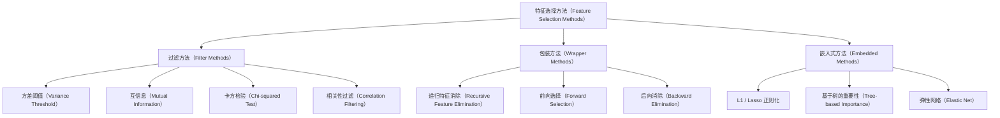
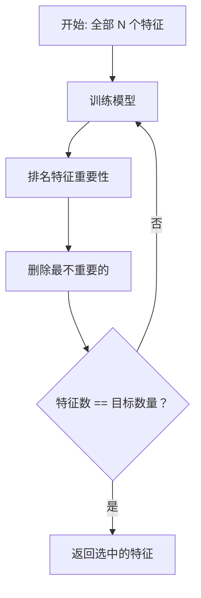
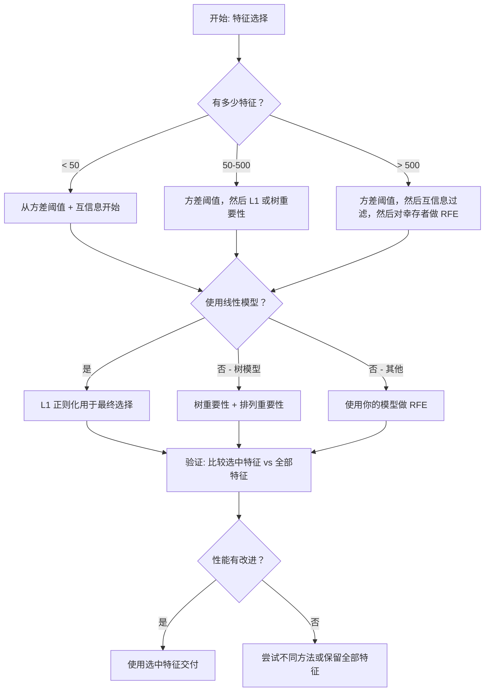

# 特征选择（Feature Selection）

> 更多特征并不更好。正确的特征才更好。

**类型：** 构建（Build）
**语言：** Python
**前置要求：** 第 2 阶段，第 01-09 课，第 08 课（特征工程）
**时间：** 约 75 分钟

## 学习目标（Learning Objectives）

- 从零实现过滤方法（Filter Methods，方差阈值（Variance Threshold）、互信息（Mutual Information）、卡方检验（Chi-squared））和包装方法（Wrapper Methods，递归特征消除 RFE、前向选择）
- 解释为什么互信息能捕获相关性所遗漏的非线性特征-目标关系
- 比较 L1 正则化（嵌入式选择）与 RFE（包装选择），并评估其计算权衡
- 构建一个结合多种方法的特征选择流水线，并在留出数据上展示改进的泛化能力

## 问题（The Problem）

你有 500 个特征。你的模型训练缓慢，持续过拟合，没有人能解释它学到了什么。你添加更多特征希望提高性能。结果更糟了。

这就是维数灾难（Curse of Dimensionality）的实际体现。随着特征数量的增长，特征空间的体积呈指数爆炸。数据点变得稀疏。点之间的距离趋同。模型需要指数级更多的数据才能找到真实模式。噪声特征淹没了信号特征。过拟合成为默认状态。

特征选择是解药。剔除噪声。消除冗余。保留携带关于目标变量的实际信息的特征。结果是：更快的训练、更好的泛化能力，以及你能够真正解释的模型。

目标不是使用所有可用的信息。而是使用正确的信息。

## 概念（The Concept）

### 特征选择的三大类别

每种特征选择方法都属于以下三类之一：



**过滤方法（Filter Methods）** 使用统计量独立地对每个特征评分。它们不使用模型。快速，但会遗漏特征交互。

**包装方法（Wrapper Methods）** 训练一个模型来评估特征子集。它们使用模型性能作为分数。结果更好，但代价高，因为要多次重新训练模型。

**嵌入式方法（Embedded Methods）** 在模型训练过程中选择特征。L1 正则化将权重驱动为零。决策树在最有用特征上分裂。选择在拟合过程中发生，而不是作为单独的步骤。

### 方差阈值（Variance Threshold）

最简单的过滤方法。如果一个特征在样本之间几乎没有变化，它几乎不携带信息。

考虑一个特征，在 1000 个样本中有 999 个为 0.0。其方差接近零。没有模型能使用它来区分类别。将其移除。

```
variance(x) = mean((x - mean(x))^2)
```

设置一个阈值（例如，0.01）。丢弃方差低于该阈值的每个特征。这在完全不查看目标变量的情况下移除常量或接近常量的特征。

何时使用：作为其他方法之前的预处理步骤。它以接近零的代价捕获明显无用的特征。

局限性：一个特征可能具有高方差但仍然是纯噪声。方差阈值是必要的，但不充分。

### 互信息（Mutual Information）

互信息衡量知道特征 X 的值在多大程度上减少了对目标 Y 的不确定性。

```
I(X; Y) = sum_x sum_y p(x, y) * log(p(x, y) / (p(x) * p(y)))
```

如果 X 和 Y 独立，p(x, y) = p(x) * p(y)，因此对数项为零，I(X; Y) = 0。X 告诉你关于 Y 的信息越多，互信息越高。

相对于相关性的关键优势：互信息捕获非线性关系。一个特征可能与目标的相关性为零，但互信息很高，因为关系是二次的或周期性的。

对于连续特征，首先离散化到分箱（基于直方图的估计）。分箱数量影响估计——太少的分箱丢失信息，太多的分箱增加噪声。常见选择：sqrt(n) 个分箱或 Sturges 规则（1 + log2(n)）。


### 递归特征消除（Recursive Feature Elimination，RFE）

RFE 是一种包装方法。它使用模型自身的特征重要性进行迭代修剪：

1. 使用所有特征训练模型
2. 按重要性对特征进行排名（线性模型用系数，树模型用不纯度减少）
3. 删除最不重要的特征
4. 重复直到剩下所需数量的特征



RFE 考虑特征交互，因为模型一起看到所有剩余特征。删除一个特征会改变其他特征的重要性。这使得它比过滤方法更彻底。

代价：你训练模型 N - target 次。有 500 个特征，目标是 10 个，那就是 490 次训练运行。对于昂贵的模型，这很慢。你可以通过每步删除多个特征来加速（例如，每轮删除底部 10%）。

### L1（Lasso）正则化

L1 正则化将权重的绝对值添加到损失函数中：

```
loss = prediction_error + alpha * sum(|w_i|)
```

alpha 参数控制特征修剪的激进程度。更高的 alpha 意味着更多权重变为精确零。

为什么是精确零？L1 惩罚在权重空间中创建一个菱形约束区域。最优解倾向于落在这个菱形的角落，其中一个或多个权重为零。L2 正则化（Ridge）创建一个圆形约束，权重会缩小但很少为零。

这是嵌入式特征选择：模型在训练期间学习忽略哪些特征。权重为零的特征被有效移除。

优点：单次训练运行，处理相关特征（选择一个并将其余归零），内置于大多数线性模型实现中。

局限性：仅适用于线性模型。无法捕获非线性特征重要性。

### 基于树的特征重要性

决策树及其集成（随机森林、梯度提升）自然地排名特征。每次分裂减少不纯度（分类用基尼（Gini）或熵（Entropy），回归用方差）。产生较大不纯度减少的特征更重要。

对于具有 T 棵树的随机森林：

```
importance(feature_j) = (1/T) * 所有树上 sum of
    在特征_j上分裂的所有节点上 sum of
        (n_samples * impurity_decrease)
```

这给出每个特征的归一化重要性分数。它自动处理非线性关系和特征交互。

注意：基于树的重要性偏向具有许多唯一值的特征（高基数，High Cardinality）。随机 ID 列会显得重要，因为它完美地分割了每个样本。使用排列重要性（Permutation Importance）作为合理性检查。

### 排列重要性（Permutation Importance）

一种模型无关方法：

1. 训练模型并记录验证数据上的基线性能
2. 对于每个特征：随机打乱其值，测量性能下降
3. 下降越大，特征越重要

如果打乱一个特征不会损害性能，模型就不依赖它。如果性能崩溃，该特征至关重要。

排列重要性避免了基于树的重要性的基数偏差。但它很慢：每个特征一次完整评估，为稳定性重复多次。

### 比较表

| 方法 | 类型 | 速度 | 非线性 | 特征交互 |
|------|------|------|-------|---------|
| 方差阈值（Variance Threshold） | 过滤 | 非常快 | 否 | 否 |
| 互信息（Mutual Information） | 过滤 | 快 | 是 | 否 |
| 相关性过滤（Correlation Filter） | 过滤 | 快 | 否 | 否 |
| RFE | 包装 | 慢 | 取决于模型 | 是 |
| L1 / Lasso | 嵌入式 | 快 | 否（线性） | 否 |
| 树重要性（Tree Importance） | 嵌入式 | 中等 | 是 | 是 |
| 排列重要性（Permutation Importance） | 模型无关 | 慢 | 是 | 是 |

### 决策流程图



## 构建它（Build It）

### 步骤 1：生成具有已知特征结构的合成数据

```python
import numpy as np


def make_feature_selection_data(n_samples=500, seed=42):
    rng = np.random.RandomState(seed)

    x1 = rng.randn(n_samples)
    x2 = rng.randn(n_samples)
    x3 = rng.randn(n_samples)
    x4 = x1 + 0.1 * rng.randn(n_samples)
    x5 = x2 + 0.1 * rng.randn(n_samples)

    informative = np.column_stack([x1, x2, x3, x4, x5])

    correlated = np.column_stack([
        x1 * 0.9 + 0.1 * rng.randn(n_samples),
        x2 * 0.8 + 0.2 * rng.randn(n_samples),
        x3 * 0.7 + 0.3 * rng.randn(n_samples),
        x1 * 0.5 + x2 * 0.5 + 0.1 * rng.randn(n_samples),
        x2 * 0.6 + x3 * 0.4 + 0.1 * rng.randn(n_samples),
    ])

    noise = rng.randn(n_samples, 10) * 0.5

    X = np.hstack([informative, correlated, noise])
    y = (2 * x1 - 1.5 * x2 + x3 + 0.5 * rng.randn(n_samples) > 0).astype(int)

    feature_names = (
        [f"info_{i}" for i in range(5)]
        + [f"corr_{i}" for i in range(5)]
        + [f"noise_{i}" for i in range(10)]
    )

    return X, y, feature_names
```

我们知道真实情况：特征 0-4 是有信息量的（其中 3 和 4 是 0 和 1 的相关副本），特征 5-9 与有信息量的特征相关，特征 10-19 是纯噪声。好的选择方法应该将 0-4 排名最高，10-19 排名最低。

### 步骤 2：方差阈值

```python
def variance_threshold(X, threshold=0.01):
    variances = np.var(X, axis=0)
    mask = variances > threshold
    return mask, variances
```

### 步骤 3：互信息（离散）

```python
def discretize(x, n_bins=10):
    min_val, max_val = x.min(), x.max()
    if max_val == min_val:
        return np.zeros_like(x, dtype=int)
    bin_edges = np.linspace(min_val, max_val, n_bins + 1)
    binned = np.digitize(x, bin_edges[1:-1])
    return binned


def mutual_information(X, y, n_bins=10):
    n_samples, n_features = X.shape
    mi_scores = np.zeros(n_features)

    y_vals, y_counts = np.unique(y, return_counts=True)
    p_y = y_counts / n_samples

    for f in range(n_features):
        x_binned = discretize(X[:, f], n_bins)
        x_vals, x_counts = np.unique(x_binned, return_counts=True)
        p_x = dict(zip(x_vals, x_counts / n_samples))

        mi = 0.0
        for xv in x_vals:
            for yi, yv in enumerate(y_vals):
                joint_mask = (x_binned == xv) & (y == yv)
                p_xy = np.sum(joint_mask) / n_samples
                if p_xy > 0:
                    mi += p_xy * np.log(p_xy / (p_x[xv] * p_y[yi]))
        mi_scores[f] = mi

    return mi_scores
```

### 步骤 4：递归特征消除

```python
def simple_logistic_importance(X, y, lr=0.1, epochs=100):
    n_samples, n_features = X.shape
    w = np.zeros(n_features)
    b = 0.0

    for _ in range(epochs):
        z = X @ w + b
        pred = 1.0 / (1.0 + np.exp(-np.clip(z, -500, 500)))
        error = pred - y
        w -= lr * (X.T @ error) / n_samples
        b -= lr * np.mean(error)

    return w, b


def rfe(X, y, n_features_to_select=5, lr=0.1, epochs=100):
    n_total = X.shape[1]
    remaining = list(range(n_total))
    rankings = np.ones(n_total, dtype=int)
    rank = n_total

    while len(remaining) > n_features_to_select:
        X_subset = X[:, remaining]
        w, _ = simple_logistic_importance(X_subset, y, lr, epochs)
        importances = np.abs(w)

        least_idx = np.argmin(importances)
        original_idx = remaining[least_idx]
        rankings[original_idx] = rank
        rank -= 1
        remaining.pop(least_idx)

    for idx in remaining:
        rankings[idx] = 1

    selected_mask = rankings == 1
    return selected_mask, rankings
```

### 步骤 5：L1 特征选择

```python
def soft_threshold(w, alpha):
    return np.sign(w) * np.maximum(np.abs(w) - alpha, 0)


def l1_feature_selection(X, y, alpha=0.1, lr=0.01, epochs=500):
    n_samples, n_features = X.shape
    w = np.zeros(n_features)
    b = 0.0

    for _ in range(epochs):
        z = X @ w + b
        pred = 1.0 / (1.0 + np.exp(-np.clip(z, -500, 500)))
        error = pred - y

        gradient_w = (X.T @ error) / n_samples
        gradient_b = np.mean(error)

        w -= lr * gradient_w
        w = soft_threshold(w, lr * alpha)
        b -= lr * gradient_b

    selected_mask = np.abs(w) > 1e-6
    return selected_mask, w
```

### 步骤 6：基于树的重要性（简单决策树）

```python
def gini_impurity(y):
    if len(y) == 0:
        return 0.0
    classes, counts = np.unique(y, return_counts=True)
    probs = counts / len(y)
    return 1.0 - np.sum(probs ** 2)


def best_split(X, y, feature_idx):
    values = np.unique(X[:, feature_idx])
    if len(values) <= 1:
        return None, -1.0

    best_threshold = None
    best_gain = -1.0
    parent_gini = gini_impurity(y)
    n = len(y)

    for i in range(len(values) - 1):
        threshold = (values[i] + values[i + 1]) / 2.0
        left_mask = X[:, feature_idx] <= threshold
        right_mask = ~left_mask

        n_left = np.sum(left_mask)
        n_right = np.sum(right_mask)

        if n_left == 0 or n_right == 0:
            continue

        gain = parent_gini - (n_left / n) * gini_impurity(y[left_mask]) - (n_right / n) * gini_impurity(y[right_mask])

        if gain > best_gain:
            best_gain = gain
            best_threshold = threshold

    return best_threshold, best_gain


def tree_importance(X, y, n_trees=50, max_depth=5, seed=42):
    rng = np.random.RandomState(seed)
    n_samples, n_features = X.shape
    importances = np.zeros(n_features)

    for _ in range(n_trees):
        sample_idx = rng.choice(n_samples, size=n_samples, replace=True)
        feature_subset = rng.choice(n_features, size=max(1, int(np.sqrt(n_features))), replace=False)

        X_boot = X[sample_idx]
        y_boot = y[sample_idx]

        tree_imp = _build_tree_importance(X_boot, y_boot, feature_subset, max_depth)
        importances += tree_imp

    total = importances.sum()
    if total > 0:
        importances /= total

    return importances


def _build_tree_importance(X, y, feature_subset, max_depth, depth=0):
    n_features = X.shape[1]
    importances = np.zeros(n_features)

    if depth >= max_depth or len(np.unique(y)) <= 1 or len(y) < 4:
        return importances

    best_feature = None
    best_threshold = None
    best_gain = -1.0

    for f in feature_subset:
        threshold, gain = best_split(X, y, f)
        if gain > best_gain:
            best_gain = gain
            best_feature = f
            best_threshold = threshold

    if best_feature is None or best_gain <= 0:
        return importances

    importances[best_feature] += best_gain * len(y)

    left_mask = X[:, best_feature] <= best_threshold
    right_mask = ~left_mask

    importances += _build_tree_importance(X[left_mask], y[left_mask], feature_subset, max_depth, depth + 1)
    importances += _build_tree_importance(X[right_mask], y[right_mask], feature_subset, max_depth, depth + 1)

    return importances
```

### 步骤 7：运行所有方法并比较

代码文件在相同的合成数据集上运行所有五种方法，并打印一个比较表，显示每种方法选择了哪些特征。

## 使用它（Use It）

使用 scikit-learn，特征选择内置于流水线中：

```python
from sklearn.feature_selection import (
    VarianceThreshold,
    mutual_info_classif,
    RFE,
    SelectFromModel,
)
from sklearn.linear_model import Lasso, LogisticRegression
from sklearn.ensemble import RandomForestClassifier

vt = VarianceThreshold(threshold=0.01)
X_filtered = vt.fit_transform(X)

mi_scores = mutual_info_classif(X, y)
top_k = np.argsort(mi_scores)[-10:]

rfe_selector = RFE(LogisticRegression(), n_features_to_select=10)
rfe_selector.fit(X, y)
X_rfe = rfe_selector.transform(X)

lasso_selector = SelectFromModel(Lasso(alpha=0.01))
lasso_selector.fit(X, y)
X_lasso = lasso_selector.transform(X)

rf = RandomForestClassifier(n_estimators=100)
rf.fit(X, y)
importances = rf.feature_importances_
```

从零实现展示每种方法内部具体做了什么。方差阈值只是计算 `var(X, axis=0)` 并应用掩码。互信息是在列联表中统计联合频率和边缘频率。RFE 是一个训练、排名、修剪的循环。L1 是带软阈值步骤的梯度下降。树重要性累积跨分裂的不纯度减少。没有魔法——只是统计和循环。

sklearn 版本增加了鲁棒性（例如，mutual_info_classif 使用 k-NN 密度估计而不是分箱）、速度（C 实现）和流水线集成。

## 交付物（Ship It）

本课产生：
- `outputs/skill-feature-selector.md`——选择正确特征选择方法的快速参考决策树

## 练习（Exercises）

1. **前向选择（Forward Selection）：** 实现 RFE 的反向操作。从零特征开始。每一步，添加最能提高模型性能的特征。当添加特征不再有帮助时停止。将选中的特征与 RFE 结果进行比较。哪个更快？哪个给出更好的结果？

2. **稳定性选择（Stability Selection）：** 运行 L1 特征选择 50 次，每次在数据的随机 80% 子样本上，使用稍微不同的 alpha 值。统计每个特征被选中的频率。在 > 80% 的运行中被选中的特征是"稳定的"。将稳定特征与单次 L1 选择进行比较。哪个更可靠？

3. **多重共线性检测：** 计算所有特征的相关矩阵。实现一个函数，给定一个相关性阈值（例如，0.9），从每对高度相关的特征中移除一个（保留与目标互信息更高的那个）。在合成数据集上测试，验证它移除了冗余的相关特征。

4. **特征选择流水线：** 将方差阈值、互信息过滤和 RFE 串联成单个流水线。首先移除接近零方差的特征，然后按互信息保留前 50%，然后对幸存者运行 RFE。将此流水线与仅在所有特征上运行 RFE 进行比较。流水线是否更快？它是否同样准确？

5. **从零实现排列重要性：** 实现排列重要性。对于每个特征，将其值打乱 10 次，测量 F1 分数的平均下降。将排名与基于树的重要性进行比较。找出它们不一致的情况并解释原因（提示：相关特征）。

## 关键术语（Key Terms）

| 术语 | 人们的说法 | 实际含义 |
|------|----------|---------|
| 过滤方法（Filter Method） | "独立评分特征" | 一种特征选择方法，使用统计量对特征进行排名，无需训练模型，独立评估每个特征 |
| 包装方法（Wrapper Method） | "使用模型来选择特征" | 一种特征选择方法，通过训练模型并将其性能作为选择标准来评估特征子集 |
| 嵌入式方法（Embedded Method） | "模型在训练期间选择特征" | 在模型拟合过程中发生的特征选择，例如 L1 正则化将权重驱动为零 |
| 互信息（Mutual Information） | "一个变量告诉你关于另一个变量的多少信息" | 给定 X 的知识后 Y 不确定性的减少量，捕获线性和非线性依赖关系 |
| 递归特征消除（RFE） | "训练、排名、修剪、重复" | 一种迭代包装方法，训练模型，删除最不重要的特征，重复直到达到目标数量 |
| L1 / Lasso 正则化 | "杀死特征的惩罚项" | 将绝对权重值之和添加到损失函数中，将不重要特征的权重驱动为精确零 |
| 方差阈值（Variance Threshold） | "移除常量特征" | 丢弃跨样本方差低于指定阈值的特征，过滤掉不携带信息的特征 |
| 特征重要性（Feature Importance） | "哪些特征最重要" | 一个分数，指示每个特征对模型预测的贡献程度，从分裂增益（树）或系数大小（线性）计算 |
| 排列重要性（Permutation Importance） | "打乱并衡量损害" | 通过随机打乱每个特征的值并衡量模型性能的下降来评估特征重要性 |
| 维数灾难（Curse of Dimensionality） | "太多特征，不够数据" | 添加特征使特征空间体积指数增长，使数据稀疏且距离变得无意义的现象 |

## 进一步阅读（Further Reading）

- [An Introduction to Variable and Feature Selection (Guyon & Elisseeff, 2003)](https://jmlr.org/papers/v3/guyon03a.html)——特征选择方法的基础性综述，至今仍被广泛引用
- [scikit-learn Feature Selection Guide](https://scikit-learn.org/stable/modules/feature_selection.html)——过滤、包装和嵌入式方法的实用参考，含代码示例
- [Stability Selection (Meinshausen & Buhlmann, 2010)](https://arxiv.org/abs/0809.2932)——结合子采样与特征选择，产生鲁棒、可复现的结果
- [Beware Default Random Forest Importances (Strobl et al., 2007)](https://bmcbioinformatics.biomedcentral.com/articles/10.1186/1471-2105-8-25)——展示基于树重要性的基数偏差，提出条件重要性作为替代方案