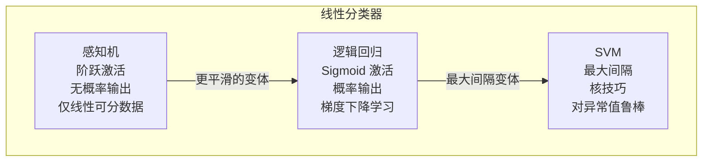

# 感知机

> 感知机是神经网络的基本构建块。它是一个数学神经元——接收输入，加权求和，然后做出是/否决策。理解感知机，你就理解了深度学习的基础。

**类型：** 构建
**语言：** Python
**前置条件：** 第一阶段（数学基础）
**时间：** ~60 分钟

## 学习目标

- 从零开始用 Python 实现一个感知机（Perceptron），包括加权求和、阶跃函数和 Hebbian 学习规则
- 解释为什么感知机无法学习 XOR，并证明线性不可分（linear separability）是根本原因
- 使用感知机收敛定理（Perceptron Convergence Theorem）预测训练何时会成功或失败
- 将单输出感知机扩展为多输出感知机，用于多类分类

## 问题

1957 年，Frank Rosenblatt 在康奈尔航空实验室建造了 Mark I 感知机。它是一台 5 吨重的机器，有 400 个光电池连接到可调电位器（权重），通过电机驱动旋钮进行物理旋转来学习。它学会了区分打孔卡片上的左右标记。纽约时报报道说，海军期望它能"走路、说话、看、写、自我复制并意识到自己的存在"。

他们没有意识到的是，感知机无法学习 XOR。

1969 年，Minsky 和 Papert 在数学上证明了这一点。不是"很难学习"——是数学上不可能。一条直线无法分离 XOR 的真值表。这个证明使神经网络研究停滞了十多年。直到多层网络（第 02 课）出现，这个限制才被克服。

感知机是起点。它包含了你需要理解的每一个概念——加权输入、偏置项（bias term）、激活函数、从示例中学习——然后才能处理更复杂的东西。

## 概念

### 感知机如何工作

感知机接收多个输入，每个输入乘以一个权重，全部求和，加上偏置，然后通过阶跃函数（step function）得到 0 或 1 的输出。

```
output = step(w1*x1 + w2*x2 + ... + wn*xn + b)
```

其中 step(z) = 1 如果 z > 0，否则 0。

几何上，权重定义了一条直线（在 2D 中）、一个平面（在 3D 中）或一个超平面（在更高维度中）。偏置将这条线从原点移开。感知机输出 1 表示在线的一侧，0 表示在另一侧。这就是为什么它只能解决线性可分（linearly separable）的问题。

### Hebbian 学习规则

Rosenblatt 的学习规则基于 Donald Hebb 的 1949 年理论："一起放电的神经元会连接在一起。"如果感知机输出 1 但应该是 0，降低活跃输入的权重。如果输出 0 但应该是 1，增加活跃输入的权重。如果输出正确，不做任何改变。

```
w_i = w_i + learning_rate * (target - prediction) * x_i
b = b + learning_rate * (target - prediction)
```

当 target = prediction 时，更新量为零。当 target = 1 且 prediction = 0 时，权重增加（鼓励激活）。当 target = 0 且 prediction = 1 时，权重减少（抑制激活）。

### 感知机收敛定理

如果数据是线性可分的，感知机学习规则保证在有限步数内收敛到一个解。不是"可能"——是保证。权重更新次数有一个上界：(R/γ)²，其中 R 是最大输入范数，γ 是最小间隔（margin，即最近点到决策边界的距离）。

如果数据不是线性可分的，权重将永远振荡。没有收敛。没有近似解。感知机在不可分数据上会无限循环。

### XOR 问题

XOR 真值表：

| x1 | x2 | XOR |
|----|----|-----|
| 0  | 0  | 0   |
| 0  | 1  | 1   |
| 1  | 0  | 1   |
| 1  | 1  | 0   |

在 2D 平面上画出这些点：(0,0) 和 (1,1) 应该输出 0，(0,1) 和 (1,0) 应该输出 1。没有一条直线可以将它们分开。你需要一条曲线——或者多个感知机组合在一起。

### 多输出感知机

对于 K 类分类，使用 K 个感知机，每个类一个。每个感知机有自己的权重向量和偏置。输入通过所有 K 个感知机，得分最高的类获胜。

```
对于 k = 1 到 K：
    score_k = w_k · x + b_k
prediction = argmax(score_k)
```

这等价于一个没有隐藏层的单层神经网络，使用恒等激活函数。它仍然只能学习线性决策边界，但可以处理多类问题。

### 感知机 vs 逻辑回归 vs SVM



## 构建它

### 步骤 1：阶跃激活函数

```python
def step(x):
    return 1.0 if x > 0 else 0.0
```

### 步骤 2：单感知机类

```python
class Perceptron:
    def __init__(self, n_inputs, learning_rate=0.1):
        import random
        self.weights = [random.uniform(-1, 1) for _ in range(n_inputs)]
        self.bias = random.uniform(-1, 1)
        self.lr = learning_rate

    def predict(self, inputs):
        z = sum(w * x for w, x in zip(self.weights, inputs)) + self.bias
        return step(z)

    def train(self, inputs, target):
        prediction = self.predict(inputs)
        error = target - prediction
        for i in range(len(self.weights)):
            self.weights[i] += self.lr * error * inputs[i]
        self.bias += self.lr * error
        return error
```

### 步骤 3：在 AND 和 OR 上训练

```python
and_data = [
    ([0.0, 0.0], 0.0),
    ([0.0, 1.0], 0.0),
    ([1.0, 0.0], 0.0),
    ([1.0, 1.0], 1.0),
]

or_data = [
    ([0.0, 0.0], 0.0),
    ([0.0, 1.0], 1.0),
    ([1.0, 0.0], 1.0),
    ([1.0, 1.0], 1.0),
]

import random
random.seed(42)

p_and = Perceptron(2)
for epoch in range(20):
    errors = 0
    for inputs, target in and_data:
        errors += abs(p_and.train(inputs, target))
    if errors == 0:
        print(f"AND 在 epoch {epoch} 收敛")
        break

p_or = Perceptron(2)
for epoch in range(20):
    errors = 0
    for inputs, target in or_data:
        errors += abs(p_or.train(inputs, target))
    if errors == 0:
        print(f"OR 在 epoch {epoch} 收敛")
        break
```

AND 和 OR 是线性可分的。感知机在几个 epoch 内收敛。

### 步骤 4：XOR——失败演示

```python
xor_data = [
    ([0.0, 0.0], 0.0),
    ([0.0, 1.0], 1.0),
    ([1.0, 0.0], 1.0),
    ([1.0, 1.0], 0.0),
]

p_xor = Perceptron(2)
for epoch in range(100):
    errors = 0
    for inputs, target in xor_data:
        errors += abs(p_xor.train(inputs, target))
    if epoch % 10 == 0:
        print(f"Epoch {epoch}: {errors} 个错误")
```

错误永远不会归零。感知机在 XOR 上永远振荡——这是线性不可分性的实际证明。

### 步骤 5：多输出感知机

```python
class MultiOutputPerceptron:
    def __init__(self, n_inputs, n_classes, learning_rate=0.1):
        import random
        self.perceptrons = [
            Perceptron(n_inputs, learning_rate)
            for _ in range(n_classes)
        ]

    def predict(self, inputs):
        scores = [p.predict(inputs) for p in self.perceptrons]
        return scores.index(max(scores))

    def train(self, inputs, target_class):
        for i, p in enumerate(self.perceptrons):
            target = 1.0 if i == target_class else 0.0
            p.train(inputs, target)
```

## 使用它

scikit-learn 提供了一个生产级的感知机实现：

```python
from sklearn.linear_model import Perceptron

model = Perceptron(max_iter=1000, eta0=0.1)
model.fit(X_train, y_train)
predictions = model.predict(X_test)
```

`Perceptron` 类使用与我们从零开始构建的相同的 Hebbian 学习规则。`max_iter` 控制 epoch 数，`eta0` 是学习率。对于线性可分数据，它保证收敛。对于不可分数据，设置 `early_stopping=True` 以在验证分数停止改善时停止。

## 发布它

本课生成一个可复用的提示词，用于设计感知机解决方案：

- `outputs/prompt-perceptron.md`

当你需要确定一个问题是否可以用单个感知机解决，或者是否需要更复杂的架构时使用它。

## 练习

1. 在 2D 平面上生成 100 个随机点，一半标记为 0，一半标记为 1，用一条直线分开。训练一个感知机并验证它收敛。绘制决策边界。

2. 修改感知机使其输出概率而非硬分类。将阶跃函数替换为 sigmoid。在相同数据上训练。输出有何不同？

3. 实现一个 `score` 方法，返回加权和（在阶跃函数之前）。使用该分数来衡量感知机对其预测的置信度。在 AND 数据上：哪些点置信度最高？哪些最低？

4. 训练一个 3 输入感知机来学习规则：如果至少两个输入为 1，则输出 1。这是多数函数（majority function）。它是线性可分的吗？感知机能学习它吗？

5. 在 2D 平面上生成一个螺旋数据集（两个交错的螺旋，每个螺旋一个类）。训练一个感知机。观察失败。这为第 02 课的多层网络提供了动机。

## 关键术语

| 术语 | 人们怎么说 | 实际含义 |
|------|-----------|---------|
| 感知机 | "一个简单的神经元" | 一个线性分类器：加权输入 + 偏置，通过阶跃函数得到 0/1 输出 |
| 线性可分 | "可以用一条线分开" | 存在一个超平面完美地将两个类分开。感知机只能解决这类问题 |
| Hebbian 学习 | "一起放电，一起连接" | 权重更新规则：误差 × 输入。如果神经元错误激活，降低活跃输入的权重 |
| 感知机收敛定理 | "保证能学习" | 如果数据是线性可分的，感知机在有限步数内保证找到解 |
| XOR 问题 | "感知机杀手" | 最简单的线性不可分问题。需要隐藏层才能解决 |
| 偏置 | "截距" | 将决策边界从原点移开。没有偏置，所有线必须经过 (0,0) |
