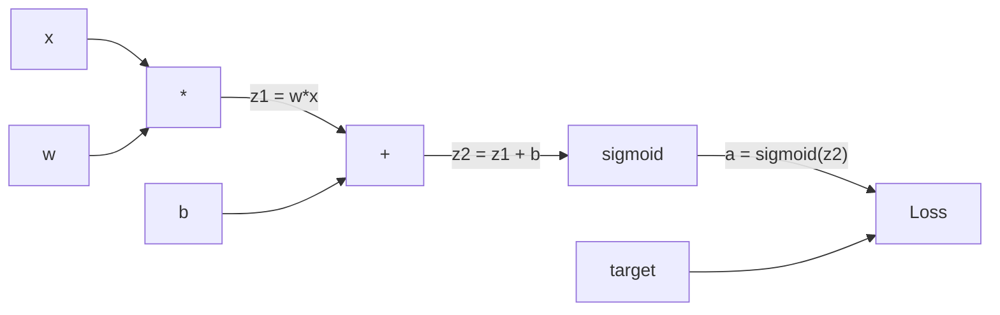
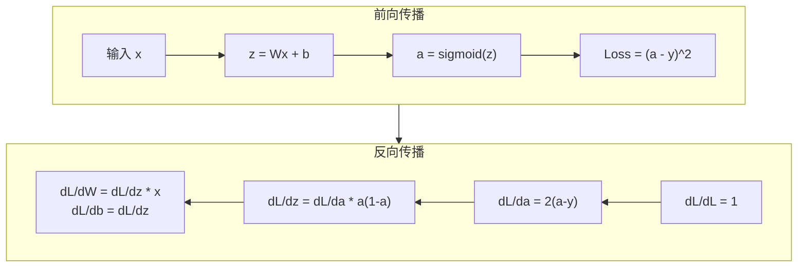
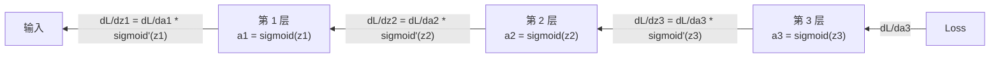

# 从零开始实现反向传播

> 反向传播（Backpropagation）是使学习成为可能的算法。没有它，神经网络只是昂贵的随机数生成器。

**类型：** 构建
**语言：** Python
**前置条件：** 第 03.02 课（多层网络）
**时间：** ~120 分钟

## 学习目标

- 实现一个基于 Value 的自动求导引擎（autograd engine），构建计算图（computational graph）并通过拓扑排序（topological sort）计算梯度
- 使用链式法则（chain rule）推导加法、乘法和 sigmoid 的反向传播
- 仅使用从零开始的反向传播引擎在 XOR 和圆形分类上训练多层网络
- 识别深度 sigmoid 网络中的梯度消失（vanishing gradient）问题，并解释为什么梯度呈指数级缩小

## 问题

你的网络有一个隐藏层，768 个输入和 3072 个输出。那是 2,359,296 个权重。它做出了错误的预测。哪些权重导致了错误？逐个测试每个权重意味着 230 万次前向传播。反向传播在单次反向传递中计算所有 230 万个梯度。这不是优化。这是可训练与不可能之间的区别。

朴素方法：取一个权重，微调一点点，再次运行前向传播，测量损失是上升还是下降。这给你该权重的梯度。现在对网络中的每个权重都这样做。乘以数千个训练步骤和数百万个数据点。你需要地质时间尺度才能训练出任何有用的东西。

反向传播解决了这个问题。一次前向传播，一次反向传播，所有梯度都计算出来。诀窍是来自微积分的链式法则，系统地应用于计算图。这是使深度学习变得实用的算法。没有它，我们仍然困在玩具问题上。

## 概念

### 链式法则，应用于网络

你在第一阶段第 05 课中见过链式法则。快速回顾：如果 y = f(g(x))，那么 dy/dx = f'(g(x)) * g'(x)。你沿着链乘导数。

在神经网络中，"链"是从输入到损失的操作序列。每一层应用权重、加偏置、通过激活函数。损失函数将最终输出与目标进行比较。反向传播反向追踪这条链，计算每个操作对误差的贡献。

### 计算图

每次前向传播构建一个图。每个节点是一个操作（乘、加、sigmoid）。每条边向前携带一个值，向后携带一个梯度。



前向传播：值从左向右流动。x 和 w 产生 z1 = w*x。加上 b 得到 z2。Sigmoid 给出激活 a。使用损失函数将 a 与目标 y 进行比较。

反向传播：梯度从右向左流动。从 dL/da（损失如何随激活变化）开始。乘以 da/dz2（sigmoid 导数）。得到 dL/dz2。分解为 dL/db（等于 dL/dz2，因为 z2 = z1 + b）和 dL/dz1。然后 dL/dw = dL/dz1 * x，dL/dx = dL/dz1 * w。

图中的每个节点在反向传播期间有一个任务：接收来自上方的梯度，乘以其局部导数（local gradient），然后向下传递。

### 前向 vs 反向



前向传播存储每个中间值：z、a、每层的输入。反向传播需要这些存储的值来计算梯度。这是反向传播核心的内存-计算权衡。你用内存（存储激活值）换取速度（一次传递而非数百万次）。

### 梯度在网络中的流动

对于 3 层网络，梯度链过每一层：



在每一层，梯度乘以 sigmoid 导数。sigmoid 导数是 a * (1 - a)，最大值为 0.25（当 a = 0.5 时）。三层深，梯度最多被乘以 0.25^3 = 0.0156。十层深：0.25^10 = 0.000001。

### 梯度消失

这就是梯度消失问题（vanishing gradient problem）。Sigmoid 将其输出压缩在 0 和 1 之间。其导数始终小于 0.25。堆叠足够多的 sigmoid 层，梯度缩小到无。早期层几乎不学习，因为它们接收到接近零的梯度。

```
sigmoid(z):     输出范围 [0, 1]
sigmoid'(z):    最大值 0.25（在 z = 0 处）

5 层后：  梯度 * 0.25^5 = 原始的 0.001 倍
10 层后： 梯度 * 0.25^10 = 原始的 0.000001 倍
```

这就是为什么深度 sigmoid 网络几乎不可能训练。解决方案——ReLU 及其变体——是第 04 课的主题。现在，理解反向传播本身完美工作。问题在于它正在通过什么工作。

### 推导 2 层网络的梯度

具有输入 x、带 sigmoid 的隐藏层、带 sigmoid 的输出层和 MSE 损失的网络的具體数学。

前向传播：
```
z1 = W1 * x + b1
a1 = sigmoid(z1)
z2 = W2 * a1 + b2
a2 = sigmoid(z2)
L = (a2 - y)^2
```

反向传播（逐步应用链式法则）：
```
dL/da2 = 2(a2 - y)
da2/dz2 = a2 * (1 - a2)
dL/dz2 = dL/da2 * da2/dz2 = 2(a2 - y) * a2 * (1 - a2)

dL/dW2 = dL/dz2 * a1
dL/db2 = dL/dz2

dL/da1 = dL/dz2 * W2
da1/dz1 = a1 * (1 - a1)
dL/dz1 = dL/da1 * da1/dz1

dL/dW1 = dL/dz1 * x
dL/db1 = dL/dz1
```

每个梯度都是从损失反向追踪的局部导数的乘积。这就是反向传播的全部。

## 构建它

### 步骤 1：Value 节点

我们计算中的每个数字都成为一个 Value。它存储其数据、其梯度以及它是如何创建的（因此它知道如何反向计算梯度）。

```python
class Value:
    def __init__(self, data, children=(), op=''):
        self.data = data
        self.grad = 0.0
        self._backward = lambda: None
        self._children = set(children)
        self._op = op

    def __repr__(self):
        return f"Value(data={self.data:.4f}, grad={self.grad:.4f})"
```

还没有梯度（0.0）。还没有反向函数（无操作）。`_children` 追踪哪些 Value 产生了这个 Value，以便我们稍后对图进行拓扑排序。

### 步骤 2：带反向函数的操作

每个操作创建一个新的 Value 并定义梯度如何通过它反向流动。

```python
def __add__(self, other):
    other = other if isinstance(other, Value) else Value(other)
    out = Value(self.data + other.data, (self, other), '+')

    def _backward():
        self.grad += out.grad
        other.grad += out.grad

    out._backward = _backward
    return out

def __mul__(self, other):
    other = other if isinstance(other, Value) else Value(other)
    out = Value(self.data * other.data, (self, other), '*')

    def _backward():
        self.grad += other.data * out.grad
        other.grad += self.data * out.grad

    out._backward = _backward
    return out
```

对于加法：d(a+b)/da = 1，d(a+b)/db = 1。所以两个输入都直接获得输出的梯度。

对于乘法：d(a*b)/da = b，d(a*b)/db = a。每个输入获得另一个的值乘以输出梯度。

`+=` 至关重要。一个 Value 可能在多个操作中使用。其梯度是所有路径梯度的总和。

### 步骤 3：Sigmoid 和损失

```python
import math

def sigmoid(self):
    x = self.data
    x = max(-500, min(500, x))
    s = 1.0 / (1.0 + math.exp(-x))
    out = Value(s, (self,), 'sigmoid')

    def _backward():
        self.grad += (s * (1 - s)) * out.grad

    out._backward = _backward
    return out
```

Sigmoid 导数：sigmoid(x) * (1 - sigmoid(x))。我们在前向传播期间计算了 sigmoid(x) = s。复用它。无需额外工作。

```python
def mse_loss(predicted, target):
    diff = predicted + Value(-target)
    return diff * diff
```

单个输出的 MSE：(predicted - target)^2。我们将减法表示为加上一个取反的 Value。

### 步骤 4：反向传播

拓扑排序确保我们以正确的顺序处理节点——节点的梯度在通过它传播之前已完全累积。

```python
def backward(self):
    topo = []
    visited = set()

    def build_topo(v):
        if v not in visited:
            visited.add(v)
            for child in v._children:
                build_topo(child)
            topo.append(v)

    build_topo(self)
    self.grad = 1.0
    for v in reversed(topo):
        v._backward()
```

从损失开始（梯度 = 1.0，因为 dL/dL = 1）。反向遍历排序后的图。每个节点的 `_backward` 将梯度推送到其子节点。

### 步骤 5：层和网络

```python
import random

class Neuron:
    def __init__(self, n_inputs):
        scale = (2.0 / n_inputs) ** 0.5
        self.weights = [Value(random.uniform(-scale, scale)) for _ in range(n_inputs)]
        self.bias = Value(0.0)

    def __call__(self, x):
        act = sum((wi * xi for wi, xi in zip(self.weights, x)), self.bias)
        return act.sigmoid()

    def parameters(self):
        return self.weights + [self.bias]


class Layer:
    def __init__(self, n_inputs, n_outputs):
        self.neurons = [Neuron(n_inputs) for _ in range(n_outputs)]

    def __call__(self, x):
        out = [n(x) for n in self.neurons]
        return out[0] if len(out) == 1 else out

    def parameters(self):
        params = []
        for n in self.neurons:
            params.extend(n.parameters())
        return params


class Network:
    def __init__(self, sizes):
        self.layers = []
        for i in range(len(sizes) - 1):
            self.layers.append(Layer(sizes[i], sizes[i + 1]))

    def __call__(self, x):
        for layer in self.layers:
            x = layer(x)
            if not isinstance(x, list):
                x = [x]
        return x[0] if len(x) == 1 else x

    def parameters(self):
        params = []
        for layer in self.layers:
            params.extend(layer.parameters())
        return params

    def zero_grad(self):
        for p in self.parameters():
            p.grad = 0.0
```

一个 Neuron 接收输入，计算加权和 + 偏置，并应用 sigmoid。权重初始化按 sqrt(2/n_inputs) 缩放，以防止更深网络中 sigmoid 饱和。一个 Layer 是 Neuron 的列表。一个 Network 是 Layer 的列表。`parameters()` 方法收集所有可学习的 Value，以便我们可以更新它们。

### 步骤 6：在 XOR 上训练

```python
random.seed(42)
net = Network([2, 4, 1])

xor_data = [
    ([0.0, 0.0], 0.0),
    ([0.0, 1.0], 1.0),
    ([1.0, 0.0], 1.0),
    ([1.0, 1.0], 0.0),
]

learning_rate = 1.0

for epoch in range(1000):
    total_loss = Value(0.0)
    for inputs, target in xor_data:
        x = [Value(i) for i in inputs]
        pred = net(x)
        loss = mse_loss(pred, target)
        total_loss = total_loss + loss

    net.zero_grad()
    total_loss.backward()

    for p in net.parameters():
        p.data -= learning_rate * p.grad

    if epoch % 100 == 0:
        print(f"Epoch {epoch:4d} | Loss: {total_loss.data:.6f}")

print("\nXOR 结果:")
for inputs, target in xor_data:
    x = [Value(i) for i in inputs]
    pred = net(x)
    print(f"  {inputs} -> {pred.data:.4f} (期望 {target})")
```

观察损失下降。从随机预测到正确的 XOR 输出，完全由反向传播计算梯度并将权重推向正确方向驱动。

### 步骤 7：圆形分类

在第 02 课中，你手工调整了圆形分类的权重。现在让网络学习它们。

```python
random.seed(7)

def generate_circle_data(n=200):
    data = []
    for _ in range(n):
        x = random.uniform(-1, 1)
        y = random.uniform(-1, 1)
        label = 1.0 if x*x + y*y < 0.25 else 0.0
        data.append(([x, y], label))
    return data

circle_data = generate_circle_data(200)
net = Network([2, 8, 1])

for epoch in range(2000):
    total_loss = Value(0.0)
    for inputs, target in circle_data:
        x = [Value(i) for i in inputs]
        pred = net(x)
        loss = mse_loss(pred, target)
        total_loss = total_loss + loss

    net.zero_grad()
    total_loss.backward()

    for p in net.parameters():
        p.data -= 0.5 * p.grad

    if epoch % 200 == 0:
        correct = 0
        for inputs, target in circle_data:
            x = [Value(i) for i in inputs]
            pred = net(x)
            if (pred.data >= 0.5) == (target == 1.0):
                correct += 1
        print(f"Epoch {epoch:4d} | Loss: {total_loss.data:.4f} | 准确率: {correct/2:.1f}%")
```

网络学习画一个圆。从随机猜测到 95%+ 的准确率，仅由反向传播驱动。

## 使用它

PyTorch 的 autograd 引擎做的是完全相同的事情，只是规模更大：

```python
import torch

x = torch.tensor([1.0, 2.0], requires_grad=True)
w = torch.tensor([0.5, -0.5], requires_grad=True)
b = torch.tensor(0.1, requires_grad=True)

z = torch.dot(w, x) + b
a = torch.sigmoid(z)
loss = (a - 1.0) ** 2

loss.backward()

print(f"dL/dw: {w.grad}")
print(f"dL/db: {b.grad}")
```

`loss.backward()` 构建计算图，进行拓扑排序，并计算所有梯度——与你刚从零开始构建的完全相同。区别在于 PyTorch 在 GPU 上运行，处理动态图，并支持数万种操作。

## 发布它

本课生成一个可复用的提示词，用于调试反向传播：

- `outputs/prompt-backprop-debugger.md`

当梯度不流动、损失不下降或网络不学习时使用它。

## 练习

1. 在 Value 类中添加 `__pow__` 操作（幂运算）。实现其反向函数。用它计算 f(x) = x^3 在 x = 2 处的梯度。手动验证结果。

2. 在 Value 类中实现 `tanh` 操作。其导数是 1 - tanh(x)^2。在 5 层网络上用 tanh 替换 sigmoid 并比较训练速度。

3. 添加梯度裁剪（gradient clipping）：在 backward() 之后，将任何绝对值大于 10.0 的梯度裁剪为 10.0。在圆形分类上训练并观察对稳定性的影响。

4. 实现数值梯度检查（numerical gradient checking）：使用有限差分 (f(x+h) - f(x-h)) / (2h) 近似梯度，并与 autograd 结果比较。差异应小于 1e-5。

5. 在 Network 类中添加 `save` 和 `load` 方法，将所有权重和偏置序列化到 JSON 文件。训练一个网络，保存它，加载到一个新网络中，并验证输出相同。

## 关键术语

| 术语 | 人们怎么说 | 实际含义 |
|------|-----------|---------|
| 反向传播 | "训练神经网络的方法" | 使用链式法则通过计算图反向计算所有参数梯度的算法 |
| 计算图 | "操作的 DAG" | 有向无环图，其中节点是操作，边是数据依赖关系 |
| 链式法则 | "乘导数" | 微积分规则：dy/dx = dy/du * du/dx。反向传播系统地应用它 |
| 拓扑排序 | "正确的顺序" | 节点的排序，使得每个节点在其所有子节点之后出现。确保梯度在传播之前已完全累积 |
| 梯度消失 | "网络不学习" | 当梯度在反向传播通过许多层时呈指数级缩小，早期层接收不到学习信号 |
| 局部导数 | "节点的梯度" | 一个操作相对于其输入的导数。反向传播将局部导数与上游梯度相乘 |
