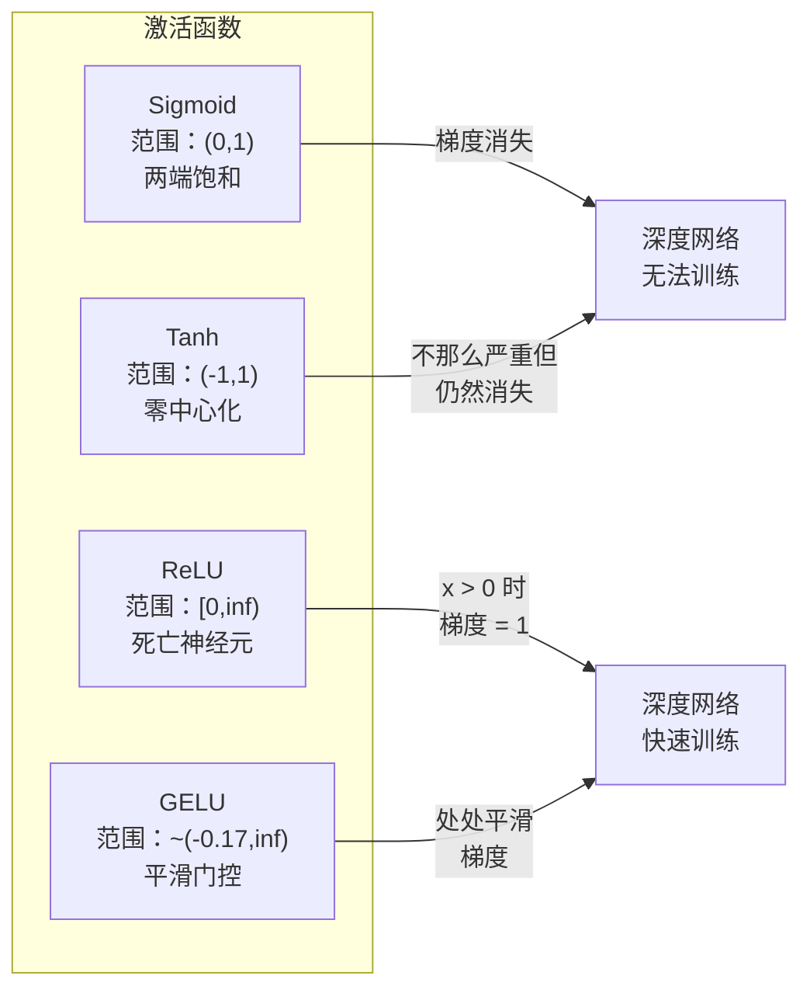
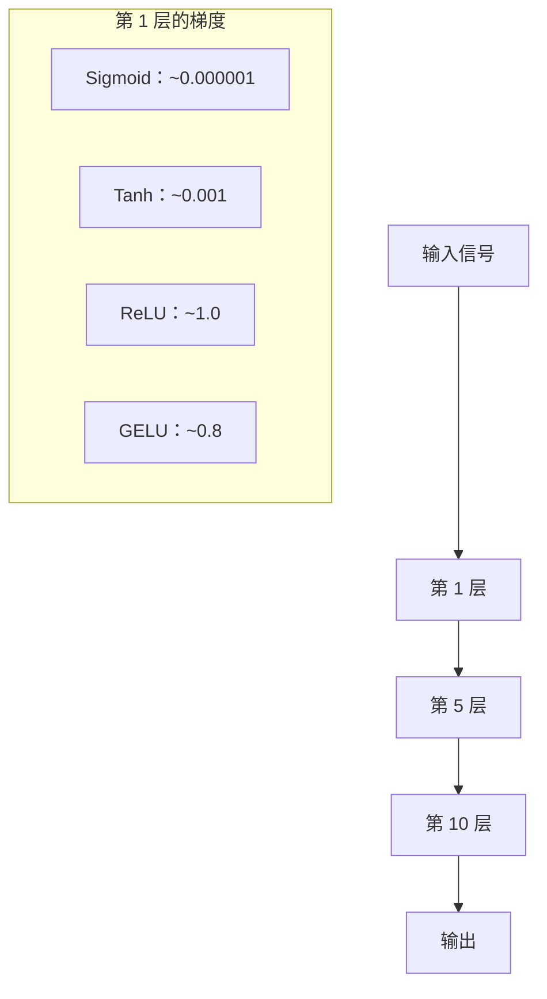
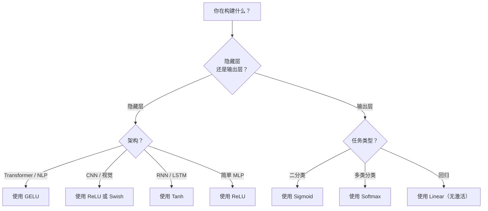

# 激活函数

> 没有非线性，你的 100 层网络只是一个花哨的矩阵乘法。激活函数（Activation Functions）是让神经网络用曲线思考的门。

**类型：** 构建
**语言：** Python
**前置条件：** 第 03.03 课（反向传播）
**时间：** ~75 分钟

## 学习目标

- 从零开始实现 sigmoid、tanh、ReLU、Leaky ReLU、GELU、Swish 和 softmax 及其导数
- 通过测量不同激活函数在 10+ 层中的激活幅度来诊断梯度消失（vanishing gradient）问题
- 检测 ReLU 网络中的死亡神经元（dead neurons），并解释为什么 GELU 避免了这种失败模式
- 为给定架构（transformer、CNN、RNN、输出层）选择正确的激活函数

## 问题

堆叠两个线性变换：y = W2(W1x + b1) + b2。展开它：y = W2W1x + W2b1 + b2。那只是 y = Ax + c——一个单一的线性变换。无论你堆叠多少线性层，结果都坍缩为一个矩阵乘法。你的 100 层网络与单层具有相同的表示能力。

这不是理论上的好奇心。这意味着深度线性网络字面上无法学习 XOR，无法分类螺旋数据集，无法识别人脸。没有激活函数，深度是一种幻觉。

激活函数打破线性。它们通过非线性函数扭曲每层的输出，赋予网络弯曲决策边界、逼近任意函数和实际学习的能力。但选择错误的激活函数，你的梯度会消失到零（深度网络中的 sigmoid）、爆炸到无穷大（没有仔细初始化的无界激活函数），或者你的神经元永久死亡（具有大负偏置的 ReLU）。激活函数的选择直接决定你的网络是否能学习。

## 概念

### 为什么非线性是必要的

矩阵乘法是可组合的。将向量乘以矩阵 A 然后乘以矩阵 B 等同于乘以 AB。这意味着堆叠十个线性层在数学上等同于一个具有一个大矩阵的线性层。所有这些参数，所有这些深度——都浪费了。你需要一些东西来打破链条。这就是激活函数所做的。

以下是证明。一个线性层计算 f(x) = Wx + b。堆叠两个：

```
第 1 层：h = W1 * x + b1
第 2 层：y = W2 * h + b2
```

代入：

```
y = W2 * (W1 * x + b1) + b2
y = (W2 * W1) * x + (W2 * b1 + b2)
y = A * x + c
```

一层。在层之间插入非线性激活 g()：

```
h = g(W1 * x + b1)
y = W2 * h + b2
```

现在代入被打破了。W2 * g(W1 * x + b1) + b2 不能被简化为单个线性变换。网络可以表示非线性函数。每个带有激活的额外层都增加了表示能力。

### Sigmoid

神经网络最初的激活函数。

```
sigmoid(x) = 1 / (1 + e^(-x))
```

输出范围：(0, 1)。平滑、可微，将任何实数映射到类似概率的值。

导数：

```
sigmoid'(x) = sigmoid(x) * (1 - sigmoid(x))
```

此导数的最大值为 0.25，出现在 x = 0 处。在反向传播中，梯度在各层之间相乘。十层 sigmoid 意味着梯度最多被乘以 0.25 十次：

```
0.25^10 = 0.000000953674
```

不到原始信号的百万分之一。这就是梯度消失问题。早期层的梯度变得如此之小，以至于权重几乎不更新。网络看起来在学习——损失在后面的层中下降——但前面的层被冻结了。深度 sigmoid 网络根本无法训练。

额外问题：sigmoid 输出始终为正（0 到 1），这意味着权重的梯度始终具有相同的符号。这在梯度下降期间导致锯齿形（zig-zagging）运动。

### Tanh

Sigmoid 的中心化版本。

```
tanh(x) = (e^x - e^(-x)) / (e^x + e^(-x))
```

输出范围：(-1, 1)。零中心化（zero-centered），消除了锯齿形问题。

导数：

```
tanh'(x) = 1 - tanh(x)^2
```

最大导数为 1.0（在 x = 0 处）——比 sigmoid 好四倍。但梯度消失问题仍然存在。对于大的正或负输入，导数接近零。十层仍然会压碎梯度，只是不那么剧烈。

### ReLU：突破

修正线性单元（Rectified Linear Unit）。由 Nair 和 Hinton 在 2010 年推广用于深度学习（该函数本身可追溯到 Fukushima 1969 年的工作），它改变了一切。

```
relu(x) = max(0, x)
```

输出范围：[0, 无穷大)。导数极其简单：

```
relu'(x) = 1  如果 x > 0
           0  如果 x <= 0
```

正输入没有梯度消失。梯度恰好为 1，直接传递。这就是深度网络变得可训练的原因——ReLU 在各层之间保持梯度幅度。

但有一个失败模式：死亡神经元问题（dead neuron problem）。如果一个神经元的加权输入始终为负（由于大的负偏置或不幸的权重初始化），其输出始终为零，其梯度始终为零，并且它永远不会更新。它永久死亡。在实践中，ReLU 网络中 10-40% 的神经元可能在训练期间死亡。

### Leaky ReLU

对死亡神经元最简单的修复。

```
leaky_relu(x) = x        如果 x > 0
                alpha * x 如果 x <= 0
```

其中 alpha 是一个小常数，通常为 0.01。负侧有一个小斜率而不是零，因此死亡神经元仍然获得梯度信号并可以恢复。

### GELU：现代默认值

高斯误差线性单元（Gaussian Error Linear Unit）。由 Hendrycks 和 Gimpel 在 2016 年引入。BERT、GPT 和大多数现代 transformer 中的默认激活函数。

```
gelu(x) = x * Phi(x)
```

其中 Phi(x) 是标准正态分布的累积分布函数（cumulative distribution function）。实践中使用的近似：

```
gelu(x) ~= 0.5 * x * (1 + tanh(sqrt(2/pi) * (x + 0.044715 * x^3)))
```

GELU 处处平滑，允许小的负值（不像 ReLU 那样硬截断为零），并具有概率解释：它根据输入在高斯分布下为正的可能性对每个输入进行加权。这种平滑门控（smooth gating）在 transformer 架构中优于 ReLU，因为它提供更好的梯度流并完全避免了死亡神经元问题。

### Swish / SiLU

由 Ramachandran 等人在 2017 年通过自动搜索发现的自门控激活函数。

```
swish(x) = x * sigmoid(x)
```

Swish 正式是 x * sigmoid(x)。Google 通过对激活函数空间的自动搜索发现了它——神经网络设计神经网络的部分。

像 GELU 一样，它是平滑的、非单调的，并允许小的负值。区别很微妙：Swish 使用 sigmoid 进行门控，而 GELU 使用高斯 CDF。在实践中，性能几乎相同。Swish 用于 EfficientNet 和一些视觉模型。GELU 在语言模型中占主导地位。

### Softmax：输出激活

不在隐藏层中使用。Softmax 将原始分数（logits）向量转换为概率分布。

```
softmax(x_i) = e^(x_i) / sum(e^(x_j) for all j)
```

每个输出在 0 和 1 之间。所有输出之和为 1。这使其成为多类分类的标准最终激活函数。最大的 logit 获得最高的概率，但与 argmax 不同，softmax 是可微的并保留有关相对置信度的信息。

### 形状比较



### 梯度流比较



### 何时使用哪种激活函数



## 构建它

### 步骤 1：实现所有激活函数及其导数

每个函数接收一个浮点数并返回一个浮点数。每个导数函数接收相同的输入并返回梯度。

```python
import math

def sigmoid(x):
    x = max(-500, min(500, x))
    return 1.0 / (1.0 + math.exp(-x))

def sigmoid_derivative(x):
    s = sigmoid(x)
    return s * (1 - s)

def tanh_act(x):
    return math.tanh(x)

def tanh_derivative(x):
    t = math.tanh(x)
    return 1 - t * t

def relu(x):
    return max(0.0, x)

def relu_derivative(x):
    return 1.0 if x > 0 else 0.0

def leaky_relu(x, alpha=0.01):
    return x if x > 0 else alpha * x

def leaky_relu_derivative(x, alpha=0.01):
    return 1.0 if x > 0 else alpha

def gelu(x):
    return 0.5 * x * (1 + math.tanh(math.sqrt(2 / math.pi) * (x + 0.044715 * x ** 3)))

def gelu_derivative(x):
    phi = 0.5 * (1 + math.erf(x / math.sqrt(2)))
    pdf = math.exp(-0.5 * x * x) / math.sqrt(2 * math.pi)
    return phi + x * pdf

def swish(x):
    return x * sigmoid(x)

def swish_derivative(x):
    s = sigmoid(x)
    return s + x * s * (1 - s)

def softmax(xs):
    max_x = max(xs)
    exps = [math.exp(x - max_x) for x in xs]
    total = sum(exps)
    return [e / total for e in exps]
```

### 步骤 2：可视化梯度消失的位置

在从 -5 到 5 的 100 个均匀间隔点上计算梯度。打印文本直方图，显示每个激活函数的梯度在何处接近零。

```python
def gradient_scan(name, derivative_fn, start=-5, end=5, n=100):
    step = (end - start) / n
    near_zero = 0
    healthy = 0
    for i in range(n):
        x = start + i * step
        g = derivative_fn(x)
        if abs(g) < 0.01:
            near_zero += 1
        else:
            healthy += 1
    pct_dead = near_zero / n * 100
    print(f"{name:15s}: {healthy:3d} 健康, {near_zero:3d} 接近零 ({pct_dead:.0f}% 死区)")

gradient_scan("Sigmoid", sigmoid_derivative)
gradient_scan("Tanh", tanh_derivative)
gradient_scan("ReLU", relu_derivative)
gradient_scan("Leaky ReLU", leaky_relu_derivative)
gradient_scan("GELU", gelu_derivative)
gradient_scan("Swish", swish_derivative)
```

### 步骤 3：梯度消失实验

使用 sigmoid vs ReLU 将信号前向传播通过 N 层。测量激活幅度如何变化。

```python
import random

def vanishing_gradient_experiment(activation_fn, name, n_layers=10, n_inputs=5):
    random.seed(42)
    values = [random.gauss(0, 1) for _ in range(n_inputs)]

    print(f"\n{name} 通过 {n_layers} 层：")
    for layer in range(n_layers):
        weights = [random.gauss(0, 1) for _ in range(n_inputs)]
        z = sum(w * v for w, v in zip(weights, values))
        activated = activation_fn(z)
        magnitude = abs(activated)
        bar = "#" * int(magnitude * 20)
        print(f"  第 {layer+1:2d} 层：幅度 = {magnitude:.6f} {bar}")
        values = [activated] * n_inputs

vanishing_gradient_experiment(sigmoid, "Sigmoid")
vanishing_gradient_experiment(relu, "ReLU")
vanishing_gradient_experiment(gelu, "GELU")
```

### 步骤 4：死亡神经元检测器

创建一个 ReLU 网络，通过它传递随机输入，计算有多少神经元从未激活。

```python
def dead_neuron_detector(n_inputs=5, hidden_size=20, n_samples=1000):
    random.seed(0)
    weights = [[random.gauss(0, 1) for _ in range(n_inputs)] for _ in range(hidden_size)]
    biases = [random.gauss(-2, 1) for _ in range(hidden_size)]  # 故意负偏置

    fired = [0] * hidden_size
    for _ in range(n_samples):
        inputs = [random.gauss(0, 1) for _ in range(n_inputs)]
        for i in range(hidden_size):
            z = sum(w * x for w, x in zip(weights[i], inputs)) + biases[i]
            if relu(z) > 0:
                fired[i] += 1

    dead = sum(1 for f in fired if f == 0)
    low_activity = sum(1 for f in fired if f < n_samples * 0.01)

    print(f"隐藏层大小：{hidden_size}")
    print(f"死亡神经元（从未激活）：{dead} ({dead/hidden_size*100:.1f}%)")
    print(f"低活动神经元（<1% 的样本）：{low_activity} ({low_activity/hidden_size*100:.1f}%)")

    for i, f in enumerate(fired):
        if f == 0:
            print(f"  神经元 {i}: 死亡（偏置 = {biases[i]:.3f}）")

dead_neuron_detector()
```

## 使用它

PyTorch 在 `torch.nn.functional` 中提供了所有这些激活函数：

```python
import torch
import torch.nn.functional as F

x = torch.randn(3, 5)

# 隐藏层激活
gelu_out = F.gelu(x)
relu_out = F.relu(x)
swish_out = F.silu(x)  # PyTorch 称 Swish 为 SiLU

# 输出层激活
probs = F.softmax(x, dim=-1)
binary_out = torch.sigmoid(x)
```

`F.gelu` 使用 tanh 近似（与你从零开始构建的相同）。`F.silu` 是 Swish。`F.softmax` 沿指定维度归一化。

## 发布它

本课生成一个可复用的提示词，用于选择激活函数：

- `outputs/prompt-activation-selector.md`

当你需要为给定架构和任务选择正确的激活函数时使用它。

## 练习

1. 实现 Parametric ReLU (PReLU)：leaky_relu，其中 alpha 是可学习的参数。写出前向和反向传播方程。

2. 在 20 层网络上比较 ReLU 和 GELU。测量每层之后梯度的 L2 范数。哪个更好地保持梯度幅度？

3. 实现 ELU（指数线性单元）：如果 x > 0 返回 x，否则返回 alpha * (exp(x) - 1)。其相对于 Leaky ReLU 的优势是什么？

4. 使用 softmax 将 logits [2.0, 1.0, 0.1] 转换为概率。将第一个 logit 加倍到 4.0。概率如何变化？这告诉你关于 softmax 的什么？

5. 训练两个相同的网络，一个使用 ReLU，一个使用 GELU，在 MNIST 上训练 5 个 epoch。比较最终准确率和死亡神经元的百分比。

## 关键术语

| 术语 | 人们怎么说 | 实际含义 |
|------|-----------|---------|
| 激活函数 | "非线性" | 应用于每层输出的函数，使网络能够学习曲线而非直线 |
| 梯度消失 | "网络停止学习" | 当梯度在反向传播通过许多层时呈指数级缩小，早期层接收不到学习信号 |
| 死亡神经元 | "ReLU 坏了" | 一个始终输出零的神经元，梯度为零，永远不会更新。在 ReLU 网络中常见 |
| 饱和 | "激活函数卡住了" | 当输入幅度很大时，sigmoid/tanh 的导数接近零。梯度无法通过 |
| 门控 | "软开关" | GELU/Swish 根据输入值平滑地在传递和抑制之间过渡，而不是硬截断 |
| Logits | "原始分数" | Softmax 之前的未归一化输出。可以是任何实数。Softmax 将它们转换为概率 |
