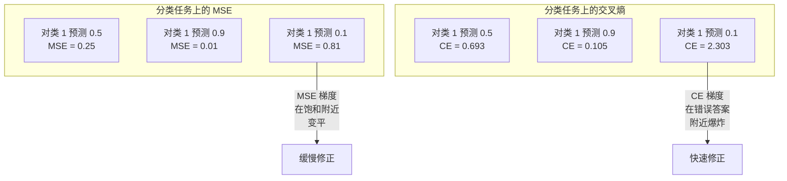
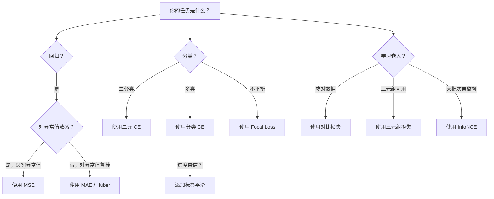
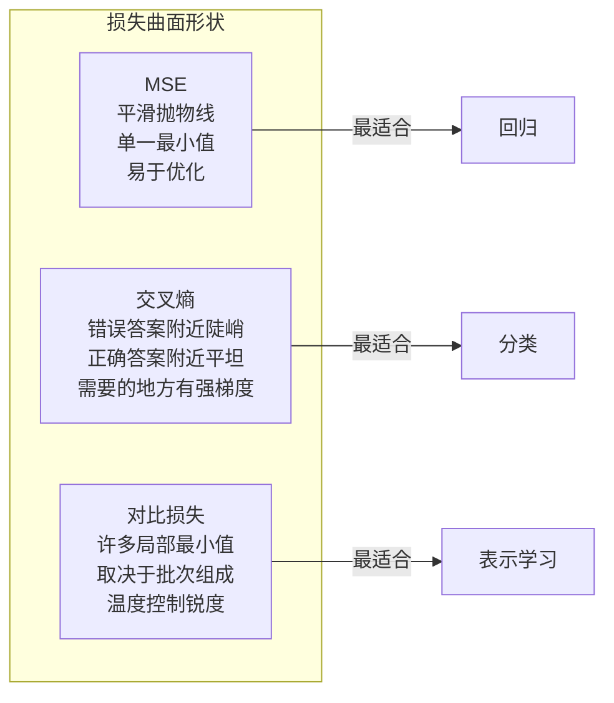

# 损失函数

> 你的网络做出预测。真实标签说不是这样。它错得有多离谱？那个数字就是损失（Loss）。选错损失函数，你的模型就会优化完全错误的东西。

**类型：** 构建
**语言：** Python
**前置条件：** 第 03.04 课（激活函数）
**时间：** ~75 分钟

## 学习目标

- 从零开始实现 MSE、二元交叉熵（binary cross-entropy）、分类交叉熵（categorical cross-entropy）和对比损失（contrastive loss / InfoNCE）及其梯度
- 通过演示"对所有输入预测 0.5"的失败模式，解释为什么 MSE 在分类任务中失败
- 对交叉熵应用标签平滑（label smoothing），并描述它如何防止过度自信的预测
- 为回归、二分类、多类分类和嵌入学习（embedding learning）任务选择正确的损失函数

## 问题

一个在分类问题上最小化 MSE 的模型会自信地对所有输入预测 0.5。它在最小化损失。它也是无用的。

损失函数是你的模型实际优化的唯一东西。不是准确率。不是 F1 分数。不是你向经理报告的任何指标。优化器取损失函数的梯度并调整权重使那个数字变小。如果损失函数不能捕获你关心的东西，模型会找到数学上最便宜的方式来满足它，而那种方式几乎从来不是你想要的。

这是一个具体例子。你有一个二分类任务。两个类，50/50 分布。你使用 MSE 作为损失。模型对每个输入都预测 0.5。平均 MSE 是 0.25，这是不实际学习任何东西的情况下的最小值。模型具有零判别能力，但它在技术上最小化了你的损失函数。切换到交叉熵，同一个模型被迫将预测推向 0 或 1，因为 -log(0.5) = 0.693 是一个糟糕的损失，而 -log(0.99) = 0.01 奖励自信的正确预测。损失函数的选择是学习模型和玩弄指标的模型之间的区别。

更糟的是。在自监督学习（self-supervised learning）中，你甚至没有标签。对比损失完全定义了学习信号：什么算相似，什么算不同，以及模型应该把它们推多远。对比损失搞错了，你的嵌入（embeddings）会坍缩到一个点——每个输入映射到相同的向量。技术上损失为零。完全毫无价值。

## 概念

### 均方误差（MSE）

回归的默认选择。计算预测和目标之间的平方差，对所有样本取平均。

```
MSE = (1/n) * sum((y_pred - y_true)^2)
```

为什么平方很重要：它以二次方惩罚大误差。误差为 2 的成本是误差为 1 的 4 倍。误差为 10 的成本是 100 倍。这使得 MSE 对异常值（outliers）敏感——一个完全错误的预测会主导损失。

实际数字：如果你的模型预测房价，大多数房子差 $10,000，但一栋豪宅差 $200,000，MSE 会激进地试图修复那栋豪宅，可能损害其他 99 栋房子的性能。

MSE 相对于预测的梯度是：

```
dMSE/dy_pred = (2/n) * (y_pred - y_true)
```

与误差成线性关系。更大的误差获得更大的梯度。这对回归是特性（大误差需要大修正），对分类是缺陷（你想以指数方式而非线性方式惩罚自信的错误答案）。

### 交叉熵损失

分类的损失函数。根植于信息论——它衡量预测概率分布与真实分布之间的差异。

**二元交叉熵（BCE）：**

```
BCE = -(y * log(p) + (1 - y) * log(1 - p))
```

其中 y 是真实标签（0 或 1），p 是预测概率。

为什么 -log(p) 有效：当真实标签为 1 且你预测 p = 0.99 时，损失是 -log(0.99) = 0.01。当你预测 p = 0.01 时，损失是 -log(0.01) = 4.6。这 460 倍的差异就是交叉熵有效的原因。它残酷地惩罚自信的错误预测，同时几乎不惩罚自信的正确预测。

梯度讲述了同样的故事：

```
dBCE/dp = -(y/p) + (1-y)/(1-p)
```

当 y = 1 且 p 接近零时，梯度是 -1/p，趋近负无穷。模型获得巨大的信号来修复其错误。当 p 接近 1 时，梯度很小。已经正确，无需修复。

**分类交叉熵：**

用于具有 one-hot 编码目标的多类分类。

```
CCE = -sum(y_i * log(p_i))
```

只有真实类对损失有贡献（因为所有其他 y_i 为零）。如果有 10 个类且正确类获得概率 0.1（随机猜测），损失是 -log(0.1) = 2.3。如果正确类获得概率 0.9，损失是 -log(0.9) = 0.105。模型学会将概率质量集中在正确答案上。

### 为什么 MSE 在分类中失败



MSE 梯度在预测接近 0 或 1 时变平（由于 sigmoid 饱和）。交叉熵梯度补偿了这一点——-log 抵消了 sigmoid 的平坦区域，在最需要的地方给出强梯度。

### 标签平滑

标准 one-hot 标签说"这 100% 是类 3，其他都是 0%。"这是一个强烈的声明。标签平滑软化它：

```
smooth_label = (1 - alpha) * one_hot + alpha / num_classes
```

当 alpha = 0.1 且有 10 个类时：目标变为 [0.01, 0.01, 0.91, 0.01, ...] 而不是 [0, 0, 1, 0, ...]。模型目标是 0.91 而不是 1.0。

为什么这有效：试图通过 softmax 输出恰好 1.0 的模型需要将 logits 推到无穷大。这导致过度自信（overconfidence），损害泛化能力，并使模型对分布偏移（distribution shift）脆弱。标签平滑将目标上限设为 0.9（当 alpha=0.1 时），将 logits 保持在合理范围内。GPT 和大多数现代模型使用标签平滑或其等价方法。

### 对比损失

没有标签。没有类别。只有输入对和一个问题：这些是相似还是不同？

**SimCLR 风格的对比损失（NT-Xent / InfoNCE）：**

取一张图片。创建它的两个增强视图（裁剪、旋转、颜色抖动）。这些是"正样本对"——它们应该有相似的嵌入。批次中的每张其他图片形成"负样本对"——它们应该有不同的嵌入。

```
L = -log(exp(sim(z_i, z_j) / tau) / sum(exp(sim(z_i, z_k) / tau)))
```

其中 sim() 是余弦相似度（cosine similarity），z_i 和 z_j 是正样本对，求和覆盖所有负样本，tau（温度，temperature）控制分布的锐度。更低的温度 = 更难的负样本 = 更激进的分离。

实际数字：批次大小 256 意味着每个正样本对有 255 个负样本。温度 tau = 0.07（SimCLR 默认值）。损失看起来像相似度上的 softmax——它希望正样本对的相似度在所有 256 个选项中最高。

**三元组损失（Triplet Loss）：**

接收三个输入：锚点（anchor）、正样本（同类）、负样本（不同类）。

```
L = max(0, d(anchor, positive) - d(anchor, negative) + margin)
```

间隔（margin，通常 0.2-1.0）强制正负样本距离之间的最小差距。如果负样本已经足够远，损失为零——没有梯度，没有更新。这使训练高效，但需要仔细的三元组挖掘（triplet mining，选择靠近锚点的困难负样本）。

### Focal Loss

用于不平衡数据集。标准交叉熵对所有正确分类的样本一视同仁。Focal loss 降低简单样本的权重：

```
FL = -alpha * (1 - p_t)^gamma * log(p_t)
```

其中 p_t 是真实类的预测概率，gamma 控制聚焦程度。当 gamma = 0 时，这是标准交叉熵。当 gamma = 2（默认值）时：

- 简单样本（p_t = 0.9）：权重 = (0.1)^2 = 0.01。实际上被忽略。
- 困难样本（p_t = 0.1）：权重 = (0.9)^2 = 0.81。完整的梯度信号。

Focal loss 由 Lin 等人为目标检测引入，其中 99% 的候选区域是背景（简单负样本）。没有 focal loss，模型淹没在简单背景样本中，永远学不会检测物体。有了它，模型将其能力集中在重要的困难、模糊案例上。

### 损失函数决策树



### 损失景观



## 构建它

### 步骤 1：MSE 及其梯度

```python
def mse(predictions, targets):
    n = len(predictions)
    total = 0.0
    for p, t in zip(predictions, targets):
        total += (p - t) ** 2
    return total / n

def mse_gradient(predictions, targets):
    n = len(predictions)
    grads = []
    for p, t in zip(predictions, targets):
        grads.append(2.0 * (p - t) / n)
    return grads
```

### 步骤 2：二元交叉熵

log(0) 问题是真实存在的。如果模型对正样本预测恰好为 0，log(0) = 负无穷。裁剪防止了这一点。

```python
import math

def binary_cross_entropy(predictions, targets, eps=1e-15):
    n = len(predictions)
    total = 0.0
    for p, t in zip(predictions, targets):
        p_clipped = max(eps, min(1 - eps, p))
        total += -(t * math.log(p_clipped) + (1 - t) * math.log(1 - p_clipped))
    return total / n

def bce_gradient(predictions, targets, eps=1e-15):
    grads = []
    for p, t in zip(predictions, targets):
        p_clipped = max(eps, min(1 - eps, p))
        grads.append(-(t / p_clipped) + (1 - t) / (1 - p_clipped))
    return grads
```

### 步骤 3：带 Softmax 的分类交叉熵

Softmax 将原始 logits 转换为概率。然后我们计算相对于 one-hot 目标的交叉熵。

```python
def softmax(logits):
    max_val = max(logits)
    exps = [math.exp(x - max_val) for x in logits]
    total = sum(exps)
    return [e / total for e in exps]

def categorical_cross_entropy(logits, target_index, eps=1e-15):
    probs = softmax(logits)
    p = max(eps, probs[target_index])
    return -math.log(p)

def cce_gradient(logits, target_index):
    probs = softmax(logits)
    grads = list(probs)
    grads[target_index] -= 1.0
    return grads
```

softmax + 交叉熵的梯度优雅地简化：对于真实类，就是（预测概率 - 1），对于所有其他类，就是（预测概率）。这种优雅的简化不是巧合——这就是为什么 softmax 和交叉熵配对使用。

### 步骤 4：标签平滑

```python
def label_smoothed_cce(logits, target_index, num_classes, alpha=0.1, eps=1e-15):
    probs = softmax(logits)
    loss = 0.0
    for i in range(num_classes):
        if i == target_index:
            smooth_target = 1.0 - alpha + alpha / num_classes
        else:
            smooth_target = alpha / num_classes
        p = max(eps, probs[i])
        loss += -smooth_target * math.log(p)
    return loss
```

### 步骤 5：对比损失（简化版 InfoNCE）

```python
def cosine_similarity(a, b):
    dot = sum(ai * bi for ai, bi in zip(a, b))
    norm_a = math.sqrt(sum(ai * ai for ai in a))
    norm_b = math.sqrt(sum(bi * bi for bi in b))
    return dot / (norm_a * norm_b + 1e-8)

def info_nce_loss(embeddings, temperature=0.07):
    n = len(embeddings)
    loss = 0.0
    for i in range(0, n, 2):
        zi = embeddings[i]
        zj = embeddings[i + 1]
        pos_sim = math.exp(cosine_similarity(zi, zj) / temperature)

        neg_sum = 0.0
        for k in range(n):
            if k != i and k != i + 1:
                neg_sum += math.exp(cosine_similarity(zi, embeddings[k]) / temperature)

        loss += -math.log(pos_sim / (pos_sim + neg_sum + 1e-8))

    return loss / (n // 2)
```

### 步骤 6：损失函数对决

在相同的二分类数据上比较 MSE 和 BCE。观察 MSE 如何停滞而 BCE 收敛。

```python
import random

random.seed(42)

# 生成简单的二分类数据
data = []
for _ in range(100):
    x = random.uniform(-2, 2)
    label = 1.0 if x > 0 else 0.0
    data.append((x, label))

# 简单模型：单个 sigmoid 权重
def predict(x, w, b):
    z = w * x + b
    z = max(-500, min(500, z))
    return 1.0 / (1.0 + math.exp(-z))

# 使用 MSE 训练
w_mse, b_mse = 0.0, 0.0
print("使用 MSE 训练：")
for epoch in range(100):
    total_loss = 0.0
    for x, y in data:
        p = predict(x, w_mse, b_mse)
        total_loss += (p - y) ** 2
        grad = 2 * (p - y) * p * (1 - p)
        w_mse -= 0.1 * grad * x
        b_mse -= 0.1 * grad
    if epoch % 20 == 0:
        print(f"  Epoch {epoch}: loss = {total_loss/len(data):.4f}")

# 使用 BCE 训练
w_bce, b_bce = 0.0, 0.0
print("\n使用 BCE 训练：")
for epoch in range(100):
    total_loss = 0.0
    for x, y in data:
        p = predict(x, w_bce, b_bce)
        p = max(1e-15, min(1 - 1e-15, p))
        total_loss += -(y * math.log(p) + (1 - y) * math.log(1 - p))
        grad = (p - y)
        w_bce -= 0.1 * grad * x
        b_bce -= 0.1 * grad
    if epoch % 20 == 0:
        print(f"  Epoch {epoch}: loss = {total_loss/len(data):.4f}")
```

## 使用它

PyTorch 在 `torch.nn` 中提供了所有这些损失函数：

```python
import torch
import torch.nn as nn

# 回归
mse = nn.MSELoss()

# 二分类
bce = nn.BCELoss()  # 输入必须是概率
bce_logits = nn.BCEWithLogitsLoss()  # 输入是 logits（数值更稳定）

# 多类分类
cce = nn.CrossEntropyLoss()  # 输入是 logits，内部包含 softmax
cce_smooth = nn.CrossEntropyLoss(label_smoothing=0.1)

# 对比学习
cosine = nn.CosineEmbeddingLoss()
triplet = nn.TripletMarginLoss(margin=1.0)
```

`BCEWithLogitsLoss` 在数值上比 sigmoid + BCELoss 更稳定——它在一个融合操作中处理 log-sum-exp 技巧。始终优先使用它而不是手动应用 sigmoid。

## 发布它

本课生成一个可复用的提示词，用于选择损失函数：

- `outputs/prompt-loss-selector.md`

当你需要为给定任务选择正确的损失函数时使用它。

## 练习

1. 实现 Huber 损失：对小于 delta 的误差使用 MSE，对更大的误差使用 MAE。在具有异常值的合成回归数据上将其与 MSE 进行比较。

2. 在具有 99% 负样本的不平衡二分类数据集上比较 BCE 和 Focal Loss。哪个收敛更快？哪个达到更好的 F1 分数？

3. 实现对比损失的梯度。验证当正样本相似度增加时梯度减小，当负样本相似度增加时梯度增大。

4. 使用标签平滑（alpha=0.0, 0.05, 0.1, 0.2）训练一个分类器。绘制 softmax 输出的最大概率的直方图。标签平滑如何改变置信度分布？

5. 在 MNIST 上训练一个模型，使用分类交叉熵。然后冻结权重，仅用三元组损失训练一个新的分类头。比较两种方法的嵌入质量。

## 关键术语

| 术语 | 人们怎么说 | 实际含义 |
|------|-----------|---------|
| 损失函数 | "模型优化的东西" | 衡量预测与真实值之间差异的函数。模型通过梯度下降最小化它 |
| 交叉熵 | "分类损失" | 衡量两个概率分布之间差异的信息论度量。对自信的错误预测惩罚极重 |
| 标签平滑 | "防止过度自信" | 将 one-hot 目标从 [0,0,1,0] 软化到 [0.01,0.01,0.91,0.01]，防止模型将 logits 推到无穷大 |
| 对比损失 | "无标签学习" | 通过将相似对拉近、不相似对推远来学习嵌入的损失函数 |
| 温度 | "锐度控制" | 对比损失中缩放相似度的参数。更低的值使分布更尖锐，创造更难的负样本 |
| Focal Loss | "不平衡数据的损失" | 降低已正确分类样本权重的交叉熵变体，将训练聚焦在困难样本上 |
