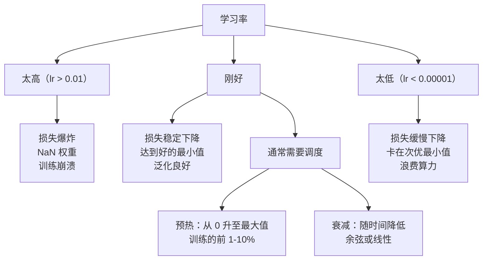
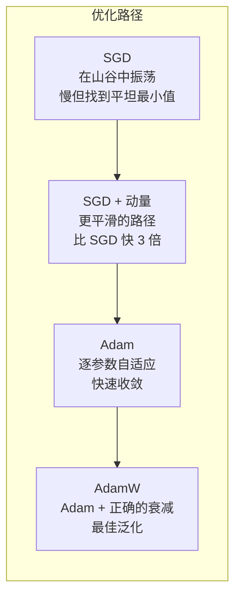
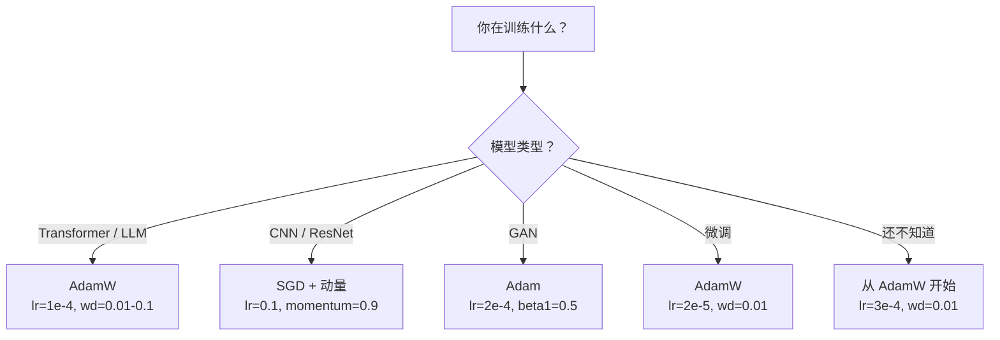

# 优化器

> 梯度下降告诉你该往哪个方向走。它完全不告诉你走多远或多快。SGD 是指南针。Adam 是带交通数据的 GPS。

**类型：** 构建
**语言：** Python
**前置条件：** 第 03.05 课（损失函数）
**时间：** ~75 分钟

## 学习目标

- 从零开始用 Python 实现 SGD、带动量的 SGD、Adam 和 AdamW 优化器
- 解释 Adam 的偏差修正（bias correction）如何在训练早期步骤中补偿零初始化的矩估计
- 证明为什么 AdamW 在相同任务上比带 L2 正则化的 Adam 产生更好的泛化
- 为 transformer、CNN、GAN 和微调选择适当的优化器和默认超参数

## 问题

你计算了梯度。你知道权重 #4,721 应该减少 0.003 以降低损失。但 0.003 是什么单位？按什么缩放？你应该在第 1 步和第 1,000 步移动相同的量吗？

普通梯度下降对每一步的每个参数应用相同的学习率：w = w - lr * gradient。这产生了三个在实践中使训练神经网络痛苦的问题。

第一，振荡（oscillation）。损失景观很少形状像光滑的碗。它更像一个又长又窄的山谷。梯度指向山谷的横向（陡峭方向），而不是纵向（浅方向）。梯度下降在窄维度上来回弹跳，而在有用的维度上进展微小。你见过这种情况：损失快速下降然后停滞，不是因为模型收敛了，而是因为它在振荡。

第二，对所有参数使用一个学习率是错误的。一些权重需要大的更新（它们处于早期欠拟合阶段）。其他权重需要微小的更新（它们接近最优值）。对前者有效的学习率会破坏后者，反之亦然。

第三，鞍点（saddle points）。在高维空间中，损失景观有大片梯度接近零的平坦区域。普通 SGD 以梯度的速度爬过这些区域，而梯度实际上为零。模型看起来卡住了。它没有卡住——它在一个平坦区域，另一侧有有用的下降。但 SGD 没有机制来推动通过。

Adam 解决了所有三个问题。它为每个参数维护两个运行平均值——平均梯度（动量，处理振荡）和平均平方梯度（自适应学习率，处理不同尺度）。结合前几步的偏差修正，它给你一个在 80% 的问题上使用默认超参数就能工作的单一优化器。本课从零开始构建它，让你准确理解它何时以及为什么在另外 20% 上失败。

## 概念

### 随机梯度下降（SGD）

最简单的优化器。在小批次（mini-batch）上计算梯度并朝相反方向迈步。

```
w = w - lr * gradient
```

"随机"意味着你使用数据的随机子集（小批次）来估计梯度，而不是完整数据集。这种噪声实际上是有用的——它有助于逃离尖锐的局部最小值。但噪声也会导致振荡。

学习率是唯一的旋钮。太高：损失发散。太低：训练永远进行。最优值取决于架构、数据、批次大小和训练的当前阶段。对于现代网络上的普通 SGD，典型值范围从 0.01 到 0.1。但即使在单次训练运行中，理想的学习率也会变化。

### 动量

球滚下山的类比被过度使用但是准确的。你不是仅按梯度迈步，而是维护一个累积过去梯度的速度（velocity）。

```
m_t = beta * m_{t-1} + gradient
w = w - lr * m_t
```

Beta（通常 0.9）控制保留多少历史。当 beta = 0.9 时，动量大约是最近 10 个梯度的平均值（1 / (1 - 0.9) = 10）。

为什么这能修复振荡：指向相同方向的梯度会累积。翻转方向的梯度会抵消。在那个窄山谷中，"横向"分量每步翻转符号并被衰减。"纵向"分量保持一致并被放大。结果是在有用方向上的平滑加速。

实际数字：在条件不良的损失景观上，单独的 SGD 可能需要 10,000 步。带动量的 SGD（beta=0.9）在相同问题上通常需要 3,000-5,000 步。加速不是微不足道的。

### RMSProp

第一个实际有效的逐参数自适应学习率方法。由 Hinton 在 Coursera 讲座中提出（从未正式发表）。

```
s_t = beta * s_{t-1} + (1 - beta) * gradient^2
w = w - lr * gradient / (sqrt(s_t) + epsilon)
```

s_t 追踪平方梯度的运行平均值。具有持续大梯度的参数被除以一个大数（更小的有效学习率）。具有小梯度的参数被除以一个小数（更大的有效学习率）。

这解决了"对所有参数使用一个学习率"的问题。一个已经获得大更新的权重可能接近其目标——减慢它。一个获得微小更新的权重可能训练不足——加速它。

Epsilon（通常 1e-8）防止参数未被更新时的除零错误。

### Adam：动量 + RMSProp

Adam 结合了两种思想。它为每个参数维护两个指数移动平均：

```
m_t = beta1 * m_{t-1} + (1 - beta1) * gradient        （一阶矩：均值）
v_t = beta2 * v_{t-1} + (1 - beta2) * gradient^2       （二阶矩：方差）
```

**偏差修正**是大多数解释跳过的关键细节。在第 1 步，m_1 = (1 - beta1) * gradient。当 beta1 = 0.9 时，那是 0.1 * gradient——小了十倍。移动平均还没有预热。偏差修正补偿了这一点：

```
m_hat = m_t / (1 - beta1^t)
v_hat = v_t / (1 - beta2^t)
```

在第 1 步，beta1 = 0.9：m_hat = m_1 / (1 - 0.9) = m_1 / 0.1 = 实际梯度。在第 100 步：(1 - 0.9^100) 约等于 1.0，所以修正消失。偏差修正对前约 10 步很重要，约 50 步后无关紧要。

更新：

```
w = w - lr * m_hat / (sqrt(v_hat) + epsilon)
```

Adam 默认值：lr = 0.001, beta1 = 0.9, beta2 = 0.999, epsilon = 1e-8。这些默认值对 80% 的问题有效。当它们无效时，首先改变 lr。然后改变 beta2。几乎从不改变 beta1 或 epsilon。

### AdamW：正确实现的权重衰减

L2 正则化将 lambda * w^2 加到损失中。在普通 SGD 中，这等价于权重衰减（weight decay，每步从权重中减去 lambda * w）。在 Adam 中，这种等价性被打破。

Loshchilov & Hutter 的洞察：当你将 L2 加到损失中，然后 Adam 处理梯度时，自适应学习率也会缩放正则化项。具有大梯度方差的参数获得更少的正则化。具有小方差的参数获得更多。这不是你想要的——你想要无论梯度统计如何都均匀的正则化。

AdamW 通过在 Adam 更新之后直接将权重衰减应用于权重来修复这一点：

```
w = w - lr * m_hat / (sqrt(v_hat) + epsilon) - lr * lambda * w
```

权重衰减项（lr * lambda * w）不被 Adam 的自适应因子缩放。每个参数获得相同的比例收缩。

这看起来像一个小细节。它不是。AdamW 在几乎每个任务上都比 Adam + L2 正则化收敛到更好的解。它是 PyTorch 中训练 transformer、扩散模型和大多数现代架构的默认优化器。BERT、GPT、LLaMA、Stable Diffusion——全部使用 AdamW 训练。

### 学习率：最重要的超参数



如果你只调一个超参数，就调学习率。学习率 10 倍的变化比你做出的任何架构决策都重要。常见默认值：

- SGD：lr = 0.01 到 0.1
- Adam/AdamW：lr = 1e-4 到 3e-4
- 微调预训练模型：lr = 1e-5 到 5e-5
- 学习率预热（warmup）：在前 1-10% 的步骤中线性上升

### 优化器比较



### 每种优化器何时胜出



## 构建它

### 步骤 1：普通 SGD

```python
class SGD:
    def __init__(self, lr=0.01):
        self.lr = lr

    def step(self, params, grads):
        for i in range(len(params)):
            params[i] -= self.lr * grads[i]
```

### 步骤 2：带动量的 SGD

```python
class SGDMomentum:
    def __init__(self, lr=0.01, beta=0.9):
        self.lr = lr
        self.beta = beta
        self.velocities = None

    def step(self, params, grads):
        if self.velocities is None:
            self.velocities = [0.0] * len(params)
        for i in range(len(params)):
            self.velocities[i] = self.beta * self.velocities[i] + grads[i]
            params[i] -= self.lr * self.velocities[i]
```

### 步骤 3：Adam

```python
import math

class Adam:
    def __init__(self, lr=0.001, beta1=0.9, beta2=0.999, epsilon=1e-8):
        self.lr = lr
        self.beta1 = beta1
        self.beta2 = beta2
        self.epsilon = epsilon
        self.m = None
        self.v = None
        self.t = 0

    def step(self, params, grads):
        if self.m is None:
            self.m = [0.0] * len(params)
            self.v = [0.0] * len(params)

        self.t += 1

        for i in range(len(params)):
            self.m[i] = self.beta1 * self.m[i] + (1 - self.beta1) * grads[i]
            self.v[i] = self.beta2 * self.v[i] + (1 - self.beta2) * grads[i] ** 2

            m_hat = self.m[i] / (1 - self.beta1 ** self.t)
            v_hat = self.v[i] / (1 - self.beta2 ** self.t)

            params[i] -= self.lr * m_hat / (math.sqrt(v_hat) + self.epsilon)
```

### 步骤 4：AdamW

```python
class AdamW:
    def __init__(self, lr=0.001, beta1=0.9, beta2=0.999, epsilon=1e-8, weight_decay=0.01):
        self.lr = lr
        self.beta1 = beta1
        self.beta2 = beta2
        self.epsilon = epsilon
        self.weight_decay = weight_decay
        self.m = None
        self.v = None
        self.t = 0

    def step(self, params, grads):
        if self.m is None:
            self.m = [0.0] * len(params)
            self.v = [0.0] * len(params)

        self.t += 1

        for i in range(len(params)):
            self.m[i] = self.beta1 * self.m[i] + (1 - self.beta1) * grads[i]
            self.v[i] = self.beta2 * self.v[i] + (1 - self.beta2) * grads[i] ** 2

            m_hat = self.m[i] / (1 - self.beta1 ** self.t)
            v_hat = self.v[i] / (1 - self.beta2 ** self.t)

            params[i] -= self.lr * m_hat / (math.sqrt(v_hat) + self.epsilon)
            params[i] -= self.lr * self.weight_decay * params[i]
```

### 步骤 5：训练比较

使用第 05 课的圆形数据集，用所有四种优化器训练相同的两层网络。比较收敛情况。

```python
import random

def sigmoid(x):
    x = max(-500, min(500, x))
    return 1.0 / (1.0 + math.exp(-x))

def make_circle_data(n=200, seed=42):
    random.seed(seed)
    data = []
    for _ in range(n):
        x = random.uniform(-2, 2)
        y = random.uniform(-2, 2)
        label = 1.0 if x * x + y * y < 1.5 else 0.0
        data.append(([x, y], label))
    return data


class OptimizerTestNetwork:
    def __init__(self, optimizer, hidden_size=8):
        random.seed(42)
        self.W1 = [[random.uniform(-1, 1) for _ in range(2)] for _ in range(hidden_size)]
        self.b1 = [0.0] * hidden_size
        self.W2 = [random.uniform(-1, 1) for _ in range(hidden_size)]
        self.b2 = 0.0
        self.optimizer = optimizer

    def forward(self, x):
        self.h = []
        for i in range(len(self.W1)):
            z = self.W1[i][0] * x[0] + self.W1[i][1] * x[1] + self.b1[i]
            self.h.append(sigmoid(z))

        z2 = sum(self.W2[i] * self.h[i] for i in range(len(self.h))) + self.b2
        self.output = sigmoid(z2)
        return self.output

    def compute_gradients(self, x, y):
        p = self.output
        d_output = 2 * (p - y) * p * (1 - p)

        dW2 = [d_output * self.h[i] for i in range(len(self.h))]
        db2 = d_output

        dW1 = []
        db1 = []
        for i in range(len(self.W1)):
            dh = d_output * self.W2[i]
            dz = dh * self.h[i] * (1 - self.h[i])
            dW1.append([dz * x[0], dz * x[1]])
            db1.append(dz)

        return dW1, db1, dW2, db2

    def train_step(self, x, y):
        self.forward(x)
        dW1, db1, dW2, db2 = self.compute_gradients(x, y)

        params = []
        grads = []
        for i in range(len(self.W1)):
            params.append(self.W1[i][0])
            grads.append(dW1[i][0])
            params.append(self.W1[i][1])
            grads.append(dW1[i][1])
            params.append(self.b1[i])
            grads.append(db1[i])
        for i in range(len(self.W2)):
            params.append(self.W2[i])
            grads.append(dW2[i])
        params.append(self.b2)
        grads.append(db2)

        self.optimizer.step(params, grads)

        idx = 0
        for i in range(len(self.W1)):
            self.W1[i][0] = params[idx]; idx += 1
            self.W1[i][1] = params[idx]; idx += 1
            self.b1[i] = params[idx]; idx += 1
        for i in range(len(self.W2)):
            self.W2[i] = params[idx]; idx += 1
        self.b2 = params[idx]


def compare_optimizers():
    data = make_circle_data()

    optimizers = {
        "SGD": SGD(lr=0.1),
        "SGD+Momentum": SGDMomentum(lr=0.1, beta=0.9),
        "Adam": Adam(lr=0.01),
        "AdamW": AdamW(lr=0.01, weight_decay=0.001),
    }

    for name, opt in optimizers.items():
        net = OptimizerTestNetwork(opt)
        losses = []
        for epoch in range(500):
            total_loss = 0.0
            for x, y in data:
                p = net.forward(x)
                total_loss += (p - y) ** 2
                net.train_step(x, y)
            losses.append(total_loss / len(data))
            if epoch % 100 == 0:
                print(f"  {name:15s} Epoch {epoch:3d}: loss = {total_loss/len(data):.6f}")
        print(f"  {name:15s} Final loss: {losses[-1]:.6f}")
        print()

compare_optimizers()
```

## 使用它

PyTorch 在 `torch.optim` 中提供了所有这些优化器：

```python
import torch
import torch.optim as optim

model = torch.nn.Linear(10, 1)

# SGD
sgd = optim.SGD(model.parameters(), lr=0.01)

# SGD + 动量
sgd_m = optim.SGD(model.parameters(), lr=0.01, momentum=0.9)

# Adam
adam = optim.Adam(model.parameters(), lr=0.001)

# AdamW（PyTorch 中 transformer 的默认选择）
adamw = optim.AdamW(model.parameters(), lr=0.001, weight_decay=0.01)

# 带预热的余弦退火学习率调度
scheduler = optim.lr_scheduler.CosineAnnealingLR(adamw, T_max=100)
```

`optim.AdamW` 实现了解耦的权重衰减（与你从零开始构建的完全相同）。`CosineAnnealingLR` 在 T_max 步内将学习率从初始值余弦衰减到零。

## 发布它

本课生成一个可复用的提示词，用于选择优化器：

- `outputs/prompt-optimizer-selector.md`

当你需要为给定模型和任务选择正确的优化器和超参数时使用它。

## 练习

1. 实现 Nesterov 加速梯度（NAG）：在计算梯度之前，先沿动量方向迈一步。将其与标准动量在相同问题上进行比较。

2. 在 Adam 中添加梯度裁剪（gradient clipping）：在更新之前将梯度的 L2 范数裁剪到最大值。在训练 RNN 时这为什么重要？

3. 实现学习率预热：在前 100 步将学习率从 0 线性增加到目标值。在 10 层网络上比较有预热和无预热的训练。

4. 在相同任务上比较 Adam 和 AdamW，使用不同的权重衰减值（0.0, 0.001, 0.01, 0.1）。绘制最终损失与权重衰减的关系。最佳值是多少？

5. 实现一个简单的学习率查找器：以指数增长的学习率训练一个 epoch，绘制损失与学习率的关系。找到损失下降最快的学习率。

## 关键术语

| 术语 | 人们怎么说 | 实际含义 |
|------|-----------|---------|
| 优化器 | "训练算法" | 使用梯度更新模型参数以最小化损失的算法 |
| 动量 | "平滑梯度" | 过去梯度的运行平均值，衰减振荡并加速一致方向 |
| 自适应学习率 | "每个参数有自己的学习率" | 根据历史梯度幅度为每个参数缩放学习率 |
| 偏差修正 | "Adam 的预热" | 在早期步骤中除以 (1 - beta^t) 以补偿零初始化的矩估计 |
| 权重衰减 | "L2 正则化" | 每步将权重向零缩小一个小因子，防止权重变得过大 |
| 学习率调度 | "随时间降低学习率" | 在训练过程中系统地降低学习率，以在后期细化权重 |
