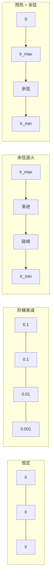
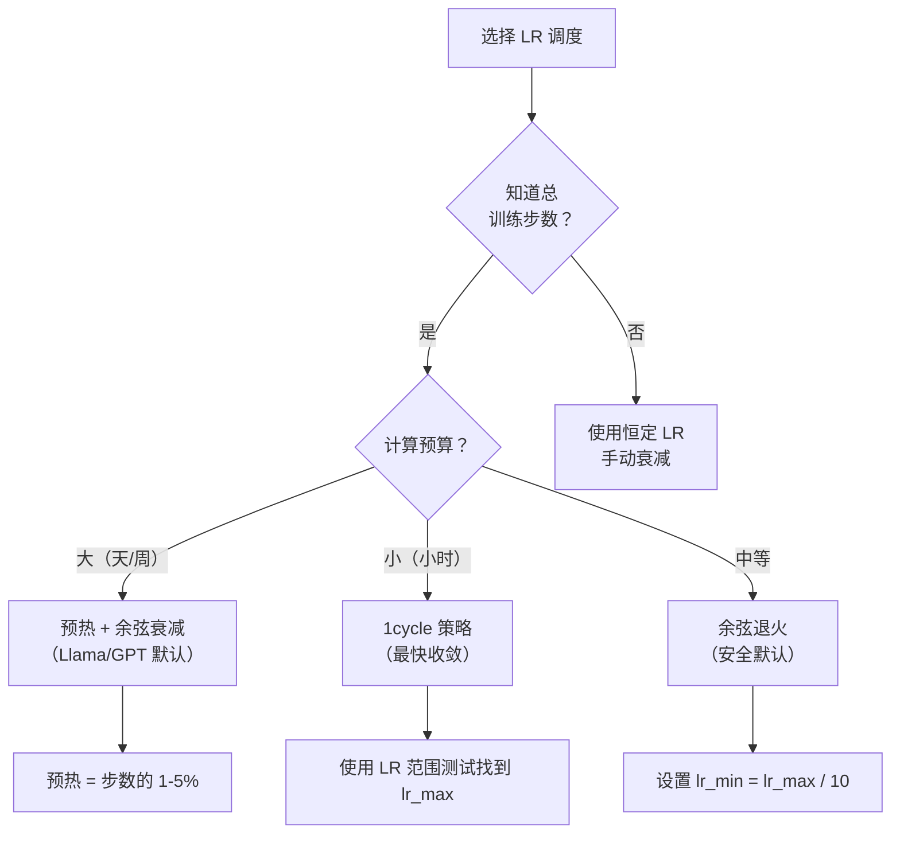
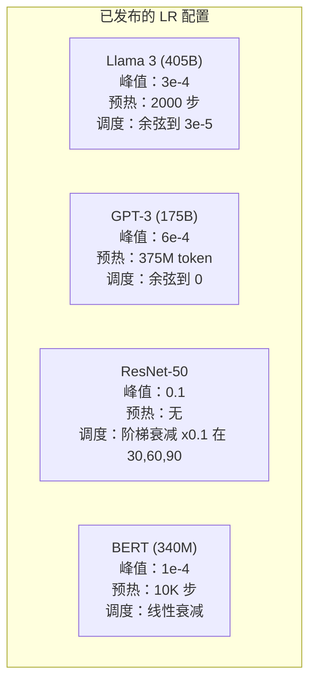

# 学习率调度与预热

> 学习率是最重要的超参数。不是架构。不是数据集大小。不是激活函数。是学习率。如果你什么都不调，就调这个。

**类型：** 构建
**语言：** Python
**前置条件：** 第 03.06 课（优化器），第 03.08 课（权重初始化）
**时间：** ~90 分钟

## 学习目标

- 从零开始实现恒定、阶梯衰减（step decay）、余弦退火（cosine annealing）、预热 + 余弦（warmup + cosine）和 1cycle 学习率调度
- 演示学习率选择的三种失败模式：发散（太高）、停滞（太低）和振荡（无衰减）
- 解释为什么预热对基于 Adam 的优化器是必要的，以及它如何稳定早期训练
- 在相同任务上比较所有五种调度的收敛速度，并为给定的训练预算选择适当的调度

## 问题

将学习率设为 0.1。训练发散——损失在 3 步内跳到无穷大。设为 0.0001。训练爬行——100 个 epoch 后，模型几乎没从随机移动。设为 0.01。训练有效 50 个 epoch，然后损失在它永远无法达到的最小值周围振荡，因为步长太大。

最优学习率不是常数。它在训练期间变化。早期，你想要大步长以快速覆盖地面。训练后期，你想要微小步长以沉降到尖锐的最小值。90% 准确率模型和 95% 准确率模型之间的区别通常只是调度。

过去三年发布的每个主要模型都使用学习率调度。Llama 3 使用峰值 lr=3e-4，2000 预热步，余弦衰减到 3e-5。GPT-3 使用 lr=6e-4，在 3.75 亿 token 上预热。这些不是任意选择。它们是花费数百万美元的广泛超参数扫描的结果。

你需要理解调度，因为默认值对你的问题无效。当你微调预训练模型时，正确的调度与从零开始训练不同。当你增加批次大小时，预热期需要改变。当训练在第 10,000 步中断时，你需要知道是调度问题还是其他问题。

## 概念

### 恒定学习率

最简单的方法。选一个数字，每一步都用它。

```
lr(t) = lr_0
```

很少是最优的。它要么对训练末期太高（在最小值周围振荡），要么对训练初期太低（在微小步长上浪费计算）。对小模型和调试有效。对任何训练超过一小时的东西都是糟糕的选择。

### 阶梯衰减

ResNet 时代的老派方法。在固定 epoch 将学习率削减一个因子（通常是 10 倍）。

```
lr(t) = lr_0 * gamma^(floor(epoch / step_size))
```

其中 gamma = 0.1 且 step_size = 30 意味着：lr 每 30 个 epoch 下降 10 倍。ResNet-50 使用这个——lr=0.1，在 epoch 30、60 和 90 下降 10 倍。

问题：最优衰减点取决于数据集和架构。换到不同的问题，你需要重新调整何时下降。转换是突变的——当学习率突然改变时，损失可能飙升。

### 余弦退火

从最大学习率到最小学习率的平滑衰减，遵循余弦曲线：

```
lr(t) = lr_min + 0.5 * (lr_max - lr_min) * (1 + cos(pi * t / T))
```

其中 t 是当前步，T 是总步数。

在 t=0 时，余弦项为 1，所以 lr = lr_max。在 t=T 时，余弦项为 -1，所以 lr = lr_min。衰减起初温和，在中间加速，在接近末尾时再次变得温和。

这是大多数现代训练运行的默认选择。除了 lr_max 和 lr_min 之外没有超参数需要调整。余弦形状匹配了经验观察：大多数学习发生在训练中期——你希望在那个关键时期有合理的步长。

### 预热：为什么从小开始

Adam 和其他自适应优化器维护梯度均值和方差的运行估计。在第 0 步，这些估计被初始化为零。前几个梯度更新基于垃圾统计。如果你在此期间学习率很大，模型会采取巨大的、方向错误的步骤。

预热修复了这一点。从一个微小的学习率开始（通常是 lr_max / warmup_steps 甚至零），并在前 N 步线性上升到 lr_max。到你达到完整学习率时，Adam 的统计量已经稳定。

```
lr(t) = lr_max * (t / warmup_steps)     对于 t < warmup_steps
```

典型预热：总训练步数的 1-5%。Llama 3 训练了约 1.8 万亿 token，预热了 2000 步。GPT-3 在 3.75 亿 token 上预热。

### 线性预热 + 余弦衰减

现代默认选择。线性上升，然后余弦衰减：

```
if t < warmup_steps:
    lr(t) = lr_max * (t / warmup_steps)
else:
    progress = (t - warmup_steps) / (total_steps - warmup_steps)
    lr(t) = lr_min + 0.5 * (lr_max - lr_min) * (1 + cos(pi * progress))
```

这是 Llama、GPT、PaLM 和大多数现代 transformer 使用的。预热防止早期不稳定。余弦衰减将模型沉降到好的最小值。

### 1cycle 策略

Leslie Smith 的发现（2018）：在训练的前半段将学习率从低值上升到高值，然后在后半段将其降回。反直觉——为什么你会在中途*增加*学习率？

理论：高学习率通过向优化轨迹添加噪声来充当正则化。模型在上升阶段探索更多的损失景观，找到更好的盆地。然后下降阶段在找到的最佳盆地内细化。

```
阶段 1（0 到 T/2）：lr 从 lr_max/25 上升到 lr_max
阶段 2（T/2 到 T）：lr 从 lr_max 下降到 lr_max/10000
```

对于固定的计算预算，1cycle 通常比余弦退火训练得更快。权衡：你必须提前知道总步数。

### 调度形状



### 决策流程图



### 已发布模型的实际数字



## 构建它

### 步骤 1：调度函数

每个函数接收当前步并返回该步的学习率。

```python
import math


def constant_schedule(step, lr=0.01, **kwargs):
    return lr


def step_decay_schedule(step, lr=0.1, step_size=100, gamma=0.1, **kwargs):
    return lr * (gamma ** (step // step_size))


def cosine_schedule(step, lr=0.01, total_steps=1000, lr_min=1e-5, **kwargs):
    if step >= total_steps:
        return lr_min
    return lr_min + 0.5 * (lr - lr_min) * (1 + math.cos(math.pi * step / total_steps))


def warmup_cosine_schedule(step, lr=0.01, total_steps=1000, warmup_steps=100, lr_min=1e-5, **kwargs):
    if total_steps <= warmup_steps:
        return lr * (step / max(warmup_steps, 1))
    if step < warmup_steps:
        return lr * step / warmup_steps
    progress = (step - warmup_steps) / (total_steps - warmup_steps)
    return lr_min + 0.5 * (lr - lr_min) * (1 + math.cos(math.pi * progress))


def one_cycle_schedule(step, lr=0.01, total_steps=1000, **kwargs):
    mid = max(total_steps // 2, 1)
    if step < mid:
        return (lr / 25) + (lr - lr / 25) * step / mid
    else:
        progress = (step - mid) / max(total_steps - mid, 1)
        return lr * (1 - progress) + (lr / 10000) * progress
```

### 步骤 2：可视化所有调度

打印基于文本的图表，显示每个调度在训练过程中如何演变。

```python
def visualize_schedule(name, schedule_fn, total_steps=500, **kwargs):
    steps = list(range(0, total_steps, total_steps // 20))
    if total_steps - 1 not in steps:
        steps.append(total_steps - 1)

    lrs = [schedule_fn(s, total_steps=total_steps, **kwargs) for s in steps]
    max_lr = max(lrs) if max(lrs) > 0 else 1.0

    print(f"\n{name}：")
    for s, lr_val in zip(steps, lrs):
        bar_len = int(lr_val / max_lr * 40)
        bar = "#" * bar_len
        print(f"  步 {s:4d}：lr={lr_val:.6f} {bar}")
```

### 步骤 3：训练网络

圆形数据集上的简单两层网络，与之前课程相同，但现在我们改变调度。

```python
import random


def sigmoid(x):
    x = max(-500, min(500, x))
    return 1.0 / (1.0 + math.exp(-x))


def relu(x):
    return max(0.0, x)


def relu_deriv(x):
    return 1.0 if x > 0 else 0.0


def make_circle_data(n=200, seed=42):
    random.seed(seed)
    data = []
    for _ in range(n):
        x = random.uniform(-2, 2)
        y = random.uniform(-2, 2)
        label = 1.0 if x * x + y * y < 1.5 else 0.0
        data.append(([x, y], label))
    return data


def train_with_schedule(schedule_fn, schedule_name, data, epochs=300, base_lr=0.05, **kwargs):
    random.seed(0)
    hidden_size = 8
    total_steps = epochs * len(data)

    std = math.sqrt(2.0 / 2)
    w1 = [[random.gauss(0, std) for _ in range(2)] for _ in range(hidden_size)]
    b1 = [0.0] * hidden_size
    w2 = [random.gauss(0, std) for _ in range(hidden_size)]
    b2 = 0.0

    step = 0
    epoch_losses = []

    for epoch in range(epochs):
        total_loss = 0
        correct = 0

        for x, target in data:
            lr = schedule_fn(step, lr=base_lr, total_steps=total_steps, **kwargs)

            z1 = []
            h = []
            for i in range(hidden_size):
                z = w1[i][0] * x[0] + w1[i][1] * x[1] + b1[i]
                z1.append(z)
                h.append(relu(z))

            z2 = sum(w2[i] * h[i] for i in range(hidden_size)) + b2
            out = sigmoid(z2)

            error = out - target
            d_out = error * out * (1 - out)

            for i in range(hidden_size):
                d_h = d_out * w2[i] * relu_deriv(z1[i])
                w2[i] -= lr * d_out * h[i]
                for j in range(2):
                    w1[i][j] -= lr * d_h * x[j]
                b1[i] -= lr * d_h
            b2 -= lr * d_out

            total_loss += (out - target) ** 2
            if (out >= 0.5) == (target >= 0.5):
                correct += 1
            step += 1

        avg_loss = total_loss / len(data)
        accuracy = correct / len(data) * 100
        epoch_losses.append(avg_loss)

    return epoch_losses
```

### 步骤 4：比较所有调度

使用每种调度训练相同的网络，并比较最终损失和收敛行为。

```python
def compare_schedules(data):
    configs = [
        ("恒定", constant_schedule, {}),
        ("阶梯衰减", step_decay_schedule, {"step_size": 15000, "gamma": 0.1}),
        ("余弦", cosine_schedule, {"lr_min": 1e-5}),
        ("预热+余弦", warmup_cosine_schedule, {"warmup_steps": 3000, "lr_min": 1e-5}),
        ("1cycle", one_cycle_schedule, {}),
    ]

    print(f"\n{'调度':<20} {'起始损失':>12} {'中期损失':>12} {'最终损失':>12} {'最佳损失':>12}")
    print("-" * 70)

    for name, schedule_fn, extra_kwargs in configs:
        losses = train_with_schedule(schedule_fn, name, data, epochs=300, base_lr=0.05, **extra_kwargs)
        mid_idx = len(losses) // 2
        best = min(losses)
        print(f"{name:<20} {losses[0]:>12.6f} {losses[mid_idx]:>12.6f} {losses[-1]:>12.6f} {best:>12.6f}")
```

### 步骤 5：LR 太高 vs 太低

演示三种失败模式：太高（发散）、太低（爬行）和刚好。

```python
def lr_sensitivity(data):
    learning_rates = [1.0, 0.1, 0.01, 0.001, 0.0001]

    print("\nLR 敏感性（恒定调度，100 个 epoch）：")
    print(f"  {'LR':>10} {'起始损失':>12} {'最终损失':>12} {'状态':>15}")
    print("  " + "-" * 52)

    for lr in learning_rates:
        losses = train_with_schedule(constant_schedule, f"lr={lr}", data, epochs=100, base_lr=lr)
        start = losses[0]
        end = losses[-1]

        if end > start or math.isnan(end) or end > 1.0:
            status = "已发散"
        elif end > start * 0.9:
            status = "几乎没动"
        elif end < 0.15:
            status = "已收敛"
        else:
            status = "学习中"

        end_str = f"{end:.6f}" if not math.isnan(end) else "NaN"
        print(f"  {lr:>10.4f} {start:>12.6f} {end_str:>12} {status:>15}")
```

## 使用它

PyTorch 在 `torch.optim.lr_scheduler` 中提供调度器：

```python
import torch
import torch.optim as optim
from torch.optim.lr_scheduler import CosineAnnealingLR, OneCycleLR, StepLR

model = nn.Sequential(nn.Linear(10, 64), nn.ReLU(), nn.Linear(64, 1))
optimizer = optim.Adam(model.parameters(), lr=3e-4)

scheduler = CosineAnnealingLR(optimizer, T_max=1000, eta_min=1e-5)

for step in range(1000):
    loss = train_step(model, optimizer)
    scheduler.step()
```

对于预热 + 余弦，使用 lambda 调度器或 HuggingFace 的 `get_cosine_schedule_with_warmup`：

```python
from transformers import get_cosine_schedule_with_warmup

scheduler = get_cosine_schedule_with_warmup(
    optimizer,
    num_warmup_steps=2000,
    num_training_steps=100000,
)
```

HuggingFace 函数是大多数 Llama 和 GPT 微调脚本使用的。有疑问时，使用预热 + 余弦，预热 = 总步数的 3-5%。它对几乎所有东西都有效。

## 发布它

本课产出：
- `outputs/prompt-lr-schedule-advisor.md`——为你的训练设置推荐正确学习率调度和超参数的提示词

## 练习

1. 实现指数衰减：lr(t) = lr_0 * gamma^t，其中 gamma = 0.999。在圆形数据集上与余弦退火比较。

2. 实现学习率范围测试（Leslie Smith）：训练几百步，同时将 LR 从 1e-7 指数增加到 1。绘制损失 vs LR。最优最大 LR 就在损失开始增加之前。

3. 使用预热 + 余弦训练，但改变预热长度：总步数的 0%、1%、5%、10%、20%。找到训练最稳定的最佳点。

4. 实现带热重启的余弦退火（SGDR）：每 T 步将学习率重置为 lr_max 并再次衰减。在更长的训练运行中与标准余弦比较。

5. 构建一个"调度外科医生"，监控训练损失，当损失稳定时自动从预热切换到余弦，如果损失停滞太久则降低 lr。

## 关键术语

| 术语 | 人们怎么说 | 实际含义 |
|------|-----------|---------|
| 学习率 | "模型学习的速度" | 乘以梯度以确定参数更新大小的标量 |
| 调度 | "随时间改变 LR" | 将训练步映射到学习率的函数，设计用于优化收敛 |
| 预热 | "从小 LR 开始" | 在前 N 步将 LR 从接近零线性上升到目标值，以稳定优化器统计量 |
| 余弦退火 | "平滑 LR 衰减" | 在训练过程中遵循余弦曲线将 LR 从 lr_max 降低到 lr_min |
| 阶梯衰减 | "在里程碑处降低 LR" | 在固定 epoch 间隔将 LR 乘以一个因子（通常是 0.1） |
| 1cycle 策略 | "先升后降" | Leslie Smith 的方法，在单个周期内先升后降 LR，以实现更快的收敛 |
| LR 范围测试 | "找到最佳学习率" | 在增加 LR 的同时短暂训练，以找到损失开始发散的值 |
| 带热重启的余弦 | "重置并重复" | 周期性地将 LR 重置为 lr_max 并再次衰减（SGDR） |
| Eta min | "LR 的下限" | 调度衰减到的最小学习率 |
| 峰值学习率 | "最大 LR" | 训练期间达到的最高 LR，通常在预热之后 |
