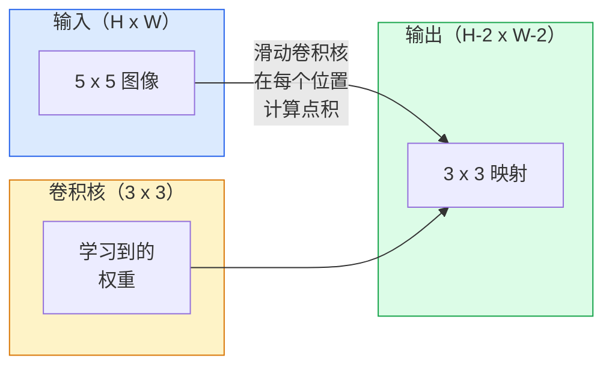
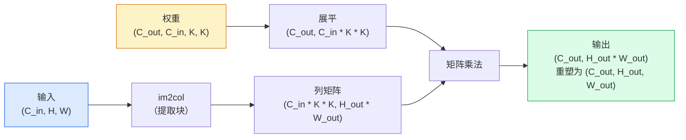

# 从零实现卷积（Convolutions from Scratch）

> 卷积是一个微小的密集层，你在图像上滑动它，在每个位置共享相同的权重。

**类型：** 构建（Build）
**语言：** Python
**前置要求：** 第三阶段（深度学习核心），第四阶段第 1 课（图像基础）
**时间：** 约 75 分钟

## 学习目标

- 仅使用 NumPy 从零实现 2D 卷积，包括嵌套循环版本和向量化的 `im2col` 版本
- 对输入尺寸、卷积核尺寸、填充（Padding）和步长（Stride）的任意组合计算输出空间尺寸，并论证 `(H - K + 2P) / S + 1` 公式
- 手工设计卷积核（边缘、模糊、锐化、Sobel），并解释为什么每个卷积核产生它所产生的那种激活模式
- 将卷积堆叠成特征提取器，并将堆叠深度与感受野（Receptive Field）的大小联系起来

## 问题

一个全连接层在 224x224 的 RGB 图像上，每个神经元需要 224 * 224 * 3 = 150,528 个输入权重。一个只有 1,000 个单元的隐藏层就已经是 1.5 亿个参数——在你学到任何有用的东西之前。更糟糕的是，该层不知道左上角的狗和右下角的狗是同一个模式。它将每个像素位置视为独立的，这对图像来说是完全错误的：将猫平移三个像素不应该迫使网络重新学习这个概念。

图像模型需要的两个属性是**平移等变性（Translation Equivariance）**（输出随输入平移而平移）和**参数共享（Parameter Sharing）**（相同的特征检测器在所有位置运行）。密集层两者都不给你。卷积免费给你两者。

卷积不是为深度学习发明的。它是驱动 JPEG 压缩、Photoshop 中的高斯模糊、工业视觉中的边缘检测以及所有曾经发布的音频滤波器的同一种运算。CNN 在 2012 年到 2020 年间主导 ImageNet 的原因是，卷积是对于邻近值相关且相同模式可以出现在任何位置的数据的正确先验。

## 概念

### 一个卷积核，滑动

2D 卷积取一个称为卷积核（Kernel，或滤波器（Filter））的小权重矩阵，在输入上滑动它，并在每个位置计算逐元素乘积之和。该和成为一个输出像素。



一个在 5x5 输入上的具体 3x3 示例（无填充，步长 1）：

```
输入 X（5 x 5）：                卷积核 W（3 x 3）：

  1  2  0  1  2                   1  0 -1
  0  1  3  1  0                   2  0 -2
  2  1  0  2  1                   1  0 -1
  1  0  2  1  3
  2  1  1  0  1

卷积核在每个有效的 3 x 3 窗口上滑动。输出 Y 是 3 x 3：

 Y[0,0] = sum( W * X[0:3, 0:3] )
 Y[0,1] = sum( W * X[0:3, 1:4] )
 Y[0,2] = sum( W * X[0:3, 2:5] )
 Y[1,0] = sum( W * X[1:4, 0:3] )
 ... 以此类推
```

那一个公式——**共享权重、局部性、滑动窗口**——就是整个思想。其他一切都是记账。

### 输出尺寸公式

给定输入空间尺寸 `H`、卷积核尺寸 `K`、填充 `P`、步长 `S`：

```
H_out = floor( (H - K + 2P) / S ) + 1
```

记住这个。你会在每个架构中计算它几十次。

| 场景 | H | K | P | S | H_out |
|------|---|---|---|---|-------|
| 有效卷积，无填充 | 32 | 3 | 0 | 1 | 30 |
| 相同卷积（保持尺寸） | 32 | 3 | 1 | 1 | 32 |
| 下采样 2 倍 | 32 | 3 | 1 | 2 | 16 |
| 池化 2x2 | 32 | 2 | 0 | 2 | 16 |
| 大感受野 | 32 | 7 | 3 | 2 | 16 |

"相同填充（Same Padding）"意味着选择 P 使得当 S == 1 时 H_out == H。对于奇数 K，P = (K - 1) / 2。这就是为什么 3x3 卷积核占主导地位——它们是最小的仍有中心的奇数卷积核。

### 填充

没有填充，每次卷积都会缩小特征图。堆叠 20 个，你的 224x224 图像变成 184x184，这浪费了边界上的计算，并使需要匹配形状的残差连接变得复杂。

```
在 5 x 5 输入上的零填充（P = 1）：

  0  0  0  0  0  0  0
  0  1  2  0  1  2  0
  0  0  1  3  1  0  0
  0  2  1  0  2  1  0       现在卷积核可以以像素 (0, 0)
  0  1  0  2  1  3  0       为中心，仍然有三行三列的值
  0  2  1  1  0  1  0       可以相乘。
  0  0  0  0  0  0  0
```

你在实践中遇到的模式：`zero`（最常见）、`reflect`（镜像边缘，在生成模型中避免硬边界）、`replicate`（复制边缘）、`circular`（环绕，用于环形问题）。

### 步长

步长是滑动的步长大小。`stride=1` 是默认值。`stride=2` 将空间维度减半，是在 CNN 内部进行下采样的经典方式，无需单独的池化层——每个现代架构（ResNet、ConvNeXt、MobileNet）都在某处使用步长卷积代替最大池化。

```
在 5 x 5 输入、3 x 3 卷积核上的步长 1：

  起始位置：(0,0) (0,1) (0,2)        -> 输出第 0 行
            (1,0) (1,1) (1,2)        -> 输出第 1 行
            (2,0) (2,1) (2,2)        -> 输出第 2 行

  输出：3 x 3

在相同输入上的步长 2：

  起始位置：(0,0) (0,2)              -> 输出第 0 行
            (2,0) (2,2)              -> 输出第 1 行

  输出：2 x 2
```

### 多输入通道

真实图像有三个通道。在 RGB 输入上的 3x3 卷积实际上是一个 3x3x3 的体积：每个输入通道一个 3x3 切片。在每个空间位置，你对所有三个切片进行乘加并加上偏置。

```
输入：   (C_in,  H,  W)        3 x 5 x 5
卷积核： (C_in,  K,  K)        3 x 3 x 3（一个卷积核）
输出：   (1,     H', W')       2D 映射

对于产生 C_out 个输出通道的层，你堆叠 C_out 个卷积核：

权重：   (C_out, C_in, K, K)   例如 64 x 3 x 3 x 3
输出：   (C_out, H', W')       64 x 3 x 3

参数数量：C_out * C_in * K * K + C_out   （+ C_out 是偏置）
```

最后一行是你在规划模型时要计算的。一个 64 通道的 3x3 卷积在 3 通道输入上有 `64 * 3 * 3 * 3 + 64 = 1,792` 个参数。很便宜。

### im2col 技巧

嵌套循环易读但慢。GPU 想要大矩阵乘法。技巧是：将输入的每个感受野窗口展平为大矩阵的一列，将卷积核展平为一行，整个卷积就变成了一次矩阵乘法。



每个生产级卷积实现都是这种变体加上缓存分块技巧（直接卷积、Winograd、大卷积核的 FFT 卷积）。理解 im2col，你就理解了核心。

### 感受野

单个 3x3 卷积看到 9 个输入像素。堆叠两个 3x3 卷积，第二层的一个神经元看到 5x5 个输入像素。三个 3x3 卷积给出 7x7。一般地：

```
L 个堆叠的 K x K 卷积（步长 1）后的感受野 = 1 + L * (K - 1)

有步长时：感受野沿每层随步长乘法增长。
```

"一路 3x3"（VGG、ResNet、ConvNeXt）之所以有效的全部原因在于，两个 3x3 卷积看到的输入区域与一个 5x5 卷积相同，但参数更少，且中间多了一个非线性。

## 构建它

### 步骤 1：填充数组

从最小的原语开始：一个在 H x W 数组周围填充零的函数。

```python
import numpy as np

def pad2d(x, p):
    if p == 0:
        return x
    h, w = x.shape[-2:]
    out = np.zeros(x.shape[:-2] + (h + 2 * p, w + 2 * p), dtype=x.dtype)
    out[..., p:p + h, p:p + w] = x
    return out

x = np.arange(9).reshape(3, 3)
print(x)
print()
print(pad2d(x, 1))
```

尾轴技巧 `x.shape[:-2]` 意味着同一个函数可以在 `(H, W)`、`(C, H, W)` 或 `(N, C, H, W)` 上无需修改地工作。

### 步骤 2：带嵌套循环的 2D 卷积

参考实现——慢，但无歧义。这就是 `torch.nn.functional.conv2d` 在原理上所做的事情。

```python
def conv2d_naive(x, w, b=None, stride=1, padding=0):
    c_in, h, w_in = x.shape
    c_out, c_in_w, kh, kw = w.shape
    assert c_in == c_in_w

    x_pad = pad2d(x, padding)
    h_out = (h + 2 * padding - kh) // stride + 1
    w_out = (w_in + 2 * padding - kw) // stride + 1

    out = np.zeros((c_out, h_out, w_out), dtype=np.float32)
    for oc in range(c_out):
        for i in range(h_out):
            for j in range(w_out):
                hs = i * stride
                ws = j * stride
                patch = x_pad[:, hs:hs + kh, ws:ws + kw]
                out[oc, i, j] = np.sum(patch * w[oc])
        if b is not None:
            out[oc] += b[oc]
    return out
```

四层嵌套循环（输出通道、行、列，加上对 C_in、kh、kw 的隐式求和）。这是你将用来检查每个更快实现的基准真相。

### 步骤 3：用手工设计的卷积核验证

构建一个垂直 Sobel 卷积核，将其应用于合成阶梯图像，观察垂直边缘亮起。

```python
def synthetic_step_image():
    img = np.zeros((1, 16, 16), dtype=np.float32)
    img[:, :, 8:] = 1.0
    return img

sobel_x = np.array([
    [[-1, 0, 1],
     [-2, 0, 2],
     [-1, 0, 1]]
], dtype=np.float32)[None]

x = synthetic_step_image()
y = conv2d_naive(x, sobel_x, padding=1)
print(y[0].round(1))
```

预期在第 7 列（从左到右亮度增加）看到大的正值，其他地方为零。这一行打印就是你的数学正确性检查。

### 步骤 4：im2col

将输入中每个卷积核大小的窗口转换为矩阵的一列。对于 `C_in=3, K=3`，每列是 27 个数字。

```python
def im2col(x, kh, kw, stride=1, padding=0):
    c_in, h, w = x.shape
    x_pad = pad2d(x, padding)
    h_out = (h + 2 * padding - kh) // stride + 1
    w_out = (w + 2 * padding - kw) // stride + 1

    cols = np.zeros((c_in * kh * kw, h_out * w_out), dtype=x.dtype)
    col = 0
    for i in range(h_out):
        for j in range(w_out):
            hs = i * stride
            ws = j * stride
            patch = x_pad[:, hs:hs + kh, ws:ws + kw]
            cols[:, col] = patch.reshape(-1)
            col += 1
    return cols, h_out, w_out
```

它仍然是 Python 循环，但现在繁重的工作将是一次向量化的矩阵乘法。

### 步骤 5：通过 im2col + 矩阵乘法的快速卷积

用一次矩阵乘法替换四重循环。

```python
def conv2d_im2col(x, w, b=None, stride=1, padding=0):
    c_out, c_in, kh, kw = w.shape
    cols, h_out, w_out = im2col(x, kh, kw, stride, padding)
    w_flat = w.reshape(c_out, -1)
    out = w_flat @ cols
    if b is not None:
        out += b[:, None]
    return out.reshape(c_out, h_out, w_out)
```

正确性检查：运行两种实现并比较。

```python
rng = np.random.default_rng(0)
x = rng.normal(0, 1, (3, 16, 16)).astype(np.float32)
w = rng.normal(0, 1, (8, 3, 3, 3)).astype(np.float32)
b = rng.normal(0, 1, (8,)).astype(np.float32)

y_naive = conv2d_naive(x, w, b, padding=1)
y_im2col = conv2d_im2col(x, w, b, padding=1)

print(f"max abs diff: {np.max(np.abs(y_naive - y_im2col)):.2e}")
```

`max abs diff` 应约为 `1e-5`——差异是浮点累加顺序，不是 bug。

### 步骤 6：一组手工设计的卷积核

五个滤波器，展示单个卷积层在没有任何训练之前可以表达什么。

```python
KERNELS = {
    "identity": np.array([[0, 0, 0], [0, 1, 0], [0, 0, 0]], dtype=np.float32),
    "blur_3x3": np.ones((3, 3), dtype=np.float32) / 9.0,
    "sharpen": np.array([[0, -1, 0], [-1, 5, -1], [0, -1, 0]], dtype=np.float32),
    "sobel_x": np.array([[-1, 0, 1], [-2, 0, 2], [-1, 0, 1]], dtype=np.float32),
    "sobel_y": np.array([[-1, -2, -1], [0, 0, 0], [1, 2, 1]], dtype=np.float32),
}

def apply_kernel(img2d, kernel):
    x = img2d[None].astype(np.float32)
    w = kernel[None, None]
    return conv2d_im2col(x, w, padding=1)[0]
```

应用于任何灰度图像，模糊会柔化，锐化会使边缘更清晰，Sobel-x 点亮垂直边缘，Sobel-y 点亮水平边缘。这些正是 AlexNet 和 VGG 中*第一个*训练好的卷积层最终学到的模式——因为一个好的图像模型无论后续任务是什么，都需要边缘和斑点检测器。

## 使用它

PyTorch 的 `nn.Conv2d` 用自动微分、CUDA 内核和 cuDNN 优化包装了相同的运算。形状语义完全相同。

```python
import torch
import torch.nn as nn

conv = nn.Conv2d(in_channels=3, out_channels=64, kernel_size=3, stride=1, padding=1)
print(conv)
print(f"weight shape: {tuple(conv.weight.shape)}   # (C_out, C_in, K, K)")
print(f"bias shape:   {tuple(conv.bias.shape)}")
print(f"param count:  {sum(p.numel() for p in conv.parameters())}")

x = torch.randn(8, 3, 224, 224)
y = conv(x)
print(f"\ninput  shape: {tuple(x.shape)}")
print(f"output shape: {tuple(y.shape)}")
```

将 `padding=1` 换成 `padding=0`，输出降到 222x222。将 `stride=1` 换成 `stride=2`，输出降到 112x112。与你在上面记住的公式相同。

## 交付它

本课产出：

- `outputs/prompt-cnn-architect.md` — 一个提示词，给定输入尺寸、参数预算和目标感受野，设计一个在每一步都有正确 K/S/P 的 `Conv2d` 层堆叠。
- `outputs/skill-conv-shape-calculator.md` — 一个技能，逐层遍历网络规格，返回每个块的输出形状、感受野和参数数量。

## 练习

1. **（简单）** 给定一个 128x128 灰度输入和一个 `[Conv3x3(s=1,p=1), Conv3x3(s=2,p=1), Conv3x3(s=1,p=1), Conv3x3(s=2,p=1)]` 的堆叠，手工计算每层的输出空间尺寸和感受野。用虚拟卷积的 PyTorch `nn.Sequential` 验证。
2. **（中等）** 扩展 `conv2d_naive` 和 `conv2d_im2col` 以接受 `groups` 参数。展示 `groups=C_in=C_out` 复现了深度可分离卷积（Depthwise Convolution），且其参数数量是 `C * K * K` 而不是 `C * C * K * K`。
3. **（困难）** 手工实现 `conv2d_im2col` 的反向传播：给定输出的梯度，计算 `x` 和 `w` 的梯度。在相同输入和权重上与 `torch.autograd.grad` 验证。技巧：im2col 的梯度是 `col2im`，它必须累加重叠的窗口。

## 关键术语

| 术语 | 人们怎么说 | 实际含义 |
|------|-----------|---------|
| 卷积（Convolution） | "滑动一个滤波器" | 在每个空间位置应用的可学习点积，共享权重；数学上是互相关（Cross-Correlation），但所有人都叫它卷积 |
| 卷积核/滤波器（Kernel/Filter） | "特征检测器" | 形状为 (C_in, K, K) 的小权重张量，其与输入窗口的点积产生一个输出像素 |
| 步长（Stride） | "跳多远" | 连续卷积核放置之间的步长大小；步长 2 将每个空间维度减半 |
| 填充（Padding） | "边缘上的零" | 在输入周围添加的额外值，使卷积核可以以边界像素为中心；`same` 填充保持输出尺寸等于输入尺寸 |
| 感受野（Receptive Field） | "神经元看到多少" | 给定输出激活所依赖的原始输入块，随深度和步长增长 |
| im2col | "GEMM 技巧" | 将每个感受窗口重新排列为列，使卷积变成一次大矩阵乘法——每个快速卷积内核的核心 |
| 深度可分离卷积（Depthwise Conv） | "每个通道一个卷积核" | `groups == C_in` 的卷积，每个输出通道仅从其匹配的输入通道计算；MobileNet 和 ConvNeXt 的骨干 |
| 平移等变性（Translation Equivariance） | "输入平移，输出平移" | 将输入平移 k 个像素，输出也平移 k 个像素的性质；共享权重免费提供 |

## 扩展阅读

- [A guide to convolution arithmetic for deep learning (Dumoulin & Visin, 2016)](https://arxiv.org/abs/1603.07285) — 关于填充/步长/膨胀的权威图示，每门课程都在默默复制
- [CS231n: Convolutional Neural Networks for Visual Recognition](https://cs231n.github.io/convolutional-networks/) — 经典讲义，包括原始的 im2col 解释
- [The Annotated ConvNet (fast.ai)](https://nbviewer.org/github/fastai/fastbook/blob/master/13_convolutions.ipynb) — 从手动卷积到训练好的数字分类器的 notebook
- [Receptive Field Arithmetic for CNNs (Dang Ha The Hien)](https://distill.pub/2019/computing-receptive-fields/) — 感受野计算的论文级交互式解释器
