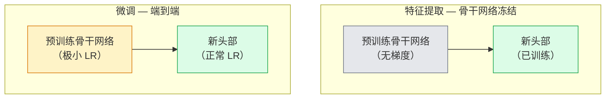

# 迁移学习与微调（Transfer Learning & Fine-Tuning）

> 别人花了一百万 GPU 小时教会一个网络边缘、纹理和物体部件长什么样。你应该在训练自己的特征之前借用这些特征。

**类型：** 构建（Build）
**语言：** Python
**前置要求：** 第四阶段第 3 课（CNN），第四阶段第 4 课（图像分类）
**时间：** 约 75 分钟

## 学习目标

- 区分特征提取（Feature Extraction）和微调（Fine-Tuning），并根据数据集大小、领域距离和计算预算选择正确的方法
- 加载预训练骨干网络，替换其分类器头，并在 20 行内仅训练头部达到可工作的基线
- 使用判别性学习率（Discriminative Learning Rate）逐步解冻层，使早期通用特征获得比后期任务特定特征更小的更新
- 诊断三种常见失败：解冻块上过高的学习率导致的特征漂移（Feature Drift）、小数据集上的 BN 统计量崩溃（BN Statistics Collapse）以及灾难性遗忘（Catastrophic Forgetting）

## 问题

在 ImageNet 上训练一个 ResNet-50 大约需要 2,000 GPU 小时。很少有团队对每个交付的任务都有这样的预算。几乎所有团队实际交付的是一个预训练骨干网络加上一个在几百或几千张任务特定图像上训练的新头部。

这不是捷径。任何 ImageNet 训练的 CNN 的第一个卷积块学习边缘和类 Gabor 滤波器。接下来的几个块学习纹理和简单图案。中间块学习物体部件。最后块学习开始看起来像 1,000 个 ImageNet 类别的组合。该层次结构的前 90% 几乎不变地迁移到医学影像、工业检测、卫星数据和所有其他视觉任务——因为自然界只有有限的边缘和纹理词汇。最后 10% 才是你实际训练的。

把迁移做对有三个 bug 等着你：用过高的学习率破坏预训练特征、冻结太多导致模型信息不足、以及让 BatchNorm 的运行统计量漂向一个网络其余部分从未学习过的微小数据集。本课有目的地逐一讲解它们。

## 概念

### 特征提取 vs 微调

两种模式，根据你对预训练特征的信任程度和你拥有的数据量来选择。



经验法则：

| 数据集大小 | 领域距离 | 配方 |
|-----------|---------|------|
| < 1k 图像 | 接近 ImageNet | 冻结骨干网络，仅训练头部 |
| 1k-10k | 接近 | 冻结前 2-3 个阶段，微调其余 |
| 10k-100k | 任意 | 使用判别性 LR 端到端微调 |
| 100k+ | 远 | 微调一切；如果领域足够远，考虑从头训练 |

"接近 ImageNet"大致意味着具有物体类内容的自然 RGB 照片。医学 CT 扫描、俯视卫星图像和显微镜是远领域——特征仍然有帮助，但你需要让更多层适应。

### 为什么冻结能起作用

CNN 学习的 ImageNet 特征并不专门针对那 1,000 个类别。它们专门针对自然图像的统计特性：特定方向的边缘、纹理、对比度模式、形状原语。这些统计特性在人类能命名的几乎所有视觉领域中都是稳定的。这就是为什么一个在 ImageNet 上训练、仅用新的线性头在 CIFAR-10 上零样本评估（不微调骨干网络）的模型能达到 80%+ 的准确率。头部正在学习为这个任务加权哪些已经学到的特征。

### 判别性学习率

当你确实解冻时，早期层应该比后期层训练得更慢。早期层编码你想要保留的通用特征；后期层编码你需要大幅移动的任务特定结构。

```
典型配方：

  stage 0（stem + 第一组）：lr = base_lr / 100    （基本固定）
  stage 1：                  lr = base_lr / 10
  stage 2：                  lr = base_lr / 3
  stage 3（最后一个骨干组）：lr = base_lr
  head：                     lr = base_lr  （或稍高）
```

在 PyTorch 中，这只是传递给优化器的参数组列表。一个模型，五个学习率，零额外代码。

### BatchNorm 问题

BN 层持有在 ImageNet 上计算的 `running_mean` 和 `running_var` 缓冲区。如果你的任务有不同的像素分布——不同的光照、不同的传感器、不同的色彩空间——这些缓冲区就是错的。按偏好顺序的三种选择：

1. **在训练模式下微调 BN。** 让 BN 随其他一切更新其运行统计量。当任务数据集为中等大小（>= 5k 样本）时的默认选择。
2. **在评估模式下冻结 BN。** 保持 ImageNet 统计量，仅训练权重。当你的数据集小到 BN 的移动平均会有噪声时正确。
3. **用 GroupNorm 替换 BN。** 完全消除移动平均问题。用于每个 GPU 批次大小很小的检测和分割骨干网络。

搞错这个会静默地使准确率下降 5-15%。

### 头部设计

分类器头是 1-3 个线性层加一个可选的 dropout。每个 torchvision 骨干网络都附带一个默认头部，你将其替换：

```
backbone.fc = nn.Linear(backbone.fc.in_features, num_classes)          # ResNet
backbone.classifier[1] = nn.Linear(..., num_classes)                    # EfficientNet、MobileNet
backbone.heads.head = nn.Linear(..., num_classes)                       # torchvision ViT
```

对于小数据集，单个线性层通常就足够了。当任务分布离骨干网络的训练分布更远时，添加一个隐藏层（Linear -> ReLU -> Dropout -> Linear）有帮助。

### 逐层学习率衰减

判别性 LR 的一个更平滑版本，用于现代微调（BEiT、DINOv2、ViT-B 微调）。不是将层分组到阶段中，而是给每一层比它上面一层稍小的 LR：

```
lr_layer_k = base_lr * decay^(L - k)
```

当 decay = 0.75 且 L = 12 个 Transformer 块时，第一个块以头部 LR 的 `0.75^11 ≈ 0.04x` 训练。对 Transformer 微调比 CNN 更重要，对 CNN 来说阶段分组的 LR 通常就足够了。

### 评估什么

迁移学习运行需要两个你在从头训练运行中不会跟踪的数字：

- **仅预训练准确率** — 骨干网络冻结时头部的准确率。这是你的下限。
- **微调准确率** — 端到端训练后同一模型的准确率。这是你的上限。

如果微调后低于仅预训练，你有一个学习率或 BN bug。始终打印两者。

## 构建它

### 步骤 1：加载预训练骨干网络并检查它

```python
import torch
import torch.nn as nn
from torchvision.models import resnet18, ResNet18_Weights

backbone = resnet18(weights=ResNet18_Weights.IMAGENET1K_V1)
print(backbone)
print()
print("classifier head:", backbone.fc)
print("feature dim:", backbone.fc.in_features)
```

`ResNet18` 有四个阶段（`layer1..layer4`）加一个 stem 和一个 `fc` 头。每个 torchvision 分类骨干网络都有类似的结构。

### 步骤 2：特征提取——冻结一切，替换头部

```python
def make_feature_extractor(num_classes=10):
    model = resnet18(weights=ResNet18_Weights.IMAGENET1K_V1)
    for p in model.parameters():
        p.requires_grad = False
    model.fc = nn.Linear(model.fc.in_features, num_classes)
    return model

model = make_feature_extractor(num_classes=10)
trainable = sum(p.numel() for p in model.parameters() if p.requires_grad)
frozen = sum(p.numel() for p in model.parameters() if not p.requires_grad)
print(f"trainable: {trainable:>10,}")
print(f"frozen:    {frozen:>10,}")
```

只有 `model.fc` 是可训练的。骨干网络是一个冻结的特征提取器。

### 步骤 3：判别性微调

一个构建具有阶段特定学习率的参数组的工具。

```python
def discriminative_param_groups(model, base_lr=1e-3, decay=0.3):
    stages = [
        ["conv1", "bn1"],
        ["layer1"],
        ["layer2"],
        ["layer3"],
        ["layer4"],
        ["fc"],
    ]
    groups = []
    for i, names in enumerate(stages):
        lr = base_lr * (decay ** (len(stages) - 1 - i))
        params = [p for n, p in model.named_parameters()
                  if any(n.startswith(k) for k in names)]
        if params:
            groups.append({"params": params, "lr": lr, "name": "_".join(names)})
    return groups

model = resnet18(weights=ResNet18_Weights.IMAGENET1K_V1)
model.fc = nn.Linear(model.fc.in_features, 10)
for p in model.parameters():
    p.requires_grad = True

groups = discriminative_param_groups(model)
for g in groups:
    print(f"{g['name']:>10s}  lr={g['lr']:.2e}  params={sum(p.numel() for p in g['params']):>8,}")
```

`decay=0.3` 意味着每个阶段以下一个阶段 30% 的速率训练。`fc` 获得 `base_lr`，`layer4` 获得 `0.3 * base_lr`，`conv1` 获得 `0.3^5 * base_lr ≈ 0.00243 * base_lr`。听起来极端；经验上它有效。

### 步骤 4：BatchNorm 处理

冻结 BN 运行统计量而不冻结其权重的辅助函数。

```python
def freeze_bn_stats(model):
    for m in model.modules():
        if isinstance(m, (nn.BatchNorm1d, nn.BatchNorm2d, nn.BatchNorm3d)):
            m.eval()
            for p in m.parameters():
                p.requires_grad = False
    return model
```

在每个 epoch 开始时设置 `model.train()` 之后调用它。`model.train()` 将所有内容翻转为训练模式；这仅对 BN 层反转它。

### 步骤 5：一个最小的端到端微调循环

```python
from torch.optim import SGD
from torch.utils.data import DataLoader
from torch.optim.lr_scheduler import CosineAnnealingLR
import torch.nn.functional as F

def fine_tune(model, train_loader, val_loader, device, epochs=5, base_lr=1e-3, freeze_bn=False):
    model = model.to(device)
    groups = discriminative_param_groups(model, base_lr=base_lr)
    optimizer = SGD(groups, momentum=0.9, weight_decay=1e-4, nesterov=True)
    scheduler = CosineAnnealingLR(optimizer, T_max=epochs)

    for epoch in range(epochs):
        model.train()
        if freeze_bn:
            freeze_bn_stats(model)
        tr_loss, tr_correct, tr_total = 0.0, 0, 0
        for x, y in train_loader:
            x, y = x.to(device), y.to(device)
            logits = model(x)
            loss = F.cross_entropy(logits, y, label_smoothing=0.1)
            optimizer.zero_grad()
            loss.backward()
            optimizer.step()
            tr_loss += loss.item() * x.size(0)
            tr_total += x.size(0)
            tr_correct += (logits.argmax(-1) == y).sum().item()
        scheduler.step()

        model.eval()
        va_total, va_correct = 0, 0
        with torch.no_grad():
            for x, y in val_loader:
                x, y = x.to(device), y.to(device)
                pred = model(x).argmax(-1)
                va_total += x.size(0)
                va_correct += (pred == y).sum().item()
        print(f"epoch {epoch}  train {tr_loss/tr_total:.3f}/{tr_correct/tr_total:.3f}  "
              f"val {va_correct/va_total:.3f}")
    return model
```

在 CIFAR-10 上用上述配方训练五个 epoch，将 `ResNet18-IMAGENET1K_V1` 从约 70% 的零样本线性探测（Linear Probe）准确率提升到约 93% 的微调准确率。仅头部在不触及骨干网络的情况下会在约 86% 处达到平台期。

### 步骤 6：渐进式解冻

一个从末端向开头每 epoch 解冻一个阶段的调度。以一些额外 epoch 为代价减轻特征漂移。

```python
def progressive_unfreeze_schedule(model):
    stages = ["layer4", "layer3", "layer2", "layer1"]
    yielded = set()

    def start():
        for p in model.parameters():
            p.requires_grad = False
        for p in model.fc.parameters():
            p.requires_grad = True

    def unfreeze(epoch):
        if epoch < len(stages):
            name = stages[epoch]
            yielded.add(name)
            for n, p in model.named_parameters():
                if n.startswith(name):
                    p.requires_grad = True
            return name
        return None

    return start, unfreeze
```

在第一个 epoch 之前调用 `start()` 一次。在每个 epoch 开始时调用 `unfreeze(epoch)`。每当可训练参数集合变化时重建优化器，否则冻结的参数仍然持有会混淆它的缓存动量。

## 使用它

对于大多数实际任务，`torchvision.models` + 三行就足够了。上面的重型机制在你遇到库默认值无法修复的问题时才重要。

```python
from torchvision.models import resnet50, ResNet50_Weights

model = resnet50(weights=ResNet50_Weights.IMAGENET1K_V2)
model.fc = nn.Linear(model.fc.in_features, num_classes)
optimizer = torch.optim.AdamW(model.parameters(), lr=1e-4, weight_decay=1e-4)
```

另外两个生产级默认值：

- `timm` 提供约 800 个预训练视觉骨干网络，具有一致的 API（`timm.create_model("resnet50", pretrained=True, num_classes=10)`）。对于 torchvision 模型库之外的任何微调，它是标准。
- 对于 Transformer，`transformers.AutoModelForImageClassification.from_pretrained(name, num_labels=N)` 为你提供 ViT / BEiT / DeiT，具有与文本模型相同的加载语义。

## 交付它

本课产出：

- `outputs/prompt-fine-tune-planner.md` — 一个提示词，根据数据集大小、领域距离和计算预算选择特征提取 vs 渐进式 vs 端到端微调。
- `outputs/skill-freeze-inspector.md` — 一个技能，给定 PyTorch 模型，报告哪些参数是可训练的，哪些 BatchNorm 层处于评估模式，以及优化器是否确实被喂入了可训练参数。

## 练习

1. **（简单）** 在相同的合成 CIFAR 数据集上，将 `ResNet18` 作为线性探测（骨干网络冻结）和完整微调进行训练。并排报告两种准确率。解释哪个差距告诉你特征迁移得好，哪个告诉你迁移得不好。
2. **（中等）** 故意引入一个 bug：在骨干阶段而不是头部设置 `base_lr = 1e-1`。展示训练损失爆炸，然后通过应用 `discriminative_param_groups` 辅助函数恢复。记录每个阶段开始发散时的 LR。
3. **（困难）** 取一个医学影像数据集（例如 CheXpert-small、PatchCamelyon 或 HAM10000）并比较三种模式：(a) ImageNet 预训练冻结骨干网络 + 线性头；(b) ImageNet 预训练端到端微调；(c) 从头训练。报告每种模式的准确率和计算成本。在什么数据集大小下从头训练变得有竞争力？

## 关键术语

| 术语 | 人们怎么说 | 实际含义 |
|------|-----------|---------|
| 特征提取（Feature Extraction） | "冻结并训练头部" | 骨干网络参数冻结，只有新的分类器头接收梯度 |
| 微调（Fine-Tuning） | "端到端重新训练" | 所有参数可训练，通常使用比从头训练小得多的 LR |
| 判别性 LR（Discriminative LR） | "早期层用更小的 LR" | 优化器参数组，其中早期阶段 LR 是后期阶段 LR 的一个分数 |
| 逐层 LR 衰减（Layer-wise LR Decay） | "平滑的 LR 梯度" | 每层 LR 乘以 decay^(L - k)；在 Transformer 微调中常见 |
| 灾难性遗忘（Catastrophic Forgetting） | "模型丢失了 ImageNet" | 过高的 LR 在新任务信号被学习之前覆盖了预训练特征 |
| BN 统计量漂移（BN Statistics Drift） | "运行均值是错的" | BatchNorm 的 running_mean/var 在与当前任务不同的分布上计算，静默地损害准确率 |
| 线性探测（Linear Probe） | "冻结骨干网络 + 线性头" | 预训练特征的评估——在冻结表示之上的最佳线性分类器的准确率 |
| 灾难性崩溃（Catastrophic Collapse） | "一切预测一个类别" | 当微调 LR 高到在头部梯度能稳定之前就破坏了特征时发生 |

## 扩展阅读

- [How transferable are features in deep neural networks? (Yosinski et al., 2014)](https://arxiv.org/abs/1411.1792) — 量化了跨层特征可迁移性的论文
- [Universal Language Model Fine-tuning (ULMFiT, Howard & Ruder, 2018)](https://arxiv.org/abs/1801.06146) — 原始的判别性 LR / 渐进式解冻配方；这些思想直接迁移到视觉
- [timm 文档](https://huggingface.co/docs/timm) — 现代视觉骨干网络及其训练时使用的精确微调默认值的参考
- [A Simple Framework for Linear-Probe Evaluation (Kornblith et al., 2019)](https://arxiv.org/abs/1805.08974) — 为什么线性探测准确率重要以及如何正确报告它
