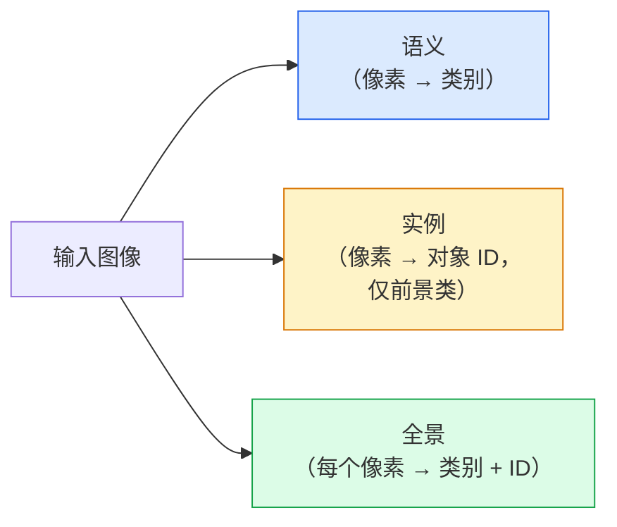
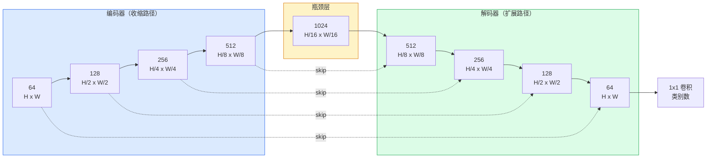

# 语义分割（Semantic Segmentation）— U-Net

> 分割（Segmentation）就是对每个像素做分类。U-Net 通过将下采样编码器（Encoder）与上采样解码器（Decoder）配对，并在它们之间连接跳跃连接（Skip Connection），使其真正有效。

**类型：** 构建（Build）
**语言：** Python
**前置知识：** 第 4 阶段第 03 课（CNN）、第 4 阶段第 04 课（图像分类）
**时间：** 约 75 分钟

## 学习目标

- 区分语义分割（Semantic Segmentation）、实例分割（Instance Segmentation）和全景分割（Panoptic Segmentation），并为给定问题选择正确的任务类型
- 从零开始用 PyTorch 构建一个 U-Net，包含编码器块、瓶颈层（Bottleneck）、带转置卷积（Transposed Convolution）的解码器以及跳跃连接
- 实现逐像素交叉熵（Pixel-wise Cross-Entropy）、Dice 损失（Dice Loss），以及当前医学和工业分割领域默认使用的组合损失（Combined Loss）
- 读取每个类别的 IoU 和 Dice 指标，并诊断差分数是来自小目标召回率、边界精度还是类别不平衡

## 问题

分类（Classification）每张图像输出一个标签。检测（Detection）每张图像输出少量边界框。分割每张图像输出每个像素一个标签。对于 `H x W` 大小的输入，输出是一个形状为 `H x W`（语义）或 `H x W x N_instances`（实例）的张量。这意味着每张图像有数百万个预测，而不是一个。

分割的结构特性使其几乎支撑了所有密集预测（Dense Prediction）视觉产品：医学影像（肿瘤掩码）、自动驾驶（道路、车道、障碍物）、卫星图像（建筑物轮廓、农田边界）、文档解析（版面区域）、机器人（可抓取区域）。这些任务都无法通过给目标画一个框来解决；它们需要精确的轮廓。

架构问题陈述起来简单，解决起来却不简单：你需要网络同时看到图像的全局上下文（Global Context）（这是什么场景）和局部像素细节（Local Pixel Detail）（哪个像素是道路，哪个是人行道）。标准 CNN 通过空间压缩来获取上下文，但这会丢弃细节。U-Net 是同时获得两者的设计。

## 概念

### 语义 vs 实例 vs 全景



- **语义（Semantic）** 说"这个像素是道路，那个像素是汽车。"两辆相邻的汽车会合并成一个 blob。
- **实例（Instance）** 说"这个像素是汽车 #3，那个像素是汽车 #5。"忽略背景物体（"stuff" = 天空、道路、草地）。
- **全景（Panoptic）** 统一两者：每个像素获得一个类别标签，每个实例获得一个唯一 ID，stuff 和 things 都被分割。

本课涵盖语义分割。下一课（Mask R-CNN）涵盖实例分割。

### U-Net 的形状



编码器将空间分辨率减半四次，通道数加倍。解码器反向操作：将空间分辨率加倍四次，通道数减半。跳跃连接在每个分辨率级别将匹配的编码器特征与解码器特征拼接起来。最后的 1x1 卷积将 `64 -> num_classes` 映射到全分辨率。

为什么跳跃连接是必需的：解码器在尝试输出像素级预测时，之前只见过小尺寸的特征图。没有跳跃连接，它无法准确定位边缘，因为这些信息在编码器中已被压缩掉了。跳跃连接将编码器在下采样过程中计算的高分辨率特征图直接传递给解码器。

### 转置卷积 vs 双线性上采样

解码器需要扩展空间维度。有两种选择：

- **转置卷积（Transposed Convolution）**（`nn.ConvTranspose2d`）— 可学习的上采样。历史上 U-Net 的默认选择。如果步长和卷积核大小不能整除，可能产生棋盘伪影（Checkerboard Artifact）。
- **双线性上采样 + 3x3 卷积（Bilinear Upsample + 3x3 Conv）** — 平滑上采样后接一个卷积。伪影更少，参数更少，现在是现代默认选择。

两种方式在实际中都有使用。对于第一个 U-Net，双线性更安全。

### 像素网格上的交叉熵

对于有 C 个类别的语义分割，模型输出是 `(N, C, H, W)`。目标是 `(N, H, W)` 的整数类别 ID。交叉熵与分类情况完全相同，只是在每个空间位置应用：

```
Loss = 对所有 (n, h, w) 取均值：-log( softmax(logits[n, :, h, w])[target[n, h, w]] )
```

PyTorch 中的 `F.cross_entropy` 原生支持这种形状。无需 reshape。

### Dice 损失及其必要性

交叉熵对每个像素一视同仁。当一个类别占据画面主导地位时（医学影像：99% 背景，1% 肿瘤），这是错误的。网络可以通过预测所有像素都是背景来获得 99% 的准确率，但仍然毫无用处。

Dice 损失通过直接优化预测掩码与真实掩码之间的重叠来解决这个问题：

```
Dice(p, y) = 2 * sum(p * y) / (sum(p) + sum(y) + epsilon)
Dice_loss = 1 - Dice
```

其中 `p` 是某个类别的 sigmoid/softmax 概率图，`y` 是二值真实掩码。只有当重叠完美时损失才为零。因为它是基于比率的，类别不平衡无关紧要。

在实践中，使用**组合损失（Combined Loss）**：

```
L = L_cross_entropy + lambda * L_dice       （lambda ~ 1）
```

交叉熵在训练早期提供稳定的梯度；Dice 将训练后期集中在真正匹配掩码形状上。这种组合是医学影像的默认选择，在任何类别不平衡的数据集上都难以被超越。

### 评估指标

- **像素准确率（Pixel Accuracy）** — 预测正确的像素百分比。计算成本低。在类别不平衡数据上失效，原因与分类中的准确率相同。
- **每类 IoU** — 每个类别掩码的交并比（Intersection over Union）；跨类别平均 = mIoU。
- **Dice（像素级 F1）** — 与 IoU 类似；`Dice = 2 * IoU / (1 + IoU)`。医学影像偏好 Dice，驾驶社区偏好 IoU；它们是单调相关的。
- **边界 F1（Boundary F1）** — 衡量预测边界与真实边界的接近程度，即使微小偏移也会被惩罚。对半导体检测等高精度任务很重要。

报告每类 IoU，而不仅仅是 mIoU。平均 IoU 会掩盖一个类别 15% 而其他九个类别 85% 的情况。

### 输入分辨率权衡

U-Net 的编码器将分辨率减半四次，因此输入必须能被 16 整除。医学图像通常是 512x512 或 1024x1024。自动驾驶裁剪是 2048x1024。U-Net 的内存成本随 `H * W * C_max` 缩放，在 1024x1024 和 1024 个瓶颈通道下，前向传播已经消耗数 GB 的显存。

两种标准变通方案：
1. 分块（Tile）输入 — 处理 256x256 的块，有重叠，然后拼接。
2. 用空洞卷积（Dilated Convolution）替换瓶颈层，保持更高的空间分辨率但扩大感受野（DeepLab 系列）。

对于第一个模型，256x256 输入配合 64 通道基数的 U-Net 可以在 8 GB 显存上舒适地训练。

## 构建它

### 步骤 1：编码器块

两个 3x3 卷积，带批归一化（Batch Norm）和 ReLU。第一个卷积改变通道数；第二个保持不变。

```python
import torch
import torch.nn as nn
import torch.nn.functional as F

class DoubleConv(nn.Module):
    def __init__(self, in_c, out_c):
        super().__init__()
        self.net = nn.Sequential(
            nn.Conv2d(in_c, out_c, kernel_size=3, padding=1, bias=False),
            nn.BatchNorm2d(out_c),
            nn.ReLU(inplace=True),
            nn.Conv2d(out_c, out_c, kernel_size=3, padding=1, bias=False),
            nn.BatchNorm2d(out_c),
            nn.ReLU(inplace=True),
        )

    def forward(self, x):
        return self.net(x)
```

这个块在整个网络中复用。`bias=False` 是因为 BN 的 beta 处理了偏置。

### 步骤 2：下采样和上采样块

```python
class Down(nn.Module):
    def __init__(self, in_c, out_c):
        super().__init__()
        self.net = nn.Sequential(
            nn.MaxPool2d(2),
            DoubleConv(in_c, out_c),
        )

    def forward(self, x):
        return self.net(x)


class Up(nn.Module):
    def __init__(self, in_c, out_c):
        super().__init__()
        self.up = nn.Upsample(scale_factor=2, mode="bilinear", align_corners=False)
        self.conv = DoubleConv(in_c, out_c)

    def forward(self, x, skip):
        x = self.up(x)
        if x.shape[-2:] != skip.shape[-2:]:
            x = F.interpolate(x, size=skip.shape[-2:], mode="bilinear", align_corners=False)
        x = torch.cat([skip, x], dim=1)
        return self.conv(x)
```

仅检查空间维度的形状（`shape[-2:]`）可以处理输入尺寸不能被 16 整除的情况；安全的 `F.interpolate` 在拼接前对齐张量。如果比较完整形状，也会因通道数差异而触发，这应该是一个明显的错误，而不是静默的插值。

### 步骤 3：U-Net

```python
class UNet(nn.Module):
    def __init__(self, in_channels=3, num_classes=2, base=64):
        super().__init__()
        self.inc = DoubleConv(in_channels, base)
        self.d1 = Down(base, base * 2)
        self.d2 = Down(base * 2, base * 4)
        self.d3 = Down(base * 4, base * 8)
        self.d4 = Down(base * 8, base * 16)
        self.u1 = Up(base * 16 + base * 8, base * 8)
        self.u2 = Up(base * 8 + base * 4, base * 4)
        self.u3 = Up(base * 4 + base * 2, base * 2)
        self.u4 = Up(base * 2 + base, base)
        self.outc = nn.Conv2d(base, num_classes, kernel_size=1)

    def forward(self, x):
        x1 = self.inc(x)
        x2 = self.d1(x1)
        x3 = self.d2(x2)
        x4 = self.d3(x3)
        x5 = self.d4(x4)
        x = self.u1(x5, x4)
        x = self.u2(x, x3)
        x = self.u3(x, x2)
        x = self.u4(x, x1)
        return self.outc(x)

net = UNet(in_channels=3, num_classes=2, base=32)
x = torch.randn(1, 3, 256, 256)
print(f"output: {net(x).shape}")
print(f"params: {sum(p.numel() for p in net.parameters()):,}")
```

输出形状 `(1, 2, 256, 256)` — 与输入相同的空间尺寸，`num_classes` 个通道。在 `base=32` 时约 7.7M 参数。

### 步骤 4：损失函数

```python
def dice_loss(logits, targets, num_classes, eps=1e-6):
    probs = F.softmax(logits, dim=1)
    targets_one_hot = F.one_hot(targets, num_classes).permute(0, 3, 1, 2).float()
    dims = (0, 2, 3)
    intersection = (probs * targets_one_hot).sum(dim=dims)
    denom = probs.sum(dim=dims) + targets_one_hot.sum(dim=dims)
    dice = (2 * intersection + eps) / (denom + eps)
    return 1 - dice.mean()


def combined_loss(logits, targets, num_classes, lam=1.0):
    ce = F.cross_entropy(logits, targets)
    dc = dice_loss(logits, targets, num_classes)
    return ce + lam * dc, {"ce": ce.item(), "dice": dc.item()}
```

Dice 按类别计算然后取平均（宏 Dice）。`eps` 防止在批次中不存在的类别上除以零。

### 步骤 5：IoU 指标

```python
@torch.no_grad()
def iou_per_class(logits, targets, num_classes):
    preds = logits.argmax(dim=1)
    ious = torch.zeros(num_classes)
    for c in range(num_classes):
        pred_c = (preds == c)
        true_c = (targets == c)
        inter = (pred_c & true_c).sum().float()
        union = (pred_c | true_c).sum().float()
        ious[c] = (inter / union) if union > 0 else torch.tensor(float("nan"))
    return ious
```

返回长度为 C 的向量。`nan` 标记批次中不存在的类别 — 计算 mIoU 时不要对这些值取平均。

### 步骤 6：用于端到端验证的合成数据集

在彩色背景上生成形状，这样网络必须学习形状而不是像素颜色。

```python
import numpy as np
from torch.utils.data import Dataset, DataLoader

def synthetic_segmentation(num_samples=200, size=64, seed=0):
    rng = np.random.default_rng(seed)
    images = np.zeros((num_samples, size, size, 3), dtype=np.float32)
    masks = np.zeros((num_samples, size, size), dtype=np.int64)
    for i in range(num_samples):
        bg = rng.uniform(0, 1, (3,))
        images[i] = bg
        masks[i] = 0
        num_shapes = rng.integers(1, 4)
        for _ in range(num_shapes):
            cls = int(rng.integers(1, 3))
            color = rng.uniform(0, 1, (3,))
            cx, cy = rng.integers(10, size - 10, size=2)
            r = int(rng.integers(4, 12))
            yy, xx = np.meshgrid(np.arange(size), np.arange(size), indexing="ij")
            if cls == 1:
                mask = (xx - cx) ** 2 + (yy - cy) ** 2 < r ** 2
            else:
                mask = (np.abs(xx - cx) < r) & (np.abs(yy - cy) < r)
            images[i][mask] = color
            masks[i][mask] = cls
        images[i] += rng.normal(0, 0.02, images[i].shape)
        images[i] = np.clip(images[i], 0, 1)
    return images, masks


class SegDataset(Dataset):
    def __init__(self, images, masks):
        self.images = images
        self.masks = masks

    def __len__(self):
        return len(self.images)

    def __getitem__(self, i):
        img = torch.from_numpy(self.images[i]).permute(2, 0, 1).float()
        mask = torch.from_numpy(self.masks[i]).long()
        return img, mask
```

三个类别：背景（0）、圆形（1）、方形（2）。网络必须学会区分形状。

### 步骤 7：训练循环

```python
def train_one_epoch(model, loader, optimizer, device, num_classes):
    model.train()
    loss_sum, total = 0.0, 0
    iou_sum = torch.zeros(num_classes)
    for x, y in loader:
        x, y = x.to(device), y.to(device)
        logits = model(x)
        loss, _ = combined_loss(logits, y, num_classes)
        optimizer.zero_grad()
        loss.backward()
        optimizer.step()
        loss_sum += loss.item() * x.size(0)
        total += x.size(0)
        iou_sum += iou_per_class(logits, y, num_classes).nan_to_num(0)
    return loss_sum / total, iou_sum / len(loader)
```

在合成数据集上运行 10-30 个 epoch，观察形状类别的 mIoU 攀升到 0.9 以上。注意 `nan_to_num(0)` 将批次中不存在的类别视为零；为了获得准确的每类 IoU，在评估时按存在性掩码并使用 `torch.nanmean` 跨批次计算，而不是在这里直接平均。

## 使用它

对于生产环境，`segmentation_models_pytorch`（"smp"）用三行代码包装了所有标准分割架构，可搭配任何 torchvision 或 timm 骨干网络：

```python
import segmentation_models_pytorch as smp

model = smp.Unet(
    encoder_name="resnet34",
    encoder_weights="imagenet",
    in_channels=3,
    classes=3,
)
```

在实际工作中还值得了解：
- **DeepLabV3+** 用空洞卷积替换基于最大池化的下采样，使瓶颈层保持分辨率；在卫星和驾驶数据上边界更快。
- **SegFormer** 将卷积编码器替换为分层 Transformer；目前在多个基准上达到 SOTA。
- **Mask2Former** / **OneFormer** 在单一架构中统一了语义、实例和全景分割。

这三者在 `smp` 或 `transformers` 中都是即插即用的，使用相同的数据加载器。

## 交付它

本课产出：

- `outputs/prompt-segmentation-task-picker.md` — 一个提示词，在语义、实例和全景分割之间做出选择，并为给定任务指定架构。
- `outputs/skill-segmentation-mask-inspector.md` — 一个技能，报告类别分布、预测掩码统计信息，以及预测不足或边界模糊的类别。

## 练习

1. **（简单）** 为二值分割任务（前景 vs 背景）实现 `bce_dice_loss`。在合成二类数据集上验证，当前景仅占 5% 像素时，组合损失比单独使用 BCE 收敛更快。
2. **（中等）** 将 `nn.Upsample + conv` 上采样块替换为 `nn.ConvTranspose2d` 上采样块。在合成数据集上训练两者并比较 mIoU。观察转置卷积版本中棋盘伪影出现的位置。
3. **（困难）** 取一个真实分割数据集（Oxford-IIIT Pets、Cityscapes mini split 或医学子集），训练 U-Net 使其与 `smp.Unet` 参考的 IoU 差距在 2 个点以内。报告每类 IoU，并识别哪些类别从添加 Dice 到损失中获益最大。

## 关键术语

| 术语 | 人们怎么说 | 实际含义 |
|------|----------------|----------------------|
| 语义分割（Semantic Segmentation） | "给每个像素打标签" | 逐像素分类为 C 个类别；同一类别的实例会合并 |
| 实例分割（Instance Segmentation） | "给每个对象打标签" | 分离同一类别的不同实例；仅前景 |
| 全景分割（Panoptic Segmentation） | "语义 + 实例" | 每个像素获得一个类别；每个 thing 实例还获得唯一 ID |
| 跳跃连接（Skip Connection） | "U-Net 桥接" | 将编码器特征拼接到匹配分辨率的解码器特征中；保留高频细节 |
| 转置卷积（Transposed Conv） | "反卷积" | 可学习的上采样；可能产生棋盘伪影 |
| Dice 损失（Dice Loss） | "重叠损失" | 1 - 2\|A ∩ B\| / (\|A\| + \|B\|)；直接优化掩码重叠，对类别不平衡鲁棒 |
| mIoU | "平均交并比" | 跨类别的平均 IoU；分割领域的社区标准指标 |
| 边界 F1（Boundary F1） | "边界准确率" | 仅在边界像素上计算的 F1 分数；对精度关键任务很重要 |

## 扩展阅读

- [U-Net: Convolutional Networks for Biomedical Image Segmentation (Ronneberger et al., 2015)](https://arxiv.org/abs/1505.04597) — 原始论文；每个人都在复制的图在第 2 页
- [Fully Convolutional Networks (Long et al., 2015)](https://arxiv.org/abs/1411.4038) — 首次将分割变为端到端卷积问题的论文
- [segmentation_models_pytorch](https://github.com/qubvel/segmentation_models.pytorch) — 生产级分割的参考实现；每种标准架构加每种标准损失
- [Lessons learned from training SOTA segmentation (kaggle.com competitions)](https://www.kaggle.com/code/iafoss/carvana-unet-pytorch) — 关于为什么 TTA、伪标签和类别权重在真实数据上很重要的实战指南
