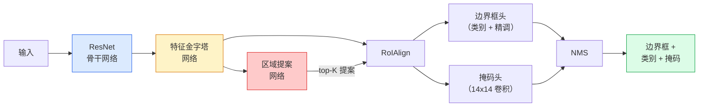

# 实例分割（Instance Segmentation）— Mask R-CNN

> 在 Faster R-CNN 检测器上添加一个微小的掩码头（Mask Head），你就得到了实例分割。难点在于 RoIAlign，而且它比看起来更难。

**类型：** 构建 + 学习（Build + Learn）
**语言：** Python
**前置知识：** 第 4 阶段第 06 课（YOLO）、第 4 阶段第 07 课（U-Net）
**时间：** 约 75 分钟

## 学习目标

- 端到端追踪 Mask R-CNN 架构：骨干网络（Backbone）、FPN、RPN、RoIAlign、边界框头（Box Head）、掩码头（Mask Head）
- 从零开始实现 RoIAlign，并解释为什么 RoIPool 不再使用
- 使用 torchvision 的 `maskrcnn_resnet50_fpn_v2` 预训练模型进行生产级实例掩码生成，并正确读取其输出格式
- 通过替换边界框头和掩码头并冻结骨干网络，在小型自定义数据集上微调 Mask R-CNN

## 问题

语义分割（Semantic Segmentation）为每个类别给出一个掩码。实例分割为每个对象给出一个掩码，即使两个对象属于同一类别。计数个体、跨帧追踪以及测量物体（墙上每块砖的边界框、显微镜图像中的每个细胞）都需要实例分割。

Mask R-CNN（He et al., 2017）通过将实例分割重新定义为"检测加掩码"解决了这个问题。这个设计如此简洁，以至于在接下来的五年里，几乎每篇实例分割论文都是 Mask R-CNN 的变体，而 torchvision 的实现至今仍是中小型数据集的生产默认选择。

困难的工程问题是采样：如何从提案框（Proposal Box）中裁剪出固定大小的特征区域，而该框的角点并不与像素边界对齐？搞错这一点会在各处损失十分之几个 mAP 点。RoIAlign 就是答案。

## 概念

### 架构



需要理解的五个部分：

1. **骨干网络（Backbone）** — 在 ImageNet 上训练的 ResNet-50 或 ResNet-101。产生步长（Stride）为 4、8、16、32 的特征图层次结构。
2. **FPN（特征金字塔网络，Feature Pyramid Network）** — 自上而下 + 横向连接，为每个级别提供 C 个通道的语义丰富特征。检测时查询与目标大小匹配的 FPN 级别。
3. **RPN（区域提案网络，Region Proposal Network）** — 一个小型卷积头，在每个锚点（Anchor）位置预测"这里有目标吗？"和"如何精调边界框？"。每张图像产生约 1000 个提案。
4. **RoIAlign** — 从任何 FPN 级别的任意边界框中采样固定大小（如 7x7）的特征块。双线性采样，无量化。
5. **头部（Heads）** — 两层边界框头精调边界框并选择类别，加上一个小型卷积头为每个提案输出 `28x28` 的二值掩码。

### 为什么是 RoIAlign 而不是 RoIPool

原始的 Fast R-CNN 使用 RoIPool，它将提案框分割成网格，在每个单元格中取最大特征值，并将所有坐标四舍五入为整数。这种四舍五入使特征图与输入像素坐标之间的偏差最多可达一个完整的特征图像素 — 在 224x224 图像上影响很小，但当特征图步长为 32 时是灾难性的。

```
RoIPool:
  box (34.7, 51.3, 98.2, 142.9)
  四舍五入 -> (34, 51, 98, 142)
  分割网格 -> 每个单元格边界四舍五入
  每一步都累积偏差

RoIAlign:
  box (34.7, 51.3, 98.2, 142.9)
  使用双线性插值在精确的浮点坐标处采样
  全程无四舍五入
```

RoIAlign 在 COCO 上免费将掩码 AP 提升了 3-4 个点。每个关心定位的检测器现在都使用它 — YOLOv7 seg、RT-DETR、Mask2Former 都是如此。

### RPN 简述

在特征图的每个位置，放置 K 个不同大小和形状的锚框。为每个锚框预测一个目标性分数（Objectness Score）和一个回归偏移量，将锚框变成更贴合目标的边界框。按分数保留前约 1,000 个框，以 IoU 0.7 应用 NMS，将幸存者交给头部。RPN 使用自己的小型损失进行训练 — 结构与第 6 课的 YOLO 损失相同，只是只有两个类别（目标 / 非目标）。

### 掩码头

对于每个提案（经过 RoIAlign 后），掩码头是一个小型全卷积网络（FCN）：四个 3x3 卷积，一个 2x 反卷积，最后一个 1x1 卷积在 `28x28` 分辨率上产生 `num_classes` 个输出通道。只保留与预测类别对应的通道；其他通道被忽略。这将掩码预测与分类解耦。

将 28x28 掩码上采样到提案的原始像素大小以产生最终的二值掩码。

### 损失函数

Mask R-CNN 有四个损失相加：

```
L = L_rpn_cls + L_rpn_box + L_box_cls + L_box_reg + L_mask
```

- `L_rpn_cls`、`L_rpn_box` — RPN 提案的目标性 + 边界框回归。
- `L_box_cls` — 头部分类器上 (C+1) 个类别（包括背景）的交叉熵。
- `L_box_reg` — 头部边界框精调的平滑 L1。
- `L_mask` — 28x28 掩码输出上的逐像素二值交叉熵。

每个损失有其默认权重；torchvision 实现将它们作为构造函数参数暴露。

### 输出格式

`torchvision.models.detection.maskrcnn_resnet50_fpn_v2` 返回一个字典列表，每张图像一个：

```
{
    "boxes":  (N, 4) 以 (x1, y1, x2, y2) 像素坐标表示,
    "labels": (N,) 类别 ID，0 = 背景，因此索引从 1 开始,
    "scores": (N,) 置信度分数,
    "masks":  (N, 1, H, W) 在 [0, 1] 范围内的浮点掩码 — 以 0.5 为阈值得到二值掩码,
}
```

掩码已经是全图像分辨率。28x28 的头部输出已在内部上采样。

## 构建它

### 步骤 1：从零开始实现 RoIAlign

这是 Mask R-CNN 中唯一一个用代码理解比用文字理解更简单的组件。

```python
import torch
import torch.nn.functional as F

def roi_align_single(feature, box, output_size=7, spatial_scale=1 / 16.0):
    """
    feature: (C, H, W) 单图像特征图
    box: (x1, y1, x2, y2) 以原始图像像素坐标表示
    output_size: 输出网格的边长（边界框头用 7，掩码头用 14）
    spatial_scale: 特征图步长的倒数
    """
    C, H, W = feature.shape
    x1, y1, x2, y2 = [c * spatial_scale - 0.5 for c in box]
    bin_w = (x2 - x1) / output_size
    bin_h = (y2 - y1) / output_size

    grid_y = torch.linspace(y1 + bin_h / 2, y2 - bin_h / 2, output_size)
    grid_x = torch.linspace(x1 + bin_w / 2, x2 - bin_w / 2, output_size)
    yy, xx = torch.meshgrid(grid_y, grid_x, indexing="ij")

    gx = 2 * (xx + 0.5) / W - 1
    gy = 2 * (yy + 0.5) / H - 1
    grid = torch.stack([gx, gy], dim=-1).unsqueeze(0)
    sampled = F.grid_sample(feature.unsqueeze(0), grid, mode="bilinear",
                            align_corners=False)
    return sampled.squeeze(0)
```

每个数字都在双线性采样位置。没有四舍五入，没有量化，没有丢失梯度。

### 步骤 2：与 torchvision 的 RoIAlign 比较

```python
from torchvision.ops import roi_align

feature = torch.randn(1, 16, 50, 50)
boxes = torch.tensor([[0, 10, 20, 100, 90]], dtype=torch.float32)  # (batch_idx, x1, y1, x2, y2)

ours = roi_align_single(feature[0], boxes[0, 1:].tolist(), output_size=7, spatial_scale=1/4)
theirs = roi_align(feature, boxes, output_size=(7, 7), spatial_scale=1/4, sampling_ratio=1, aligned=True)[0]

print(f"shape ours:   {tuple(ours.shape)}")
print(f"shape theirs: {tuple(theirs.shape)}")
print(f"max|diff|:    {(ours - theirs).abs().max().item():.3e}")
```

使用 `sampling_ratio=1` 和 `aligned=True`，两者匹配到 `1e-5` 以内。

### 步骤 3：加载预训练 Mask R-CNN

```python
import torch
from torchvision.models.detection import maskrcnn_resnet50_fpn_v2, MaskRCNN_ResNet50_FPN_V2_Weights

model = maskrcnn_resnet50_fpn_v2(weights=MaskRCNN_ResNet50_FPN_V2_Weights.DEFAULT)
model.eval()
print(f"params: {sum(p.numel() for p in model.parameters()):,}")
print(f"classes (including background): {len(model.roi_heads.box_predictor.cls_score.out_features * [0])}")
```

46M 参数，91 个类别（COCO）。第一个类别（id 0）是背景；模型实际检测的所有内容从 id 1 开始。

### 步骤 4：运行推理

```python
with torch.no_grad():
    x = torch.randn(3, 400, 600)
    predictions = model([x])
p = predictions[0]
print(f"boxes:  {tuple(p['boxes'].shape)}")
print(f"labels: {tuple(p['labels'].shape)}")
print(f"scores: {tuple(p['scores'].shape)}")
print(f"masks:  {tuple(p['masks'].shape)}")
```

掩码张量形状为 `(N, 1, H, W)`。以 0.5 为阈值得到每个目标的二值掩码：

```python
binary_masks = (p['masks'] > 0.5).squeeze(1)  # (N, H, W) 布尔值
```

### 步骤 5：为自定义类别数替换头部

常见的微调方案：复用骨干网络、FPN 和 RPN；替换两个分类器头部。

```python
from torchvision.models.detection.faster_rcnn import FastRCNNPredictor
from torchvision.models.detection.mask_rcnn import MaskRCNNPredictor

def build_custom_maskrcnn(num_classes):
    model = maskrcnn_resnet50_fpn_v2(weights=MaskRCNN_ResNet50_FPN_V2_Weights.DEFAULT)
    in_features = model.roi_heads.box_predictor.cls_score.in_features
    model.roi_heads.box_predictor = FastRCNNPredictor(in_features, num_classes)
    in_features_mask = model.roi_heads.mask_predictor.conv5_mask.in_channels
    hidden_layer = 256
    model.roi_heads.mask_predictor = MaskRCNNPredictor(in_features_mask, hidden_layer, num_classes)
    return model

custom = build_custom_maskrcnn(num_classes=5)
print(f"custom cls_score.out_features: {custom.roi_heads.box_predictor.cls_score.out_features}")
```

`num_classes` 必须包含背景类，因此有 4 个目标类的数据集使用 `num_classes=5`。

### 步骤 6：冻结不需要训练的部分

在小型数据集上，冻结骨干网络和 FPN。只有 RPN 的目标性 + 回归以及两个头部进行学习。

```python
def freeze_backbone_and_fpn(model):
    # torchvision Mask R-CNN 将 FPN 打包在 `model.backbone` 内（作为
    # `model.backbone.fpn`），因此遍历 `model.backbone.parameters()` 覆盖了
    # ResNet 特征层和 FPN 横向/输出卷积。
    for p in model.backbone.parameters():
        p.requires_grad = False
    return model

custom = freeze_backbone_and_fpn(custom)
trainable = sum(p.numel() for p in custom.parameters() if p.requires_grad)
print(f"trainable after freeze: {trainable:,}")
```

在 500 张图像的数据集上，这是收敛和过拟合之间的区别。

## 使用它

torchvision 中 Mask R-CNN 的完整训练循环只有 40 行，在不同任务之间没有实质性变化 — 替换数据集即可。

```python
def train_step(model, images, targets, optimizer):
    model.train()
    loss_dict = model(images, targets)
    losses = sum(loss for loss in loss_dict.values())
    optimizer.zero_grad()
    losses.backward()
    optimizer.step()
    return {k: v.item() for k, v in loss_dict.items()}
```

`targets` 列表必须包含每张图像的字典，其中有 `boxes`、`labels` 和 `masks`（作为 `(num_instances, H, W)` 二值张量）。模型在训练时返回四个损失的字典，在评估时返回预测列表，由 `model.training` 控制。

`pycocotools` 评估器为边界框和掩码分别产生 mAP@IoU=0.5:0.95；你需要两个数字来判断是边界框头还是掩码头是瓶颈。

## 交付它

本课产出：

- `outputs/prompt-instance-vs-semantic-router.md` — 一个提示词，提出三个问题并在实例、语义和全景之间做出选择，同时指定起始模型。
- `outputs/skill-mask-rcnn-head-swapper.md` — 一个技能，为任何 torchvision 检测模型生成替换头部的 10 行代码，给定新的 `num_classes`。

## 练习

1. **（简单）** 在 100 个随机边界框上验证你的 RoIAlign 与 `torchvision.ops.roi_align` 的一致性。报告最大绝对差异。同时运行 RoIPool（2017 年之前的行为），展示它在靠近边界的框上偏差约 1-2 个特征图像素。
2. **（中等）** 在 50 张图像的自定义数据集（任意两个类别：气球、鱼、坑洞、标志）上微调 `maskrcnn_resnet50_fpn_v2`。冻结骨干网络，训练 20 个 epoch，报告掩码 AP@0.5。
3. **（困难）** 将 Mask R-CNN 的掩码头替换为预测 56x56 而非 28x28 的版本。测量替换前后的 mAP@IoU=0.75。解释增益（或缺乏增益）为何符合预期的边界精度 / 内存权衡。

## 关键术语

| 术语 | 人们怎么说 | 实际含义 |
|------|----------------|----------------------|
| Mask R-CNN | "检测 + 掩码" | 在 Faster R-CNN 上添加一个并行掩码预测分支；每个检测到的目标获得一个二值掩码 |
| RoIAlign | "无量化 RoI 池化" | 使用双线性插值在精确浮点坐标处采样 RoI 特征；无四舍五入，无偏差 |
| RoIPool | "旧版 RoI 池化" | 将 RoI 坐标四舍五入为整数，然后池化；在边界处产生 ~1 像素偏差 |
| FPN（特征金字塔网络） | "多尺度特征" | 自上而下路径 + 横向连接，为每个骨干网络级别提供语义丰富的特征 |
| RPN（区域提案网络） | "目标检测器" | 小型卷积头，预测锚框的目标性和回归偏移量 |
| 掩码头（Mask Head） | "掩码预测器" | 小型 FCN，为每个 RoI 输出 28x28 二值掩码；与分类解耦 |
| mAP@IoU=0.5:0.95 | "COCO 指标" | 在 IoU 阈值 0.5 到 0.95 之间平均的均值平均精度；标准检测/分割指标 |

## 扩展阅读

- [Mask R-CNN (He et al., 2017)](https://arxiv.org/abs/1703.06870) — 原始论文；第 3 节（RoIAlign）是必读内容
- [Feature Pyramid Networks for Object Detection (Lin et al., 2017)](https://arxiv.org/abs/1612.03144) — FPN 论文；解释了为什么多尺度特征对检测至关重要
- [torchvision Mask R-CNN 参考文档](https://pytorch.org/vision/main/models/mask_rcnn.html) — 官方 API 和预训练权重
- [Detectron2](https://github.com/facebookresearch/detectron2) — Meta 的检测/分割库；Mask R-CNN 的参考实现
