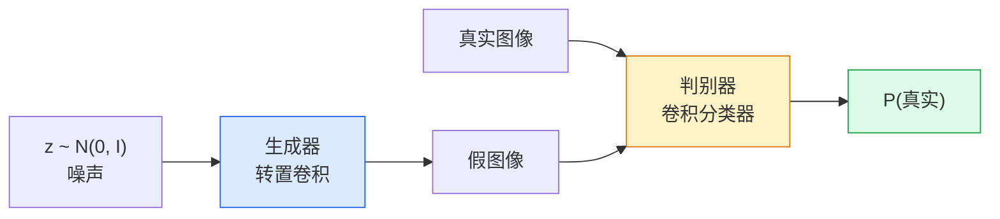
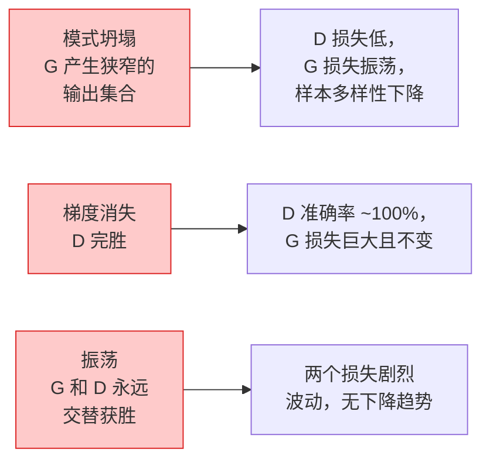

# 图像生成（Image Generation）— GAN

> GAN 是两个神经网络在一个固定博弈（Game）中对抗。一个画画，一个评判。它们一起进步，直到画作能骗过评判者。

**类型：** 构建（Build）
**语言：** Python
**前置知识：** 第 4 阶段第 03 课（CNN）、第 3 阶段第 06 课（优化器）、第 3 阶段第 07 课（正则化）
**时间：** 约 75 分钟

## 学习目标

- 解释生成器（Generator）和判别器（Discriminator）之间的极小极大博弈（Minimax Game），以及为什么均衡点对应 p_model = p_data
- 用 PyTorch 实现一个 DCGAN，在 60 行代码内生成连贯的 32x32 合成图像
- 用三个标准技巧稳定 GAN 训练：非饱和损失（Non-Saturating Loss）、谱归一化（Spectral Norm）、TTUR（双时间尺度更新规则，Two-Timescale Update Rule）
- 阅读训练曲线，区分健康收敛、模式坍塌（Mode Collapse）、振荡（Oscillation）和判别器完胜

## 问题

分类教会网络将图像映射到标签。生成反转了这个问题：采样看起来来自同一分布的新图像。没有可以对比的"正确"输出；只有一个你想要模仿的分布。

标准损失函数（MSE、交叉熵）无法衡量"这个样本是否来自真实分布"。最小化逐像素误差会产生模糊的平均值，而不是逼真的样本。突破在于学习损失：训练第二个网络，其任务是区分真假，并用它的判断来推动生成器。

GAN（Goodfellow et al., 2014）定义了这个框架。到 2018 年，StyleGAN 已经能生成与照片无法区分的 1024x1024 人脸。扩散模型（Diffusion Model）此后在质量和可控性上占据了王座，但使扩散模型实用的每一个技巧 — 归一化选择、潜在空间、特征损失 — 都是在 GAN 上首次理解的。

## 概念

### 两个网络



**生成器（Generator）** G 接收一个噪声向量 `z` 并输出一张图像。**判别器（Discriminator）** D 接收一张图像并输出一个标量：该图像是真实的概率。

### 博弈

G 想让 D 出错。D 想正确。形式化地：

```
min_G max_D  E_x[log D(x)] + E_z[log(1 - D(G(z)))]
```

从右向左读：D 最大化在真实图像（`log D(real)`）和假图像（`log (1 - D(fake))`）上的准确率。G 最小化 D 在假图像上的准确率 — 它希望 `D(G(z))` 很高。

Goodfellow 证明了这个极小极大博弈有一个全局均衡点，其中 `p_G = p_data`，D 处处输出 0.5，生成分布与真实分布之间的 Jensen-Shannon 散度为零。难点在于到达那里。

### 非饱和损失

上述形式在数值上不稳定。在训练早期，`D(G(z))` 对每个假样本都接近零，因此 `log(1 - D(G(z)))` 对 G 的梯度消失。修复方法：翻转 G 的损失。

```
L_D = -E_x[log D(x)] - E_z[log(1 - D(G(z)))]
L_G = -E_z[log D(G(z))]                          # 非饱和
```

现在当 `D(G(z))` 接近零时，G 的损失很大且其梯度信息丰富。每个现代 GAN 都使用这个变体进行训练。

### DCGAN 架构规则

Radford、Metz、Chintala（2015）将多年的失败实验提炼为五条使 GAN 训练稳定的规则：

1. 用步长卷积替换池化（两个网络都如此）。
2. 在生成器和判别器中使用批归一化（Batch Norm），除了 G 的输出和 D 的输入。
3. 在更深架构中移除全连接层。
4. G 在所有层使用 ReLU，除了输出层（输出用 tanh 映射到 [-1, 1]）。
5. D 在所有层使用 LeakyReLU（negative_slope=0.2）。

每个现代基于卷积的 GAN（StyleGAN、BigGAN、GigaGAN）仍然从这些规则出发，一次替换一个部分。

### 失败模式及其特征



- **模式坍塌（Mode Collapse）**：G 找到一张能骗过 D 的图像，然后只生成那张。修复：添加小批量判别（Minibatch Discrimination）、谱归一化或标签条件化。
- **判别器获胜（Discriminator Wins）**：D 变得太强太快，G 的梯度消失。修复：更小的 D、更低的 D 学习率，或对真实标签应用标签平滑（Label Smoothing）。
- **振荡（Oscillation）**：两个网络交替获胜，从未接近均衡。修复：TTUR（D 比 G 学习快 2-4 倍），或切换到 Wasserstein 损失。

### 评估

GAN 没有真实标签，那么如何知道它们是否有效？

- **样本检查（Sample Inspection）** — 在每个 epoch 结束时直接看 64 个样本。不可省略。
- **FID（Fréchet Inception Distance）** — 真实和生成集合的 Inception-v3 特征分布之间的距离。越低越好。社区标准。
- **Inception Score** — 更旧，更脆弱；优先使用 FID。
- **生成模型的精确率/召回率（Precision/Recall for Generative Models）** — 分别衡量质量（精确率）和覆盖度（召回率）。比单独的 FID 更有信息量。

对于小型合成数据运行，样本检查就足够了。

## 构建它

### 步骤 1：生成器

一个小型 DCGAN 生成器，接收 64 维噪声并产生 32x32 图像。

```python
import torch
import torch.nn as nn

class Generator(nn.Module):
    def __init__(self, z_dim=64, img_channels=3, feat=64):
        super().__init__()
        self.net = nn.Sequential(
            nn.ConvTranspose2d(z_dim, feat * 4, kernel_size=4, stride=1, padding=0, bias=False),
            nn.BatchNorm2d(feat * 4),
            nn.ReLU(inplace=True),
            nn.ConvTranspose2d(feat * 4, feat * 2, kernel_size=4, stride=2, padding=1, bias=False),
            nn.BatchNorm2d(feat * 2),
            nn.ReLU(inplace=True),
            nn.ConvTranspose2d(feat * 2, feat, kernel_size=4, stride=2, padding=1, bias=False),
            nn.BatchNorm2d(feat),
            nn.ReLU(inplace=True),
            nn.ConvTranspose2d(feat, img_channels, kernel_size=4, stride=2, padding=1, bias=False),
            nn.Tanh(),
        )

    def forward(self, z):
        return self.net(z.view(z.size(0), -1, 1, 1))
```

四个转置卷积，每个使用 `kernel_size=4, stride=2, padding=1`，因此它们干净地将空间尺寸加倍。通过 tanh 将输出激活值映射到 [-1, 1]。

### 步骤 2：判别器

生成器的镜像。LeakyReLU，步长卷积，以标量 logit 结束。

```python
class Discriminator(nn.Module):
    def __init__(self, img_channels=3, feat=64):
        super().__init__()
        self.net = nn.Sequential(
            nn.Conv2d(img_channels, feat, kernel_size=4, stride=2, padding=1),
            nn.LeakyReLU(0.2, inplace=True),
            nn.Conv2d(feat, feat * 2, kernel_size=4, stride=2, padding=1, bias=False),
            nn.BatchNorm2d(feat * 2),
            nn.LeakyReLU(0.2, inplace=True),
            nn.Conv2d(feat * 2, feat * 4, kernel_size=4, stride=2, padding=1, bias=False),
            nn.BatchNorm2d(feat * 4),
            nn.LeakyReLU(0.2, inplace=True),
            nn.Conv2d(feat * 4, 1, kernel_size=4, stride=1, padding=0),
        )

    def forward(self, x):
        return self.net(x).view(-1)
```

最后一个卷积将 `4x4` 特征图缩减为 `1x1`。输出是每张图像一个标量；仅在损失计算时应用 sigmoid。

### 步骤 3：训练步骤

交替进行：每个批次先更新 D 一次，再更新 G 一次。

```python
import torch.nn.functional as F

def train_step(G, D, real, z, opt_g, opt_d, device):
    real = real.to(device)
    bs = real.size(0)

    # D 步骤
    opt_d.zero_grad()
    d_real = D(real)
    d_fake = D(G(z).detach())
    loss_d = (F.binary_cross_entropy_with_logits(d_real, torch.ones_like(d_real))
              + F.binary_cross_entropy_with_logits(d_fake, torch.zeros_like(d_fake)))
    loss_d.backward()
    opt_d.step()

    # G 步骤
    opt_g.zero_grad()
    d_fake = D(G(z))
    loss_g = F.binary_cross_entropy_with_logits(d_fake, torch.ones_like(d_fake))
    loss_g.backward()
    opt_g.step()

    return loss_d.item(), loss_g.item()
```

D 步骤中的 `G(z).detach()` 至关重要：我们不希望梯度在 D 更新期间流入 G。忘记这一点是经典的初学者错误。

### 步骤 4：在合成形状上的完整训练循环

```python
from torch.utils.data import DataLoader, TensorDataset
import numpy as np

def synthetic_images(num=2000, size=32, seed=0):
    rng = np.random.default_rng(seed)
    imgs = np.zeros((num, 3, size, size), dtype=np.float32) - 1.0
    for i in range(num):
        r = rng.uniform(6, 12)
        cx, cy = rng.uniform(r, size - r, size=2)
        yy, xx = np.meshgrid(np.arange(size), np.arange(size), indexing="ij")
        mask = (xx - cx) ** 2 + (yy - cy) ** 2 < r ** 2
        color = rng.uniform(-0.5, 1.0, size=3)
        for c in range(3):
            imgs[i, c][mask] = color[c]
    return torch.from_numpy(imgs)

device = "cuda" if torch.cuda.is_available() else "cpu"
data = synthetic_images()
loader = DataLoader(TensorDataset(data), batch_size=64, shuffle=True)

G = Generator(z_dim=64, img_channels=3, feat=32).to(device)
D = Discriminator(img_channels=3, feat=32).to(device)
opt_g = torch.optim.Adam(G.parameters(), lr=2e-4, betas=(0.5, 0.999))
opt_d = torch.optim.Adam(D.parameters(), lr=2e-4, betas=(0.5, 0.999))

for epoch in range(10):
    for (batch,) in loader:
        z = torch.randn(batch.size(0), 64, device=device)
        ld, lg = train_step(G, D, batch, z, opt_g, opt_d, device)
    print(f"epoch {epoch}  D {ld:.3f}  G {lg:.3f}")
```

`Adam(lr=2e-4, betas=(0.5, 0.999))` 是 DCGAN 的默认设置 — 较低的 beta1 防止动量项过度稳定对抗博弈。

### 步骤 5：采样

```python
@torch.no_grad()
def sample(G, n=16, z_dim=64, device="cpu"):
    G.eval()
    z = torch.randn(n, z_dim, device=device)
    imgs = G(z)
    imgs = (imgs + 1) / 2
    return imgs.clamp(0, 1)
```

采样前始终切换到 eval 模式。对于 DCGAN，这很重要，因为批归一化使用运行统计量而非批次统计量。

### 步骤 6：谱归一化

判别器中 BN 的即插即用替代方案，保证网络是 1-Lipschitz 的。修复大多数"D 赢得太狠"的失败。

```python
from torch.nn.utils import spectral_norm

def build_sn_discriminator(img_channels=3, feat=64):
    return nn.Sequential(
        spectral_norm(nn.Conv2d(img_channels, feat, 4, 2, 1)),
        nn.LeakyReLU(0.2, inplace=True),
        spectral_norm(nn.Conv2d(feat, feat * 2, 4, 2, 1)),
        nn.LeakyReLU(0.2, inplace=True),
        spectral_norm(nn.Conv2d(feat * 2, feat * 4, 4, 2, 1)),
        nn.LeakyReLU(0.2, inplace=True),
        spectral_norm(nn.Conv2d(feat * 4, 1, 4, 1, 0)),
    )
```

将 `Discriminator` 替换为 `build_sn_discriminator()`，通常就不需要 TTUR 技巧了。谱归一化是你可以应用的最简单的单一鲁棒性升级。

## 使用它

对于严肃的生成任务，使用预训练权重或切换到扩散模型。两个标准库：

- `torch_fidelity` 在你的生成器上计算 FID / IS，无需编写自定义评估代码。
- `pytorch-gan-zoo`（遗留）和 `StudioGAN` 提供了 DCGAN、WGAN-GP、SN-GAN、StyleGAN 和 BigGAN 的经过测试的实现。

在 2026 年，GAN 仍然是以下场景的最佳选择：实时图像生成（延迟 <10 ms）、风格迁移（Style Transfer）、具有精确控制的图像到图像翻译（Pix2Pix、CycleGAN）。扩散模型在照片真实感和文本条件化方面胜出。

## 交付它

本课产出：

- `outputs/prompt-gan-training-triage.md` — 一个提示词，读取训练曲线描述并选择失败模式（模式坍塌、D 获胜、振荡）以及推荐的单一修复方案。
- `outputs/skill-dcgan-scaffold.md` — 一个技能，从 `z_dim`、目标 `image_size` 和 `num_channels` 编写 DCGAN 脚手架，包括训练循环和样本保存器。

## 练习

1. **（简单）** 在合成圆形数据集上训练上述 DCGAN，并在每个 epoch 结束时保存 16 个样本的网格。到哪个 epoch 时生成的圆形变得明显是圆形的？
2. **（中等）** 将判别器的批归一化替换为谱归一化。并排训练两个版本。哪个收敛更快？哪个在三个随机种子上的方差更低？
3. **（困难）** 实现一个条件 DCGAN：将类别标签输入 G 和 D（在 G 中将 one-hot 拼接到噪声中，在 D 中拼接一个类别嵌入通道）。在第 7 课的合成"圆形 vs 方形"数据集上训练，并通过使用特定标签采样来展示类别条件化有效。

## 关键术语

| 术语 | 人们怎么说 | 实际含义 |
|------|----------------|----------------------|
| 生成器（Generator, G） | "伪造者" | 将噪声映射到图像的神经网络；试图生成判别器无法与真实图像区分的样本 |
| 判别器（Discriminator, D） | "评论家" | 将图像映射到 P(真实) 的神经网络；试图正确标记真实图像和生成图像 |
| 极小极大博弈（Minimax Game） | "对抗训练" | G 最小化而 D 最大化的目标；均衡点是 p_G = p_data |
| 非饱和损失（Non-Saturating Loss） | "翻转的 G 损失" | G 最大化 log D(G(z)) 而非最小化 log(1 - D(G(z)))；修复梯度消失 |
| 模式坍塌（Mode Collapse） | "G 只生成一种东西" | G 找到少数能骗过 D 的样本并只生成这些；多样性崩溃 |
| 谱归一化（Spectral Norm） | "1-Lipschitz 约束" | 将每层的谱范数限制为 1；稳定 D 训练，无需调整学习率 |
| TTUR | "D 学得更快" | D 的学习率是 G 的 2-4 倍；防止 D 落后于 G |
| FID | "生成质量分数" | Fréchet Inception Distance；真实与生成 Inception 特征之间的 Wasserstein-2 距离 |

## 扩展阅读

- [Generative Adversarial Nets (Goodfellow et al., 2014)](https://arxiv.org/abs/1406.2661) — 原始 GAN 论文；第 4 节证明了均衡点的存在
- [DCGAN: Unsupervised Representation Learning with Deep Convolutional GANs (Radford et al., 2015)](https://arxiv.org/abs/1511.06434) — 使 GAN 稳定工作的五条架构规则
- [Improved Techniques for Training GANs (Salimans et al., 2016)](https://arxiv.org/abs/1606.03498) — 小批量判别、特征匹配、历史平均
- [Spectral Normalization for GANs (Miyato et al., 2018)](https://arxiv.org/abs/1802.05957) — 谱归一化；最简单的单一稳定性升级
