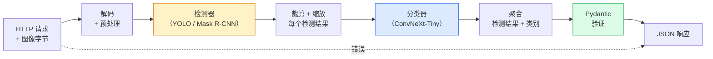

# 构建完整的视觉流水线（Vision Pipeline）— 综合项目（Capstone）

> 一个生产级视觉系统是由模型和规则组成的链条，通过数据契约（Data Contract）缝合在一起。各个组件已经在本阶段中；综合项目将它们端到端地连接起来。

**类型：** 构建（Build）
**语言：** Python
**前置知识：** 第 4 阶段第 01-15 课
**时间：** 约 120 分钟

## 学习目标

- 设计一个生产级视觉流水线，检测目标、分类目标并输出结构化 JSON — 处理每个失败路径
- 将检测器（Mask R-CNN 或 YOLO）、分类器（ConvNeXt-Tiny）和数据契约（Pydantic）插入一个服务中
- 对端到端流水线进行基准测试，并确定第一个瓶颈（通常是预处理，然后是检测器）
- 交付一个最小 FastAPI 服务，接受图像上传，运行流水线，并返回带有分类的检测结果

## 问题

单个视觉模型是有用的；视觉产品是它们的链条。零售货架审计是检测器加产品分类器加价格 OCR 流水线。自动驾驶是 2D 检测器加 3D 检测器加分割器加追踪器加规划器。医学预筛查是分割器加区域分类器加临床医生 UI。

连接这些链条是将 ML 原型与产品区分开来的部分。模型之间的每个接口都是新的错误来源。每个坐标变换、每个归一化、每个掩码缩放都是静默失败的候选者。流水线的强度取决于其最弱的接口。

本综合项目建立最小可行流水线：检测 + 分类 + 结构化输出 + 服务层。第 4 阶段的其他所有内容都可以插入这个骨架：将 Mask R-CNN 替换为 YOLOv8，添加 OCR 头，添加分割分支，添加追踪器。架构是稳定的；组件是可插拔的。

## 概念

### 流水线



七个阶段。两个模型阶段是昂贵的；其他五个阶段是错误所在的地方。

### 使用 Pydantic 的数据契约

每个模型边界都变成一个类型化对象。这将静默失败变成响亮的失败。

```
Detection(
    box: tuple[float, float, float, float],   # (x1, y1, x2, y2)，绝对像素
    score: float,                              # [0, 1]
    class_id: int,                             # 来自检测器的标签映射
    mask: Optional[list[list[int]]],           # 如果存在则为 RLE 编码
)

PipelineResult(
    image_id: str,
    detections: list[Detection],
    classifications: list[Classification],
    inference_ms: float,
)
```

当检测器返回 `(cx, cy, w, h)` 格式的框而非 `(x1, y1, x2, y2)` 时，Pydantic 的验证在边界处失败，你立即发现，而不是调试一个静默返回空区域的下游裁剪。

### 延迟去了哪里

三个事实在几乎每个视觉流水线中都成立：

1. **预处理通常是最大的单一块。** 解码 JPEG、转换颜色空间、缩放 — 这些都是 CPU 密集型的，容易被遗忘。
2. **检测器主导 GPU 时间。** 70-90% 的 GPU 时间在检测前向传播中。
3. **后处理（NMS、RLE 编码/解码）在 GPU 上便宜，在 CPU 上昂贵。** 始终在实际目标上进行分析。

了解分布是将优化变成优先级列表的关键。

### 失败模式

- **空检测结果** — 返回空列表，不要崩溃。记录日志。
- **越界框** — 裁剪前钳制到图像大小。
- **过小的裁剪** — 对小于分类器最小输入的框跳过分类。
- **损坏的上传** — 400 响应带特定错误码，而非 500。
- **模型加载失败** — 在服务启动时失败，而非在第一个请求时。

生产流水线处理以上每一种情况，而不编写隐藏失败的通用 `try/except`。每个失败都有一个命名代码和一个响应。

### 批处理

生产服务服务多个客户端。跨请求批处理检测和分类可以倍增吞吐量。权衡：等待批次填满带来的额外延迟。典型设置：收集请求最多 20ms，批处理在一起，处理，分发响应。`torchserve` 和 `triton` 原生支持；负载可预测的小型服务自己实现微批处理器（Micro-Batcher）。

## 构建它

### 步骤 1：数据契约

```python
from pydantic import BaseModel, Field
from typing import List, Optional, Tuple

class Detection(BaseModel):
    box: Tuple[float, float, float, float]
    score: float = Field(ge=0, le=1)
    class_id: int = Field(ge=0)
    mask_rle: Optional[str] = None


class Classification(BaseModel):
    detection_index: int
    class_id: int
    class_name: str
    score: float = Field(ge=0, le=1)


class PipelineResult(BaseModel):
    image_id: str
    detections: List[Detection]
    classifications: List[Classification]
    inference_ms: float
```

五秒钟的代码节省了在任何严肃流水线上一个小时的调试时间。

### 步骤 2：最小 Pipeline 类

```python
import time
import numpy as np
import torch
from PIL import Image

class VisionPipeline:
    def __init__(self, detector, classifier, class_names,
                 device="cpu", min_crop=32):
        self.detector = detector.to(device).eval()
        self.classifier = classifier.to(device).eval()
        self.class_names = class_names
        self.device = device
        self.min_crop = min_crop

    def preprocess(self, image):
        """
        image: PIL.Image 或 np.ndarray (H, W, 3) uint8
        返回: 设备上的 CHW float 张量
        """
        if isinstance(image, Image.Image):
            image = np.asarray(image.convert("RGB"))
        tensor = torch.from_numpy(image).permute(2, 0, 1).float() / 255.0
        return tensor.to(self.device)

    @torch.no_grad()
    def detect(self, image_tensor):
        return self.detector([image_tensor])[0]

    @torch.no_grad()
    def classify(self, crops):
        if len(crops) == 0:
            return []
        batch = torch.stack(crops).to(self.device)
        logits = self.classifier(batch)
        probs = logits.softmax(-1)
        scores, cls = probs.max(-1)
        return list(zip(cls.tolist(), scores.tolist()))

    def run(self, image, image_id="anonymous"):
        t0 = time.perf_counter()
        tensor = self.preprocess(image)
        det = self.detect(tensor)

        crops = []
        detections = []
        valid_indices = []
        for i, (box, score, cls) in enumerate(zip(det["boxes"], det["scores"], det["labels"])):
            x1, y1, x2, y2 = [max(0, int(b)) for b in box.tolist()]
            x2 = min(x2, tensor.shape[-1])
            y2 = min(y2, tensor.shape[-2])
            detections.append(Detection(
                box=(x1, y1, x2, y2),
                score=float(score),
                class_id=int(cls),
            ))
            if (x2 - x1) < self.min_crop or (y2 - y1) < self.min_crop:
                continue
            crop = tensor[:, y1:y2, x1:x2]
            crop = torch.nn.functional.interpolate(
                crop.unsqueeze(0),
                size=(224, 224),
                mode="bilinear",
                align_corners=False,
            )[0]
            crops.append(crop)
            valid_indices.append(i)

        class_preds = self.classify(crops)

        classifications = []
        for valid_idx, (cls_id, cls_score) in zip(valid_indices, class_preds):
            classifications.append(Classification(
                detection_index=valid_idx,
                class_id=int(cls_id),
                class_name=self.class_names[cls_id],
                score=float(cls_score),
            ))

        return PipelineResult(
            image_id=image_id,
            detections=detections,
            classifications=classifications,
            inference_ms=(time.perf_counter() - t0) * 1000,
        )
```

每个接口都是类型化的。每个失败路径都有特定的处理决策。

### 步骤 3：连接检测器和分类器

```python
from torchvision.models.detection import maskrcnn_resnet50_fpn_v2
from torchvision.models import convnext_tiny

# 使用 ImageNet 预训练权重构建真实流水线，无需训练
detector = maskrcnn_resnet50_fpn_v2(weights="DEFAULT")
classifier = convnext_tiny(weights="DEFAULT")
class_names = [f"imagenet_class_{i}" for i in range(1000)]

pipe = VisionPipeline(detector, classifier, class_names)

# 用合成图像进行冒烟测试
test_image = (np.random.rand(400, 600, 3) * 255).astype(np.uint8)
result = pipe.run(test_image, image_id="demo")
print(result.model_dump_json(indent=2)[:500])
```

### 步骤 4：FastAPI 服务

```python
from fastapi import FastAPI, UploadFile, HTTPException
from io import BytesIO

app = FastAPI()
pipe = None  # 在启动时初始化

@app.on_event("startup")
def load():
    global pipe
    detector = maskrcnn_resnet50_fpn_v2(weights="DEFAULT").eval()
    classifier = convnext_tiny(weights="DEFAULT").eval()
    pipe = VisionPipeline(detector, classifier, class_names=[f"c{i}" for i in range(1000)])

@app.post("/detect")
async def detect_endpoint(file: UploadFile):
    if file.content_type not in {"image/jpeg", "image/png", "image/webp"}:
        raise HTTPException(status_code=400, detail="unsupported image type")
    data = await file.read()
    try:
        img = Image.open(BytesIO(data)).convert("RGB")
    except Exception:
        raise HTTPException(status_code=400, detail="cannot decode image")
    result = pipe.run(img, image_id=file.filename or "upload")
    return result.model_dump()
```

使用 `uvicorn main:app --host 0.0.0.0 --port 8000` 运行。使用 `curl -F 'file=@dog.jpg' http://localhost:8000/detect` 测试。

### 步骤 5：基准测试流水线

```python
import time

def benchmark(pipe, num_runs=20, image_size=(400, 600)):
    img = (np.random.rand(*image_size, 3) * 255).astype(np.uint8)
    pipe.run(img)  # 预热

    stages = {"preprocess": [], "detect": [], "classify": [], "total": []}
    for _ in range(num_runs):
        t0 = time.perf_counter()
        tensor = pipe.preprocess(img)
        t1 = time.perf_counter()
        det = pipe.detect(tensor)
        t2 = time.perf_counter()
        crops = []
        for box in det["boxes"]:
            x1, y1, x2, y2 = [max(0, int(b)) for b in box.tolist()]
            x2 = min(x2, tensor.shape[-1])
            y2 = min(y2, tensor.shape[-2])
            if (x2 - x1) >= pipe.min_crop and (y2 - y1) >= pipe.min_crop:
                crop = tensor[:, y1:y2, x1:x2]
                crop = torch.nn.functional.interpolate(
                    crop.unsqueeze(0), size=(224, 224), mode="bilinear", align_corners=False
                )[0]
                crops.append(crop)
        pipe.classify(crops)
        t3 = time.perf_counter()
        stages["preprocess"].append((t1 - t0) * 1000)
        stages["detect"].append((t2 - t1) * 1000)
        stages["classify"].append((t3 - t2) * 1000)
        stages["total"].append((t3 - t0) * 1000)

    for stage, times in stages.items():
        times.sort()
        print(f"{stage:12s}  p50={times[len(times)//2]:7.1f} ms  p95={times[int(len(times)*0.95)]:7.1f} ms")
```

CPU 上的典型输出：预处理约 3 ms，检测 300-500 ms，分类 20-40 ms，总计 350-550 ms。在 GPU 上，检测为 20-40 ms，预处理和分类在相对意义上开始更重要。

## 使用它

生产模板收敛到相同的结构，外加：

- **模型版本化** — 始终在响应中记录模型名称和权重哈希。
- **每个请求的追踪 ID（Trace ID）** — 为每个请求记录每个阶段的时间，以便将慢响应与阶段关联起来。
- **回退路径（Fallback Path）** — 如果分类器超时，返回不带分类的检测结果，而不是使整个请求失败。
- **安全过滤器** — NSFW / PII 过滤器在分类之后、响应离开服务之前运行。
- **批处理端点** — 一个 `/detect_batch` 端点，接受图像 URL 列表进行批量处理。

对于生产级服务，`torchserve`、`Triton Inference Server` 和 `BentoML` 开箱即用地处理批处理、版本化、指标和健康检查。直接运行 `FastAPI` 对原型和小规模产品来说是可以的。

## 交付它

本课产出：

- `outputs/prompt-vision-service-shape-reviewer.md` — 一个提示词，审查视觉服务的代码是否存在契约/响应形状违规，并指出第一个破坏性错误。
- `outputs/skill-pipeline-budget-planner.md` — 一个技能，给定目标延迟和吞吐量，为每个流水线阶段分配时间预算，并标记哪个阶段将首先超出预算。

## 练习

1. **（简单）** 在任何开放数据集的 10 张图像上运行流水线。报告每个阶段的平均时间和每张图像检测数量的分布。
2. **（中等）** 向 `Detection` 添加掩码输出字段并将其编码为 RLE。验证即使对于 10 个目标的图像，JSON 也保持在 1MB 以下。
3. **（困难）** 在分类器前添加微批处理器：收集裁剪最多 10 ms，在一次 GPU 调用中对它们全部分类，按请求返回结果。测量每秒 5 个并发请求时的吞吐量增益和增加的延迟。

## 关键术语

| 术语 | 人们怎么说 | 实际含义 |
|------|----------------|----------------------|
| 流水线（Pipeline） | "系统" | 预处理、推理和后处理步骤的有序链条，每对之间有类型化接口 |
| 数据契约（Data Contract） | "模式" | 每个阶段输入和输出遵循的 Pydantic / dataclass 定义；在边界处捕获集成错误 |
| 预处理（Preprocessing） | "模型之前" | 解码、颜色转换、缩放、归一化；通常是最大的 CPU 时间消耗 |
| 后处理（Postprocessing） | "模型之后" | NMS、掩码缩放、阈值、RLE 编码；GPU 上便宜，CPU 上昂贵 |
| 微批处理器（Microbatcher） | "收集然后前向传播" | 等待固定窗口收集多个请求，运行单次批处理前向传播的聚合器 |
| 追踪 ID（Trace ID） | "请求 ID" | 在每个阶段记录的每个请求标识符，以便端到端追踪慢请求 |
| 失败代码（Failure Code） | "命名错误" | 每个失败类别的特定错误码，而非通用 500；使客户端重试逻辑成为可能 |
| 健康检查（Health Check） | "就绪探针" | 报告服务是否能应答的廉价端点；负载均衡器依赖于此 |

## 扩展阅读

- [Full Stack Deep Learning — Deploying Models](https://fullstackdeeplearning.com/course/2022/lecture-5-deployment/) — 生产 ML 部署的经典概述
- [BentoML 文档](https://docs.bentoml.com) — 带批处理、版本化和指标的服务框架
- [torchserve 文档](https://pytorch.org/serve/) — PyTorch 的官方服务库
- [NVIDIA Triton Inference Server](https://developer.nvidia.com/triton-inference-server) — 带批处理和多模型支持的高吞吐量服务
