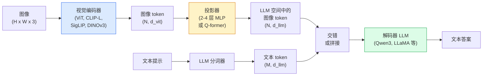

# 视觉语言模型——ViT-MLP-LLM 模式（Vision-Language Models — The ViT-MLP-LLM Pattern）

> 视觉编码器将图像转换为 token。MLP 投影器将这些 token 映射到 LLM 的嵌入空间。语言模型完成其余工作。这种模式——ViT-MLP-LLM——是 2026 年每个生产级 VLM。

**类型：** 学习 + 使用
**语言：** Python
**前置要求：** 第四阶段第 14 课（ViT）、第四阶段第 18 课（CLIP）、第七阶段第 02 课（自注意力）
**时间：** 约 75 分钟

## 学习目标

- 陈述 ViT-MLP-LLM 架构并解释三个组件各自贡献什么
- 在参数数量、上下文长度和基准性能上比较 Qwen3-VL、InternVL3.5、LLaVA-Next 和 GLM-4.6V
- 解释 DeepStack：为什么多层 ViT 特征比单个最后一层特征更好地收紧视觉-语言对齐
- 使用跨模态错误率（Cross-Modal Error Rate, CMER）衡量生产中的 VLM 幻觉并据此采取行动

## 问题

CLIP（第四阶段第 18 课）给你一个图像和文本的共享嵌入空间，这足以进行零样本分类和检索。它无法回答"这张图像中有多少辆红色汽车？"，因为 CLIP 不生成文本——它只评分相似度。

视觉语言模型（Vision-Language Models, VLMs）——Qwen3-VL、InternVL3.5、LLaVA-Next、GLM-4.6V——将 CLIP 家族的图像编码器连接到完整的语言模型。模型看到图像加问题并生成答案。在 2026 年，开源 VLM 在多模态基准（MMMU、MMBench、DocVQA、ChartQA、MathVista、OSWorld）上匹敌或击败 GPT-5 和 Gemini-2.5-Pro。

三件套（ViT、投影器、LLM）是标准。模型之间的差异在于哪个 ViT、哪个投影器、哪个 LLM、训练数据和对齐配方。一旦你理解了这种模式，替换任何组件都是机械的。

## 概念

### ViT-MLP-LLM 架构



1. **视觉编码器**——预训练的 ViT（CLIP-L/14、SigLIP、DINOv3 或微调变体）。产生块 token。
2. **投影器（Projector）**——一个小模块（2-4 层 MLP，或 Q-former），将视觉 token 映射到 LLM 的嵌入维度。这是大部分微调发生的地方。
3. **LLM**——仅解码器语言模型（Qwen3、Llama、Mistral、GLM、InternLM）。按顺序读取视觉 + 文本 token，生成文本。

原则上所有三部分都是可训练的。在实践中，视觉编码器和 LLM 大部分保持冻结，而投影器训练——几十亿参数的信号，成本低廉。

### DeepStack

普通投影仅使用最后一层 ViT。DeepStack（Qwen3-VL）从多个 ViT 深度采样特征并堆叠它们。更深的层携带高级语义；更浅的层携带细粒度空间和纹理信息。将两者馈送到 LLM 缩小了"图像包含什么"（语义）和"确切在哪里"（空间接地）之间的差距。

### 三个训练阶段

现代 VLM 分阶段训练：

1. **对齐（Alignment）**——冻结 ViT 和 LLM。仅在图像-标题对上训练投影器。教会投影器将视觉空间映射到语言空间。
2. **预训练（Pre-training）**——解冻所有内容。在大规模交错图像-文本数据（5 亿+对）上训练。构建模型的视觉知识。
3. **指令微调（Instruction tuning）**——在精选的（图像、问题、答案）三元组上微调。教会对话行为和任务格式。这是将"视觉感知 LM"转变为可用助手的关键。

大多数 LoRA 微调针对阶段 3，使用小型标注数据集。

### 模型家族比较（2026 年初）

| 模型 | 参数 | 视觉编码器 | LLM | 上下文 | 优势 |
|-------|--------|----------------|-----|---------|-----------|
| Qwen3-VL-235B-A22B (MoE) | 235B（22B 活跃） | 自定义 ViT + DeepStack | Qwen3 | 256K | 通用 SOTA，GUI 代理 |
| Qwen3-VL-30B-A3B (MoE) | 30B（3B 活跃） | 自定义 ViT + DeepStack | Qwen3 | 256K | 较小的 MoE 替代方案 |
| Qwen3-VL-8B（密集） | 8B | 自定义 ViT | Qwen3 | 128K | 生产级密集默认选择 |
| InternVL3.5-38B | 38B | InternViT-6B | Qwen3 + GPT-OSS | 128K | 强大的 MMBench / MMVet |
| InternVL3.5-241B-A28B | 241B（28B 活跃） | InternViT-6B | Qwen3 | 128K | 与 GPT-4o 竞争 |
| LLaVA-Next 72B | 72B | SigLIP | Llama-3 | 32K | 开放，易于微调 |
| GLM-4.6V | ~70B | 自定义 | GLM | 64K | 开源，强大的 OCR |
| MiniCPM-V-2.6 | 8B | SigLIP | MiniCPM | 32K | 边缘友好 |

### 视觉代理

Qwen3-VL-235B 在 OSWorld 上达到全球顶级性能——OSWorld 是一个用于操作 GUI（桌面、移动、Web）的**视觉代理（Visual Agents）**基准。模型看到截图，理解 UI，并发出动作（点击、输入、滚动）。结合工具，它闭合了常见桌面任务的循环。这是大多数 2026 年"AI PC"演示在底层运行的内容。

### 代理能力 + RoPE 变体

VLM 需要知道帧在视频中的**时间**。Qwen3-VL 从 T-RoPE（时间旋转位置嵌入）演变为**基于文本的时间对齐**——与视频帧交错的显式时间戳文本 token。模型看到"`<timestamp 00:32>` 帧，提示"，并可以推理时间关系。

### 对齐问题

爬取数据集中 12% 的图像-文本对包含未完全基于图像的描述。在此上训练的 VLM 会悄然学会幻觉——捏造对象、误读数字、发明关系。在生产中，这是主要的失败模式。

Skywork.ai 引入了**跨模态错误率（Cross-Modal Error Rate, CMER）**来追踪它：

```
CMER = 文本置信度高但图像-文本相似度（通过 CLIP 家族检查器）低的输出比例
```

高 CMER 意味着模型自信地说出未基于图像的内容。监控 CMER 并将其作为生产 KPI 处理，在他们的部署中将幻觉率降低了约 35%。技巧不是"修复模型"，而是"将高 CMER 输出路由到人工审核"。

### 使用 LoRA / QLoRA 微调

对大多数团队来说，全量微调 70B VLM 是不可及的。LoRA（秩 16-64）在注意力 + 投影器层上，或 QLoRA 使用 4 位基础权重，适合单个 A100 / H100。成本：5,000-50,000 个样本，$100-$5,000 计算费用，2-10 小时训练。

### 空间推理仍然薄弱

当前 VLM 在空间推理基准（上下、左右、计数、距离）上得分 50-60%。如果你的用例依赖于"哪个物体在哪个物体上面"，请大量验证——通用 VLM 性能低于人类。对于纯空间任务，比 VLM 更好的替代方案：专门的关键点/姿态估计器、深度模型或带框几何后处理的检测模型。

## 构建它

### 步骤 1：投影器

你最常训练的部分。2-4 层 MLP 带 GELU。

```python
import torch
import torch.nn as nn


class Projector(nn.Module):
    def __init__(self, vit_dim=768, llm_dim=4096, hidden=4096):
        super().__init__()
        self.net = nn.Sequential(
            nn.Linear(vit_dim, hidden),
            nn.GELU(),
            nn.Linear(hidden, llm_dim),
        )

    def forward(self, x):
        return self.net(x)
```

输入是 `(N_patches, d_vit)` token 张量。输出是 `(N_patches, d_llm)`。LLM 将每个输出行视为另一个 token。

### 步骤 2：端到端组装 ViT-MLP-LLM

最小 VLM 的前向传播骨架。真实代码使用 `transformers`；这是概念布局。

```python
class MinimalVLM(nn.Module):
    def __init__(self, vit, projector, llm, image_token_id):
        super().__init__()
        self.vit = vit
        self.projector = projector
        self.llm = llm
        self.image_token_id = image_token_id  # 文本提示中的占位 token

    def forward(self, image, input_ids, attention_mask):
        # 1. 视觉特征
        vision_tokens = self.vit(image)                     # (B, N_patches, d_vit)
        vision_embeds = self.projector(vision_tokens)       # (B, N_patches, d_llm)

        # 2. 文本嵌入
        text_embeds = self.llm.get_input_embeddings()(input_ids)  # (B, M, d_llm)

        # 3. 用视觉嵌入替换图像占位 token
        merged = self._merge(text_embeds, vision_embeds, input_ids)

        # 4. 运行 LLM
        return self.llm(inputs_embeds=merged, attention_mask=attention_mask)

    def _merge(self, text_embeds, vision_embeds, input_ids):
        out = text_embeds.clone()
        expected = vision_embeds.size(1)
        for b in range(input_ids.size(0)):
            positions = (input_ids[b] == self.image_token_id).nonzero(as_tuple=True)[0]
            if len(positions) != expected:
                raise ValueError(
                    f"批次项 {b} 有 {len(positions)} 个图像 token，但 vision_embeds 有 {expected} 个块。"
                    " 批次中的每个样本必须预填充到相同数量的图像占位 token。")
            out[b, positions] = vision_embeds[b]
        return out
```

文本中的 `<image>` 占位 token 被替换为真实图像嵌入——LLaVA、Qwen-VL 和 InternVL 使用的相同模式。

### 步骤 3：CMER 计算

轻量级运行时检查。

```python
import torch.nn.functional as F


def cross_modal_error_rate(image_emb, text_emb, text_confidence, sim_threshold=0.25, conf_threshold=0.8):
    """
    image_emb, text_emb: 图像和生成文本的嵌入（内部归一化）
    text_confidence:     平均每 token 概率，在 [0, 1] 中
    返回：               高置信度但图像-文本对齐低的输出比例
    """
    image_emb = F.normalize(image_emb, dim=-1)
    text_emb = F.normalize(text_emb, dim=-1)
    sim = (image_emb * text_emb).sum(dim=-1)        # 余弦相似度
    high_conf_low_sim = (text_confidence > conf_threshold) & (sim < sim_threshold)
    return high_conf_low_sim.float().mean().item()
```

将 CMER 作为生产 KPI 处理。按端点、按提示类型、按客户监控它。上升的 CMER 表明模型开始在某个输入分布上产生幻觉。

### 步骤 4：玩具 VLM 分类器（可运行）

演示投影器训练。假的"ViT 特征"进入；一个微型 LLM 风格 token 预测一个类别。

```python
class ToyVLM(nn.Module):
    def __init__(self, vit_dim=32, llm_dim=64, num_classes=5):
        super().__init__()
        self.projector = Projector(vit_dim, llm_dim, hidden=64)
        self.head = nn.Linear(llm_dim, num_classes)

    def forward(self, vision_tokens):
        projected = self.projector(vision_tokens)
        pooled = projected.mean(dim=1)
        return self.head(pooled)
```

可以在合成（特征，类别）对上在 200 步内拟合——足以展示投影器模式有效。

## 使用它

2026 年生产团队使用 VLM 的三种方式：

- **托管 API**——OpenAI Vision、Anthropic Claude Vision、Google Gemini Vision。零基础设施，供应商风险。
- **开源自托管**——Qwen3-VL 或 InternVL3.5 通过 `transformers` 和 `vllm`。完全控制，前期投入更高。
- **在领域上微调**——加载 Qwen2.5-VL-7B 或 LLaVA-1.6-7B，在 5k-50k 自定义样本上 LoRA，用 `vllm` 或 `TGI` 服务。

```python
from transformers import AutoProcessor, AutoModelForVision2Seq
import torch
from PIL import Image

model_id = "Qwen/Qwen3-VL-8B-Instruct"
processor = AutoProcessor.from_pretrained(model_id)
model = AutoModelForVision2Seq.from_pretrained(model_id, torch_dtype=torch.bfloat16, device_map="auto")

messages = [{
    "role": "user",
    "content": [
        {"type": "image", "image": Image.open("plot.png")},
        {"type": "text", "text": "What does this chart show?"},
    ],
}]
inputs = processor.apply_chat_template(messages, add_generation_prompt=True, tokenize=True, return_dict=True, return_tensors="pt").to("cuda")
generated = model.generate(**inputs, max_new_tokens=256)
answer = processor.decode(generated[0][inputs["input_ids"].shape[1]:], skip_special_tokens=True)
```

`apply_chat_template` 隐藏了 `<image>` 占位 token 的分词；模型在内部处理合并。

## 交付它

本课产出：

- `outputs/prompt-vlm-selector.md`——一个提示词，根据准确率、延迟、上下文长度和预算选择 Qwen3-VL / InternVL3.5 / LLaVA-Next / API。
- `outputs/skill-cmer-monitor.md`——发出代码，用跨模态错误率、每端点仪表板和告警阈值来仪表化生产 VLM 端点。

## 练习

1. **（简单）**在五张图像上通过任何开放 VLM 运行三个提示（"这是什么？"、"数物体"、"描述场景"）。手动将每个答案评分为正确 / 部分正确 / 幻觉。计算首次 CMER 类比率。
2. **（中等）**在目标领域的 500 张带标题图像上使用 LoRA（秩 16）微调 Qwen2.5-VL-3B 或 LLaVA-1.6-7B。比较零样本 vs 微调的 MMBench 风格准确率。
3. **（困难）**将 VLM 的图像编码器替换为 DINOv3 而非其默认的 SigLIP/CLIP。仅重新训练投影器（冻结 LLM + 冻结 DINOv3）。衡量密集预测任务（计数、空间推理）是否改进。

## 关键术语

| 术语 | 人们怎么说 | 实际含义 |
|------|----------------|----------------------|
| VLM | "视觉语言模型" | 接受图像 + 文本并生成文本的模型；ViT-MLP-LLM 是标准架构 |
| 投影器（Projector） | "视觉到语言桥" | 将 ViT 输出映射到 LLM 嵌入空间的 MLP；大部分微调发生在这里 |
| DeepStack | "多层 ViT 特征" | 从多个 ViT 深度采样特征以改善空间接地 |
| 对齐（Alignment） | "阶段 1 训练" | 仅训练投影器以将视觉空间映射到语言空间 |
| CMER | "幻觉 KPI" | 跨模态错误率；高置信度但低图像-文本对齐的输出比例 |
| LoRA | "廉价微调" | 低秩适应；在冻结基础模型上训练小型适配器权重 |
| 视觉代理（Visual agent） | "GUI 操作 VLM" | 看到截图并发出点击/输入/滚动动作的 VLM |
| OSWorld | "代理基准" | 桌面/移动/Web GUI 任务的基准；Qwen3-VL-235B 当前 SOTA |

## 进一步阅读

- [Qwen3-VL 技术报告](https://arxiv.org/abs/2505.XXXXX) — DeepStack、T-RoPE、代理能力
- [InternVL3.5 模型卡](https://huggingface.co/OpenGVLab/InternVL3_5-38B) — 架构和基准
- [LLaVA-Next (Liu et al., 2024)](https://llava-vl.github.io/blog/2024-01-30-llava-next/) — 开放 VLM 参考实现
- [Skywork CMER 博客](https://skywork.ai/blog/cmer-hallucination-monitoring) — 生产幻觉监控
- [OSWorld 基准](https://os-world.github.io/) — GUI 代理评估
