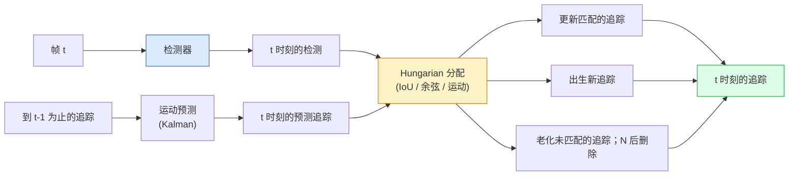

# 多目标追踪与视频内存（Multi-Object Tracking & Video Memory）

> 追踪是检测加关联。每帧检测。将本帧的检测与上一帧的追踪按 ID 匹配。

**类型：** 构建
**语言：** Python
**前置要求：** 第四阶段第 06 课（YOLO 检测）、第四阶段第 08 课（Mask R-CNN）、第四阶段第 24 课（SAM 3）
**时间：** 约 60 分钟

## 学习目标

- 区分基于检测的追踪（Tracking-by-Detection）和基于查询的追踪，并命名算法家族（SORT、DeepSORT、ByteTrack、BoT-SORT、SAM 2 内存追踪器、SAM 3.1 对象多路复用）
- 从零开始为经典基于检测的追踪实现 IoU + Hungarian 分配
- 解释 SAM 2 的内存库以及为什么它比基于 IoU 的关联更好地处理遮挡
- 阅读三个追踪指标（MOTA、IDF1、HOTA）并为给定用例选择哪个重要

## 问题

检测器告诉你物体在单帧中的位置。追踪器告诉你帧 `t` 中的哪个检测与帧 `t-1` 中的检测是同一个物体。没有它，你无法计算穿过一条线的物体数量，无法跟踪球穿过遮挡，也无法知道"4 号车已经在车道中 8 秒了"。

追踪对每个面向视频的产品都至关重要：体育分析、监控、自动驾驶、医学视频分析、野生动物监测、水印计数。核心构建块是共享的：每帧检测器、运动模型（卡尔曼滤波器或更丰富的东西）、关联步骤（在 IoU / 余弦 / 学习特征上的 Hungarian 算法）和追踪生命周期（出生、更新、死亡）。

2026 年带来了两种新模式：**SAM 2 基于内存的追踪**（特征内存而非运动模型关联）和 **SAM 3.1 对象多路复用**（同一概念的多个实例共享内存）。本课先走经典技术栈，然后是基于内存的方法。

## 概念

### 基于检测的追踪



你在 2026 年遇到的每个追踪器都是这个循环的变体。区别：

- **SORT**（2016）：卡尔曼滤波器 + IoU Hungarian。简单、快速、无外观模型。
- **DeepSORT**（2017）：SORT + 每个追踪的基于 CNN 的外观特征（ReID 嵌入）。更好地处理交叉。
- **ByteTrack**（2021）：将低置信度检测作为第二阶段关联；不需要外观特征，但在 MOT17 上是顶级表现者。
- **BoT-SORT**（2022）：Byte + 相机运动补偿 + ReID。
- **StrongSORT / OC-SORT**——ByteTrack 后代，具有更好的运动和外观。

### 卡尔曼滤波器一句话总结

卡尔曼滤波器维护每个追踪的状态 `(x, y, w, h, dx, dy, dw, dh)` 及协方差。在每帧，使用恒定速度模型**预测**状态，然后用匹配的检测**更新**。当预测不确定性高时，更新更信任检测。这给出平滑的轨迹，并能在短遮挡（1-5 帧）中继续追踪。

每个经典追踪器在运动预测步骤中使用卡尔曼滤波器。

### Hungarian 算法

给定一个 `M x N` 成本矩阵（追踪 x 检测），找到最小化总成本的一对一分配。成本通常是 `1 - IoU(track_bbox, detection_bbox)` 或外观特征的负余弦相似度。运行时间是 O((M+N)^3)；对于 M、N 高达约 1000，通过 `scipy.optimize.linear_sum_assignment` 在 Python 中足够快。

### ByteTrack 的关键思想

标准追踪器丢弃低置信度检测（< 0.5）。ByteTrack 将它们保留为**第二阶段候选**：在将追踪与高置信度检测匹配后，未匹配的追踪尝试以稍宽松的 IoU 阈值匹配低置信度检测。恢复短遮挡、人群附近的 ID 切换。

### SAM 2 基于内存的追踪

SAM 2 通过维护每个实例的时空特征**内存库（Memory Bank）**来处理视频。给定一帧上的提示（点击、框、文本），它将实例编码到内存中。在后续帧上，内存与新帧的特征进行交叉注意力，解码器为新帧中的相同实例产生掩码。

没有卡尔曼滤波器，没有 Hungarian 分配。关联隐含在内存-注意力操作中。

优点：
- 对大遮挡鲁棒（内存跨多帧携带实例身份）。
- 与 SAM 3 的文本提示结合时是开放词汇的。
- 无需独立的运动模型即可工作。

缺点：
- 对于多对象追踪比 ByteTrack 慢。
- 内存库增长；限制上下文窗口。

### SAM 3.1 对象多路复用

之前的 SAM 2 / SAM 3 追踪为每个实例维护独立的内存库。对于 50 个对象，50 个内存库。对象多路复用（2026 年 3 月）将它们折叠为一个共享内存，带有**每实例查询 token**。成本在实例数量上呈亚线性扩展。

多路复用是 2026 年人群追踪的新默认：音乐会人群、仓库工人、交通路口。

### 需要知道的三个指标

- **MOTA（Multi-Object Tracking Accuracy，多目标追踪准确率）**——1 - (FN + FP + ID 切换) / GT。按错误类型加权；一个将检测和关联失败混为一谈的单一指标。
- **IDF1（ID F1）**——ID 精确率和召回率的调和平均。特别关注每个真实追踪随时间保持其 ID 的程度。对于 ID 切换敏感任务比 MOTA 更好。
- **HOTA（Higher Order Tracking Accuracy，高阶追踪准确率）**——分解为检测准确率（DetA）和关联准确率（AssA）。自 2020 年以来的社区标准；最全面。

对于监控（谁是谁）：IDF1 是你报告的。对于体育分析（计算传球）：HOTA。对于一般学术比较：HOTA。

## 构建它

### 步骤 1：基于 IoU 的成本矩阵

```python
import numpy as np


def bbox_iou(a, b):
    """
    a, b: (N, 4) 数组，格式为 [x1, y1, x2, y2]。
    返回 (N_a, N_b) IoU 矩阵。
    """
    ax1, ay1, ax2, ay2 = a[:, 0], a[:, 1], a[:, 2], a[:, 3]
    bx1, by1, bx2, by2 = b[:, 0], b[:, 1], b[:, 2], b[:, 3]
    inter_x1 = np.maximum(ax1[:, None], bx1[None, :])
    inter_y1 = np.maximum(ay1[:, None], by1[None, :])
    inter_x2 = np.minimum(ax2[:, None], bx2[None, :])
    inter_y2 = np.minimum(ay2[:, None], by2[None, :])
    inter = np.clip(inter_x2 - inter_x1, 0, None) * np.clip(inter_y2 - inter_y1, 0, None)
    area_a = (ax2 - ax1) * (ay2 - ay1)
    area_b = (bx2 - bx1) * (by2 - by1)
    union = area_a[:, None] + area_b[None, :] - inter
    return inter / np.clip(union, 1e-8, None)
```

### 步骤 2：最小 SORT 风格追踪器

为简洁省略了固定恒定速度卡尔曼——我们在这里使用简单的 IoU 关联；在生产中卡尔曼预测是必不可少的。`sort` Python 包提供完整版本。

```python
from scipy.optimize import linear_sum_assignment


class Track:
    def __init__(self, tid, bbox, frame):
        self.id = tid
        self.bbox = bbox
        self.last_frame = frame
        self.hits = 1

    def update(self, bbox, frame):
        self.bbox = bbox
        self.last_frame = frame
        self.hits += 1


class SimpleTracker:
    def __init__(self, iou_threshold=0.3, max_age=5):
        self.tracks = []
        self.next_id = 1
        self.iou_threshold = iou_threshold
        self.max_age = max_age

    def step(self, detections, frame):
        if not self.tracks:
            for d in detections:
                self.tracks.append(Track(self.next_id, d, frame))
                self.next_id += 1
            return [(t.id, t.bbox) for t in self.tracks]

        track_boxes = np.array([t.bbox for t in self.tracks])
        det_boxes = np.array(detections) if len(detections) else np.empty((0, 4))

        iou = bbox_iou(track_boxes, det_boxes) if len(det_boxes) else np.zeros((len(track_boxes), 0))
        cost = 1 - iou
        cost[iou < self.iou_threshold] = 1e6

        matched_track = set()
        matched_det = set()
        if cost.size > 0:
            row, col = linear_sum_assignment(cost)
            for r, c in zip(row, col):
                if cost[r, c] < 1.0:
                    self.tracks[r].update(det_boxes[c], frame)
                    matched_track.add(r); matched_det.add(c)

        for i, d in enumerate(det_boxes):
            if i not in matched_det:
                self.tracks.append(Track(self.next_id, d, frame))
                self.next_id += 1

        self.tracks = [t for t in self.tracks if frame - t.last_frame <= self.max_age]
        return [(t.id, t.bbox) for t in self.tracks]
```

60 行。接收每帧检测，返回每帧追踪 ID。真实系统添加卡尔曼预测、ByteTrack 的第二阶段重新匹配和外观特征。

### 步骤 3：合成轨迹测试

```python
def synthetic_frames(num_frames=20, num_objects=3, H=240, W=320, seed=0):
    rng = np.random.default_rng(seed)
    starts = rng.uniform(20, 200, size=(num_objects, 2))
    velocities = rng.uniform(-5, 5, size=(num_objects, 2))
    frames = []
    for f in range(num_frames):
        dets = []
        for i in range(num_objects):
            cx, cy = starts[i] + f * velocities[i]
            dets.append([cx - 10, cy - 10, cx + 10, cy + 10])
        frames.append(dets)
    return frames


tracker = SimpleTracker()
for f, dets in enumerate(synthetic_frames()):
    tracks = tracker.step(dets, f)
```

三个沿直线移动的物体应在所有 20 帧中保持其 ID。

### 步骤 4：ID 切换指标

```python
def count_id_switches(tracks_per_frame, gt_per_frame):
    """
    tracks_per_frame:  (track_id, bbox) 列表的列表
    gt_per_frame:      (gt_id, bbox) 列表的列表
    返回 ID 切换次数。
    """
    prev_assignment = {}
    switches = 0
    for tracks, gts in zip(tracks_per_frame, gt_per_frame):
        if not tracks or not gts:
            continue
        t_boxes = np.array([b for _, b in tracks])
        g_boxes = np.array([b for _, b in gts])
        iou = bbox_iou(g_boxes, t_boxes)
        for g_idx, (gt_id, _) in enumerate(gts):
            j = iou[g_idx].argmax()
            if iou[g_idx, j] > 0.5:
                t_id = tracks[j][0]
                if gt_id in prev_assignment and prev_assignment[gt_id] != t_id:
                    switches += 1
                prev_assignment[gt_id] = t_id
    return switches
```

这是一个简化的 IDF1 相邻指标：计算真实对象更改其分配的预测追踪 ID 的次数。真正的 MOTA / IDF1 / HOTA 工具在 `py-motmetrics` 和 `TrackEval` 中。

## 使用它

2026 年的生产追踪器：

- `ultralytics`——YOLOv8 + ByteTrack / BoT-SORT 内置。`results = model.track(source, tracker="bytetrack.yaml")`。默认选择。
- `supervision`（Roboflow）——ByteTrack 封装加标注工具。
- SAM 2 / SAM 3.1——通过 `processor.track()` 进行基于内存的追踪。
- 自定义技术栈：检测器（YOLOv8 / RT-DETR）+ `sort-tracker` / `OC-SORT` / `StrongSORT`。

选择：

- 30+ fps 的行人 / 汽车 / 框：**ByteTrack 配合 ultralytics**。
- 人群中一个类的多个实例：**SAM 3.1 对象多路复用**。
- 具有可识别外观的重度遮挡：**DeepSORT / StrongSORT**（ReID 特征）。
- 体育 / 复杂交互：**BoT-SORT** 或学习型追踪器（MOTRv3）。

## 交付它

本课产出：

- `outputs/prompt-tracker-picker.md`——根据场景类型、遮挡模式和延迟预算选择 SORT / ByteTrack / BoT-SORT / SAM 2 / SAM 3.1。
- `outputs/skill-mot-evaluator.md`——编写一个完整的评估框架，针对真实追踪进行 MOTA / IDF1 / HOTA 评估。

## 练习

1. **（简单）**使用 3、10 和 30 个对象运行上述合成追踪器。报告每种情况下的 ID 切换计数。识别简单的仅 IoU 关联开始失败的位置。
2. **（中等）**在关联之前添加恒定速度卡尔曼预测步骤。展示短（2-3 帧）遮挡不再导致 ID 切换。
3. **（困难）**将 SAM 2 的基于内存的追踪器（通过 `transformers`）集成为替代追踪器后端。在 30 秒的人群片段上同时运行 SimpleTracker 和 SAM 2，比较 ID 切换计数，手动为 5 个显著人物标注真实 ID。

## 关键术语

| 术语 | 人们怎么说 | 实际含义 |
|------|----------------|----------------------|
| 基于检测的追踪（Tracking-by-detection） | "检测然后关联" | 每帧检测器 + 在 IoU / 外观上的 Hungarian 分配 |
| 卡尔曼滤波器（Kalman filter） | "运动预测" | 线性动力学 + 协方差，用于平滑轨迹预测和遮挡处理 |
| Hungarian 算法 | "最优分配" | 解决最小成本二分匹配问题；`scipy.optimize.linear_sum_assignment` |
| ByteTrack | "低置信度第二遍" | 将未匹配的追踪重新匹配到低置信度检测以恢复短遮挡 |
| DeepSORT | "SORT + 外观" | 添加 ReID 特征用于跨帧匹配；更好地保持 ID |
| 内存库（Memory bank） | "SAM 2 技巧" | 跨帧存储的每实例时空特征；交叉注意力取代显式关联 |
| 对象多路复用（Object Multiplex） | "SAM 3.1 共享内存" | 单个共享内存，带每实例查询，用于快速多对象追踪 |
| HOTA | "现代追踪指标" | 分解为检测和关联准确率；社区标准 |

## 进一步阅读

- [SORT (Bewley et al., 2016)](https://arxiv.org/abs/1602.00763) — 最小基于检测的追踪论文
- [DeepSORT (Wojke et al., 2017)](https://arxiv.org/abs/1703.07402) — 添加外观特征
- [ByteTrack (Zhang et al., 2022)](https://arxiv.org/abs/2110.06864) — 低置信度第二遍
- [BoT-SORT (Aharon et al., 2022)](https://arxiv.org/abs/2206.14651) — 相机运动补偿
- [HOTA (Luiten et al., 2020)](https://arxiv.org/abs/2009.07736) — 分解的追踪指标
- [SAM 2 视频分割 (Meta, 2024)](https://ai.meta.com/sam2/) — 基于内存的追踪器
- [SAM 3.1 对象多路复用 (Meta, March 2026)](https://ai.meta.com/blog/segment-anything-model-3/)
