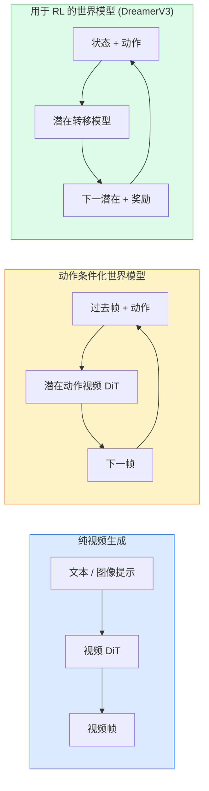

# 世界模型与视频扩散（World Models & Video Diffusion）

> 一个预测场景接下来几秒的视频模型就是一个世界模拟器。用动作条件化该预测，你就有了一个学习的游戏引擎。

**类型：** 学习 + 构建
**语言：** Python
**前置要求：** 第四阶段第 10 课（扩散）、第四阶段第 12 课（视频理解）、第四阶段第 23 课（DiT + 整流流）
**时间：** 约 75 分钟

## 学习目标

- 解释纯视频生成模型（Sora 2）和动作条件化世界模型（Genie 3、DreamerV3）之间的区别
- 描述视频 DiT：时空块（Spatio-Temporal Patches）、3D 位置编码、跨 (T, H, W) token 的联合注意力
- 追溯世界模型如何插入机器人技术：VLM 规划 → 视频模型模拟 → 逆动力学发出动作
- 为给定用例（创意视频、交互式模拟、自动驾驶合成）在 Sora 2、Genie 3、Runway GWM-1 Worlds、Wan-Video 和 HunyuanVideo 之间选择

## 问题

视频生成和世界建模在 2026 年融合。一个能生成连贯一分钟视频的模型在某种意义上已经学会了世界如何运动：物体持久性、重力、因果关系、风格。如果你用动作（向左走、开门）条件化该预测，视频模型就变成了一个可学习的模拟器，可以替代游戏引擎、驾驶模拟器或机器人环境。

利害关系是具体的。Genie 3 从单张图像生成可玩的环境。Runway GWM-1 Worlds 合成无限可探索的场景。Sora 2 产生带同步音频和建模物理的一分钟长视频。NVIDIA Cosmos-Drive、Wayve Gaia-2 和 Tesla DrivingWorld 为自动驾驶训练数据生成逼真的驾驶视频。世界模型范式正在悄然接管机器人技术的仿真到现实（Sim-to-Real）。

本课是第四阶段的"大局"课。它将图像生成、视频理解和代理推理连接到主流研究正在走向的架构模式。

## 概念

### 世界建模的三个家族



- **Sora 2** 是基于提示条件化的纯视频生成。没有动作接口。你不能在生成中途"操控"它。
- **Genie 3**、**GWM-1 Worlds**、**Mirage / Magica** 是动作条件化世界模型。从观察到的视频推断潜在动作，然后用动作条件化未来帧预测。交互式——你按键或移动相机，场景响应。
- **DreamerV3** 和经典 RL 世界模型家族在潜在空间中预测，具有显式动作条件化，在奖励信号上训练。视觉性较低；对样本高效 RL 更有用。

### 视频 DiT 架构

```
视频潜在变量：          (C, T, H, W)
块化（空间）：          每帧 P_h x P_w 块的网格
块化（时间）：          将 P_t 帧分组为一个时间块
结果 token：           (T / P_t) * (H / P_h) * (W / P_w) 个 token
```

位置编码是 3D 的：每个 (t, h, w) 坐标的旋转或学习嵌入。注意力可以是：

- **全联合（Full joint）**——所有 token 关注所有 token。N 个 token 的 O(N^2)。对长视频不可行。
- **分离式（Divided）**——交替时间注意力（相同空间位置，跨时间：`(H*W) * T^2`）和空间注意力（相同时间步，跨空间：`T * (H*W)^2`）。TimeSformer 和大多数视频 DiT 使用。
- **窗口式（Window）**——(t, h, w) 中的局部窗口。Video Swin 使用。

每个 2026 年视频扩散模型使用这三种模式之一，加上 AdaLN 条件化（第 23 课）和整流流。

### 用动作条件化：潜在动作模型

Genie 通过判别性地预测一对连续帧之间的动作来学习每帧的**潜在动作（Latent Action）**。模型的解码器然后在推断的潜在动作上条件化——而不是显式的键盘按键。在推理时，用户可以指定一个潜在动作（或从新的先验中采样一个），模型生成与该动作一致的下一帧。

Sora 完全跳过动作接口。其解码器从过去的时空 token 预测下一时空 token。提示条件化开始；没有任何东西在生成中途操控它。

### 物理合理性

Sora 2 的 2026 年发布明确宣传了**物理合理性（Physical Plausibility）**：重量、平衡、物体持久性、因果关系。由团队通过人工评分的合理性分数衡量；模型在掉落物体、角色碰撞和故意失败（跳失误）方面比 Sora 1 明显改进。

合理性仍然是主要的失败模式。2024-2025 年人们吃意大利面或用杯子喝水的视频揭示了模型缺乏持久的物体表示。2026 年模型（Sora 2、Runway Gen-5、HunyuanVideo）减少但没有消除这些问题。

### 自动驾驶世界模型

驾驶世界模型在轨迹、边界框或导航地图的条件下生成逼真的道路场景。用途：

- **Cosmos-Drive-Dreams**（NVIDIA）——生成数分钟的驾驶视频用于 RL 训练。
- **Gaia-2**（Wayve）——轨迹条件化场景合成用于策略评估。
- **DrivingWorld**（Tesla）——模拟变化的天气、时间、交通条件。
- **Vista**（ByteDance）——反应式驾驶场景合成。

它们替代了昂贵的真实世界数据收集，用于边缘情况——夜间行人乱穿马路、结冰路口、不寻常的车辆类型——否则需要数百万英里的驾驶。

### 机器人技术栈：VLM + 视频模型 + 逆动力学

新兴的三组件机器人循环：

1. **VLM** 解析目标（"拿起红色杯子"），规划高级动作序列。
2. **视频生成模型**模拟执行每个动作会是什么样子——预测 N 帧后的观察。
3. **逆动力学模型（Inverse Dynamics Model）**提取会产生这些观察的具体电机命令。

这替代了奖励塑造和样本密集的 RL。世界模型做想象；逆动力学闭合驱动循环。Genie Envisioner 是一个实例化；许多研究小组正在汇聚到这种结构。

### 评估

- **视觉质量**——FVD（Fréchet Video Distance，Fréchet 视频距离）、用户研究。
- **提示对齐**——每帧 CLIPScore、VQA 风格评估。
- **物理合理性**——在基准套件上人工评分（Sora 2 的内部基准、VBench）。
- **可控性**（用于交互式世界模型）——动作 → 观察一致性；你能回到之前的状态吗？

### 2026 年模型格局

| 模型 | 用途 | 参数 | 输出 | 许可 |
|-------|-----|------------|--------|---------|
| Sora 2 | 文本到视频、音频 | — | 1 分钟 1080p + 音频 | 仅 API |
| Runway Gen-5 | 文本/图像到视频 | — | 10 秒片段 | API |
| Runway GWM-1 Worlds | 交互式世界 | — | 无限 3D 展开 | API |
| Genie 3 | 从图像生成交互式世界 | 11B+ | 可玩帧 | 研究预览 |
| Wan-Video 2.1 | 开放文本到视频 | 14B | 高质量片段 | 非商业 |
| HunyuanVideo | 开放文本到视频 | 13B | 10 秒片段 | 宽松 |
| Cosmos / Cosmos-Drive | 自动驾驶模拟 | 7-14B | 驾驶场景 | NVIDIA 开放 |
| Magica / Mirage 2 | AI 原生游戏引擎 | — | 可修改世界 | 产品 |

## 构建它

### 步骤 1：视频的 3D 块化

```python
import torch
import torch.nn as nn


class VideoPatch3D(nn.Module):
    def __init__(self, in_channels=4, dim=64, patch_t=2, patch_h=2, patch_w=2):
        super().__init__()
        self.proj = nn.Conv3d(
            in_channels, dim,
            kernel_size=(patch_t, patch_h, patch_w),
            stride=(patch_t, patch_h, patch_w),
        )
        self.patch_t = patch_t
        self.patch_h = patch_h
        self.patch_w = patch_w

    def forward(self, x):
        # x: (N, C, T, H, W)
        x = self.proj(x)
        n, c, t, h, w = x.shape
        tokens = x.reshape(n, c, t * h * w).transpose(1, 2)
        return tokens, (t, h, w)
```

步长等于核的 3D 卷积充当时空块化器。`(T, H, W) -> (T/2, H/2, W/2)` 的 token 网格。

### 步骤 2：3D 旋转位置编码

沿 `t`、`h`、`w` 轴分别应用旋转位置嵌入（RoPE）：

```python
def rope_3d(tokens, t_dim, h_dim, w_dim, grid):
    """
    tokens: (N, T*H*W, D)
    grid: (T, H, W) 大小
    t_dim + h_dim + w_dim == D
    """
    T, H, W = grid
    n, seq, d = tokens.shape
    if t_dim + h_dim + w_dim != d:
        raise ValueError(f"t_dim+h_dim+w_dim ({t_dim}+{h_dim}+{w_dim}) 必须等于 D={d}")
    assert seq == T * H * W
    t_idx = torch.arange(T, device=tokens.device).repeat_interleave(H * W)
    h_idx = torch.arange(H, device=tokens.device).repeat_interleave(W).repeat(T)
    w_idx = torch.arange(W, device=tokens.device).repeat(T * H)
    # 简化：仅按频率缩放通道。真正的 RoPE 旋转配对。
    freqs_t = torch.exp(-torch.log(torch.tensor(10000.0)) * torch.arange(t_dim // 2, device=tokens.device) / (t_dim // 2))
    freqs_h = torch.exp(-torch.log(torch.tensor(10000.0)) * torch.arange(h_dim // 2, device=tokens.device) / (h_dim // 2))
    freqs_w = torch.exp(-torch.log(torch.tensor(10000.0)) * torch.arange(w_dim // 2, device=tokens.device) / (w_dim // 2))
    emb_t = torch.cat([torch.sin(t_idx[:, None] * freqs_t), torch.cos(t_idx[:, None] * freqs_t)], dim=-1)
    emb_h = torch.cat([torch.sin(h_idx[:, None] * freqs_h), torch.cos(h_idx[:, None] * freqs_h)], dim=-1)
    emb_w = torch.cat([torch.sin(w_idx[:, None] * freqs_w), torch.cos(w_idx[:, None] * freqs_w)], dim=-1)
    return tokens + torch.cat([emb_t, emb_h, emb_w], dim=-1)
```

简化的加法形式。真正的 RoPE 以频率旋转配对通道；位置信息是相同的。

### 步骤 3：分离注意力块

```python
class DividedAttentionBlock(nn.Module):
    def __init__(self, dim=64, heads=2):
        super().__init__()
        self.time_attn = nn.MultiheadAttention(dim, heads, batch_first=True)
        self.space_attn = nn.MultiheadAttention(dim, heads, batch_first=True)
        self.ln1 = nn.LayerNorm(dim)
        self.ln2 = nn.LayerNorm(dim)
        self.ln3 = nn.LayerNorm(dim)
        self.mlp = nn.Sequential(nn.Linear(dim, 4 * dim), nn.GELU(), nn.Linear(4 * dim, dim))

    def forward(self, x, grid):
        T, H, W = grid
        n, seq, d = x.shape
        # 时间注意力：相同 (h, w)，跨 t
        xt = x.view(n, T, H * W, d).permute(0, 2, 1, 3).reshape(n * H * W, T, d)
        a, _ = self.time_attn(self.ln1(xt), self.ln1(xt), self.ln1(xt), need_weights=False)
        xt = (xt + a).reshape(n, H * W, T, d).permute(0, 2, 1, 3).reshape(n, seq, d)
        # 空间注意力：相同 t，跨 (h, w)
        xs = xt.view(n, T, H * W, d).reshape(n * T, H * W, d)
        a, _ = self.space_attn(self.ln2(xs), self.ln2(xs), self.ln2(xs), need_weights=False)
        xs = (xs + a).reshape(n, T, H * W, d).reshape(n, seq, d)
        xs = xs + self.mlp(self.ln3(xs))
        return xs
```

时间注意力在每个空间位置内跨时间关注；空间注意力在每帧内跨位置关注。两个 O(T^2 + (HW)^2) 操作而非一个 O((THW)^2)。这是 TimeSformer 和每个现代视频 DiT 的核心。

### 步骤 4：组合微型视频 DiT

```python
class TinyVideoDiT(nn.Module):
    def __init__(self, in_channels=4, dim=64, depth=2, heads=2):
        super().__init__()
        self.patch = VideoPatch3D(in_channels=in_channels, dim=dim, patch_t=2, patch_h=2, patch_w=2)
        self.blocks = nn.ModuleList([DividedAttentionBlock(dim, heads) for _ in range(depth)])
        self.out = nn.Linear(dim, in_channels * 2 * 2 * 2)

    def forward(self, x):
        tokens, grid = self.patch(x)
        for blk in self.blocks:
            tokens = blk(tokens, grid)
        return self.out(tokens), grid
```

不是可工作的视频生成器；一个结构演示，展示每个部分形状正确。

### 步骤 5：检查形状

```python
vid = torch.randn(1, 4, 8, 16, 16)  # (N, C, T, H, W)
model = TinyVideoDiT()
out, grid = model(vid)
print(f"input  {tuple(vid.shape)}")
print(f"tokens grid {grid}")
print(f"output {tuple(out.shape)}")
```

期望 `grid = (4, 8, 8)` 和 `out = (1, 256, 32)` 在块化后；头部然后投影到每 token 时空块，准备反块化回视频。

## 使用它

2026 年的生产访问模式：

- **Sora 2 API**（OpenAI）——文本到视频，同步音频。高级定价。
- **Runway Gen-5 / GWM-1**（Runway）——图像到视频，交互式世界。
- **Wan-Video 2.1 / HunyuanVideo**——开源自托管。
- **Cosmos / Cosmos-Drive**（NVIDIA）——驾驶模拟开放权重。
- **Genie 3**——研究预览，请求访问。

对于构建交互式世界模型演示：从 Wan-Video 开始以获得质量，在其上叠加潜在动作适配器以获得交互性。

## 交付它

本课产出：

- `outputs/prompt-world-model-picker.md`——一个提示词，根据交互性、视觉质量和部署约束在 Sora 2 / Genie 3 / GWM-1 / Wan-Video / HunyuanVideo 之间选择。
- `outputs/skill-video-dit-trainer.md`——一个技能，编写一个完整的视频 DiT 训练循环，包含 3D 块化、分离注意力和整流流。

## 练习

1. **（简单）**运行上述 `TinyVideoDiT` 形状检查。变化 `(T, H, W)` 并确认 token 计数和输出形状按预期缩放。
2. **（中等）**在合成移动斑点视频（3D 版本的第四阶段第 23 课斑点数据集）上训练 `TinyVideoDiT`。采样并目视检查生成帧的时间一致性。
3. **（困难）**在 `TinyVideoDiT` 中添加潜在动作条件化：将动作嵌入拼接到时间嵌入中。在动作标记的合成视频上训练（例如"斑点向左移动"vs"斑点向右移动"）。验证条件化动作控制生成的运动方向。

## 关键术语

| 术语 | 人们怎么说 | 实际含义 |
|------|----------------|----------------------|
| 世界模型（World model） | "学习的模拟器" | 预测给定动作或提示的未来观察的视频模型 |
| 视频 DiT | "视频扩散 transformer" | 在时空块化 token 上操作的 DiT；使用分离或联合注意力 |
| 潜在动作（Latent action） | "推断的控制" | 从观察视频中学习的动作表示；Genie 的核心创新 |
| 物理合理性（Physical plausibility） | "它看起来真实吗" | 物体持久性、重力、因果关系的度量；Sora 2 的主要评估轴 |
| 逆动力学（Inverse dynamics） | "观察 → 动作" | 预测产生给定观察变化的电机命令的模型 |
| FVD | "视频 FID" | Fréchet 视频距离；视频生成的标准质量指标 |
| 分离注意力（Divided attention） | "时间 + 空间" | 交替时间注意力和空间注意力而非全联合注意力；O(T^2 + (HW)^2) |
| Cosmos-Drive | "NVIDIA 驾驶世界模型" | 用于自动驾驶训练数据生成的开放权重驾驶模拟器 |

## 进一步阅读

- [Sora 2 技术报告 (OpenAI, 2026)](https://openai.com/index/sora-2/) — 物理合理性和一分钟视频生成
- [Genie 3: Generative Interactive Environments (DeepMind, 2025)](https://arxiv.org/abs/2502.XXXXX) — 潜在动作世界模型
- [Runway GWM-1 Worlds 公告](https://runwayml.com/research/gwm-1-worlds) — 交互式世界生成
- [Video DiT (Meta, 2024)](https://arxiv.org/abs/2404.XXXXX) — 视频扩散 transformer 架构
- [DreamerV3 (Hafner et al., 2023)](https://arxiv.org/abs/2301.04104) — 经典 RL 世界模型
- [Cosmos-Drive (NVIDIA, 2025)](https://developer.nvidia.com/cosmos) — 自动驾驶世界模型
