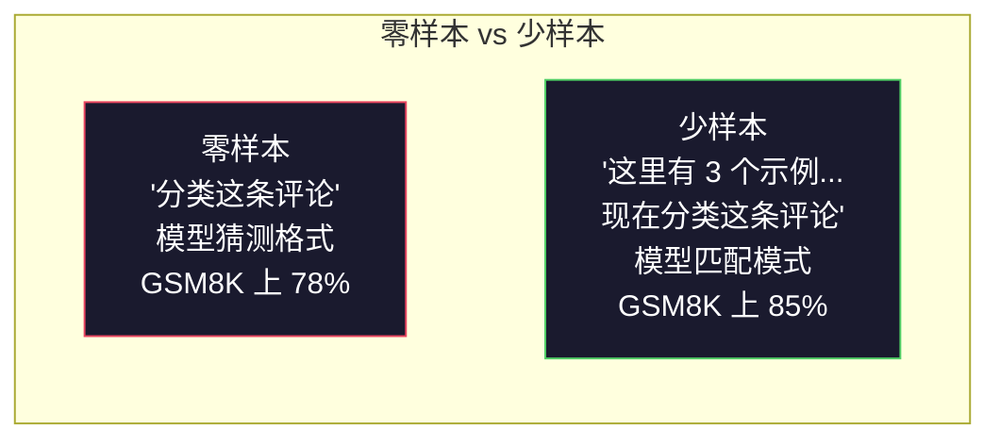
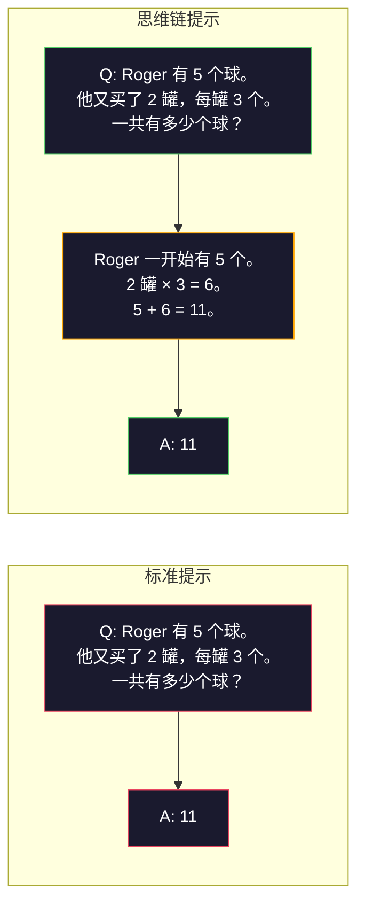
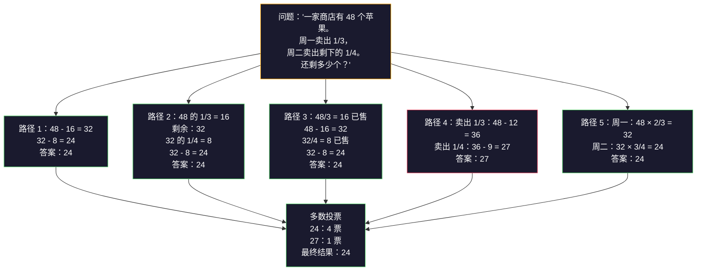
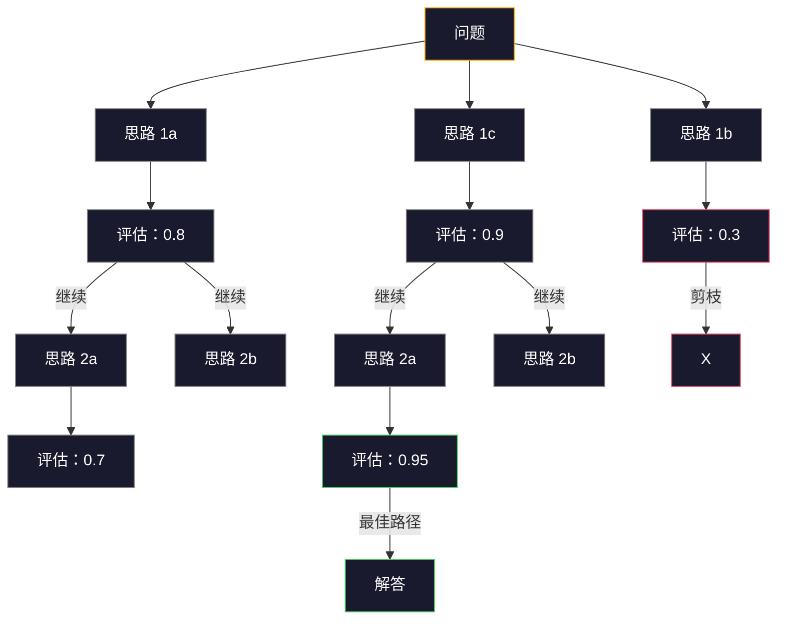
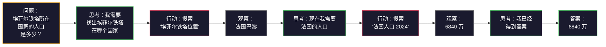

# 少样本、思维链、思维树

> 告诉模型做什么是提示工程。向模型展示如何思考才是真正的工程。同一个模型、同一个任务、同一份数据上 78% 与 91% 准确率的差距，并非来自更好的模型，而是来自更好的推理策略。

**类型：** 构建
**语言：** Python
**先修课程：** 第 11.01 课（提示工程）
**时间：** 约 45 分钟

## 学习目标

- 通过选择和格式化能最大化任务准确率的示例演示，实现少样本（few-shot）提示
- 应用思维链（Chain-of-Thought, CoT）推理来提高数学应用题等多步骤问题的准确率
- 构建一个思维树（Tree-of-Thought）提示，探索多条推理路径并选择最佳路径
- 在标准基准测试上衡量零样本（zero-shot）vs 少样本 vs 思维链的准确率提升

## 问题

你开发了一款数学辅导应用。你的提示词是："解这道应用题。"GPT-5 在 GSM8K（标准小学数学基准测试）上的正确率是 94%。你以为已经到顶了——其实没有，思维链还能再提升 3-4 个百分点。

加上五个字——"让我们一步步思考"——准确率跃升至 91%。再加上几个已解答的示例，准确率达到 95%。同一个模型。同一个 temperature。同样的 API 成本。唯一的区别是你给了模型一张草稿纸。

这不是取巧。这就是推理的工作原理。人类不会在一次思维跳跃中解决多步骤问题。Transformer 也是如此。当你强制模型生成中间 token 时，这些 token 会成为下一个 token 的上下文的一部分。每一步推理都在为下一步提供输入。模型实际上是通过计算一步步走向答案的。

但"一步步思考"只是起点，而非终点。如果你采样五条推理路径并取多数投票呢？如果你让模型探索一棵可能性树，评估并剪枝呢？如果你将推理与工具使用交错进行呢？这些不是假设，而是已有论文发表、经过实测验证的技术，你将在本课中逐一构建它们。

## 概念

### 零样本 vs 少样本：当示例胜过指令

零样本提示只给模型一个任务，不提供其他任何内容。少样本提示则先给它一些示例。

Wei 等人（2022）在 8 个基准测试上测量了这一差异。对于情感分类等简单任务，零样本和少样本的表现差距在 2% 以内。对于多步骤算术和符号推理等复杂任务，少样本将准确率提升了 10-25%。

直觉解释：示例就是压缩后的指令。与其描述输出格式，不如直接展示。与其解释推理过程，不如直接演示。模型对示例的模式匹配比它对抽象指令的解读更可靠。



**少样本占优的场景：** 对格式敏感的任务、分类任务、结构化抽取、领域专用术语，以及任何需要模型匹配特定模式的任务。

**零样本占优的场景：** 简单的事实性问题、示例会限制创造力的创意任务、找好示例比写好指令更难的任务。

### 示例选择：相似胜过随机

并非所有示例都是平等的。选择与目标输入相似的示例，在分类任务上比随机选择高出 5-15% 的准确率（Liu 等人，2022）。三个原则：

1. **语义相似度**：在嵌入空间中选择与输入最接近的示例
2. **标签多样性**：示例中覆盖所有输出类别
3. **难度匹配**：匹配目标问题的复杂度水平

对于大多数任务，示例的最优数量是 3-5 个。少于 3 个，模型没有足够的信号来提取模式。超过 5 个，边际收益递减且浪费上下文窗口 token。对于标签数量较多的分类任务，每个标签使用一个示例。

### 思维链：给模型一张草稿纸

思维链（Chain-of-Thought, CoT）提示由 Google Brain 的 Wei 等人（2022）提出。思路很简单：不要只让模型给出答案，而是让它先展示推理步骤。



这在机制上为什么有效？Transformer 生成的每个 token 都会成为下一个 token 的上下文。没有 CoT 时，模型必须将所有推理压缩到单次前向传播的隐藏状态中。有了 CoT，模型将中间计算外部化为 token。每个推理 token 都扩展了有效的计算深度。

**GSM8K 基准测试（小学数学，8500 道题）：**

| 模型 | 零样本 | 零样本 CoT | 少样本 CoT |
|-------|-----------|---------------|--------------|
| GPT-4o | 78% | 91% | 95% |
| GPT-5 | 94% | 97% | 98% |
| o4-mini（推理模型） | 97% | — | — |
| Claude Opus 4.7 | 93% | 97% | 98% |
| Gemini 3 Pro | 92% | 96% | 98% |
| Llama 4 70B | 80% | 89% | 94% |
| DeepSeek-V3.1 | 89% | 94% | 96% |

**关于推理模型的说明。** OpenAI 的 o 系列（o3、o4-mini）和 DeepSeek-R1 等模型在输出答案之前会在内部运行思维链。对推理模型添加"让我们一步步思考"是多余的，有时甚至适得其反——它们已经做过了。

CoT 的两种形式：

**零样本 CoT**：在提示词末尾加上"让我们一步步思考"。无需示例。Kojima 等人（2022）证明，仅这一句话就能提升算术、常识和符号推理任务的准确率。

**少样本 CoT**：提供包含推理步骤的示例。比零样本 CoT 更有效，因为模型能看到你所期望的确切推理格式。

**CoT 有害的场景：** 简单的事实回忆（"法国的首都是什么？"）、单步分类、速度比准确率更重要的任务。CoT 每次查询会增加 50-200 个 token 的推理开销。对于高吞吐量、低复杂度的任务，这是浪费成本。

### 自一致性：多样采样，一次投票

Wang 等人（2023）提出了自一致性（self-consistency）。其洞见是：单条 CoT 路径可能包含推理错误。但如果你采样 N 条独立的推理路径（使用 temperature > 0），并对最终答案进行多数投票，错误就会相互抵消。



在最初的 PaLM 540B 实验中，自一致性将 GSM8K 准确率从 56.5%（单条 CoT）提升到了 N=40 时的 74.4%。在 GPT-5 上提升很小（97% 到 98%），因为基础准确率已经饱和。该技术在基础 CoT 准确率在 60-85% 的模型上效果最好——这是单路径错误频繁但不系统化的最佳区间。对于推理模型（o 系列、R1），自一致性已被内置的内部采样所涵盖。

权衡：N 次采样意味着 N 倍的 API 成本和延迟。在实践中，N=5 就能捕获大部分收益。N=3 是有意义的投票的最低要求。对于大多数任务，N > 10 的边际收益递减。

### 思维树：分支探索

Yao 等人（2023）提出了思维树（Tree-of-Thought, ToT）。CoT 只沿一条线性推理路径前进，而 ToT 则探索多条分支，并在继续之前评估哪些分支最有前景。



ToT 有三个组成部分：

1. **思路生成**：生成多个候选的下一步
2. **状态评估**：对每个候选进行评分（可以使用 LLM 本身作为评估器）
3. **搜索算法**：通过树进行 BFS 或 DFS 搜索，剪去低分分支

在 24 点游戏任务（用算术运算组合 4 个数字得到 24）中，GPT-4 使用标准提示只能解决 7.3% 的问题。使用 CoT 是 4.0%（CoT 在这里实际上有害，因为搜索空间很大）。使用 ToT 是 74%。

ToT 成本高昂。树中的每个节点都需要一次 LLM 调用。一个分支因子为 3、深度为 3 的树需要多达 39 次 LLM 调用。仅在搜索空间大但可评估的问题上使用它——规划、解谜、带约束的创意问题求解。

### ReAct：思考 + 行动

Yao 等人（2022）将推理轨迹与行动结合起来。模型在思考（生成推理）和行动（调用工具、搜索、计算）之间交替进行。



ReAct 在知识密集型任务上优于纯 CoT，因为它能将推理建立在真实数据之上。在 HotpotQA（多跳问答）上，使用 GPT-4 的 ReAct 达到了 35.1% 的精确匹配率，而单独使用 CoT 为 29.4%。真正的威力在于推理错误可以被观察结果纠正——模型可以在执行过程中更新其计划。

ReAct 是现代 AI Agent 的基础。每个 Agent 框架（LangChain、CrewAI、AutoGen）都实现了某种形式的思考-行动-观察循环。你将在第 14 阶段构建完整的 Agent。本课涵盖的是提示模式。

### 结构化提示：XML 标签、分隔符、标题

随着提示变得越来越复杂，结构化可以防止模型混淆不同部分。三种方法：

**XML 标签**（在 Claude 上效果最佳，在其他模型上也都适用）：
```
<context>
You are reviewing a pull request.
The codebase uses TypeScript and React.
</context>

<task>
Review the following diff for bugs, security issues, and style violations.
</task>

<diff>
{diff_content}
</diff>

<output_format>
List each issue with: file, line, severity (critical/warning/info), description.
</output_format>
```

**Markdown 标题**（通用）：
```

## 角色
某金融科技公司的高级安全工程师。

## 任务
分析此 API 端点的漏洞。

## 输入
{api_code}

## 规则
- 重点关注 OWASP Top 10
- 对每个发现进行评级：严重、高、中、低
- 包含修复步骤
```

**分隔符**（简洁但有效）：
```
---INPUT---
{user_text}
---END INPUT---

---INSTRUCTIONS---
Summarize the above in 3 bullet points.
---END INSTRUCTIONS---
```

### 提示链：顺序分解

有些任务过于复杂，单个提示无法完成。提示链将其拆分为多个步骤，每一步的输出成为下一步的输入。


提示链优于单次提示有三个原因：

1. **每一步更简单**：模型只需处理一个聚焦的任务，而不是同时应付所有事情
2. **中间输出可检查**：你可以在步骤之间验证和纠正
3. **不同步骤可以使用不同的模型**：用便宜的模型做提取，用昂贵的模型做推理

### 性能对比

| 技术 | 最适合 | GSM8K 准确率 (GPT-5) | API 调用次数 | Token 开销 | 复杂度 |
|-----------|----------|------------------------|-----------|----------------|------------|
| 零样本 | 简单任务 | 94% | 1 | 无 | 极低 |
| 少样本 | 格式匹配 | 96% | 1 | 200-500 tokens | 低 |
| 零样本思维链 | 快速提升推理能力 | 97% | 1 | 50-200 tokens | 极低 |
| 少样本思维链 | 单次调用最高准确率 | 98% | 1 | 300-600 tokens | 低 |
| 自一致性 (N=5) | 高风险推理 | 98.5% | 5 | 5 倍 token 成本 | 中 |
| 推理模型 (o4-mini) | 直接替代思维链 | 97% | 1 | 隐藏（内部 2-10 倍） | 极低 |
| 思维树 | 搜索/规划问题 | N/A（24 点游戏 74%） | 10-40+ | 10-40 倍 token 成本 | 高 |
| ReAct | 知识驱动推理 | N/A（HotpotQA 35.1%） | 3-10+ | 可变 | 高 |
| 提示链 | 复杂多步任务 | 96%（流水线） | 2-5 | 2-5 倍 token 成本 | 中 |

选择合适的技术取决于三个因素：准确率要求、延迟预算和成本容忍度。对于大多数生产系统，少样本思维链配合 3 样本自一致性回退可以覆盖 90% 的用例。

## 动手实践

我们将构建一个数学问题求解器，将少样本提示、思维链推理和自一致性投票整合到一个流水线中。然后为难题加入思维树。

完整实现位于 `code/advanced_prompting.py`。以下是核心组件。

### 步骤 1：少样本示例库

第一个组件管理少样本示例，并为给定问题选择最相关的示例。

```python
GSM8K_EXAMPLES = [
    {
        "question": "Janet's ducks lay 16 eggs per day. She eats three for breakfast every morning and bakes muffins for her friends every day with four. She sells every egg at the farmers' market for $2. How much does she make every day at the farmers' market?",
        "reasoning": "Janet's ducks lay 16 eggs per day. She eats 3 and bakes 4, using 3 + 4 = 7 eggs. So she has 16 - 7 = 9 eggs left. She sells each for $2, so she makes 9 * 2 = $18 per day.",
        "answer": "18"
    },
    ...
]
```

每个示例包含三个部分：问题、推理链和最终答案。推理链正是将普通少样本示例转变为思维链少样本示例的关键。

### 步骤 2：思维链提示构建器

提示构建器将系统消息、带推理链的少样本示例以及目标问题组装成单个提示。

```python
def build_cot_prompt(question, examples, num_examples=3):
    system = (
        "You are a math problem solver. "
        "For each problem, show your step-by-step reasoning, "
        "then give the final numerical answer on the last line "
        "in the format: 'The answer is [number]'."
    )

    example_text = ""
    for ex in examples[:num_examples]:
        example_text += f"Q: {ex['question']}\n"
        example_text += f"A: {ex['reasoning']} The answer is {ex['answer']}.\n\n"

    user = f"{example_text}Q: {question}\nA:"
    return system, user
```

格式约束（"The answer is [number]"）至关重要。没有它，自一致性就无法从多个样本中提取和比较答案。

### 步骤 3：自一致性投票

采样 N 条推理路径，取多数答案。

```python
def self_consistency_solve(question, examples, client, model, n_samples=5):
    system, user = build_cot_prompt(question, examples)

    answers = []
    reasonings = []
    for _ in range(n_samples):
        response = client.chat.completions.create(
            model=model,
            messages=[
                {"role": "system", "content": system},
                {"role": "user", "content": user}
            ],
            temperature=0.7
        )
        text = response.choices[0].message.content
        reasonings.append(text)
        answer = extract_answer(text)
        if answer is not None:
            answers.append(answer)

    vote_counts = Counter(answers)
    best_answer = vote_counts.most_common(1)[0][0] if vote_counts else None
    confidence = vote_counts[best_answer] / len(answers) if best_answer else 0

    return best_answer, confidence, reasonings, vote_counts
```

Temperature 设为 0.7 很重要。如果设为 0.0，所有 N 个样本将完全相同，这就失去了意义。你需要足够的随机性来产生多样化的推理路径，但又不能太多导致模型生成无意义的内容。

### 步骤 4：思维树求解器

对于线性推理无法解决的问题，思维树会探索多种方法并评估哪个方向最有希望。

```python
def tree_of_thought_solve(question, client, model, breadth=3, depth=3):
    thoughts = generate_initial_thoughts(question, client, model, breadth)
    scored = [(t, evaluate_thought(t, question, client, model)) for t in thoughts]
    scored.sort(key=lambda x: x[1], reverse=True)

    for current_depth in range(1, depth):
        next_thoughts = []
        for thought, score in scored[:2]:
            extensions = extend_thought(thought, question, client, model, breadth)
            for ext in extensions:
                ext_score = evaluate_thought(ext, question, client, model)
                next_thoughts.append((ext, ext_score))
        scored = sorted(next_thoughts, key=lambda x: x[1], reverse=True)

    best_thought = scored[0][0] if scored else ""
    return extract_answer(best_thought), best_thought
```

评估器本身就是一个 LLM 调用。你向模型提问："On a scale of 0.0 to 1.0, how promising is this reasoning path for solving the problem?"（在 0.0 到 1.0 的范围内，这条推理路径对解决此问题有多大希望？）这正是思维树的核心洞察——模型评估自己的部分解。

### 步骤 5：完整流水线

该流水线将所有技术结合在一个升级策略中。

```python
def solve_with_escalation(question, examples, client, model):
    system, user = build_cot_prompt(question, examples)
    single_response = call_llm(client, model, system, user, temperature=0.0)
    single_answer = extract_answer(single_response)

    sc_answer, confidence, _, _ = self_consistency_solve(
        question, examples, client, model, n_samples=5
    )

    if confidence >= 0.8:
        return sc_answer, "self_consistency", confidence

    tot_answer, _ = tree_of_thought_solve(question, client, model)
    return tot_answer, "tree_of_thought", None
```

升级逻辑：先尝试廉价方案（单次思维链）。如果自一致性置信度低于 0.8（即 5 个样本中少于 4 个一致），则升级到思维树。这在成本和准确率之间取得了平衡——大多数问题以低成本解决，难题则投入更多计算资源。

## 实际使用

### 使用 LangChain

LangChain 提供了内置的提示模板和输出解析支持，可简化少样本和思维链模式：

```python
from langchain_core.prompts import FewShotPromptTemplate, PromptTemplate
from langchain_openai import ChatOpenAI

example_prompt = PromptTemplate(
    input_variables=["question", "reasoning", "answer"],
    template="Q: {question}\nA: {reasoning} The answer is {answer}."
)

few_shot_prompt = FewShotPromptTemplate(
    examples=examples,
    example_prompt=example_prompt,
    suffix="Q: {input}\nA: Let's think step by step.",
    input_variables=["input"]
)

llm = ChatOpenAI(model="gpt-4o", temperature=0.7)
chain = few_shot_prompt | llm
result = chain.invoke({"input": "If a train travels 120 km in 2 hours..."})
```

LangChain 还提供了 `ExampleSelector` 类用于语义相似度选择：

```python
from langchain_core.example_selectors import SemanticSimilarityExampleSelector
from langchain_openai import OpenAIEmbeddings

selector = SemanticSimilarityExampleSelector.from_examples(
    examples,
    OpenAIEmbeddings(),
    k=3
)
```

### 使用 DSPy

DSPy 将提示策略视为可优化的模块。无需手动编写思维链提示，只需定义签名，让 DSPy 来优化提示：

```python
import dspy

dspy.configure(lm=dspy.LM("openai/gpt-4o", temperature=0.7))

class MathSolver(dspy.Module):
    def __init__(self):
        self.solve = dspy.ChainOfThought("question -> answer")

    def forward(self, question):
        return self.solve(question=question)

solver = MathSolver()
result = solver(question="Janet's ducks lay 16 eggs per day...")
```

DSPy 的 `ChainOfThought` 会自动添加推理轨迹。`dspy.majority` 实现了自一致性：

```python
result = dspy.majority(
    [solver(question=q) for _ in range(5)],
    field="answer"
)
```

### 对比：从零实现 vs 框架

| 特性 | 从零实现（本课） | LangChain | DSPy |
|------|------------------|-----------|------|
| 对提示格式的控制 | 完全控制 | 基于模板 | 自动 |
| 自一致性 | 手动投票 | 手动 | 内置 (`dspy.majority`) |
| 示例选择 | 自定义逻辑 | `ExampleSelector` | `dspy.BootstrapFewShot` |
| 思维树 | 自定义树搜索 | 社区链 | 非内置 |
| 提示优化 | 手动迭代 | 手动 | 自动编译 |
| 适用场景 | 学习、自定义流水线 | 标准工作流 | 研究、优化 |

## 交付成果

本课产生两项产出物。

**1. 推理链提示** (`outputs/prompt-reasoning-chain.md`)：一个可用于生产的少样本思维链加自一致性提示模板。插入你自己的示例和问题领域即可使用。

**2. 思维链模式选择技能** (`outputs/skill-cot-patterns.md`)：一个决策框架，用于根据任务类型、准确度要求和成本约束选择合适的推理技术。

## 练习

1. **衡量差距**：选取 10 道 GSM8K 题目。分别用零样本、少样本、零样本思维链和少样本思维链求解。记录每种方法的准确率。在你的模型上，哪种技术提升最大？

2. **示例选择实验**：对同样的 10 道题，比较随机选择示例与手工挑选相似示例的效果。测量准确率差异。在什么情况下示例质量比示例数量更重要？

3. **自一致性成本曲线**：在 20 道 GSM8K 题目上，分别以 N=1、3、5、7、10 运行自一致性。绘制准确率与成本（总 token 数）的关系图。你的模型成本曲线的拐点在哪里？

4. **构建 ReAct 循环**：为流水线添加一个计算器工具。当模型生成数学表达式时，在沙箱中用 Python 的 `eval()` 执行它，并将结果反馈回去。测量工具辅助推理是否优于纯思维链。

5. **面向创意任务的思维树**：将思维树求解器适配到创意写作任务："写一个既好笑又悲伤的六词故事。"使用 LLM 作为评估器。分支探索是否比单次生成能产生更好的创意输出？

## 关键术语

| 术语 | 人们常说的 | 实际含义 |
|------|-----------|---------|
| 少样本提示 (Few-shot prompting) | "给它几个例子" | 在提示中包含输入-输出示例，以锚定模型的输出格式和行为 |
| 思维链 (Chain-of-Thought) | "让它一步步思考" | 在给出最终答案之前，引出中间推理 token，扩展模型的有效计算量 |
| 自一致性 (Self-Consistency) | "多运行几次" | 在 temperature > 0 的条件下采样 N 条不同的推理路径，通过多数投票选择最常见的最终答案 |
| 思维树 (Tree-of-Thought) | "让它探索选项" | 对推理分支进行结构化搜索，评估每个部分解，只扩展有希望的路径 |
| ReAct | "思考 + 工具使用" | 在"思考-行动-观察"循环中交替进行推理轨迹与外部操作（搜索、计算、API 调用） |
| 提示链 (Prompt chaining) | "把任务拆成步骤" | 将复杂任务分解为一系列顺序提示，每个输出作为下一个输入 |
| 零样本思维链 (Zero-shot CoT) | "只需加上'一步步思考'" | 在没有任何示例的情况下，在提示末尾附加推理触发短语，依赖模型潜在的推理能力 |

## 扩展阅读

- [Chain-of-Thought Prompting Elicits Reasoning in Large Language Models](https://arxiv.org/abs/2201.11903) —— Wei 等人，2022 年。Google Brain 的原始思维链论文。阅读第 2-3 节了解核心结果。
- [Self-Consistency Improves Chain of Thought Reasoning in Language Models](https://arxiv.org/abs/2203.11171) —— Wang 等人，2023 年。自一致性论文。表 1 包含了你需要的所有数据。
- [Tree of Thoughts: Deliberate Problem Solving with Large Language Models](https://arxiv.org/abs/2305.10601) —— Yao 等人，2023 年。思维树论文。第 4 节的 Game of 24 结果是亮点。
- [ReAct: Synergizing Reasoning and Acting in Language Models](https://arxiv.org/abs/2210.03629) —— Yao 等人，2022 年。现代 AI Agent 的基础。第 3 节解释了"思考-行动-观察"循环。
- [Large Language Models are Zero-Shot Reasoners](https://arxiv.org/abs/2205.11916) —— Kojima 等人，2022 年。"让我们一步步思考"论文。尽管方法简单，效果却出奇地好。
- [DSPy: Compiling Declarative Language Model Calls into Self-Improving Pipelines](https://arxiv.org/abs/2310.03714) —— Khattab 等人，2023 年。将提示工程视为编译问题。如果你想超越手动提示工程，推荐阅读。
- [OpenAI — 推理模型指南](https://platform.openai.com/docs/guides/reasoning) —— 供应商指南，说明思维链何时变成按 token 计费的内部"推理"模式，何时只是提示层面的技巧。
- [Lightman 等人，"Let's Verify Step by Step" (2023)](https://arxiv.org/abs/2305.20050) —— 过程奖励模型（PRM），对推理链的每一步进行评分；这种推理监督信号优于仅看最终结果的奖励。
- [Snell 等人，"Scaling LLM Test-Time Compute Optimally" (2024)](https://arxiv.org/abs/2408.03314) —— 对思维链长度、自一致性采样和 MCTS 的系统性研究；当准确率比延迟更重要时，"一步步思考"会走向何方。
