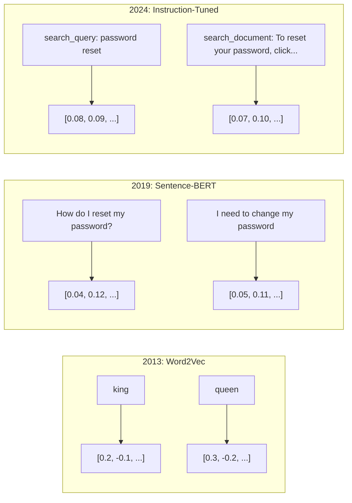
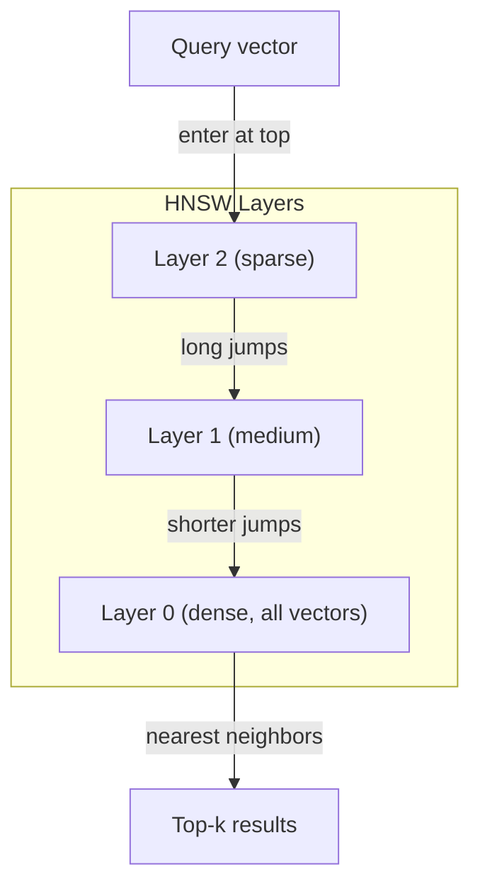
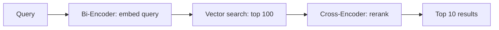

# 嵌入向量与向量表示

> 文本是离散的，数学是连续的。每当你让一个大语言模型查找"相似"文档、比较语义或进行超越关键词的搜索时，你都在依赖一座连接这两个世界的桥梁。这座桥梁就是嵌入向量。如果你不理解嵌入向量，你就不理解现代 AI——你只是在使用它而已。

**类型：** 构建
**语言：** Python
**前置课程：** Phase 11, Lesson 01（提示工程）
**时长：** 约 75 分钟
**相关：** Phase 5 · 22（嵌入模型深度解析）涵盖稠密、稀疏和多向量嵌入、套娃截断以及按维度选择模型。本课聚焦于生产级流水线（向量数据库、HNSW、相似度数学）。在选择模型之前先阅读 Phase 5 · 22。

## 学习目标

- 使用 API 提供商和开源模型生成文本嵌入向量，并计算它们之间的余弦相似度
- 解释为什么嵌入向量能解决关键词搜索无法处理的词汇不匹配问题
- 构建一个语义搜索索引，使其能按含义而非精确关键词匹配来检索文档
- 使用检索基准（precision@k、召回率）评估嵌入质量，并为你的任务选择合适的嵌入模型

## 问题

你有 10,000 条客服工单。一位客户写道"my payment didn't go through"（我的支付没成功）。你需要找到相似的过往工单。关键词搜索能找到包含"payment"和"didn't go through"的工单，但会漏掉"transaction failed"（交易失败）、"charge was declined"（支付被拒绝）和"billing error"（账单错误）。这些工单描述的是完全相同的问题，但用了完全不同的措辞。

这就是词汇不匹配问题。人类语言中，同一件事有几十种说法。关键词搜索将每个词视为一个独立的符号，没有语义理解。它无法知道"declined"和"didn't go through"指向的是同一个概念。

你需要一种文本表示方式，使得相似性由含义而非拼写来决定。你需要一种方法，在某个数学空间中将"my payment didn't go through"和"transaction was declined"放在一起，同时将"my payment arrived on time"（我的付款按时到了）推远——尽管它同样包含"payment"这个词。

这种表示方式就是嵌入向量。

## 概念

### 什么是嵌入向量？

嵌入向量是一个表示文本含义的稠密浮点数向量。"稠密"这个词很关键——每个维度都承载着信息，这与稀疏表示（词袋、TF-IDF）不同，后者的绝大多数维度为零。

"The cat sat on the mat" 会变成类似 `[0.023, -0.041, 0.087, ..., 0.012]` 的形式——根据模型的不同，它是由 768 到 3072 个数字组成的列表。这些数字编码了语义信息。你永远不会直接查看它们，而是对它们进行比较。

### Word2Vec 的突破

2013 年，Google 的 Tomas Mikolov 及其同事发表了 Word2Vec。核心洞察是：训练一个神经网络，让它根据上下文词来预测目标词（或根据目标词预测上下文词），那么隐藏层的权重就会变成有意义的向量表示。

著名的结果：

```
king - man + woman = queen
```

词嵌入向量上的向量运算捕捉了语义关系。从"man"到"woman"的方向，大致等同于从"king"到"queen"的方向。这是整个领域意识到几何可以编码语义的时刻。

Word2Vec 产生 300 维向量。每个词得到一个向量，与上下文无关。"bank"在"river bank"（河岸）和"bank account"（银行账户）中具有相同的嵌入向量。这一局限驱动了此后十年的研究。

### 从词到句子

词嵌入向量表示单个 token。生产系统需要嵌入整个句子、段落或文档。出现了四种方法：

**平均法**：取句子中所有词向量的平均值。成本低、信息损失大，但对于短文本来说，效果出人意料地不错。完全丢失了词序——"dog bites man"和"man bites dog"会得到完全相同的嵌入向量。

**CLS token**：Transformer 模型（BERT，2018 年）输出一个特殊的 [CLS] token 嵌入向量来表示整个输入。比平均法更好，但 [CLS] token 是为下一句预测而训练的，而非为相似度而训练。

**对比学习**：显式训练模型，将相似的文本对拉近，将不相似的文本对推远。Sentence-BERT（Reimers & Gurevych，2019 年）采用了这种方法，并成为现代嵌入模型的基础。对于"How do I reset my password?"和"I need to change my password"，模型会学习到这两个句子应该有几乎相同的向量。

**指令微调嵌入**：最新的方法。像 E5 和 GTE 这样的模型接受一个任务前缀（"search_query:"、"search_document:"），告诉模型应该产生哪种类型的嵌入向量。这让一个模型可以服务于多个任务。



### 现代嵌入模型

市场已收敛为少数几个生产级别的选项（MTEB 评分截至 2026 年初，MTEB v2）：

| 模型 | 提供商 | 维度 | MTEB | 上下文 | 成本 / 百万 token |
|-------|----------|-----------|------|---------|------------------|
| Gemini Embedding 2 | Google | 3072（套娃） | 67.7（检索） | 8192 | $0.15 |
| embed-v4 | Cohere | 1024（套娃） | 65.2 | 128K | $0.12 |
| voyage-4 | Voyage AI | 1024/2048（套娃） | 66.8 | 32K | $0.12 |
| text-embedding-3-large | OpenAI | 3072（套娃） | 64.6 | 8192 | $0.13 |
| text-embedding-3-small | OpenAI | 1536（套娃） | 62.3 | 8192 | $0.02 |
| BGE-M3 | BAAI | 1024（稠密+稀疏+ColBERT） | 63.0 多语言 | 8192 | 开源权重 |
| Qwen3-Embedding | Alibaba | 4096（套娃） | 66.9 | 32K | 开源权重 |
| Nomic-embed-v2 | Nomic | 768（套娃） | 63.1 | 8192 | 开源权重 |

MTEB（Massive Text Embedding Benchmark，大规模文本嵌入基准）v2 涵盖了 100 多项任务，涉及检索、分类、聚类、重排序和摘要。分数越高越好。到 2026 年，开源权重模型（Qwen3-Embedding、BGE-M3）在大多数维度上已能与闭源托管模型匹敌甚至超越。Gemini Embedding 2 在纯检索任务中领先；Voyage/Cohere 在特定领域（金融、法律、代码）领先。在做出选择之前，务必在自己的查询上进行基准测试。

### 相似度度量

给定两个嵌入向量，有三种方法来度量它们的相似程度：

**余弦相似度**：两个向量之间夹角的余弦值。范围从 -1（完全相反）到 1（完全相同方向）。忽略向量的大小——一个 10 个词的句子和一个 500 词的文档，如果它们指向相同方向，得分也可以是 1.0。这是 90% 用例的默认选择。

```
cosine_sim(a, b) = dot(a, b) / (||a|| * ||b||)
```

**点积**：两个向量的原始内积。当向量已归一化（单位长度）时，与余弦相似度等价。计算更快。OpenAI 的嵌入向量已经归一化，所以点积和余弦会给出相同的排序。

```
dot(a, b) = sum(a_i * b_i)
```

**欧氏（L2）距离**：向量空间中的直线距离。越小 = 越相似。对向量大小的差异敏感。当你关心空间中的绝对位置而不仅仅是方向时使用。

```
L2(a, b) = sqrt(sum((a_i - b_i)^2))
```

何时使用哪种度量：

| 度量 | 使用场景 | 避免场景 |
|--------|----------|------------|
| 余弦相似度 | 比较不同长度的文本；大多数检索任务 | 向量大小承载信息 |
| 点积 | 嵌入向量已归一化；追求极限速度 | 向量具有不同大小 |
| 欧氏距离 | 聚类；空间最近邻问题 | 比较长度差异巨大的文档 |

### 向量数据库与 HNSW

暴力相似度搜索需要将查询向量与每个存储向量进行比较。对于 100 万个 1536 维向量，每次查询需要 15 亿次乘加运算。太慢了。

向量数据库通过近似最近邻（ANN）算法来解决这个问题。主流算法是 HNSW（Hierarchical Navigable Small World，分层可导航小世界）：

1. 构建一个多层向量图
2. 顶层稀疏——远处聚类之间的长距离连接
3. 底层密集——邻近向量之间的细粒度连接
4. 搜索从顶层开始，贪婪地向下细化
5. 在 O(log n) 时间内返回近似 top-k 结果，而不是 O(n)

HNSW 以少量精度损失（通常为 95-99% 的召回率）换取巨大的速度提升。在 1000 万个向量上，暴力搜索需要数秒，HNSW 只需要毫秒级。



生产环境选项：

| 数据库 | 类型 | 最适合 | 最大规模 |
|----------|------|----------|-----------|
| Pinecone | 托管 SaaS | 零运维生产环境 | 数十亿 |
| Weaviate | 开源 | 自托管、混合搜索 | 1 亿+ |
| Qdrant | 开源 | 高性能、过滤 | 1 亿+ |
| ChromaDB | 嵌入式 | 原型开发、本地开发 | 100 万 |
| pgvector | Postgres 扩展 | 已在使用 Postgres | 1000 万 |
| FAISS | 库 | 进程内、研究 | 10 亿+ |

### 分块策略

文档太长，无法作为单个向量嵌入。一份 50 页的 PDF 涵盖数十个主题——它的嵌入向量会变成所有内容的平均值，与任何具体内容都不相似。你需要将文档分割成块，然后分别嵌入每个块。

**固定大小分块**：每 N 个 token 分割一次，带 M 个 token 的重叠。简单且可预测。当文档没有清晰结构时效果很好。一个 512 token 的块带 50 token 重叠：块 1 是 token 0-511，块 2 是 token 462-973。

**基于句子的分块**：在句子边界处分割，将句子分组直到达到 token 限制。每个块至少包含一个完整的句子。比固定大小更好，因为你永远不会把一个句子从中间截断。

**递归分块**：首先在最大的边界处（章节标题）尝试分割。如果仍然太大，尝试段落边界，然后是句子边界，最后是字符限制。这是 LangChain 的 `RecursiveCharacterTextSplitter`，对于混合格式的语料库效果很好。

**语义分块**：嵌入每个句子，然后将嵌入向量相似度高的连续句子归为一组。当嵌入相似度降到阈值以下时，开始一个新的块。成本高（需要对每个句子单独嵌入），但能产生最连贯的块。

| 策略 | 复杂度 | 质量 | 最适合 |
|----------|-----------|---------|----------|
| 固定大小 | 低 | 尚可 | 无结构文本、日志 |
| 基于句子 | 低 | 好 | 文章、邮件 |
| 递归 | 中 | 好 | Markdown、HTML、混合文档 |
| 语义 | 高 | 最佳 | 对检索质量要求极高 |

大多数系统的最佳平衡点：256-512 token 的块，带 50 token 重叠。

### 双编码器与交叉编码器

双编码器独立地嵌入查询和文档，然后比较向量。速度快——你只需嵌入一次查询，然后与预先计算好的文档嵌入向量进行比较。这就是你用于检索的方式。

交叉编码器将查询和文档作为单个输入，输出一个相关性分数。速度慢——它需要通过完整模型处理每个查询-文档对。但准确度更高，因为它可以同时在查询 token 和文档 token 之间进行注意力计算。

生产环境模式：双编码器检索 top-100 候选，交叉编码器将其重排序为 top-10。这就是"先检索后重排序"流水线。



重排序模型：Cohere Rerank 3.5（每 1000 次查询 $2）、BGE-reranker-v2（免费、开源）、Jina Reranker v2（免费、开源）。

### 套娃嵌入向量

传统嵌入向量是全有或全无的。一个 1536 维的向量使用 1536 个浮点数。如果不重新训练，你无法将其截断到 256 维。

套娃表示学习（Kusupati 等，2022 年）解决了这个问题。模型经过训练，使得前 N 维捕获最重要的信息，就像俄罗斯套娃一样。将一个 1536 维的套娃嵌入向量截断到 256 维会损失一些精度，但仍然可用。

OpenAI 的 text-embedding-3-small 和 text-embedding-3-large 通过 `dimensions` 参数支持套娃截断。请求 256 维而不是 1536 维可以将存储量减少 6 倍，而在 MTEB 基准测试上精度损失约为 3-5%。

### 二值量化

一个以 float32 存储的 1536 维嵌入向量占用 6,144 字节。乘以 1000 万份文档：仅向量就需要 61 GB。

二值量化将每个浮点数转换为一个位：正值变为 1，负值变为 0。存储从 6,144 字节降至 192 字节——减少了 32 倍。相似度使用汉明距离（计算不同位的数量）来计算，CPU 可以在单条指令中完成。

检索召回率的精度损失约为 5-10%。常见模式：在数百万个向量上使用二值量化进行第一遍搜索，然后用全精度向量对 top-1000 进行重新评分。这可以在内存减少 32 倍的情况下获得全精度 95% 以上的准确率。

## 动手实践

我们从零构建一个语义搜索引擎。不使用向量数据库，不调用外部嵌入向量 API，仅用 Python 配合 numpy 进行数学运算。

### 步骤 1：文本分块

```python
def chunk_text(text, chunk_size=200, overlap=50):
    words = text.split()
    chunks = []
    start = 0
    while start < len(words):
        end = start + chunk_size
        chunk = " ".join(words[start:end])
        chunks.append(chunk)
        start += chunk_size - overlap
    return chunks


def chunk_by_sentences(text, max_chunk_tokens=200):
    sentences = text.replace("\n", " ").split(".")
    sentences = [s.strip() + "." for s in sentences if s.strip()]
    chunks = []
    current_chunk = []
    current_length = 0
    for sentence in sentences:
        sentence_length = len(sentence.split())
        if current_length + sentence_length > max_chunk_tokens and current_chunk:
            chunks.append(" ".join(current_chunk))
            current_chunk = []
            current_length = 0
        current_chunk.append(sentence)
        current_length += sentence_length
    if current_chunk:
        chunks.append(" ".join(current_chunk))
    return chunks
```

### 步骤 2：从零构建嵌入向量

我们使用 TF-IDF 配合 L2 归一化实现一个简单的稠密嵌入向量。这并非神经网络嵌入向量，但它遵循相同的约定：文本输入，固定大小的向量输出，相似文本产生相似向量。

```python
import math
import numpy as np
from collections import Counter

class SimpleEmbedder:
    def __init__(self):
        self.vocab = []
        self.idf = []
        self.word_to_idx = {}

    def fit(self, documents):
        vocab_set = set()
        for doc in documents:
            vocab_set.update(doc.lower().split())
        self.vocab = sorted(vocab_set)
        self.word_to_idx = {w: i for i, w in enumerate(self.vocab)}
        n = len(documents)
        self.idf = np.zeros(len(self.vocab))
        for i, word in enumerate(self.vocab):
            doc_count = sum(1 for doc in documents if word in doc.lower().split())
            self.idf[i] = math.log((n + 1) / (doc_count + 1)) + 1

    def embed(self, text):
        words = text.lower().split()
        count = Counter(words)
        total = len(words) if words else 1
        vec = np.zeros(len(self.vocab))
        for word, freq in count.items():
            if word in self.word_to_idx:
                tf = freq / total
                vec[self.word_to_idx[word]] = tf * self.idf[self.word_to_idx[word]]
        norm = np.linalg.norm(vec)
        if norm > 0:
            vec = vec / norm
        return vec
```

### 步骤 3：相似度函数

```python
def cosine_similarity(a, b):
    dot = np.dot(a, b)
    norm_a = np.linalg.norm(a)
    norm_b = np.linalg.norm(b)
    if norm_a == 0 or norm_b == 0:
        return 0.0
    return float(dot / (norm_a * norm_b))


def dot_product(a, b):
    return float(np.dot(a, b))


def euclidean_distance(a, b):
    return float(np.linalg.norm(a - b))
```

### 步骤 4：基于暴力搜索的向量索引

```python
class VectorIndex:
    def __init__(self):
        self.vectors = []
        self.texts = []
        self.metadata = []

    def add(self, vector, text, meta=None):
        self.vectors.append(vector)
        self.texts.append(text)
        self.metadata.append(meta or {})

    def search(self, query_vector, top_k=5, metric="cosine"):
        scores = []
        for i, vec in enumerate(self.vectors):
            if metric == "cosine":
                score = cosine_similarity(query_vector, vec)
            elif metric == "dot":
                score = dot_product(query_vector, vec)
            elif metric == "euclidean":
                score = -euclidean_distance(query_vector, vec)
            else:
                raise ValueError(f"Unknown metric: {metric}")
            scores.append((i, score))
        scores.sort(key=lambda x: x[1], reverse=True)
        results = []
        for idx, score in scores[:top_k]:
            results.append({
                "text": self.texts[idx],
                "score": score,
                "metadata": self.metadata[idx],
                "index": idx
            })
        return results

    def size(self):
        return len(self.vectors)
```

### 步骤 5：语义搜索引擎

```python
class SemanticSearchEngine:
    def __init__(self, chunk_size=200, overlap=50):
        self.embedder = SimpleEmbedder()
        self.index = VectorIndex()
        self.chunk_size = chunk_size
        self.overlap = overlap

    def index_documents(self, documents, source_names=None):
        all_chunks = []
        all_sources = []
        for i, doc in enumerate(documents):
            chunks = chunk_text(doc, self.chunk_size, self.overlap)
            all_chunks.extend(chunks)
            name = source_names[i] if source_names else f"doc_{i}"
            all_sources.extend([name] * len(chunks))
        self.embedder.fit(all_chunks)
        for chunk, source in zip(all_chunks, all_sources):
            vec = self.embedder.embed(chunk)
            self.index.add(vec, chunk, {"source": source})
        return len(all_chunks)

    def search(self, query, top_k=5, metric="cosine"):
        query_vec = self.embedder.embed(query)
        return self.index.search(query_vec, top_k, metric)

    def search_with_scores(self, query, top_k=5):
        results = self.search(query, top_k)
        return [
            {
                "text": r["text"][:200],
                "source": r["metadata"].get("source", "unknown"),
                "score": round(r["score"], 4)
            }
            for r in results
        ]
```

### 步骤 6：对比相似度度量方法

```python
def compare_metrics(engine, query, top_k=3):
    results = {}
    for metric in ["cosine", "dot", "euclidean"]:
        hits = engine.search(query, top_k=top_k, metric=metric)
        results[metric] = [
            {"score": round(h["score"], 4), "preview": h["text"][:80]}
            for h in hits
        ]
    return results
```

## 使用它

使用生产级 embedding API 时，架构保持不变。只有嵌入器发生变化：

```python
from openai import OpenAI

client = OpenAI()

def openai_embed(texts, model="text-embedding-3-small", dimensions=None):
    kwargs = {"model": model, "input": texts}
    if dimensions:
        kwargs["dimensions"] = dimensions
    response = client.embeddings.create(**kwargs)
    return [item.embedding for item in response.data]
```

使用 OpenAI 的 Matryoshka 截断 -- 相同模型，更少维度，更低存储：

```python
full = openai_embed(["semantic search query"], dimensions=1536)
compact = openai_embed(["semantic search query"], dimensions=256)
```

256 维向量使用的存储空间减少 6 倍。对于 1000 万份文档，这意味着 10 GB 对比 61 GB。在标准基准测试中，准确率损失大约为 3-5%。

使用 Cohere 进行重排序：

```python
import cohere

co = cohere.ClientV2()

results = co.rerank(
    model="rerank-v3.5",
    query="What is the refund policy?",
    documents=["Full refund within 30 days...", "No refunds after 90 days..."],
    top_n=3
)
```

使用本地 embedding，无需 API 依赖：

```python
from sentence_transformers import SentenceTransformer

model = SentenceTransformer("BAAI/bge-small-en-v1.5")
embeddings = model.encode(["semantic search query", "another document"])
```

我们构建的 VectorIndex 类可以与上述任何一种方案配合使用。只需替换 embedding 函数，搜索逻辑保持不变。

## 交付成果

本课产出：
- `outputs/prompt-embedding-advisor.md` -- 一份用于为特定用例选择 embedding 模型和策略的提示词
- `outputs/skill-embedding-patterns.md` -- 一个教授 agent 如何在生产环境中有效使用 embedding 的技能

## 练习

1. **指标对比**：使用余弦相似度、点积和欧几里得距离，对示例文档运行相同的 5 个查询。记录每种方法的前 3 个结果。对于哪些查询，这些指标会产生分歧？为什么？

2. **分块大小实验**：分别以 50、100、200 和 500 词的分块大小索引示例文档。对每种分块大小运行 5 个查询，记录 top-1 相似度分数。绘制分块大小与检索质量之间的关系图。找出更大的分块开始降低质量的那个临界点。

3. **Matryoshka 模拟**：构建一个生成 500 维向量的 SimpleEmbedder。分别截断到 50、100、200 和 500 维。测量每次截断后检索召回率的下降程度。这模拟了 Matryoshka 行为，无需真正的训练技巧。

4. **二值量化**：从搜索引擎中取出 embedding，将其转换为二值（正数为 1，负数为 0），并实现汉明距离搜索。将前 10 个结果与全精度余弦相似度的结果进行对比。测量重叠百分比。

5. **基于句子的分块**：将固定大小分块替换为 `chunk_by_sentences`。运行相同的查询并比较检索分数。尊重句子边界是否改善了结果？

## 关键术语

| 术语 | 人们常说的 | 实际含义 |
|------|----------------|----------------------|
| Embedding | "把文本变成数字" | 一种稠密向量，其中几何上的接近程度编码了语义相似度 |
| Word2Vec | "最初的 embedding" | 2013 年的模型，通过预测上下文词来学习词向量；证明了向量算术可以编码语义 |
| 余弦相似度 | "两个向量有多相似" | 向量之间夹角的余弦值；1 = 方向相同，0 = 正交，-1 = 方向相反 |
| HNSW | "快速向量搜索" | 分层可导航小世界图 -- 多层结构，实现 O(log n) 近似最近邻搜索 |
| Bi-encoder | "分别嵌入，快速比较" | 将查询和文档独立编码为向量；支持预计算和快速检索 |
| Cross-encoder | "慢但准确的重排序器" | 将查询-文档对联合输入完整模型处理；准确率更高，无法预计算 |
| Matryoshka embedding | "可截断向量" | 训练时使前 N 个维度捕获最重要信息的 embedding，实现可变大小存储 |
| 二值量化 | "1 比特 embedding" | 将浮点向量转换为二值（仅保留符号位），通过汉明距离搜索实现 32 倍存储缩减 |
| 分块 | "将文档拆分用于 embedding" | 将文档拆分为 256-512 个 token 的片段，使每个片段可以独立进行嵌入和检索 |
| 向量数据库 | "embedding 的搜索引擎" | 为存储向量和执行大规模近似最近邻搜索而优化的数据存储 |
| 对比学习 | "通过比较来训练" | 一种训练方法，将相似样本对的 embedding 拉近，将不相似样本对的 embedding 推远 |
| MTEB | "embedding 基准测试" | 大规模文本嵌入基准 -- 涵盖 8 个任务的 56 个数据集；是对比 embedding 模型的标准 |

## 扩展阅读

- Mikolov 等人，《Efficient Estimation of Word Representations in Vector Space》(2013) -- Word2Vec 论文，以 king-queen 类比开启了 embedding 革命
- Reimers & Gurevych，《Sentence-BERT: Sentence Embeddings using Siamese BERT-Networks》(2019) -- 如何训练用于句子级相似度的 bi-encoder，现代 embedding 模型的基础
- Kusupati 等人，《Matryoshka Representation Learning》(2022) -- 可变维度 embedding 背后的技术，OpenAI 将其应用于 text-embedding-3
- Malkov & Yashunin，《Efficient and Robust Approximate Nearest Neighbor using Hierarchical Navigable Small World Graphs》(2018) -- HNSW 论文，大多数生产环境向量搜索背后的算法
- OpenAI Embeddings 指南 (platform.openai.com/docs/guides/embeddings) -- text-embedding-3 模型的实用参考，包括 Matryoshka 降维
- MTEB 排行榜 (huggingface.co/spaces/mteb/leaderboard) -- 跨任务和语言对比所有 embedding 模型的实时基准
- [Muennighoff 等人，《MTEB: Massive Text Embedding Benchmark》(EACL 2023)](https://arxiv.org/abs/2210.07316) -- 定义了排行榜报告的 8 个任务类别（分类、聚类、对分类、重排序、检索、语义文本相似度、摘要、双语文本挖掘）的基准；在信任任何单一 MTEB 分数之前，建议先阅读此论文。
- [Sentence Transformers 文档](https://www.sbert.net/) -- bi-encoder 与 cross-encoder 对比、池化策略以及本课实现的"摄入-拆分-嵌入-存储" RAG 流水线的权威参考。
