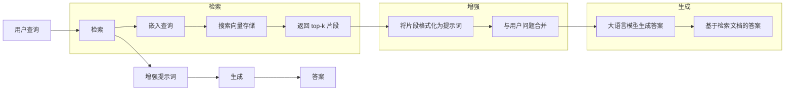
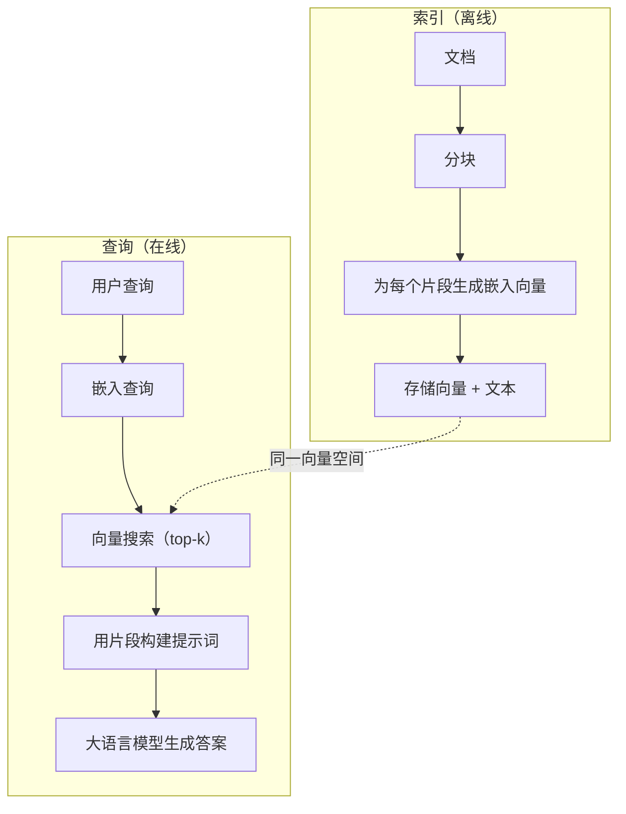

# RAG（检索增强生成）

> 你的大语言模型知道训练截止日期之前的一切。但它对你的公司文档、代码库或上周的会议记录一无所知。RAG 通过检索相关文档并将其塞入提示词来解决这个问题。这是生产环境 AI 中最广泛部署的模式。如果你只从这门课程中学一样东西，那就搭建一个 RAG 管线。

**类型：** 构建
**语言：** Python
**前置条件：** 第 10 阶段（从零构建大语言模型）、第 11 阶段第 01-05 课
**时间：** 约 90 分钟
**相关：** 第 5 阶段 · 第 23 课（RAG 分块策略）涵盖六种分块算法及其适用场景。第 5 阶段 · 第 22 课（嵌入向量模型深入解析）用于选择嵌入模型。第 11 阶段 · 第 07 课（高级 RAG）涵盖混合搜索、重排序和查询转换。

## 学习目标

- 构建一个完整的 RAG 管线：文档加载、分块、嵌入向量生成、向量存储、检索和生成
- 使用向量数据库（ChromaDB、FAISS 或 Pinecone）实现语义搜索，并建立适当的索引
- 解释为什么在基于知识的应用中 RAG 优于微调（成本、时效性、可溯源）
- 使用检索指标（精确率、召回率）和生成指标（忠实度、相关性）评估 RAG 质量

## 问题所在

你为公司搭建了一个聊天机器人。客户问："企业版套餐的退款政策是什么？"大语言模型给出了一个关于典型 SaaS 退款政策的通用回答。而真实的政策——埋在一份 200 页的内部维基文档里——规定企业客户享有 60 天窗口期和按比例退款。大语言模型从未见过这份文档。它不可能知道自己没有被训练过的内容。

微调是一种解决方案：拿大语言模型来，用你的内部文档训练它，然后部署更新后的模型。这确实可行，但存在严重问题。微调需要数千美元的算力成本。文档一旦变更，模型就过时了。你无法知道模型从哪个来源获取了信息。而且如果公司下个月收购了另一条产品线，你就得再次微调。

RAG 是另一种解决方案。模型保持不动。当问题进来时，在文档库中搜索相关段落，把它们粘贴到提示词中问题之前，然后让模型以这些段落为上下文来回答。文档库可以在几分钟内更新。你可以清楚地看到检索了哪些文档。模型本身永远不变。这就是 RAG 在生产环境中占据主导地位的原因：更便宜、更即时、更可审计，且适用于任何大语言模型。

## 核心概念

### RAG 模式

整个模式只需四步：



查询 → 检索 → 增强提示词 → 生成。每个 RAG 系统都遵循这个模式。生产环境中不同 RAG 系统的区别在于每个步骤的细节：如何分块、如何生成嵌入向量、如何搜索以及如何构建提示词。

### 为什么 RAG 优于微调

| 关注点 | 微调 | RAG |
|---------|------------|-----|
| 成本 | 每次训练 1,000-100,000+ 美元 | 每次查询 0.01-0.10 美元（嵌入向量 + 大语言模型） |
| 时效性 | 直到重新训练前都是过时的 | 重新索引文档即可在几分钟内更新 |
| 可审计性 | 无法追溯答案来源 | 可以展示检索到的确切段落 |
| 幻觉 | 仍然会自由产生幻觉 | 基于检索到的文档 |
| 数据隐私 | 训练数据融入模型权重 | 文档保留在你自己的向量存储中 |

微调会永久改变模型的权重。RAG 则临时改变模型的上下文。对于大多数应用来说，临时上下文正是你需要的。

微调唯一胜出的情况是：当你需要模型采用特定的风格、语气或推理模式，而这些仅靠提示词无法实现时。对于事实知识检索，RAG 每次都能胜出。

### 嵌入向量模型

嵌入向量模型将文本转换为稠密向量。相似的文本在这个高维空间中会靠近彼此。"How do I reset my password?"（如何重置密码？）和"I need to change my password"（我需要修改密码）尽管几乎没有共享相同的词语，却会产生几乎相同的向量。而"The cat sat on the mat"（猫坐在垫子上）则会产生一个非常不同的向量。

常用嵌入向量模型（2026 年阵容——完整分析见第 5 阶段 · 第 22 课）：

| 模型 | 维度 | 提供商 | 备注 |
|-------|-----------|----------|-------|
| text-embedding-3-small | 1536（套娃） | OpenAI | 大多数场景下的最佳性价比 |
| text-embedding-3-large | 3072（套娃） | OpenAI | 更高精度，可截断至 256/512/1024 维 |
| Gemini Embedding 2 | 3072（套娃） | Google | MTEB 检索最高分；8K 上下文 |
| voyage-4 | 1024/2048（套娃） | Voyage AI | 领域变体（代码、金融、法律） |
| Cohere embed-v4 | 1024（套娃） | Cohere | 多语言能力强，128K 上下文 |
| BGE-M3 | 1024（稠密 + 稀疏 + ColBERT） | BAAI（开源） | 单一模型三种视角 |
| Qwen3-Embedding | 4096（套娃） | 阿里巴巴（开源） | 开源检索最高分 |
| all-MiniLM-L6-v2 | 384 | 开源（Sentence Transformers） | 原型开发基线 |

在本课中，我们将使用 TF-IDF 构建自己的简单嵌入。不是因为 TF-IDF 是生产系统使用的工具，而是因为它能让概念变得具体：文本输入，向量输出，相似的文本产生相似的向量。

### 向量相似度

给定两个向量，如何衡量它们的相似度？有三种选择：

**余弦相似度**：两个向量之间夹角的余弦值。范围从 -1（完全相反）到 1（完全相同）。忽略幅度，只关心方向。这是 RAG 的默认选择。

```
cosine_sim(a, b) = dot(a, b) / (||a|| * ||b||)
```

**点积**：原始内积。更大的向量会得到更高的分数。当幅度包含信息时（更长的文档可能更相关）有用。

```
dot(a, b) = sum(a_i * b_i)
```

**L2（欧几里得）距离**：向量空间中的直线距离。距离越小 = 越相似。对幅度差异敏感。

```
L2(a, b) = sqrt(sum((a_i - b_i)^2))
```

余弦相似度是标准选择。它通过按幅度归一化来优雅地处理不同长度的文档。当人们说"向量搜索"时，几乎总是指余弦相似度。

### 分块策略

文档太长，无法作为单个向量来生成嵌入向量。一份 50 页的 PDF 可能产生糟糕的嵌入向量，因为它包含几十个主题。因此，你需要将文档拆分为多个片段（chunk），并分别对每个片段生成嵌入向量。

**固定大小分块**：每 N 个 token 切分一次。简单且可预测。一个 512 token 的片段，50 token 的重叠意味着片段 1 是 token 0-511，片段 2 是 token 462-973，依此类推。重叠确保你不会在不巧的边界处截断句子。

**语义分块**：在自然边界处切分。段落、章节或 markdown 标题。每个片段都是一个连贯的意义单元。实现更复杂，但检索效果更好。

**递归分块**：首先尝试在最大的边界处切分（章节标题）。如果某个章节仍然太大，则在段落边界处切分。如果某个段落仍然太大，则在句子边界处切分。这是 LangChain RecursiveCharacterTextSplitter 的方法，在实践中效果很好。

片段大小比人们想象的更重要：

- 太小（64-128 token）：每个片段缺乏上下文。"上季度增长了 15%"——在不知道"它"指代什么的情况下毫无意义。
- 太大（2048+ token）：每个片段涵盖多个主题，稀释了相关性。当你搜索收入数据时，得到的片段中 10% 关于收入，90% 关于员工人数。
- 最佳范围（256-512 token）：足够的上下文使其自包含，同时又足够聚焦以保证相关性。

大多数生产环境 RAG 系统使用 256-512 token 的片段，50 token 的重叠。Anthropic 的 RAG 指南推荐这个范围。

### 向量数据库

有了嵌入向量之后，你需要一个地方来存储和搜索它们。选项如下：

| 数据库 | 类型 | 最佳用途 |
|----------|------|----------|
| FAISS | 库（进程内） | 原型开发，中小规模数据集 |
| Chroma | 轻量级数据库 | 本地开发，小规模部署 |
| Pinecone | 托管服务 | 无需运维开销的生产环境 |
| Weaviate | 开源数据库 | 自托管生产环境 |
| pgvector | Postgres 扩展 | 已在使用 Postgres |
| Qdrant | 开源数据库 | 高性能自托管 |

在本课中，我们构建一个简单的内存向量存储。它将向量存储在列表中，并进行暴力余弦相似度搜索。这相当于使用平面索引的 FAISS。它可以扩展到大约 100,000 个向量，之后会变慢。生产系统使用近似最近邻（ANN）算法（如 HNSW）在毫秒内搜索数百万个向量。

### 完整管线



索引阶段每个文档运行一次（或在文档更新时运行）。查询阶段在每个用户请求时运行。在生产环境中，索引可能需要数小时处理数百万个文档。查询则必须在不到一秒内响应。

### 实际参数

大多数生产环境 RAG 系统使用以下参数：

- **k = 5 到 10** 每个查询检索的片段数
- **片段大小 = 256 到 512 token**，50 token 重叠
- **上下文预算**：每个查询 2,500-5,000 token 的检索内容
- **总提示词**：约 8,000-16,000 token（系统提示词 + 检索片段 + 对话历史 + 用户查询）
- **嵌入向量维度**：384-3072，取决于模型
- **索引吞吐量**：使用 API 嵌入时每秒 100-1,000 个文档
- **查询延迟**：检索 50-200ms，生成 500-3000ms

## 构建

### 第一步：文档分块

```python
def chunk_text(text, chunk_size=200, overlap=50):
    words = text.split()
    chunks = []
    start = 0
    while start < len(words):
        end = start + chunk_size
        chunk = " ".join(words[start:end])
        chunks.append(chunk)
        start += chunk_size - overlap
    return chunks
```

### 第二步：TF-IDF 嵌入

我们构建一个简单的嵌入函数。TF-IDF（词频-逆文档频率）并非神经嵌入，但它能将文本转换为向量，以捕捉词语的重要性。文档中出现频率高的词会获得更高的 TF。在整个语料库中稀有的词会获得更高的 IDF。两者的乘积给出一个向量，其中重要的、有区分度的词具有较高的值。

```python
import math
from collections import Counter

def build_vocabulary(documents):
    vocab = set()
    for doc in documents:
        vocab.update(doc.lower().split())
    return sorted(vocab)

def compute_tf(text, vocab):
    words = text.lower().split()
    count = Counter(words)
    total = len(words)
    return [count.get(word, 0) / total for word in vocab]

def compute_idf(documents, vocab):
    n = len(documents)
    idf = []
    for word in vocab:
        doc_count = sum(1 for doc in documents if word in doc.lower().split())
        idf.append(math.log((n + 1) / (doc_count + 1)) + 1)
    return idf

def tfidf_embed(text, vocab, idf):
    tf = compute_tf(text, vocab)
    return [t * i for t, i in zip(tf, idf)]
```

### 第三步：余弦相似度搜索

```python
def cosine_similarity(a, b):
    dot = sum(x * y for x, y in zip(a, b))
    norm_a = math.sqrt(sum(x * x for x in a))
    norm_b = math.sqrt(sum(x * x for x in b))
    if norm_a == 0 or norm_b == 0:
        return 0.0
    return dot / (norm_a * norm_b)

def search(query_embedding, stored_embeddings, top_k=5):
    scores = []
    for i, emb in enumerate(stored_embeddings):
        sim = cosine_similarity(query_embedding, emb)
        scores.append((i, sim))
    scores.sort(key=lambda x: x[1], reverse=True)
    return scores[:top_k]
```

### 第四步：提示词构建

这就是 RAG 中"增强"（augmented）的含义所在。将检索到的文档块格式化为提示词，然后要求 LLM 根据所提供的上下文进行回答。

```python
def build_rag_prompt(query, retrieved_chunks):
    context = "\n\n---\n\n".join(
        f"[Source {i+1}]\n{chunk}"
        for i, chunk in enumerate(retrieved_chunks)
    )
    return f"""Answer the question based ONLY on the following context.
If the context doesn't contain enough information, say "I don't have enough information to answer that."

Context:
{context}

Question: {query}

Answer:"""
```

### 第五步：完整的 RAG 流水线

```python
class RAGPipeline:
    def __init__(self):
        self.chunks = []
        self.embeddings = []
        self.vocab = []
        self.idf = []

    def index(self, documents):
        all_chunks = []
        for doc in documents:
            all_chunks.extend(chunk_text(doc))
        self.chunks = all_chunks
        self.vocab = build_vocabulary(all_chunks)
        self.idf = compute_idf(all_chunks, self.vocab)
        self.embeddings = [
            tfidf_embed(chunk, self.vocab, self.idf)
            for chunk in all_chunks
        ]

    def query(self, question, top_k=5):
        query_emb = tfidf_embed(question, self.vocab, self.idf)
        results = search(query_emb, self.embeddings, top_k)
        retrieved = [(self.chunks[i], score) for i, score in results]
        prompt = build_rag_prompt(
            question, [chunk for chunk, _ in retrieved]
        )
        return prompt, retrieved
```

### 第六步：生成（模拟）

在生产环境中，这里会调用 LLM API。在本课中，我们通过从检索到的上下文中提取最相关的句子来模拟生成过程。

```python
def simple_generate(prompt, retrieved_chunks):
    query_words = set(prompt.lower().split("question:")[-1].split())
    best_sentence = ""
    best_score = 0
    for chunk in retrieved_chunks:
        for sentence in chunk.split("."):
            sentence = sentence.strip()
            if not sentence:
                continue
            words = set(sentence.lower().split())
            overlap = len(query_words & words)
            if overlap > best_score:
                best_score = overlap
                best_sentence = sentence
    return best_sentence if best_sentence else "I don't have enough information."
```

## 使用

使用真正的嵌入模型和 LLM 时，代码几乎不需要改动：

```python
from openai import OpenAI

client = OpenAI()

def embed(text):
    response = client.embeddings.create(
        model="text-embedding-3-small",
        input=text
    )
    return response.data[0].embedding

def generate(prompt):
    response = client.chat.completions.create(
        model="gpt-4o-mini",
        messages=[{"role": "user", "content": prompt}],
        temperature=0
    )
    return response.choices[0].message.content
```

或者使用 Anthropic：

```python
import anthropic

client = anthropic.Anthropic()

def generate(prompt):
    response = client.messages.create(
        model="claude-sonnet-4-20250514",
        max_tokens=1024,
        messages=[{"role": "user", "content": prompt}]
    )
    return response.content[0].text
```

流水线是一样的。替换嵌入函数，替换生成函数。检索逻辑、文档分块、提示词构建——无论你使用哪种模型，这些部分都完全相同。

对于大规模向量存储，可以将暴力搜索替换为合适的向量数据库：

```python
import chromadb

client = chromadb.Client()
collection = client.create_collection("my_docs")

collection.add(
    documents=chunks,
    ids=[f"chunk_{i}" for i in range(len(chunks))]
)

results = collection.query(
    query_texts=["What is the refund policy?"],
    n_results=5
)
```

Chroma 内部处理嵌入（默认使用 all-MiniLM-L6-v2），并将向量存储在本地数据库中。模式相同，只是底层实现不同。

## 交付物

本课产出：
- `outputs/prompt-rag-architect.md` —— 针对特定用例设计 RAG 系统的提示词
- `outputs/skill-rag-pipeline.md` —— 教授 agent 如何构建与调试 RAG 管线的技能

## 练习

1. 将 TF-IDF 嵌入替换为简单的词袋方法（二值：单词出现记为 1，未出现记为 0）。比较在示例文档上的检索质量。TF-IDF 应该表现更好，因为它会给稀有词更高的权重。

2. 尝试不同的分块大小：在同一个文档集上分别尝试 50、100、200 和 500 词。对于每种大小，运行相同的 5 个查询，统计有多少查询在前 3 个结果中返回了相关的块。找到检索质量达到峰值的"甜点"大小。

3. 为每个块添加元数据（源文档名称、块位置）。修改提示词模板以包含来源归属，让 LLM 能够引用其来源。

4. 实现一个简单的评估：给定 10 组问答对，对每个问题运行 RAG 管线，衡量检索到的块中包含答案的比例。这就是 k 处的检索召回率（recall@k）。

5. 构建一个支持对话上下文的 RAG 管线：保留最近 3 轮对话的历史记录，并将其与检索到的块一起放入提示词中。用追问式问题（例如在询问定价之后问"那企业版呢？"）进行测试。

## 关键术语

| 术语 | 人们怎么说 | 实际含义 |
|------|----------------|----------------------|
| RAG | "能读你文档的 AI" | 检索相关文档，将其粘贴到提示词中，生成基于这些文档的答案 |
| Embedding（嵌入） | "把文本变成数字" | 文本的稠密向量表示，语义相似的文本会产生相似的向量 |
| Vector database（向量数据库） | "AI 的搜索引擎" | 一种为存储向量并按相似度查找最近邻而优化的数据存储 |
| Chunking（分块） | "把文档切成小段" | 将文档拆分为更小的片段（通常 256-512 token），使每一段都能独立嵌入和检索 |
| Cosine similarity（余弦相似度） | "两个向量有多相似" | 两个向量之间夹角的余弦值；1 = 方向完全相同，0 = 正交，-1 = 方向完全相反 |
| Top-k retrieval（Top-k 检索） | "获取 k 个最佳匹配" | 从向量存储中返回与查询最相似的 k 个块 |
| Context window（上下文窗口） | "LLM 能看到多少文本" | LLM 在单次请求中能处理的最大 token 数；检索到的块必须适配在这个范围内 |
| Augmented generation（增强生成） | "用给定的上下文来回答" | 使用检索到的文档作为上下文来生成回答，而非仅依赖训练时学到的知识 |
| TF-IDF | "词重要性评分" | 词频乘以逆文档频率；根据词在语料库中的独特程度为其赋予权重 |
| Indexing（索引） | "为搜索准备文档" | 分块、嵌入和存储文档的离线过程，使文档在查询时能够被搜索 |

## 延伸阅读

- Lewis et al., "Retrieval-Augmented Generation for Knowledge-Intensive NLP Tasks" (2020) —— Facebook AI Research 发表的原始 RAG 论文，正式确立了"先检索再生成"的模式
- Anthropic 的 RAG 文档 (docs.anthropic.com) —— 关于分块大小、提示词构建和评估的实用指南
- Pinecone Learning Center, "What is RAG?" —— 对 RAG 管线的清晰可视化解释，包含生产环境考量
- Sentence-BERT: Reimers & Gurevych (2019) —— all-MiniLM 嵌入模型背后的论文，展示了如何训练双编码器实现语义相似度
- [Karpukhin et al., "Dense Passage Retrieval for Open-Domain Question Answering" (EMNLP 2020)](https://arxiv.org/abs/2004.04906) —— DPR 论文，证明了稠密双编码器检索在开放域问答上优于 BM25，并为现代 RAG 检索器奠定了模式
- [LlamaIndex High-Level Concepts](https://docs.llamaindex.ai/en/stable/getting_started/concepts.html) —— 构建 RAG 管线时需要了解的主要概念：数据加载器、节点解析器、索引、检索器、响应合成器
- [LangChain RAG tutorial](https://python.langchain.com/docs/tutorials/rag/) —— 另一种风格的编排框架；以可运行链（chain-of-runnables）的视角呈现相同的"先检索再生成"模式
