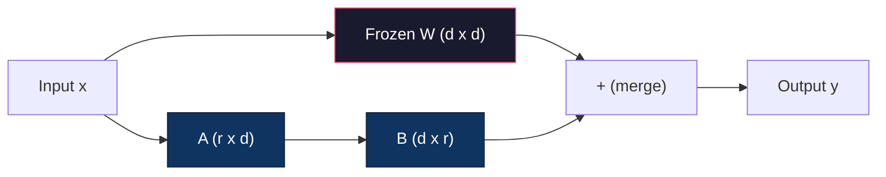
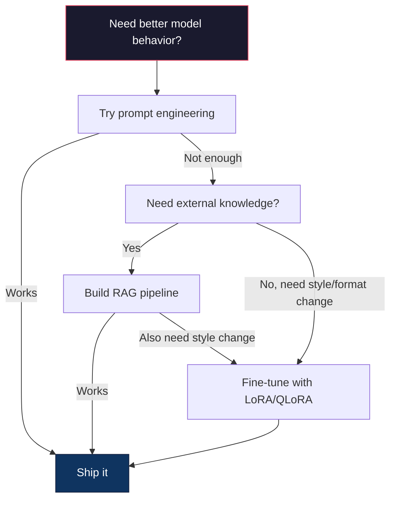

# 使用 LoRA 与 QLoRA 进行微调

> 全量微调一个 7B 模型需要 56GB 的显存。你没有那么多显存，大多数公司也没有。LoRA（低秩适应）让你只需训练不到 1% 的参数，就能在 6GB 显存下微调同一个模型。这并非妥协——在大多数任务上，它的质量与全量微调相当。整个开源微调生态都建立在这一技巧之上。

**类型：** 构建
**语言：** Python
**前置课程：** Phase 10, Lesson 06（指令微调 / SFT）
**时间：** 约 75 分钟
**相关：** Phase 10 涵盖了从头实现 SFT/DPO 循环。本课将其接入 2026 年的 PEFT 工具链（PEFT、TRL、Unsloth、Axolotl、LLaMA-Factory）。

## 学习目标

- 通过将低秩适配器矩阵（A 和 B）注入预训练模型的注意力层来实现 LoRA
- 计算 LoRA 相对于全量微调的参数节省量：秩为 r、d_model 维度下训练的参数为 2\*r\*d，而非 d^2
- 使用 QLoRA（4 位量化基础模型 + LoRA 适配器）微调模型，使其能在消费级 GPU 内存中运行
- 将 LoRA 权重合并回基础模型以进行部署，并比较使用和不使用适配器时的推理速度

## 问题

你有一个基础模型——Llama 3 8B。你希望它用你公司的语气回答客户支持工单。SFT 是答案，但 SFT 有一个成本问题。

全量微调会更新模型中的每一个参数。Llama 3 8B 有 80 亿个参数。在 fp16 精度下，每个参数占 2 字节，仅加载权重就需要 16GB。在训练过程中，你还需要梯度（16GB）、Adam 优化器状态（momentum + variance 共 32GB）以及激活值。总计：单个 8B 模型大约需要 56GB 显存。

一块 A100 80GB 勉强能装下。两块 A100 在云平台上的成本约为每小时 3-4 美元。在 50,000 个样本上训练 3 个 epoch 需要 6-10 小时，每次实验花费 30-40 美元。做 10 次实验来调优超参数，还没部署就已经花了 400 美元。

扩展到 Llama 3 70B，数字就更离谱了。仅权重就需要 140GB。你需要一个集群，每次实验成本 100 美元以上。

还有一个更深层次的问题。全量微调会修改模型中的每一个权重。如果你在客户支持数据上微调，可能会降低模型的通用能力，这就是灾难性遗忘——模型在你的任务上变得更好，但在其他方面变得更差。

你需要一种方法：训练更少的参数、使用更少的内存，并且不破坏模型已有的知识。

## 核心概念

### LoRA：低秩适应

2021 年 6 月，微软的 Edward Hu 及其同事发表了 LoRA。论文的核心洞察是：微调过程中的权重更新具有低内在秩。你不需要更新一个 4096x4096 权重矩阵中全部 1670 万个参数，更新中有用的信息可以被秩为 16 或 32 的矩阵捕获。

数学原理如下。一个标准线性层的计算为：

```
y = Wx
```

其中 W 是一个 d_out x d_in 的矩阵。对于一个 4096x4096 的注意力投影，那就是 16,777,216 个参数。

LoRA 冻结 W 并添加一个低秩分解：

```
y = Wx + BAx
```

其中 B 是 (d_out x r)，A 是 (r x d_in)。秩 r 远小于 d——通常为 8、16 或 32。

对于一个 4096x4096 的层，取 r=16：
- 原始参数量：4096 x 4096 = 16,777,216
- LoRA 参数量：(4096 x 16) + (16 x 4096) = 65,536 + 65,536 = 131,072
- 缩减比例：131,072 / 16,777,216 = 0.78%

你只训练了 0.78% 的参数，却获得了 95-100% 的质量。



A 用随机高斯分布初始化，B 初始化为零。这意味着 LoRA 的贡献从零开始——模型从原始行为开始训练，逐步学习适应。

### 缩放因子：Alpha

LoRA 引入了一个缩放因子 alpha，用于控制低秩更新对输出的影响程度：

```
y = Wx + (alpha / r) * BAx
```

当 alpha = r 时，缩放倍数为 1 倍。当 alpha = 2r（常见的默认值）时，缩放倍数为 2 倍。这个超参数可以独立于基础学习率来控制 LoRA 路径的学习率。

实践指导：
- alpha = 2 \* rank 是社区常见的惯例（原论文大多数实验中使用 alpha = rank）
- alpha = rank 给出 1 倍缩放，保守但稳定
- 更高的 alpha 意味着每步更新更大，可能加速收敛也可能导致不稳定

### 在哪里应用 LoRA

一个 Transformer 有很多线性层，你不需要在所有层上都加 LoRA。原论文测试了不同的组合：

| 目标层 | 可训练参数量（7B） | 质量 |
|--------------|----------------------|---------|
| 仅 q_proj | 4.7M | 良好 |
| q_proj + v_proj | 9.4M | 更好 |
| q_proj + k_proj + v_proj + o_proj | 18.9M | 注意力最优 |
| 所有线性层（注意力 + MLP） | 37.7M | 收益微弱，参数翻倍 |

大多数任务的最佳选择：q_proj + v_proj。这针对的是自注意力中的查询投影和值投影，它们控制模型关注什么以及提取什么信息。对于代码生成等复杂任务，加入 MLP 层有帮助，但对于较简单的任务，参数翻倍带来的收益递减。

### 秩的选择

秩 r 控制适应的表达能力：

| 秩 | 可训练参数量（每层） | 最适合 |
|------|---------------------------|----------|
| 4 | 32,768 | 简单分类、情感分析 |
| 8 | 65,536 | 单领域问答、摘要 |
| 16 | 131,072 | 多领域任务、指令遵循 |
| 32 | 262,144 | 复杂推理、代码生成 |
| 64 | 524,288 | 大多数任务收益递减 |
| 128 | 1,048,576 | 很少有必要 |

Hu 等人证明 r=4 已经能捕获简单任务的大部分适应。r=8 和 r=16 是实践中最常见的选择。超过 r=64 很少能提升质量，反而会开始丧失 LoRA 的内存优势。

### QLoRA：4 位量化 + LoRA

2023 年 5 月，华盛顿大学的 Tim Dettmers 及其同事发表了 QLoRA。其思路是：将冻结的基础模型量化到 4 位精度，然后在其上附加 fp16 精度的 LoRA 适配器。

这极大地改变了内存计算：

| 方法 | 权重内存（7B） | 训练内存（7B） | 所需 GPU |
|--------|-------------------|---------------------|-------------|
| 全量微调（fp16） | 14GB | ~56GB | 1x A100 80GB |
| LoRA（fp16 基础模型） | 14GB | ~18GB | 1x A100 40GB |
| QLoRA（4 位基础模型） | 3.5GB | ~6GB | 1x RTX 3090 24GB |

QLoRA 做出了三项技术贡献：

**NF4（正态浮点4位）**：一种专为神经网络权重设计的新数据类型。神经网络权重大致遵循正态分布，NF4 将 16 个量化级别放置在标准正态分布的分位数上，这在信息论上对正态分布数据是最优的。相比均匀 4 位量化（INT4）或标准 Float4，它损失的信息更少。

**双重量化**：量化常数本身也占用内存。每 64 个权重需要 1 个 fp32 缩放因子（4 字节）。对于一个 7B 模型，这会额外增加 0.4GB。双重量化将这些常数进一步量化为 fp8，将额外开销降至 0.1GB。数值虽小，但积少成多。

**分页优化器**：训练时，优化器状态（Adam 的 momentum 和 variance）在长序列上可能超出 GPU 内存。分页优化器利用 NVIDIA 的统一内存，在 GPU 内存耗尽时自动将优化器状态分页到 CPU RAM，需要时再调回。这以牺牲部分吞吐量为代价，防止了 OOM 崩溃。

### 质量问题

减少参数或量化基础模型是否会损害质量？多篇论文的结果如下：

| 方法 | MMLU（5-shot） | MT-Bench | HumanEval |
|--------|--------------|----------|-----------|
| 全量微调（Llama 2 7B） | 48.3 | 6.72 | 14.6 |
| LoRA r=16 | 47.9 | 6.68 | 14.0 |
| QLoRA r=16（NF4） | 47.5 | 6.61 | 13.4 |
| QLoRA r=64（NF4） | 48.1 | 6.70 | 14.2 |

在大多数基准测试中，r=16 的 LoRA 与全量微调的差距在 1% 以内。r=16 的 QLoRA 再损失不到一个百分点。而 r=64 的 QLoRA 基本上与全量微调持平，同时节省了 90% 的内存。

### 实际成本

在 50,000 个样本（3 个 epoch）上微调 Llama 3 8B：

| 方法 | GPU | 时间 | 成本 |
|--------|-----|------|------|
| 全量微调 | 2x A100 80GB | 8 小时 | ~$32 |
| LoRA r=16 | 1x A100 40GB | 4 小时 | ~$8 |
| QLoRA r=16 | 1x RTX 4090 24GB | 6 小时 | ~$5 |
| QLoRA r=16（Unsloth） | 1x RTX 4090 24GB | 2.5 小时 | ~$2 |
| QLoRA r=16 | 1x T4 16GB | 12 小时 | ~$4 |

在一块消费级 GPU 上使用 QLoRA 的成本不到一顿午饭钱。这就是为什么开源权重微调社区在 2023 年爆发式增长，以及为什么到 2026 年下面列出的每个训练框架都默认支持 QLoRA。

### 2026 年 PEFT 技术栈

| 框架 | 是什么 | 适用场景 |
|-----------|-----------|-----------|
| **Hugging Face PEFT** | 标准的 LoRA/QLoRA/DoRA/IA3 库 | 你需要原始控制权，且训练循环已基于 `transformers.Trainer` |
| **TRL** | Hugging Face 的强化反馈训练器（SFT、DPO、GRPO、PPO、ORPO） | 你需要在 SFT 之后进行 DPO/GRPO；建立在 PEFT 之上 |
| **Unsloth** | 基于 Triton 内核重写的前向/反向传播 | 你想要 2-5 倍加速 + 一半显存且不损失精度；适用于 Llama/Mistral/Qwen 系列 |
| **Axolotl** | 基于 YAML 配置的 PEFT + TRL + DeepSpeed + Unsloth 封装 | 你想要可复现、版本可控的训练运行 |
| **LLaMA-Factory** | 基于 PEFT + TRL 的 GUI/CLI/API | 你想要零代码微调；支持 100+ 种模型系列 |
| **torchtune** | 原生 PyTorch 配方，不依赖 `transformers` | 你想要最少依赖，且组织已标准化使用 PyTorch |

经验法则：研究用途或一次性实验 → PEFT。可重复的生产流水线 → 启用 Unsloth 内核的 Axolotl。快速原型 → LLaMA-Factory。

### 合并适配器

训练结束后，你有两个东西：冻结的基础模型和一个小的 LoRA 适配器（通常 10-100MB）。你可以选择：

1. **分开保存**：加载基础模型，在其上加载适配器。为不同任务切换适配器。这就是你从一个基础模型服务多个微调变体的方式。

2. **永久合并**：计算 W' = W + (alpha/r) \* BA，并将结果保存为一个新的完整模型。合并后的模型大小与原始模型相同，没有推理开销，也无需管理适配器。

对于服务多个任务（客户支持适配器、代码适配器、翻译适配器），分开保存。对于部署单个专用模型，合并。

用于组合多个适配器的高级合并技术：

- **TIES-Merging**（Yadav et al. 2023）：修剪小幅值参数，解决符号冲突，然后合并。减少适配器之间的干扰。
- **DARE**（Yu et al. 2023）：在合并前随机丢弃适配器参数，并重新缩放剩余参数。在组合能力方面出奇有效。
- **任务算术**：简单地加或减适配器权重。将"代码"适配器和"数学"适配器相加，通常能产生两者都擅长的模型。

### 何时不进行微调

微调是第三种选择，而非首选。

**第一：提示工程。** 写一个更好的系统提示，添加 few-shot 示例，使用思维链。这不需要任何成本，只需几分钟。如果提示能让你达到 80% 的效果，你可能就不需要微调。

**第二：RAG。** 如果模型需要了解你的特定数据（文档、知识库、产品目录），检索比将数据固化到权重中更便宜且更易维护。参见第 06 课。

**第三：微调。** 当你需要模型采用特定的风格、格式或推理模式，而仅靠提示无法实现时使用微调。当你需要一致的、结构化的输出时。当你需要将较大的模型蒸馏为较小的模型时。当延迟很重要，无法承受 few-shot 提示带来的额外 token 消耗时。



## 动手实现

我们在纯 PyTorch 中从头实现 LoRA。不使用任何库，没有黑魔法。你将构建 LoRA 层，将其注入模型，训练它，然后将权重合并回去。

### 第 1 步：LoRA 层

```python
import torch
import torch.nn as nn
import math

class LoRALayer(nn.Module):
    def __init__(self, in_features, out_features, rank=8, alpha=16):
        super().__init__()
        self.rank = rank
        self.alpha = alpha
        self.scaling = alpha / rank

        self.A = nn.Parameter(torch.randn(in_features, rank) * (1 / math.sqrt(rank)))
        self.B = nn.Parameter(torch.zeros(rank, out_features))

    def forward(self, x):
        return (x @ self.A @ self.B) * self.scaling
```

A 用缩放后的随机值初始化。B 初始化为零。乘积 BA 从零开始，因此模型从原始行为开始运行。

### 第 2 步：带 LoRA 包装的线性层

```python
class LinearWithLoRA(nn.Module):
    def __init__(self, linear, rank=8, alpha=16):
        super().__init__()
        self.linear = linear
        self.lora = LoRALayer(
            linear.in_features, linear.out_features, rank, alpha
        )

        for param in self.linear.parameters():
            param.requires_grad = False

    def forward(self, x):
        return self.linear(x) + self.lora(x)
```

原始线性层被冻结。只有 LoRA 参数（A 和 B）是可训练的。

### 第 3 步：将 LoRA 注入模型

```python
def inject_lora(model, target_modules, rank=8, alpha=16):
    for param in model.parameters():
        param.requires_grad = False

    lora_layers = {}
    for name, module in model.named_modules():
        if isinstance(module, nn.Linear):
            if any(t in name for t in target_modules):
                parent_name = ".".join(name.split(".")[:-1])
                child_name = name.split(".")[-1]
                parent = dict(model.named_modules())[parent_name]
                lora_linear = LinearWithLoRA(module, rank, alpha)
                setattr(parent, child_name, lora_linear)
                lora_layers[name] = lora_linear
    return lora_layers
```

首先，冻结模型中的每个参数。然后遍历模型树，找到与目标名称匹配的线性层，并将其替换为 LoRA 包装版本。LoRA 的 A 和 B 矩阵是整个模型中唯一可训练的参数。

### 第 4 步：统计参数量

```python
def count_parameters(model):
    total = sum(p.numel() for p in model.parameters())
    trainable = sum(p.numel() for p in model.parameters() if p.requires_grad)
    frozen = total - trainable
    return {
        "total": total,
        "trainable": trainable,
        "frozen": frozen,
        "trainable_pct": 100 * trainable / total if total > 0 else 0
    }
```

### 第 5 步：合并权重

```python
def merge_lora_weights(model):
    for name, module in model.named_modules():
        if isinstance(module, LinearWithLoRA):
            with torch.no_grad():
                merged = (
                    module.lora.A @ module.lora.B
                ) * module.lora.scaling
                module.linear.weight.data += merged.T
            parent_name = ".".join(name.split(".")[:-1])
            child_name = name.split(".")[-1]
            if parent_name:
                parent = dict(model.named_modules())[parent_name]
            else:
                parent = model
            setattr(parent, child_name, module.linear)
```

合并后，LoRA 层被移除。模型大小与原始模型相同，适配信息已融合到权重中。没有推理开销。

### 第 6 步：模拟 QLoRA 量化

```python
def quantize_to_nf4(tensor, block_size=64):
    blocks = tensor.reshape(-1, block_size)
    scales = blocks.abs().max(dim=1, keepdim=True).values / 7.0
    scales = torch.clamp(scales, min=1e-8)
    quantized = torch.round(blocks / scales).clamp(-8, 7).to(torch.int8)
    return quantized, scales

def dequantize_from_nf4(quantized, scales, original_shape):
    dequantized = quantized.float() * scales
    return dequantized.reshape(original_shape)
```

这里模拟了 4 位量化，在 64 个元素的块内将权重映射到 16 个离散级别。生产环境中的 QLoRA 使用 bitsandbytes 库在 GPU 上实现真正的 NF4 量化。

### 第 7 步：训练循环

```python
def train_lora(model, data, epochs=5, lr=1e-3, batch_size=4):
    optimizer = torch.optim.AdamW(
        [p for p in model.parameters() if p.requires_grad], lr=lr
    )
    criterion = nn.MSELoss()

    losses = []
    for epoch in range(epochs):
        epoch_loss = 0.0
        n_batches = 0
        indices = torch.randperm(len(data["inputs"]))

        for i in range(0, len(indices), batch_size):
            batch_idx = indices[i:i + batch_size]
            x = data["inputs"][batch_idx]
            y = data["targets"][batch_idx]

            output = model(x)
            loss = criterion(output, y)

            optimizer.zero_grad()
            loss.backward()
            optimizer.step()

            epoch_loss += loss.item()
            n_batches += 1

        avg_loss = epoch_loss / n_batches
        losses.append(avg_loss)

    return losses
```

### 第 8 步：完整演示

```python
def demo():
    torch.manual_seed(42)
    d_model = 256
    n_classes = 10

    model = nn.Sequential(
        nn.Linear(d_model, 512),
        nn.ReLU(),
        nn.Linear(512, 512),
        nn.ReLU(),
        nn.Linear(512, n_classes),
    )

    n_samples = 500
    x = torch.randn(n_samples, d_model)
    y = torch.randint(0, n_classes, (n_samples,))
    y_onehot = torch.zeros(n_samples, n_classes).scatter_(1, y.unsqueeze(1), 1.0)

    data = {"inputs": x, "targets": y_onehot}

    params_before = count_parameters(model)

    lora_layers = inject_lora(
        model, target_modules=["0", "2"], rank=8, alpha=16
    )

    params_after = count_parameters(model)

    losses = train_lora(model, data, epochs=20, lr=1e-3)

    merge_lora_weights(model)
    params_merged = count_parameters(model)

    return {
        "params_before": params_before,
        "params_after": params_after,
        "params_merged": params_merged,
        "losses": losses,
    }
```

这个演示创建了一个小模型，将 LoRA 注入两个层，对其进行训练，然后将权重合并回去。在 LoRA 训练期间，参数量从全部可训练降至约 1% 可训练，合并后又恢复到原始架构。

## 使用方法

借助 Hugging Face 生态，在真实模型上使用 LoRA 大约只需 20 行代码：

```python
from transformers import AutoModelForCausalLM, AutoTokenizer
from peft import LoraConfig, get_peft_model, TaskType

model = AutoModelForCausalLM.from_pretrained("meta-llama/Llama-3.1-8B")
tokenizer = AutoTokenizer.from_pretrained("meta-llama/Llama-3.1-8B")

lora_config = LoraConfig(
    task_type=TaskType.CAUSAL_LM,
    r=16,
    lora_alpha=32,
    lora_dropout=0.05,
    target_modules=["q_proj", "v_proj"],
)

model = get_peft_model(model, lora_config)
model.print_trainable_parameters()
```

对于 QLoRA，添加 bitsandbytes 量化：

```python
from transformers import BitsAndBytesConfig

bnb_config = BitsAndBytesConfig(
    load_in_4bit=True,
    bnb_4bit_quant_type="nf4",
    bnb_4bit_compute_dtype=torch.bfloat16,
    bnb_4bit_use_double_quant=True,
)

model = AutoModelForCausalLM.from_pretrained(
    "meta-llama/Llama-3.1-8B",
    quantization_config=bnb_config,
    device_map="auto",
)

model = get_peft_model(model, lora_config)
```

就这样。相同的训练循环，相同的数据管线。现在基座模型以 4-bit 形式存储，LoRA 适配器以 fp16 训练，整个流程只需 6GB 显存。

使用 Hugging Face Trainer 进行训练：

```python
from transformers import TrainingArguments, Trainer
from datasets import load_dataset

dataset = load_dataset("tatsu-lab/alpaca", split="train[:5000]")

training_args = TrainingArguments(
    output_dir="./lora-llama",
    num_train_epochs=3,
    per_device_train_batch_size=4,
    gradient_accumulation_steps=4,
    learning_rate=2e-4,
    fp16=True,
    logging_steps=10,
    save_strategy="epoch",
    optim="paged_adamw_8bit",
)

trainer = Trainer(
    model=model,
    args=training_args,
    train_dataset=dataset,
)

trainer.train()

model.save_pretrained("./lora-adapter")
```

保存的适配器大小仅为 10-100MB。基座模型保持不变。你可以将适配器分享到 Hugging Face Hub，而无需重新分发完整的模型。

## 产出物

本课将产出：
- `outputs/prompt-lora-advisor.md` -- 一个 prompt，帮助你根据具体任务确定 LoRA rank、目标模块和超参数
- `outputs/skill-fine-tuning-guide.md` -- 一个 skill，教会 agent 何时以及如何微调的决策树

## 练习

1. **Rank 消融实验。** 分别使用 rank 2、4、8、16、32 和 64 运行演示。绘制最终损失与 rank 的关系图。找出收益递减点——即加倍 rank 不再使损失减半的那个点。对于在 256 维特征上的简单分类任务，这个点大约在 r=8-16 左右。

2. **目标模块对比。** 修改 inject_lora，使其仅针对第 "0" 层、仅针对第 "2" 层、仅针对第 "4" 层，以及同时针对所有三层。对每个变体训练 20 个 epoch。比较收敛速度和最终损失。这模拟了现实中针对 q_proj、v_proj 或所有线性层的决策。

3. **量化误差分析。** 获取训练好的模型权重矩阵在 quantize_to_nf4 / dequantize_from_nf4 前后的值。计算均方误差、最大绝对误差，以及原始权重与重构权重之间的相关性。尝试 block_size 值为 32、64、128 和 256 的实验。

4. **多适配器服务。** 在数据集的不同子集上训练两个 LoRA 适配器（偶数索引 vs 奇数索引）。保存两个适配器。加载基座模型一次，然后切换适配器，验证每个适配器对相同输入产生不同的输出。这就是生产系统如何从一个基座模型服务多个微调模型。

5. **合并 vs 未合并推理。** 在相同的 100 个输入上，比较 LoRA 模型在 merge_lora_weights 前后的输出。验证输出完全相同（在 1e-5 的浮点容差范围内）。然后对两者的推理速度进行基准测试——合并后的速度应该略快，因为它只需一次矩阵乘法而非两次。

## 关键术语

| 术语 | 人们怎么说 | 实际含义 |
|------|----------------|----------------------|
| LoRA | "高效微调" | Low-Rank Adaptation（低秩适应）：冻结基座权重，训练两个小矩阵 A 和 B，它们的乘积近似完整的权重更新 |
| QLoRA | "在笔记本上微调" | 量化 LoRA：以 4-bit NF4 加载基座模型，在其上以 fp16 训练 LoRA 适配器，使得在 6GB 显存下即可微调 7B 模型 |
| Rank (r) | "模型能学到多少" | A 和 B 矩阵的内部维度；控制表达能力与参数数量之间的权衡 |
| Alpha | "LoRA 的学习率" | 应用于 LoRA 输出的缩放因子；alpha/r 决定了适配对最终输出的贡献程度 |
| NF4 | "4-bit 量化" | Normal Float 4：一种 4-bit 数据类型，其量化级别位于正态分布分位数上，对神经网络权重效果最优 |
| Adapter | "那个小小的训练部分" | 作为单独文件保存的 LoRA A 和 B 矩阵（10-100MB），可加载到任何一份基座模型副本上 |
| Target modules | "对哪些层做 LoRA" | 注入 LoRA 适配器的特定线性层（如 q_proj、v_proj 等） |
| Merging | "固化进去" | 计算 W + (alpha/r) * BA 并替换原始权重，消除推理时的适配器开销 |
| Paged optimizers | "训练时别爆显存" | 当 GPU 内存耗尽时，将优化器状态（Adam 的动量、方差）卸载到 CPU |
| Catastrophic forgetting | "微调把其他能力都搞坏了" | 当更新所有权重时，模型丢失了之前学到的能力 |

## 扩展阅读

- Hu et al., "LoRA: Low-Rank Adaptation of Large Language Models" (2021) -- 提出低秩分解方法的原始论文，在 GPT-3 175B 上使用低至 rank 4 进行了测试
- Dettmers et al., "QLoRA: Efficient Finetuning of Quantized Language Models" (2023) -- 引入了 NF4、双重量化和分页优化器，使得在单张 48GB GPU 上即可微调 65B 模型
- PEFT 库文档 (huggingface.co/docs/peft) -- Hugging Face 生态中用于 LoRA、QLoRA 及其他参数高效方法的标准库
- Yadav et al., "TIES-Merging: Resolving Interference When Merging Models" (2023) -- 在无质量损失的情况下组合多个 LoRA 适配器的技术
- [Rafailov et al., "Direct Preference Optimization: Your Language Model is Secretly a Reward Model" (NeurIPS 2023)](https://arxiv.org/abs/2305.18290) -- DPO 推导；SFT 之后的偏好微调阶段，无需奖励模型。
- [TRL 文档](https://huggingface.co/docs/trl/) -- `SFTTrainer`、`DPOTrainer`、`KTOTrainer` 以及与 PEFT/bitsandbytes/Unsloth 集成接口的官方参考。
- [Unsloth 文档](https://docs.unsloth.ai/) -- 将微调吞吐量翻倍并将内存减半的融合内核；TRL 之下的性能层。
- [Axolotl 文档](https://axolotl-ai-cloud.github.io/axolotl/) -- 基于 YAML 配置的多 GPU SFT/DPO/QLoRA 训练器；以配置即代码的方式替代手写脚本。
