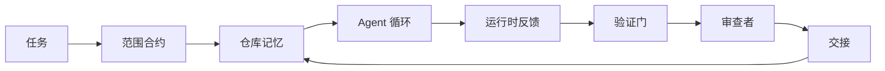

# Agent Workbench 工程：为什么能力强的模型仍然失败

> 一个能力强的模型是不够的。可靠的 agent 需要一个 workbench：指令、状态、范围、反馈、验证、审查和交接。去掉这些，即使是最前沿的模型产出的工作也不安全，无法交付。

**类型：** 学习 + 构建
**语言：** Python（标准库）
**前置条件：** Phase 14 · 01（Agent 循环），Phase 14 · 26（失败模式）
**时间：** 约 45 分钟

## 学习目标

- 区分模型能力与执行可靠性。
- 说出决定 agent 能否交付的七个 workbench 表面。
- 在一个小型仓库任务上对比纯 prompt 运行与 workbench 引导的运行。
- 生成一份失败模式报告，将每个缺失的表面映射到它导致的症状。

## 问题

你把一个前沿模型放进一个真实仓库，让它添加输入验证。它打开了四个文件，写了看起来合理的代码，声明成功，然后停了。你运行测试，两个失败了。第三个被修改的文件跟验证毫无关系。没有任何记录说明 agent 假设了什么、先尝试了什么、还有什么没做。

模型对 Python 的理解没有错。它错的是对工作的理解。它不知道什么算完成、允许在哪里写、哪些测试是权威的、下一个会话该如何接续。

这不是模型 bug，这是 workbench bug。agent 周围的表面缺少了将一次性生成转变为可靠、可恢复工程的那些部分。

## 概念

Workbench 是在任务期间包裹模型的运行环境。它有七个表面：

| 表面 | 承载什么 | 缺失时的失败 |
|------|---------|-------------|
| 指令 | 启动规则、禁止操作、完成定义 | Agent 猜测"交付"是什么意思 |
| 状态 | 当前任务、已修改文件、阻塞项、下一步 | 每个会话从零开始 |
| 范围 | 允许的文件、禁止的文件、验收标准 | 编辑泄漏到无关代码 |
| 反馈 | 真实命令输出捕获到循环中 | Agent 在 400 错误上声明成功 |
| 验证 | 测试、lint、冒烟运行、范围检查 | "看起来不错"进入主分支 |
| 审查 | 以不同角色进行的第二遍检查 | 构建者给自己的作业打分 |
| 交接 | 改了什么、为什么、还有什么没做 | 下一个会话重新发现一切 |

Workbench 独立于模型。你可以换模型而保留表面。你不能换表面而保留可靠性。



循环闭合在状态文件上，而不是聊天历史上。聊天是易失的。仓库是记录系统。

### Workbench 与 prompt 工程

Prompt 告诉模型这一轮你想要什么。Workbench 告诉模型如何跨轮次、跨会话完成工作。大多数 agent 失败故事是穿着 prompt 工程外衣的 workbench 失败。

### Workbench 与框架

框架给你一个运行时（LangGraph、AutoGen、Agents SDK）。Workbench 给 agent 一个在该运行时内工作的场所。两者都需要。本 mini-track 讲的是第二个。

### 从原语推理，而非从供应商分类法

目前关于"harness 工程"的文章很多。Addy Osmani、OpenAI、Anthropic、LangChain、Martin Fowler、MongoDB、HumanLayer、Augment Code、Thoughtworks、walkinglabs awesome list，以及 Medium 和 Hacker News 上持续不断的文章都在讨论。他们对 harness 的边界、范围和词汇存在分歧。我们不需要选边站。七个表面是 UX 层；在每个 workbench 之下，是支撑任何可靠后端的同一套分布式系统原语。

暂时去掉 agent 标签。一次 agent 运行是跨越时间、进程和机器的计算。要使其可靠，你需要任何生产系统都需要的相同原语。

| 原语 | 是什么 | 对 agent 承载什么 |
|------|------|------------------|
| 函数 | 类型化处理器。尽可能纯。拥有其输入和输出。 | 工具调用、规则检查、验证步骤、模型调用 |
| Worker | 拥有一个或多个函数和生命周期的长生命周期进程 | 构建者、审查者、验证者、MCP 服务器 |
| 触发器 | 调用函数的事件源 | Agent 循环 tick、HTTP 请求、队列消息、cron、文件变更、hook |
| 运行时 | 决定什么在哪里运行、有什么超时和资源的边界 | Claude Code 的进程、LangGraph 的运行时、worker 容器 |
| HTTP / RPC | 调用者和 worker 之间的线路 | 工具调用协议、MCP 请求、模型 API |
| 队列 | 触发器和 worker 之间的持久缓冲区；背压、重试、幂等性 | 任务板、反馈日志、审查收件箱 |
| 会话持久化 | 在崩溃、重启、模型切换后存活的状态 | `agent_state.json`、检查点、KV 存储、仓库本身 |
| 授权策略 | 谁可以用什么范围调用什么函数 | 允许/禁止的文件、审批边界、MCP 能力列表 |

现在将七个 workbench 表面映射到这些原语上。

- **指令** — 策略 + 函数元数据。规则是检查（函数）。路由器（`AGENTS.md`）是附加到运行时启动的策略。
- **状态** — 会话持久化。运行时在每一步读取的键值存储。文件、KV 或 DB；持久化语义重要，存储后端不重要。
- **范围** — 每个任务的授权策略。允许/禁止的 glob 是 ACL。需要的审批是权限格。
- **反馈** — 写入队列的调用日志。每个 shell 调用是一条记录，持久、可重放。
- **验证** — 一个函数。对输入确定性。在任务关闭时触发。失败即关闭。
- **审查** — 一个独立的 worker，对构建者产物有只读授权，对审查报告有只写授权。
- **交接** — 由会话结束触发器发出的持久记录。下一个会话的启动触发器读取它。

Agent 循环本身是一个 worker，消费事件（用户消息、工具结果、定时器 tick），调用函数（模型，然后模型选择的工具），写入记录（状态、反馈），并发出触发器（验证、审查、交接）。没有神秘之处；与作业处理器形状相同。

### 流通中的模式，翻译为原语

每个流行的 harness 模式都归结为八个原语。翻译表。

| 供应商或社区模式 | 实际是什么 |
|-----------------|-----------|
| Ralph Loop（Claude Code、Codex、agentic_harness 书）— 当 agent 试图提前停止时，将原始意图重新注入新的上下文窗口 | 一个触发器，用干净的上下文重新入队任务；会话持久化承载目标 |
| Plan / Execute / Verify（PEV） | 三个 worker，每个角色一个，通过状态和阶段间队列通信 |
| Harness-compute 分离（OpenAI Agents SDK，2026 年 4 月）— 将控制平面与执行平面分离 | 重述控制平面/数据平面。比 agent 标签早几十年 |
| Open Agent Passport（OAP，2026 年 3 月）— 在执行前对每个工具调用签名并审计，对照声明式策略 | 由预操作 worker 强制执行的授权策略，带有签名审计队列 |
| Guides and Sensors（Birgitta Böckeler / Thoughtworks）— 前馈规则 + 反馈可观测性 | 授权策略 + 验证函数 + 可观测性追踪 |
| 渐进式压缩，5 阶段（Claude Code 逆向工程，2026 年 4 月） | 一个状态管理 worker，类似 cron 运行在会话持久化上以保持在预算内 |
| Hooks / 中间件（LangChain、Claude Code）— 拦截模型和工具调用 | 包裹在运行时调用路径周围的触发器 + 函数 |
| Skills as Markdown with progressive disclosure（Anthropic、Flue） | 一个函数注册表，函数元数据按需加载到上下文中 |
| Sandbox agents（Codex、Sandcastle、Vercel Sandbox） | 计算平面：具有隔离文件系统、网络和生命周期的运行时 |
| MCP 服务器 | 通过稳定 RPC 暴露函数的 Worker，以能力列表作为授权 |

表中的每个条目都是 agent 社区发现了一个在分布式系统中已有名称的原语，并给它起了新名字。对营销有用的标签；作为工程词汇没有用。

### 实际数据说明了什么

harness-over-model 的主张现在有数字支撑。值得了解，因为它们也是反对"等更聪明的模型就行"的唯一诚实论据。

- Terminal Bench 2.0 — 相同模型，harness 变更将编码 agent 从 30 名之外提升到第五名（LangChain，《Anatomy of an Agent Harness》）。
- Vercel — 删除了 80% 的 agent 工具；成功率从 80% 跃升至 100%（MongoDB）。
- Harvey — 法律 agent 仅通过 harness 优化就将准确率提高了一倍以上（MongoDB）。
- 88% 的企业 AI agent 项目未能达到生产环境。失败集中在运行时，而非推理（preprints.org，《Harness Engineering for Language Agents》，2026 年 3 月）。
- 2025 年一项针对三个流行开源框架的基准测试研究报告了约 50% 的任务完成率；长上下文 WebAgent 在长上下文条件下从 40-50% 崩溃到 10% 以下，主要是无限循环和目标丢失（在 2026 年初的文章中广泛报道）。

结论不是"harness 永远赢"。模型确实会随时间吸收 harness 技巧。结论是今天，承重工程在模型周围，不在模型内部，承载这些负荷的原语是每个生产系统一直需要的那些。

### 供应商文章止步之处

这部分不需要客气。

- LangChain 的《Anatomy of an Agent Harness》列举了十一个组件——prompts、工具、hooks、沙箱、编排、记忆、skills、subagents，以及一个运行时"dumb loop"。它没有提到队列、作为部署单元的 worker、触发器语义、作为独立关注点的会话持久化，或授权策略。它把 harness 当作一个配置对象，而不是一个部署系统。
- Addy Osmani 的《Agent Harness Engineering》确立了 `Agent = Model + Harness` 的框架和 ratchet 模式，但没有说明 harness 是由什么构建的。读起来像立场，不像规范。
- Anthropic 和 OpenAI 在表面上走得最深，但停留在自己的运行时内。2026 年 4 月 Agents SDK 中的"harness-compute 分离"公告是第一个明确支持控制平面/数据平面分离的供应商文章。那是一个原语思想，不是新思想。
- agentic_harness 书将 harness 视为配置对象（Jaymin West 的《Agentic Engineering》第 6 章），其中最有力的一句话是"harness 是 agentic 系统中的主要安全边界"。那只是授权策略的重述。
- Hacker News 的讨论不断得出相同的结论。2026 年 4 月的帖子《The agent harness belongs outside the sandbox》认为 harness 应该"更像一个 hypervisor，位于一切之外，根据上下文和用户授权访问"。这同样是作为独立平面的授权策略。

你不需要不同意这些文章中的任何一篇就能注意到差距。它们写的是已经存在的系统的 UX 描述。我们写的是系统本身。当系统构建正确时，七个表面从原语中自然产生。当构建错误时，再多的 `AGENTS.md` 打磨也修复不了缺失的队列。

所以当你在别处听到"harness 工程"时，翻译成原语。Prompts 和规则是策略和函数。脚手架是运行时。Guardrails 是授权 + 验证。Hooks 是触发器。Memory 是会话持久化。Ralph Loop 是重新入队。Subagents 是 worker。Sandboxes 是计算平面。词汇在变；工程不变。Workbench 是面向 agent 的 UX；harness，在能经受下一次供应商重新定义的意义上，是正确连接在一起的函数、worker、触发器、运行时、队列、持久化和策略。

## 构建

`code/main.py` 在一个小型仓库任务上运行两次。第一次仅用 prompt，第二次接入七个表面。相同模型，相同任务。脚本统计失败运行中缺失了哪些表面，并打印失败模式报告。

仓库任务故意很小：为一个单文件 FastAPI 风格的处理函数添加输入验证并编写通过的测试。

运行：

```
python3 code/main.py
```

输出：两次运行的并排日志，总结纯 prompt 运行的 `failure_modes.json`，以及 workbench 运行的一行裁决。

Agent 是一个基于规则的小型桩；重点是表面，不是模型。在本 mini-track 的其余部分，你将把每个表面重建为真实、可复用的产物。

## 使用

三个地方 workbench 表面已经存在于实际中，即使没人这么叫：

- **Claude Code、Codex、Cursor。** `AGENTS.md` 和 `CLAUDE.md` 是指令表面。斜杠命令是范围。Hooks 是验证。
- **LangGraph、OpenAI Agents SDK。** 检查点和会话存储是状态表面。Handoffs 是交接表面。
- **真实仓库上的 CI。** 测试、lint 和类型检查是验证。PR 模板是交接。CODEOWNERS 是审查。

Workbench 工程是使这些表面显式化和可复用的学科，而不是让每个团队重新发现它们。

## 交付

`outputs/skill-workbench-audit.md` 是一个可移植的 skill，审计现有仓库的七个 workbench 表面，报告哪些缺失、哪些部分存在、哪些健康。放在任何 agent 设置旁边；它告诉你首先修复什么。

## 练习

1. 选一个你已经在运行 agent 的仓库。对七个表面从 0（缺失）到 2（健康）打分。你最弱的表面是什么？
2. 扩展 `main.py`，使纯 prompt 运行也产生一个假的"成功"声明。验证验证门是否会捕获它。
3. 为你的产品添加第八个表面。论证为什么它不能归入现有的七个之一。
4. 用一个不同的桩 agent 重新运行脚本，该 agent 幻觉出一个额外的文件写入。哪个表面首先捕获它？
5. 将 Phase 14 · 26 的五个行业反复出现的失败模式映射到七个表面上。每个表面设计用来吸收哪种模式？

## 关键术语

| 术语 | 人们怎么说 | 实际含义 |
|------|----------|---------|
| Workbench | "设置" | 围绕模型的工程化表面，使工作可靠 |
| 表面 | "一个文档"或"一个脚本" | agent 每轮读取或写入的命名、机器可读的输入 |
| 记录系统 | "笔记" | agent 在聊天历史消失后视为真相的文件 |
| 完成定义 | "验收" | agent 无法伪造的客观、文件支持的检查清单 |
| Workbench 审计 | "仓库就绪检查" | 对七个表面的检查，在工作开始前标记缺失的部分 |

## 扩展阅读

将这些作为数据点阅读，而非权威。在决定是否采用之前，将每个概念翻译回原语（函数、worker、触发器、运行时、HTTP/RPC、队列、持久化、策略）。

供应商框架：

- [Addy Osmani, Agent Harness Engineering](https://addyosmani.com/blog/agent-harness-engineering/) — `Agent = Model + Harness` 和 ratchet 模式；基础设施方面较薄
- [LangChain, The Anatomy of an Agent Harness](https://blog.langchain.com/the-anatomy-of-an-agent-harness/) — 十一个组件：prompts、工具、hooks、编排、沙箱、记忆、skills、subagents、运行时；省略了队列、部署、授权
- [OpenAI, Harness engineering: leveraging Codex in an agent-first world](https://openai.com/index/harness-engineering/) — Codex 团队对其运行时周围表面的看法
- [OpenAI, Unrolling the Codex agent loop](https://openai.com/index/unrolling-the-codex-agent-loop/) — agent 循环归结为函数调用上的 `while`
- [Anthropic, Effective harnesses for long-running agents](https://www.anthropic.com/engineering/effective-harnesses-for-long-running-agents) — 特定运行时内的长周期表面
- [Anthropic, Harness design for long-running application development](https://www.anthropic.com/engineering/harness-design-long-running-apps) — 应用设计笔记
- [LangChain Deep Agents harness capabilities](https://docs.langchain.com/oss/python/deepagents/harness) — 运行时配置表面

有可用细节的实践者文章：

- [Martin Fowler / Birgitta Böckeler, Harness engineering for coding agent users](https://martinfowler.com/articles/harness-engineering.html) — guides（前馈）+ sensors（反馈）；最清晰的控制论框架
- [HumanLayer, Skill Issue: Harness Engineering for Coding Agents](https://www.humanlayer.dev/blog/skill-issue-harness-engineering-for-coding-agents) — "这不是模型问题，是配置问题"
- [MongoDB, The Agent Harness: Why the LLM Is the Smallest Part of Your Agent System](https://www.mongodb.com/company/blog/technical/agent-harness-why-llm-is-smallest-part-of-your-agent-system) — 数据：Vercel 80% 到 100%，Harvey 2 倍准确率，Terminal Bench 前 30 到前 5
- [Augment Code, Harness Engineering for AI Coding Agents](https://www.augmentcode.com/guides/harness-engineering-ai-coding-agents) — 约束优先的演练
- [Sequoia podcast, Harrison Chase on Context Engineering Long-Horizon Agents](https://sequoiacap.com/podcast/context-engineering-our-way-to-long-horizon-agents-langchains-harrison-chase/) — 运行时关注优于模型关注

书籍、论文和参考实现：

- [Jaymin West, Agentic Engineering — Chapter 6: Harnesses](https://www.jayminwest.com/agentic-engineering-book/6-harnesses) — 书籍长度的论述，将 harness 视为主要安全边界
- [preprints.org, Harness Engineering for Language Agents (March 2026)](https://www.preprints.org/manuscript/202603.1756) — 学术框架：控制/代理/运行时
- [walkinglabs/awesome-harness-engineering](https://github.com/walkinglabs/awesome-harness-engineering) — 跨上下文、评估、可观测性、编排的精选阅读列表
- [ai-boost/awesome-harness-engineering](https://github.com/ai-boost/awesome-harness-engineering) — 替代精选列表（工具、评估、记忆、MCP、权限）
- [andrewgarst/agentic_harness](https://github.com/andrewgarst/agentic_harness) — 生产就绪的参考实现，带 Redis 支持的记忆和评估套件
- [HKUDS/OpenHarness](https://github.com/HKUDS/OpenHarness) — 带内置个人 agent 的开放 agent harness

值得为分歧而非共识阅读的 Hacker News 讨论：

- [HN: Effective harnesses for long-running agents](https://news.ycombinator.com/item?id=46081704)
- [HN: Improving 15 LLMs at Coding in One Afternoon. Only the Harness Changed](https://news.ycombinator.com/item?id=46988596)
- [HN: The agent harness belongs outside the sandbox](https://news.ycombinator.com/item?id=47990675) — 主张授权作为独立平面

本课程内的交叉引用：

- Phase 14 · 23 — OpenTelemetry GenAI 约定：sensors 文献指向的可观测性层
- Phase 14 · 26 — 七个表面设计用来吸收的失败模式目录
- Phase 14 · 27 — 位于授权策略原语的 prompt 注入防御
- Phase 14 · 29 — 生产运行时（队列、事件、cron）：本课中原语在部署中的位置
