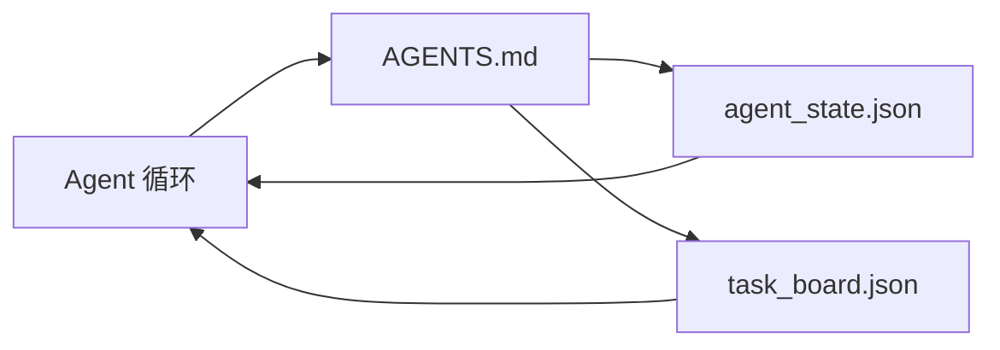

# 最小 Agent Workbench

> 最小的有用 workbench 是三个文件：一个根指令路由器、一个状态文件和一个任务板。其他一切都在此之上分层。如果一个仓库不能承载这三个文件，没有模型能拯救它。

**类型：** 构建
**语言：** Python（标准库）
**前置条件：** Phase 14 · 31（为什么能力强的模型仍然失败）
**时间：** 约 45 分钟

## 学习目标

- 定义构成最小可行 workbench 的三个文件。
- 解释为什么短根路由器优于长的单体 `AGENTS.md`。
- 构建一个 agent 每轮可读、结束时写入的状态文件。
- 构建一个在没有聊天历史的情况下能跨多会话存活的任务板。

## 问题

大多数团队通过写一个 3000 行的 `AGENTS.md` 并称之为完成来构建 workbench。模型加载它，忽略无法总结的部分，仍然在它一直失败的相同表面上失败。

你需要相反的。一个微小的根文件，仅在相关时将 agent 路由到更深层的文件。agent 在行动前读取、行动后写入的持久状态。一个任务板，说明什么在进行中、什么被阻塞、什么接下来做。

三个文件。每个都有职责。每个都足够机器可读，以便以后演化为真正的系统。

## 概念



### AGENTS.md 是路由器，不是手册

一个好的 `AGENTS.md` 是短的。它指向 agent：

- 状态文件（你在哪里）。
- 任务板（还有什么没做）。
- 更深层的规则（在 `docs/agent-rules.md` 下）。
- 验证命令（如何知道它工作）。

任何更长的内容放在更深层的文档中，仅在需要时加载。长手册被忽略。短路由器被遵循。

### agent_state.json 是记录系统

状态承载：活动任务 ID、已修改的文件、做出的假设、阻塞项和下一步行动。Agent 每轮读取它。下一个会话读取它而不是重放聊天。

状态存在于文件中，因为聊天历史不可靠。会话会死。对话会被裁剪。文件不会。

### task_board.json 是队列

任务板承载每个任务，状态为 `todo | in_progress | done | blocked`。它是 agent 在状态为空时拉取的队列，也是你想知道 agent 是否在轨道上时读取的队列。

板上的任务有 ID、目标、所有者（`builder`、`reviewer` 或 `human`）和验收标准。板故意很小：当它超过一屏时，你有的是规划问题，不是板的问题。

### 三个文件是地板，不是天花板

后续课程添加范围合约、反馈运行器、验证门、审查检查清单和交接包。这里的三个文件是它们都假设的基础。

## 构建

`code/main.py` 将最小 workbench 写入一个空仓库，并演示一个 agent 轮次：

1. 读取 `agent_state.json`。
2. 如果状态为空，从 `task_board.json` 拉取下一个任务。
3. 在范围内修改一个文件。
4. 写回更新后的状态。

运行：

```
python3 code/main.py
```

脚本在其旁边创建 `workdir/`，放置三个文件，运行一轮，并打印 diff。重新运行以查看第二轮如何从第一轮停止的地方继续。

## 使用

在生产 agent 产品内部，相同的三个文件以不同的名称出现：

- **Claude Code：** `AGENTS.md` 或 `CLAUDE.md` 用于路由器，`.claude/state.json` 风格存储用于状态，hooks 用于板。
- **Codex / Cursor：** 工作区规则用于路由器，会话记忆用于状态，聊天侧边栏中的排队任务用于板。
- **自定义 Python agent：** 你刚写的相同文件。

名称在变。形状不变。

## 实际中的生产模式

当三个模式在其上分层时，最小 workbench 能在真实单体仓库中存活。它们是独立的；选择你的仓库实际需要的。

**嵌套 `AGENTS.md`，最近优先。** OpenAI 在其主仓库中发布了 88 个 `AGENTS.md` 文件，每个子组件一个。Codex、Cursor、Claude Code 和 Copilot 都从工作文件向仓库根目录遍历，并连接沿途找到的每个 `AGENTS.md`。子目录文件扩展根文件。Codex 添加了 `AGENTS.override.md` 来替换而非扩展；覆盖机制是 Codex 特有的，跨工具工作时避免使用。Augment Code 的测量是关键：最好的 `AGENTS.md` 文件提供的质量提升相当于从 Haiku 升级到 Opus；最差的使输出比完全没有文件更糟。

**即使看起来像覆盖也要拒绝的反模式。** 冲突的指令会悄悄将 agent 从交互模式降级为贪婪模式（ICLR 2026 AMBIG-SWE：48.8% → 28% 解决率）；用数字优先级而不是平铺。没有执行命令的不可验证风格规则（"遵循 Google Python Style Guide"）让 agent 发明合规性；将每个风格规则与确切的 lint 命令配对。以风格而非命令开头会埋没验证路径；命令优先，风格最后。为人而非 agent 写作浪费上下文预算；简洁是特性。

**跨工具符号链接。** 一个带有符号链接的根文件（`ln -s AGENTS.md CLAUDE.md`、`ln -s AGENTS.md .github/copilot-instructions.md`、`ln -s AGENTS.md .cursorrules`）使每个编码 agent 保持在同一真相源上。Nx 的 `nx ai-setup` 从单个配置跨 Claude Code、Cursor、Copilot、Gemini、Codex 和 OpenCode 自动化此操作。

## 交付

`outputs/skill-minimal-workbench.md` 为任何新仓库生成三文件 workbench：一个针对项目调优的 `AGENTS.md` 路由器，一个带有正确键的 `agent_state.json`，以及一个用当前待办事项播种的 `task_board.json`。

## 练习

1. 向 `agent_state.json` 添加 `last_run` 时间戳。如果文件超过 24 小时，除非操作员确认，否则拒绝运行。
2. 向任务板添加 `priority` 字段，并更改拉取器始终选择最高优先级的 `todo`。
3. 将 `task_board.json` 迁移到 JSON Lines，使每个任务为一行，版本控制中的 diff 干净。
4. 编写一个 `lint_workbench.py`，如果 `AGENTS.md` 超过 80 行或引用了不存在的文件则失败。
5. 决定三个文件中哪个丢失最痛苦。为其辩护。

## 关键术语

| 术语 | 人们怎么说 | 实际含义 |
|------|----------|---------|
| 路由器 | `AGENTS.md` | 将 agent 指向更深层文档和文件的短根文件 |
| 状态文件 | "笔记" | agent 所在位置的机器可读记录，每轮写入 |
| 任务板 | "待办列表" | 带有状态、所有者、验收的 JSON 工作队列 |
| 记录系统 | "真相源" | workbench 在聊天消失后视为权威的文件 |

## 扩展阅读

- [agents.md — 开放规范](https://agents.md/) — 被 Cursor、Codex、Claude Code、Copilot、Gemini、OpenCode 采用
- [Augment Code, A good AGENTS.md is a model upgrade. A bad one is worse than no docs at all](https://www.augmentcode.com/blog/how-to-write-good-agents-dot-md-files) — 测量的质量跃升
- [Blake Crosley, AGENTS.md Patterns: What Actually Changes Agent Behavior](https://blakecrosley.com/blog/agents-md-patterns) — 经验上什么有效，什么无效
- [Datadog Frontend, Steering AI Agents in Monorepos with AGENTS.md](https://dev.to/datadog-frontend-dev/steering-ai-agents-in-monorepos-with-agentsmd-13g0) — 实践中的嵌套优先级
- [Nx Blog, Teach Your AI Agent How to Work in a Monorepo](https://nx.dev/blog/nx-ai-agent-skills) — 跨六个工具的单源生成
- [The Prompt Shelf, AGENTS.md Best Practices: Structure, Scope, and Real Examples](https://thepromptshelf.dev/blog/agents-md-best-practices/) — 经受审查的章节排序
- [Anthropic, Claude Code subagents and session store](https://docs.anthropic.com/en/docs/agents-and-tools/claude-code/sub-agents)
- Phase 14 · 31 — 这个最小值吸收的失败模式
- Phase 14 · 34 — 本课预览的持久状态模式
