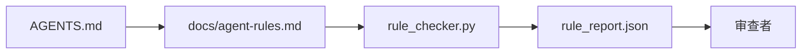

# Agent 指令作为可执行约束

> 写成散文的指令是愿望。写成约束的指令是测试。Workbench 将每条规则转化为 agent 可以在运行时检查、审查者可以在事后验证的东西。

**类型：** 构建
**语言：** Python（标准库）
**前置条件：** Phase 14 · 32（最小 Workbench）
**时间：** 约 50 分钟

## 学习目标

- 将路由散文与操作规则分离。
- 将启动规则、禁止操作、完成定义、不确定性处理和审批边界表达为机器可检查的约束。
- 实现一个规则检查器，对照规则集对运行进行评分。
- 使规则集对 diff 友好，以便审查可以看到变更。

## 问题

一个典型的 `AGENTS.md` 读起来像入职文档。它告诉 agent "要小心"、"彻底测试"、"不确定时问"。三天后，agent 交付了一个没有测试的变更，写入了禁止目录，并且从未询问，因为它从不知道界限在哪里。

指令在可操作时强大，在愿望式时薄弱。修复方法是编写 workbench 可以解释、审查者可以评分的规则。

## 概念

规则属于 `docs/agent-rules.md`，远离短的根路由器。每条规则有名称、类别和检查。



### 覆盖大多数规则的五种类别

| 类别 | 规则回答的问题 | 示例 |
|------|-------------|------|
| 启动 | 工作开始前必须为真？ | "状态文件存在且新鲜" |
| 禁止 | 什么绝对不能发生？ | "不要编辑 `scripts/release.sh`" |
| 完成定义 | 什么证明任务完成？ | "pytest 退出 0 且验收行通过" |
| 不确定性 | agent 不确定时做什么？ | "打开问题笔记而不是猜测" |
| 审批 | 什么需要人工审批？ | "任何新依赖，任何生产写入" |

不适合这五类的规则通常想成为两条规则。强制拆分。

### 规则是机器可读的

每条规则有 slug、类别、一行描述和一个 `check` 字段，命名 `rule_checker.py` 中的函数。添加规则意味着添加检查；检查器随 workbench 增长。

### 规则对 diff 友好

规则在单个 markdown 文件中每个标题一条。重命名在 diff 中可见。新规则位于其类别顶部。过时规则被删除，而不是注释掉，因为 workbench 是真相源，不是团队上个季度感受的聊天记录。

### 规则与框架 guardrails

框架 guardrails（OpenAI Agents SDK guardrails、LangGraph interrupts）在运行时级别执行规则。本课中的规则集是这些 guardrails 实现的人类可读、可审查的合约。你需要两者：运行时在轮次中捕获违规，规则集证明运行时在做正确的事。

## 构建

`code/main.py` 交付：

- `agent-rules.md` 解析器，将规则加载到 dataclass。
- `rule_checker.py` 风格的检查器函数，每个 `check` 引用一个。
- 一个违反两条规则的演示 agent 运行，以及捕获它们的检查通过。

运行：

```
python3 code/main.py
```

输出：解析后的规则集、运行追踪、每条规则的通过/失败，以及保存在脚本旁边的 `rule_report.json`。

## 实际中的生产模式

三个模式区分能持续一个季度的规则集和一周内衰减的规则集。

**编写时标记严重性。** 每条规则带有 `severity`：`block`、`warn` 或 `info`。检查器报告所有三种；运行时仅在 `block` 上拒绝。大多数团队早期高估严重性，然后在截止日期压力下悄悄削弱；编写时标记强制提前校准。与验证门（Phase 14 · 38）配对，后者将对 `block` 规则的任何覆盖签名到 `overrides.jsonl` 审计日志中。

**规则过期作为强制函数。** 每条规则带有 `expires_at` 日期（默认从编写起 90 天）。检查器在未过期规则连续 60 天零违规时发出警告；下一个季度审查要么证明保留它，要么削弱到 `info`，要么删除。Cloudflare 的生产 AI Code Review 数据（2026 年 4 月，30 天内 5,169 个仓库的 131,246 次审查运行）显示，具有显式过期的规则集保持在每个仓库 30 条规则以下；没有的集合增长到 80+，大多数从未触发。

**Markdown 作为源，JSON 作为缓存。** `agent-rules.md` 是编写的文件；`agent-rules.lock.json` 是检查器在热路径中读取的缓存。锁由 pre-commit hook 重新生成。Markdown diff 可审查；JSON 解析不进入每轮。与 `package.json` / `package-lock.json` 和 `Cargo.toml` / `Cargo.lock` 形状相同。

## 使用

在生产中：

- Claude Code、Codex、Cursor 在会话开始时读取规则，并在拒绝操作时引用它们。检查器在 CI 中重新运行它们以捕获静默漂移。
- OpenAI Agents SDK guardrails 将相同的检查注册为输入和输出 guardrails。Markdown 是文档表面；SDK 是运行时表面。
- LangGraph interrupts 在飞行中节点违反规则时触发。中断处理程序读取规则，询问人类，然后恢复。

规则集可跨三者移植，因为它只是 markdown 加函数名。

## 交付

`outputs/skill-rule-set-builder.md` 访谈项目所有者，将其现有的散文指令分类到五个类别中，并发出一个版本化的 `agent-rules.md` 加一个检查器桩。

## 练习

1. 如果你的产品确实需要，添加第六个类别。论证为什么它不能归入五个之一。
2. 扩展检查器，使规则可以携带严重性（`block`、`warn`、`info`），报告相应聚合。
3. 将检查器接入 CI：如果 block 严重性规则在最新 agent 运行上失败，则构建失败。
4. 为每条规则添加"过期"字段。90 天没有检查失败后，规则进入审查。
5. 找一个真实的 `AGENTS.md` 并将其重写为五类规则。其中多少行是可操作的？多少是愿望式的？

## 关键术语

| 术语 | 人们怎么说 | 实际含义 |
|------|----------|---------|
| 可操作规则 | "真正的指令" | workbench 可以在运行时检查的规则 |
| 愿望式规则 | "要小心" | 没有检查的规则；要么删除要么升级 |
| 完成定义 | "验收" | 任务完成的客观、文件支持的证明 |
| Block 严重性 | "硬规则" | 违规停止运行；没有操作员不能静默 |
| 规则过期 | "过时规则清理" | N 天内没有失败的规则等待退役 |

## 扩展阅读

- [OpenAI Agents SDK guardrails](https://platform.openai.com/docs/guides/agents-sdk/guardrails)
- [LangGraph interrupts](https://langchain-ai.github.io/langgraph/how-tos/human_in_the_loop/breakpoints/)
- [Anthropic, Building Effective Agents](https://www.anthropic.com/research/building-effective-agents)
- [Rick Hightower, Agent RuleZ: A Deterministic Policy Engine](https://medium.com/@richardhightower/agent-rulez-a-deterministic-policy-engine-for-ai-coding-agents-9489e0561edf) — 生产中的 block/warn/info 严重性
- [Cloudflare, Orchestrating AI Code Review at Scale](https://blog.cloudflare.com/ai-code-review/) — 131k 审查运行，规则组合经验
- [microservices.io, GenAI development platform — part 1: guardrails](https://microservices.io/post/architecture/2026/03/09/genai-development-platform-part-1-development-guardrails.html) — 规则和 CI 之间的纵深防御
- [Type-Checked Compliance: Deterministic Guardrails (arXiv 2604.01483)](https://arxiv.org/pdf/2604.01483) — Lean 4 作为规则即检查的上界
- [logi-cmd/agent-guardrails](https://github.com/logi-cmd/agent-guardrails) — 合并门实现：范围、变异测试、违规预算
- Phase 14 · 32 — 此规则集放入的最小 workbench
- Phase 14 · 38 — 消费规则报告的验证门
- Phase 14 · 39 — 对规则合规性评分的审查者 agent
