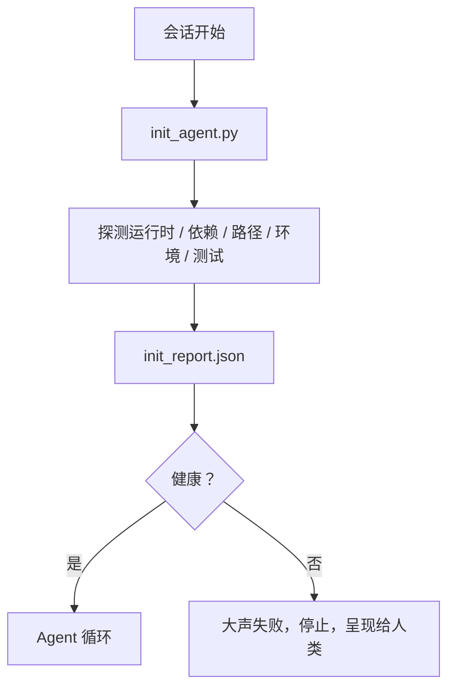

# Agent 初始化脚本

> 每个冷启动的会话都要交税。Agent 读取相同的文件，重试相同的探测，重新发现相同的路径。初始化脚本一次性交税，将答案写入状态。

**类型：** 构建
**语言：** Python（标准库）
**前置条件：** Phase 14 · 32（最小 Workbench），Phase 14 · 34（仓库记忆）
**时间：** 约 45 分钟

## 学习目标

- 识别 agent 每个会话都不应重做的工作。
- 构建一个确定性初始化脚本，探测运行时、依赖和仓库健康。
- 持久化探测结果，使 agent 读取它而不是重新运行检查。
- 当初始化失败时，大声、快速、在一个地方失败。

## 问题

打开一个会话。Agent 猜测 Python 版本。猜测测试命令。列出仓库根目录五次以找到入口点。尝试导入未安装的包。询问用户配置文件在哪里。到它做出真正的编辑时，一万个 token 已经花在了本应是一个脚本的设置工作上。

修复方法是一个初始化脚本，在 agent 做任何其他事情之前运行，并写入 agent 在启动时读取的 `init_report.json`。

## 概念



### 初始化脚本探测什么

| 探测 | 为什么重要 |
|------|----------|
| 运行时版本 | 错误的 Python 或 Node 版本意味着静默的错误版本 bug |
| 依赖可用性 | 缺失的包后来花费的成本是现在捕获的十倍 |
| 测试命令 | Agent 必须知道如何验证；如果命令缺失，workbench 已损坏 |
| 仓库路径 | 硬编码路径漂移；解析一次并固定 |
| 环境变量 | 缺失的 `OPENAI_API_KEY` 是失败表面，不是运行时谜团 |
| 状态 + 板新鲜度 | 来自崩溃会话的过时状态是陷阱 |
| 最后已知良好提交 | 会话结束时交接 diff 的锚点 |

### 大声失败，快速失败，在一个地方失败

探测失败意味着停止并呈现给人类。没有"agent 会解决的"。初始化的全部意义是在 workbench 损坏时拒绝启动。

### 幂等

连续运行两次。第二次运行应该是无操作，除了新的时间戳。幂等性是让你将脚本接入 CI、hooks 或任务前斜杠命令的东西。

### 初始化与启动规则

规则（Phase 14 · 33）描述什么必须为真才能行动。初始化是建立这些规则可以被检查的脚本。没有初始化的规则变成"要小心"。没有规则的初始化变成精致的失败。

## 构建

`code/main.py` 实现 `init_agent.py`：

- 五个探测：Python 版本、通过 `importlib.util.find_spec` 列出的依赖、测试命令可解析性、必需环境变量、状态文件新鲜度。
- 每个探测返回 `(name, status, detail)`。
- 脚本写入带有完整探测集的 `init_report.json`，如果任何 block 严重性探测失败则非零退出。

运行：

```
python3 code/main.py
```

脚本打印探测表，写入 `init_report.json`，在快乐路径上退出零，或在失败探测列表上非零退出。

## 实际中的生产模式

三个模式区分有用的初始化脚本和仪式。

**最后已知良好提交锚定。** 对照上次成功合并时写入的 `LKG` 文件探测当前提交。如果 diff 超过预算（默认 50 个文件），拒绝启动并要求人类批准新基线。这是 Cloudflare 的 AI Code Review 用来限定审查者 agent 范围的方法：每个审查会话锚定在相同的最后已知良好上，从不跨会话复合漂移。

**带 TTL 的锁文件。** 在第一次成功探测通过后写入 `prereqs.lock`。后续运行信任锁 N 小时（默认 24 小时）并跳过昂贵的探测。初始化脚本首先读取锁；如果新鲜且依赖清单哈希匹配，则短路。这与 Docker 用于层缓存的模式相同：幂等探测 + 内容哈希 = 跳过。

**热路径中无网络、无 LLM、无意外。** 初始化探测是确定性管道。调用 LLM 对失败进行分类或访问外部服务检查许可证的探测不是探测；它是工作流。如果探测在干运行中超过三秒，将其视为 workbench 异味，要么移出初始化，要么缓存其结果。

## 使用

在生产中：

- **Claude Code hooks。** `pre-task` hook 调用初始化脚本，如果失败则拒绝启动 agent。
- **GitHub Actions。** `setup-agent` 作业运行初始化脚本；agent 作业依赖它。
- **Docker 入口点。** Agent 容器在 exec agent 运行时之前运行初始化脚本；失败时日志呈现。

初始化脚本是可移植的，因为它不调用特定框架。Bash、Make 或任务文件都可以包装它。

## 交付

`outputs/skill-init-script.md` 访谈项目，将其设置工作分类为探测，并发出项目特定的 `init_agent.py` 加上在任何 agent 步骤之前运行它的 CI 工作流。

## 练习

1. 添加一个探测，将当前提交与最后已知良好提交进行 diff，如果超过 50 个文件变更则拒绝启动。
2. 将脚本接入写入 `prereqs.lock` 文件，如果锁超过七天则拒绝启动。
3. 添加 `--fix` 标志，自动安装缺失的开发依赖，但未经批准绝不修改运行时依赖。
4. 将探测从硬编码函数移动到 YAML 注册表。为权衡辩护。
5. 为每个探测添加时间预算。运行超过三秒的探测是 workbench 异味。

## 关键术语

| 术语 | 人们怎么说 | 实际含义 |
|------|----------|---------|
| 探测 | "检查" | 返回 `(name, status, detail)` 的确定性函数 |
| 初始化报告 | "设置输出" | 在状态旁边写入的 JSON，包含探测结果 |
| 幂等 | "安全重跑" | 连续两次运行产生相同的报告，模时间戳 |
| 大声失败 | "不要吞掉" | 停止并呈现给人类；无静默回退 |
| 设置税 | "引导成本" | agent 每个会话重新发现显而易见的东西所花费的 token |

## 扩展阅读

- [Anthropic, Effective harnesses for long-running agents](https://www.anthropic.com/engineering/effective-harnesses-for-long-running-agents)
- [GitHub Actions, composite actions for setup](https://docs.github.com/en/actions/sharing-automations/creating-actions/creating-a-composite-action)
- [microservices.io, GenAI dev platform: guardrails](https://microservices.io/post/architecture/2026/03/09/genai-development-platform-part-1-development-guardrails.html) — pre-commit + CI 检查作为初始化
- [Augment Code, How to Build Your AGENTS.md (2026)](https://www.augmentcode.com/guides/how-to-build-agents-md) — 初始化期望
- [Codex Blog, Codex CLI Context Compaction](https://codex.danielvaughan.com/2026/03/31/codex-cli-context-compaction-architecture/) — 会话启动作为压缩感知的初始化
- Phase 14 · 33 — 此脚本启用的规则集
- Phase 14 · 34 — 此脚本播种的状态文件
- Phase 14 · 38 — 初始化脚本馈送的验证门
- Phase 14 · 40 — 消费初始化报告的最后已知良好的交接
