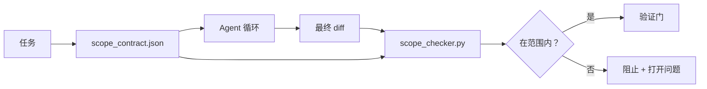

# 范围合约与任务边界

> 模型不知道工作在哪里结束。范围合约是一个每任务文件，说明工作从哪里开始、在哪里结束，以及如果溢出如何回滚。合约将"保持在范围内"从愿望变成检查。

**类型：** 构建
**语言：** Python（标准库）
**前置条件：** Phase 14 · 32（最小 Workbench），Phase 14 · 33（规则作为约束）
**时间：** 约 50 分钟

## 学习目标

- 编写 agent 在任务开始时读取、验证者在任务结束时读取的范围合约。
- 指定允许的文件、禁止的文件、验收标准、回滚计划和审批边界。
- 实现一个范围检查器，将 diff 与合约进行比较并标记违规。
- 使范围蔓延可见、自动且可审查。

## 问题

Agent 会蔓延。任务是"修复登录 bug"。Diff 涉及登录路由、邮件助手、数据库驱动、README 和发布脚本。每次修改在当时都有合理的理由。合在一起，它们是与被审查的变更不同的变更。

范围蔓延是 agent 工作中最未被监控的失败模式，因为 agent 真诚地叙述每一步。修复方法不是更严格的 prompt。修复方法是磁盘上的合约，说明承诺了什么，以及将结果与承诺进行比较的检查。

## 概念



### 范围合约中包含什么

| 字段 | 目的 |
|------|------|
| `task_id` | 链接到板上的任务 |
| `goal` | 审查者可以验证的一句话 |
| `allowed_files` | Agent 可以写入的 glob |
| `forbidden_files` | Agent 即使意外也不能触碰的 glob |
| `acceptance_criteria` | 证明完成的测试命令或断言行 |
| `rollback_plan` | 如果需要停止，操作员可以执行的一段话 |
| `approvals_required` | 需要显式人工签字的范围外操作 |

没有 `forbidden_files` 的合约是不完整的。负面空间是合约的一半。

### Glob，而非原始路径

真实仓库会移动文件。将合约固定到 glob（`app/**/*.py`、`tests/test_signup*.py`），使会话之间的重构不会使合约失效。

### 回滚是范围的一部分

列出如何回滚迫使合约作者思考可能出错的地方。你无法回滚的合约是不应被批准的合约。

### 范围检查是 diff 检查

Agent 写入 diff。检查器读取 diff、允许的 glob、禁止的 glob 以及已运行的任何验收命令列表。每个违规是验证门可以拒绝的标记发现。

## 构建

`code/main.py` 实现：

- `scope_contract.json` schema（JSON Schema 子集，glob 数组）。
- 一个 diff 解析器，将已修改文件列表加已运行命令列表转换为 `RunSummary`。
- 一个 `scope_check`，对照合约返回 `(violations, in_scope, off_scope)`。
- 两个演示运行：一个保持在范围内，一个蔓延。检查器用确切的文件和原因标记蔓延。

运行：

```
python3 code/main.py
```

输出：合约、两次运行、每次运行的裁决，以及保存的 `scope_report.json`。

## 实际中的生产模式

一位运行"specsmaxxing"（在调用 agent 前用 YAML 编写范围合约）的实践者报告，在不改变 agent 的情况下，兔子洞率在三周内从 52% 降至 21%。合约做了工作，不是模型。三个模式使收益持久。

**违规预算，而非二元失败。** `agent-guardrails`（Claude Code、Cursor、Windsurf、Codex 通过 MCP 使用的 OSS 合并门）为每个任务提供 `violationBudget`：预算内的轻微范围滑移作为警告呈现；仅在预算超出时合并门才拒绝。与 `violationSeverity: "error" | "warning"` 配对。预算是能交付的门与被讨厌它的团队禁用的门之间的区别。

**按路径族的严重性不对称。** 对 `docs/**` 的范围外写入通常是 `warn`；对 `scripts/**`、`migrations/**`、`config/prod/**` 的范围外写入始终是 `block`。这种不对称必须存在于合约中，而非运行时中，因为它是项目特定的且每个任务不同。

**文件预算旁边的时间与网络预算。** `time_budget_minutes` 字段限制墙钟时间；运行时拒绝在未经重新批准的情况下继续超过它。主机名的 `network_egress` 允许列表防止 agent 悄悄访问不属于任务的外部 API。这些也是范围维度；文件 glob 是必要的，不是充分的。

**多合约合并语义（最小权限）。** 当两个范围合约适用时（例如，项目范围合约加任务特定合约），合并是：**交集** `allowed_files`（两个合约都必须允许路径），**并集** `forbidden_files`（任一个可以禁止），`time_budget_minutes` 是最严格的（min），`approvals_required` 累积。`network_egress` 为 `None` 表示不执行，`[]` 表示拒绝所有，`[...]` 作为允许列表；合并时，`None` 遵从另一方，两个列表取交集，拒绝所有保持拒绝所有。在合约 schema 中声明这一点，使合并是机械的且可审查。

## 使用

生产模式：

- **Claude Code 斜杠命令。** `/scope` 命令写入合约并将其固定为会话上下文。Subagents 在行动前读取合约。
- **GitHub PRs。** 将合约作为 JSON 文件推送到 PR 正文中或作为检入产物。CI 对合并 diff 运行范围检查器。
- **LangGraph interrupts。** 范围违规触发中断；处理程序询问人类合约是否需要增长或 agent 是否需要后退。

合约随任务旅行。当任务关闭时，合约归档在 `outputs/scope/closed/` 下。

## 交付

`outputs/skill-scope-contract.md` 为任务描述生成范围合约，以及一个在 CI 中对每个 agent diff 运行的 glob 感知检查器。

## 练习

1. 添加 `network_egress` 字段，列出允许的外部主机。拒绝访问其他主机的运行。
2. 扩展检查器，对 `docs/**` 软失败，对 `scripts/**` 硬失败。为不对称辩护。
3. 使合约使用静态规则集（无 LLM）从 `goal` 字段派生 `allowed_files`。在第一个边缘情况上什么会出错？
4. 添加 `time_budget_minutes`，一旦墙钟时间超过则拒绝继续。
5. 对同一 diff 运行两个合约。当两者都适用时，正确的合并语义是什么？

## 关键术语

| 术语 | 人们怎么说 | 实际含义 |
|------|----------|---------|
| 范围合约 | "任务简报" | 每任务 JSON，列出允许/禁止的文件、验收、回滚 |
| 范围蔓延 | "它还改了……" | 在同一任务中修改的合约外文件 |
| 回滚计划 | "我们可以还原" | 用于停止的一段操作员运行手册 |
| 审批边界 | "需要签字" | 合约中列为需要显式人工审批的操作 |
| Diff 检查 | "路径审计" | 将已修改文件与合约 glob 进行比较 |

## 扩展阅读

- [LangGraph human-in-the-loop interrupts](https://langchain-ai.github.io/langgraph/concepts/human_in_the_loop/)
- [OpenAI Agents SDK tool approval policies](https://platform.openai.com/docs/guides/agents-sdk)
- [logi-cmd/agent-guardrails — merge gates and scope validation](https://github.com/logi-cmd/agent-guardrails) — 违规预算、严重性层级
- [Dev|Journal, Preventing AI Agent Configuration Drift with Agent Contract Testing](https://earezki.com/ai-news/2026-05-05-i-built-a-tiny-ci-tool-to-keep-ai-agent-configs-from-drifting-in-my-repo/) — 无外部依赖的 `--strict` 模式
- [Agentic Coding Is Not a Trap (production logs)](https://dev.to/jtorchia/agentic-coding-is-not-a-trap-i-answered-the-viral-hn-post-with-my-own-production-logs-33d9) — specsmaxxing 数据：52% → 21%
- [OpenCode permission globs](https://opencode.ai/docs/agents/) — 细粒度每权限范围
- [Knostic, AI Coding Agent Security: Threat Models and Protection Strategies](https://www.knostic.ai/blog/ai-coding-agent-security) — 范围作为最小权限的一部分
- [Augment Code, AI Spec Template](https://www.augmentcode.com/guides/ai-spec-template) — 三层边界系统（must/ask/never）
- Phase 14 · 27 — 与范围锁配对的 prompt 注入防御
- Phase 14 · 33 — 此合约每任务特化的规则集
- Phase 14 · 38 — 检查器报告到的验证门
