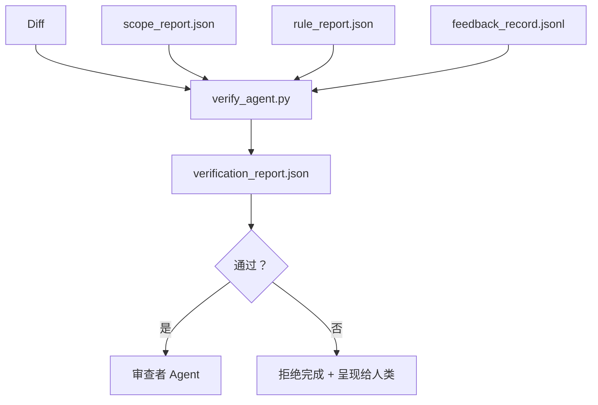

# 验证门

> Agent 不能给自己的作业打分。验证门读取范围合约、反馈日志、规则报告和 diff，并回答一个问题：这个任务真的完成了吗？如果门说不，任务就没有完成，无论聊天说什么。

**类型：** 构建
**语言：** Python（标准库）
**前置条件：** Phase 14 · 33（规则），Phase 14 · 36（范围），Phase 14 · 37（反馈）
**时间：** 约 55 分钟

## 学习目标

- 将验证门定义为对 workbench 产物的确定性函数。
- 将规则报告、范围报告、反馈记录和 diff 组合成单一裁决。
- 发出审查者 agent 和 CI 都可以读取的 `verification_report.json`。
- 拒绝在任何 block 严重性失败上推进任务，无例外。

## 问题

Agent 太容易声明成功。三种失败形状占主导：

- "看起来不错。" 模型读取自己的 diff 并决定它是正确的。
- "测试通过。" 自信地说。没有测试实际运行的记录。
- "验收满足。" 验收标准被宽松地解释为"任何类似完成的东西"。

Workbench 修复是一个单一的验证门，读取 agent 已经产生的产物并做出判断。门是确定性的。门在版本控制中。门接入 CI。Agent 不能贿赂它。

## 概念



### 门检查什么

| 检查 | 源产物 | 严重性 |
|------|-------|-------|
| 所有验收命令已运行 | `feedback_record.jsonl` | block |
| 所有验收命令退出零 | `feedback_record.jsonl` | block |
| 范围检查无禁止写入 | `scope_report.json` | block |
| 范围检查无范围外写入 | `scope_report.json` | block 或 warn |
| 所有 block 严重性规则通过 | `rule_report.json` | block |
| 反馈中无 `null` 退出码 | `feedback_record.jsonl` | block |
| 已修改文件匹配 `scope.allowed_files` | 两者 | warn |

`warn` 发现注释裁决；`block` 发现阻止 `passed: true`。

### 确定性，非概率性

门必须对相同的产物集每次产生相同的裁决。无 LLM 评判。LLM 评判属于审查者侧（Phase 14 · 39），其目标是定性评估，而非状态。

### 一个报告，一个路径

门为每个任务关闭发出一个 `verification_report.json`，写入 `outputs/verification/<task_id>.json`。CI 消费相同路径。具有不同路径的多个门会分叉真相源。

### 无例外拒绝

Block 严重性发现不能被 agent 覆盖。它们只能由人类覆盖，带有记录的 `override_reason` 和 `overridden_by` 用户 ID。覆盖是签名变更，不是 agent 决策。

## 构建

`code/main.py` 实现：

- 每个输入产物的加载器，全部本地桩化，使课程自包含。
- 一个 `verify(task_id, artifacts) -> VerdictReport` 纯函数。
- 一个打印机，显示每检查结果和最终通过/失败。
- 一个带有三个任务场景的演示：干净通过、范围蔓延、缺失验收。

运行：

```
python3 code/main.py
```

输出：三个裁决报告，每个保存在脚本旁边。

## 实际中的生产模式

四个模式将门从"另一个 lint 作业"提升为"决定性边缘"。

**纵深防御，而非单门。** Pre-commit hook → CI 状态检查 → 工具前授权 hook → 合并前门。每层是确定性的，因此一层的失败被下一层捕获。microservices.io 的 2026 年 3 月 playbook 明确：pre-commit hook 不可绕过，因为与模型侧 skill 不同，它不依赖于 agent 遵循指令。验证门位于 CI / 合并前层。

**通过确定性检查防御，模型评判仅用于细微差别。** Anthropic 的 2026 年 Hybrid Norm 配对：可验证奖励（单元测试、schema 检查、退出码）回答"代码是否解决了问题？"——LLM 评分标准回答"代码是否可读、安全、符合风格？"门运行第一类；审查者（Phase 14 · 39）运行第二类。混合它们会崩溃信号。

**签名覆盖日志，而非 Slack 讨论。** 每个覆盖在 `outputs/verification/overrides.jsonl` 中发出一行：时间戳、发现代码、原因、签名用户、当前 HEAD 提交。运行时拒绝任何缺少签名的覆盖；审计追踪是 git 跟踪的。这是覆盖策略和覆盖表演之间的界限。

**覆盖率底线作为一等检查。** `coverage_report.json` 馈送 `coverage_floor`（默认 80%）检查。如果测量的覆盖率低于底线或低于前一次合并的底线超过 1 个百分点，门失败。没有此检查，agent 会悄悄删除失败的测试，验证报告保持绿色。

**`--strict` 模式将 warn 提升为 block。** 对于发布分支、阻止交付的 PR 或事后分类，`--strict` 使每个警告成为硬失败。标志按分支选择加入；不是全局默认，因为对所有事情严格会腐蚀日常流程。

## 使用

生产模式：

- **CI 步骤。** `verify_agent` 作业对 agent 的最终产物运行门。合并保护在没有 `passed: true` 的情况下拒绝。
- **交接前 hook。** Agent 运行时在生成交接文档前调用门。没有绿色裁决，没有交接。
- **手动分类。** 当 agent 声明成功而人类怀疑时，操作员读取报告。

门是 workbench 流程中的决定性边缘。每个其他表面都在其上游。

## 交付

`outputs/skill-verification-gate.md` 将门接入特定项目：哪些验收命令馈送它，哪些规则是 block 严重性，哪些范围外写入被容忍，覆盖审计日志如何存储。

## 练习

1. 添加 `coverage_floor` 检查：测试命令必须产生至少 80% 的覆盖率报告。决定哪个产物携带底线。
2. 支持 `--strict` 模式，将每个 `warn` 提升为 `block`。记录严格模式是正确的默认值的情况。
3. 使门除了 JSON 外还生成 Markdown 摘要。为哪些字段属于摘要辩护。
4. 添加 `time_since_last_human_touch` 检查：在人类按键 60 秒内编辑的任何文件免于范围外标记。
5. 对你产品的真实 agent diff 运行门。多少发现是真实的，多少是噪音？门需要在哪里增长？

## 关键术语

| 术语 | 人们怎么说 | 实际含义 |
|------|----------|---------|
| 验证门 | "阻止事情的检查" | 对 workbench 产物的确定性函数，产生通过/失败裁决 |
| Block 严重性 | "硬失败" | 阻止 `passed: true` 并需要签名覆盖的发现 |
| 覆盖日志 | "为什么我们让它通过" | 带有原因和用户 ID 的签名条目，由审查审计 |
| 验收命令 | "证明" | 其零退出是 `done` 含义的 shell 命令 |
| 一个报告路径 | "真相源" | `outputs/verification/<task_id>.json`，由 CI 和人类共同消费 |

## 扩展阅读

- [Anthropic, Harness design for long-running application development](https://www.anthropic.com/engineering/harness-design-long-running-apps)
- [OpenAI Agents SDK guardrails](https://platform.openai.com/docs/guides/agents-sdk/guardrails)
- [microservices.io, GenAI dev platform: guardrails](https://microservices.io/post/architecture/2026/03/09/genai-development-platform-part-1-development-guardrails.html) — pre-commit 和 CI 之间的纵深防御
- [ICMD, The 2026 Playbook for Agentic AI Ops](https://icmd.app/article/the-2026-playbook-for-agentic-ai-ops-guardrails-costs-and-reliability-at-scale-1776661990431) — 审批门阶梯（草稿 → 审批 → 阈值下自动）
- [Type-Checked Compliance: Deterministic Guardrails (arXiv 2604.01483)](https://arxiv.org/pdf/2604.01483) — Lean 4 作为确定性门控的上界
- [logi-cmd/agent-guardrails — merge gate spec](https://github.com/logi-cmd/agent-guardrails) — 范围 + 变异测试门
- [Guardrails AI x MLflow](https://guardrailsai.com/blog/guardrails-mlflow) — 确定性验证器作为 CI 评分器
- [Akira, Real-Time Guardrails for Agentic Systems](https://www.akira.ai/blog/real-time-guardrails-agentic-systems) — 工具前/后门
- Phase 14 · 27 — prompt 注入防御（门的对抗对）
- Phase 14 · 36 — 此门执行的范围合约
- Phase 14 · 37 — 此门评分的反馈日志
- Phase 14 · 39 — 门交接给的审查者 agent
