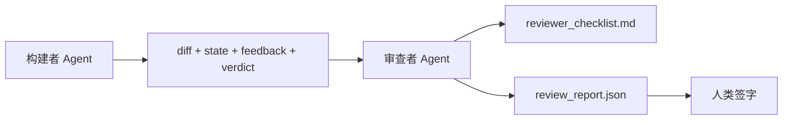

# 审查者 Agent：将构建者与评分者分离

> 写代码的 agent 不能给自己的代码打分。审查者是第二个循环，具有不同的系统 prompt、不同的目标，以及对构建者产生的一切的只读访问。构建者和审查者之间的差距是大多数可靠性所在。

**类型：** 构建
**语言：** Python（标准库）
**前置条件：** Phase 14 · 38（验证门）
**时间：** 约 55 分钟

## 学习目标

- 说明为什么同一个 agent 不能可靠地审查自己的工作。
- 构建一个审查者 agent 循环，消费构建者产物并发出结构化审查报告。
- 编写一个审查评分标准，对特定维度评分，而非感觉。
- 将审查者接入 workbench，使人类审查步骤从真实产物开始。

## 问题

你让 agent 修复一个 bug。它编辑了四个文件，运行了测试，并报告完成。验证门（Phase 14 · 38）确认验收已运行且范围保持。门说 `passed: true`。你合并。两天后你发现修复解决了 bug 的错误一半。

验收是必要的，不是充分的。审查者提出验收无法提出的问题：这解决了正确的问题吗？它是否在没有标记的情况下扩大了范围？它是否记录了本应被质疑的假设？它是否将 workbench 留在了下一个会话可以接续的状态？

## 概念



### 审查评分标准

五个维度，每个评分 0 到 2。

| 维度 | 问题 |
|------|------|
| 问题匹配 | 变更是否解决了所述任务，而非附近的任务？ |
| 范围纪律 | 编辑是否限制在合约内，还是合约被故意扩展？ |
| 假设 | 所有隐藏假设是否写在了可审查的地方？ |
| 验证质量 | 验收命令是否真正证明了目标，还是证明了较弱的版本？ |
| 交接就绪 | 下一个会话能否从当前状态干净地接续？ |

总分 10 分。低于 7 分的运行是软失败；低于 5 分的运行是硬失败。

### 审查者是独立角色，而非独立模型

你可以用与构建者相同的模型运行审查者。纪律是角色分离：不同的系统 prompt，不同的输入，对 diff 无写入访问。姿态的变化就是信号的变化。

### 审查者不能编辑 diff

审查者读取 diff、状态、反馈、裁决。它写入报告。它不修补 diff。如果报告说"修复这个"，下一个构建者轮次做修复；审查者回到审查。混合角色会破坏差距。

### 审查评分标准与验证门

门（Phase 14 · 38）检查确定性事实：验收是否运行，规则是否通过，范围是否保持。审查者做出定性判断：这是否是正确的工作，是否被记录，交接是否可用。两者都需要。

## 构建

`code/main.py` 实现：

- 一个 `ReviewerInputs` dataclass，捆绑审查者读取的产物。
- 一个评分标准评分器，每个维度一个函数。每个函数是确定性的，课程级别为桩；真实实现会调用 LLM。
- 一个 `review_report.json` 写入器，包含五个分数、总分和裁决（`pass`、`soft_fail`、`hard_fail`）。
- 两个演示案例：一个干净的变更和一个"正确的测试，错误的问题"变更。

运行：

```
python3 code/main.py
```

输出：两个写入磁盘的审查报告和一个维度分数的控制台表。

## 实际中的生产模式

数据：Cloudflare 的 2026 年 4 月 AI Code Review 系统在 30 天内在 5,169 个仓库的 48,095 个合并请求上运行了 131,246 次审查运行。中位审查在 3 分 39 秒内完成。最多七个专业审查者（安全、性能、代码质量、文档、发布管理、合规、Engineering Codex）在审查协调器下并行运行，协调器去重发现并判断严重性。顶级模型专门保留给协调器；专业审查者运行在更便宜的层级上。

四个模式使这在规模上工作。

**专业池，而非一个大审查者。** 一个具有 5 维度评分标准的审查者适用于单人仓库。一旦代码库有安全关键、性能关键和文档表面，拆分为具有更小 prompt 的专业审查者。协调器做去重；专业审查者从不运行完整评分标准。模型层级分离自然产生：便宜的专业审查者，昂贵的协调器。

**偏见缓解作为设计要求，而非优化。** LLM 评判显示四种可靠的偏见（Adnan Masood，2026 年 4 月）：位置偏见（GPT-4 在 (A,B) vs (B,A) 排序上约 40% 不一致）、冗长偏见（对更长输出约 15% 分数膨胀）、自我偏好（评判者偏好来自相同模型家族的输出）、权威（评判者高估对知名作者的引用）。缓解措施：评估两种排序，只计算一致的胜利；使用明确奖励简洁的 1-4 量表；跨模型家族轮换评判者；评分前剥离作者姓名。

**校准集，而非感觉。** 一个 10-20 个具有已知正确裁决的历史任务集。在每次 prompt 变更时对其运行审查者。如果与历史记录的一致性低于 80%，评分标准需要在审查者交付前修订。这是每个团队最终重新发现的东西；最好从一开始就这样做。

**与门的混合规范。** 验证门（Phase 14 · 38）处理确定性检查（验收是否运行，测试是否通过，范围是否保持）。审查者处理语义检查（这是否是正确的工作，假设是否被记录，交接是否可用）。Anthropic 的 2026 年指南对此分离是明确的：不要让审查者重做门已经证明的事情。

## 使用

生产模式：

- **Claude Code subagents。** 审查者 subagent 在构建者关闭任务后运行。它在 PR 上发布带有评分标准分数的评论。
- **OpenAI Agents SDK handoffs。** 构建者在任务完成时交接给审查者。审查者可以带着发现列表交回或向上交给人类。
- **双模型配对。** 构建者运行在更快更便宜的模型上。审查者运行在更强的模型上，具有更小的上下文，专注于判断。

审查者是 workbench 在人类无法自己完成每次审查时生长的第二双眼睛。

## 交付

`outputs/skill-reviewer-agent.md` 生成项目特定的审查评分标准、接入构建者产物的审查者 agent 桩，以及与验证门的集成，使人类审查从书面报告开始而非空白页。

## 练习

1. 添加特定于你产品领域的第六个维度。论证为什么它不被现有的五个吸收。
2. 用两个不同的系统 prompt（简洁、冗长）运行审查者。哪个产生的报告人类更可能阅读？
3. 为每个维度添加 `confidence` 字段。当最低维度的置信度低于 0.6 时拒绝交付报告。
4. 构建校准集：10 个具有已知正确裁决的历史任务关闭。对其运行审查者。它在哪些地方与历史记录不一致？
5. 添加"请求更多证据"功能：审查者可以在评分前要求构建者进行特定测试运行。正确的退避是什么，以免循环？

## 关键术语

| 术语 | 人们怎么说 | 实际含义 |
|------|----------|---------|
| 审查评分标准 | "检查清单" | 五维度 0-2 评分，每个维度有书面问题 |
| 软失败 | "需要修订" | 总分低于 7；构建者获得要处理的发现 |
| 硬失败 | "拒绝" | 总分低于 5 或任何维度为 0；停止并呈现给人类 |
| 角色分离 | "不同的 prompt" | 相同模型可以担任两个角色；纪律是输入和姿态 |
| 置信度底线 | "不交付低信号报告" | 当评分标准不确定时拒绝发出裁决 |

## 扩展阅读

- [OpenAI Agents SDK handoffs](https://platform.openai.com/docs/guides/agents-sdk/handoffs)
- [Anthropic Claude Code subagents](https://docs.anthropic.com/en/docs/agents-and-tools/claude-code/sub-agents)
- [Cloudflare, Orchestrating AI Code Review at Scale](https://blog.cloudflare.com/ai-code-review/) — 7 专业审查者 + 协调器架构，131k 运行 / 30 天
- [Agent-as-a-Judge: Evaluating Agents with Agents (OpenReview / ICLR)](https://openreview.net/forum?id=DeVm3YUnpj) — DevAI 基准，366 个分层解决方案需求
- [Adnan Masood, Rubric-Based Evaluations and LLM-as-a-Judge: Methodologies, Biases, Empirical Validation](https://medium.com/@adnanmasood/rubric-based-evals-llm-as-a-judge-methodologies-and-empirical-validation-in-domain-context-71936b989e80) — 4 种偏见及缓解措施
- [MLflow, LLM-as-a-Judge Evaluation](https://mlflow.org/llm-as-a-judge) — 分离构建者/评估者的生产工具
- [LangChain, How to Calibrate LLM-as-a-Judge with Human Corrections](https://www.langchain.com/articles/llm-as-a-judge) — 校准集工作流
- [Evidently AI, LLM-as-a-judge: a complete guide](https://www.evidentlyai.com/llm-guide/llm-as-a-judge)
- [Arize, LLM as a Judge — Primer and Pre-Built Evaluators](https://arize.com/llm-as-a-judge/)
- Phase 14 · 05 — Self-Refine 和 CRITIC（单 agent 自我审查基线）
- Phase 14 · 30 — 评估驱动的 agent 开发（校准集生成器）
- Phase 14 · 38 — 审查者读取的验证门
- Phase 14 · 40 — 审查报告馈送的交接包
