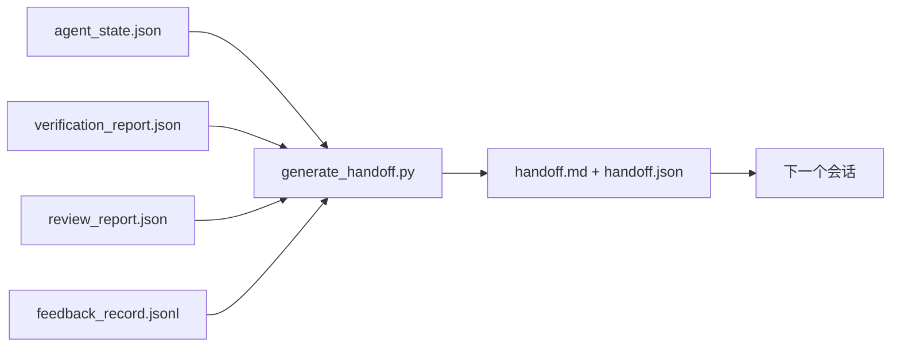

# 多会话交接

> 会话即将结束。工作没有。交接包是将"agent 工作了一小时"转变为"下一个会话在第一分钟就高效"的产物。有目的地构建它，而非事后才想。

**类型：** 构建
**语言：** Python（标准库）
**前置条件：** Phase 14 · 34（仓库记忆），Phase 14 · 38（验证），Phase 14 · 39（审查者）
**时间：** 约 50 分钟

## 学习目标

- 识别每个交接包需要的七个字段。
- 从 workbench 产物生成交接，无需手写散文。
- 将大型反馈日志修剪为交接大小的摘要。
- 使下一个会话的第一个操作是确定性的。

## 问题

会话结束。Agent 说"很好，我们取得了进展。"下一个会话打开。下一个 agent 问"我们上次停在哪里？"第一个 agent 的答案消失了。下一个 agent 重新发现，重新运行相同的命令，重新问人类相同的问题，并花费三十分钟恢复上一个会话的最后三十秒。

糟糕交接的成本在任务的整个生命周期中每个会话都要支付。修复方法是在会话结束时自动生成的包：改了什么、为什么、尝试了什么、什么失败了、还有什么没做、下次首先做什么。

## 概念



### 每个交接携带的七个字段

| 字段 | 它回答的问题 |
|------|------------|
| `summary` | 一段话说明做了什么 |
| `changed_files` | 一目了然的 diff |
| `commands_run` | 实际执行了什么 |
| `failed_attempts` | 尝试了什么以及为什么没成功 |
| `open_risks` | 什么可能在下个会话中出问题，带严重性 |
| `next_action` | 下一个会话采取的第一个具体步骤 |
| `verdict_pointer` | 验证 + 审查报告的路径 |

`next_action` 字段是承重的。一个除了 `next_action` 什么都有交接是状态报告，不是交接。

### 交接是生成的，而非编写的

手写交接是在艰难的一天会被跳过的交接。生成器读取 workbench 产物并发出包。Agent 的工作是将 workbench 留在生成器可以总结的状态，而非编写摘要。

### 两种形式：人类可读和机器可读

`handoff.md` 是人类阅读的。`handoff.json` 是下一个 agent 加载的。两者来自相同的源产物。如果它们分歧，JSON 胜出。

### 反馈日志修剪

完整的 `feedback_record.jsonl` 可能有数百条条目。交接只携带最后 K 条加上每个非零退出的条目。下一个会话在需要时加载完整日志，但包保持小。

## 构建

`code/main.py` 实现：

- 一个加载器，将状态、裁决、审查和反馈收集到单个 `WorkbenchSnapshot`。
- 一个 `generate_handoff(snapshot) -> (markdown, payload)` 函数。
- 一个过滤器，选择最后 K 条反馈条目加上所有非零退出。
- 一个演示运行，在脚本旁边写入 `handoff.md` 和 `handoff.json`。

运行：

```
python3 code/main.py
```

输出：打印的交接正文，加上磁盘上的两个文件。

## 实际中的生产模式

Codex CLI、Claude Code 和 OpenCode 各自提供不同的压缩故事；结构化交接包位于三者之上。

**压缩策略各不相同；包 schema 不变。** Codex CLI 的 POST /v1/responses/compact 是服务器端不透明 AES blob（OpenAI 模型的快速路径）；回退是作为 `_summary` 用户角色消息追加的本地"交接摘要"。Claude Code 在 95% 上下文时运行五阶段渐进式压缩。OpenCode 做基于时间戳的消息隐藏加 5 标题 LLM 摘要。三种不同的机制，相同的需求：将压缩后存活的内容序列化为可移植产物。包就是那个产物。

**新会话交接不是压缩。** 压缩延长会话；交接干净地关闭一个并开始下一个。Hermes Issue #20372 框架（2026 年 4 月）是正确的：当原地压缩开始退化时，agent 应写入紧凑交接，结束会话，并在新上下文中恢复。包是使该转换便宜的东西。错误是一直压缩直到质量崩溃；修复是为早期、干净的交接做预算。

**每个分支和主题一个活动交接。** 多 agent 协调在过时交接上比在糟糕模型输出上更容易崩溃。始终包含 `branch`、`last_known_good_commit` 和 `status`（`active | superseded | archived`）。过时交接被归档；只有活动的驱动下一个会话。这是交接作为笔记和交接作为状态之间的区别。

**在 50-75% 上下文时收尾，而非在墙上。** 手写模式 playbook（CLAUDE.md + HANDOVER.md）报告当会话在 50-75% 上下文预算而非 95% 时结束时结果最好。包生成器在压缩产物污染源状态之前干净运行。上下文完好时写入便宜；当模型已经丢失位置时昂贵。

## 使用

生产模式：

- **会话结束 hook。** 运行时在用户关闭聊天时触发生成器。包进入 `outputs/handoff/<session_id>/`。
- **PR 模板。** 生成器的 markdown 也是 PR 正文。审查者无需打开五个其他文件即可阅读。
- **跨 agent 交接。** 用一个产品构建（Claude Code），用另一个继续（Codex）。包是通用语言。

包小、规则且生成便宜。成本节省随每个会话复利。

## 交付

`outputs/skill-handoff-generator.md` 生成针对项目产物路径调优的生成器、运行它的会话结束 hook，以及下一个 agent 在启动时读取的 `handoff.json` schema。

## 练习

1. 添加 `assumptions_to_validate` 字段，呈现构建者记录但审查者评分未超过 1 的每个假设。
2. 对失败运行与通过运行不同地修剪反馈摘要。为不对称辩护。
3. 包含"给人类的问题"列表。问题进入包与进入聊天消息的阈值是什么？
4. 使生成器幂等：运行两次产生相同的包。什么需要稳定才能成立？
5. 添加"下一个会话前置条件"部分，列出下一个会话在行动前必须加载的确切产物。

## 关键术语

| 术语 | 人们怎么说 | 实际含义 |
|------|----------|---------|
| 交接包 | "会话摘要" | 携带七个字段的生成产物，markdown 和 JSON 两种形式 |
| 下一步行动 | "首先做什么" | 启动下一个会话的一个具体步骤 |
| 反馈修剪 | "日志摘要" | 最后 K 条记录加上每个非零退出 |
| 状态报告 | "我们做了什么" | 缺少 `next_action` 的文档；有用，但不是交接 |
| 裁决指针 | "收据" | 验证 + 审查报告的路径，用于可追溯性 |

## 扩展阅读

- [Anthropic, Effective harnesses for long-running agents](https://www.anthropic.com/engineering/effective-harnesses-for-long-running-agents)
- [OpenAI Agents SDK handoffs](https://platform.openai.com/docs/guides/agents-sdk/handoffs)
- [Codex Blog, Codex CLI Context Compaction: Architecture, Configuration, Managing Long Sessions](https://codex.danielvaughan.com/2026/03/31/codex-cli-context-compaction-architecture/) — POST /v1/responses/compact 和本地回退
- [Justin3go, Shedding Heavy Memories: Context Compaction in Codex, Claude Code, OpenCode](https://justin3go.com/en/posts/2026/04/09-context-compaction-in-codex-claude-code-and-opencode) — 三供应商压缩比较
- [JD Hodges, Claude Handoff Prompt: How to Keep Context Across Sessions (2026)](https://www.jdhodges.com/blog/ai-session-handoffs-keep-context-across-conversations/) — CLAUDE.md + HANDOVER.md，50-75% 上下文预算
- [Mervin Praison, Managing Handoffs in Multi-Agent Coding Sessions: Fresh Context Without Losing Continuity](https://mer.vin/2026/04/managing-handoffs-in-multi-agent-coding-sessions-fresh-context-without-losing-continuity/) — 分布式系统框架
- [Hermes Issue #20372 — 压缩变得有风险时的自动新会话交接](https://github.com/NousResearch/hermes-agent/issues/20372)
- [Hermes Issue #499 — Context Compaction Quality Overhaul](https://github.com/NousResearch/hermes-agent/issues/499) — Codex CLI 中面向交接的 prompt
- [Microsoft Agent Framework, Compaction](https://learn.microsoft.com/en-us/agent-framework/agents/conversations/compaction)
- [OpenCode, Context Management and Compaction](https://deepwiki.com/sst/opencode/2.4-context-management-and-compaction)
- [LangChain, Context Engineering for Agents](https://www.langchain.com/blog/context-engineering-for-agents)
- Phase 14 · 34 — 生成器读取的状态文件
- Phase 14 · 38 — 包指向的验证裁决
- Phase 14 · 39 — 捆绑到包中的审查报告
