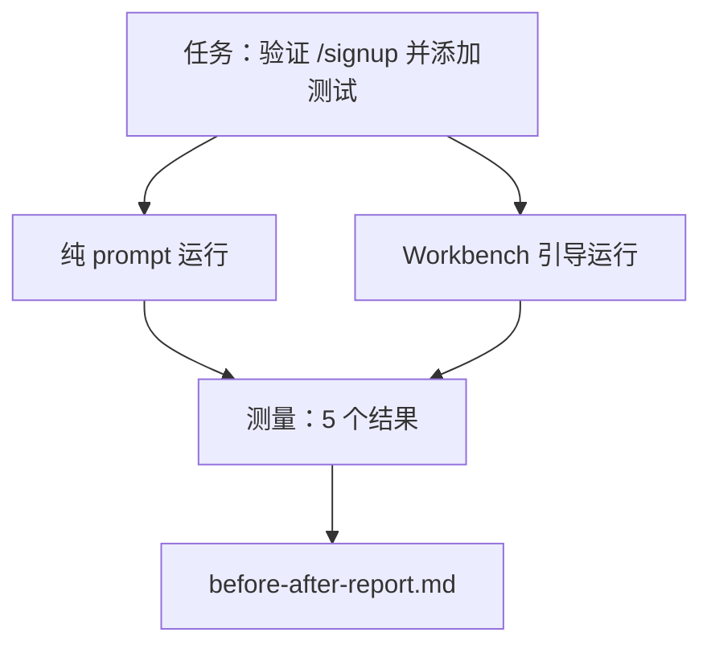

# 真实仓库上的 Workbench

> 十一课的表面如果不能在与真实代码库接触后存活就毫无价值。本课在一个小型示例应用上运行相同的任务两次：纯 prompt 与 workbench 引导。数字来做论证。

**类型：** 构建
**语言：** Python（标准库）
**前置条件：** Phase 14 · 32 至 14 · 40
**时间：** 约 60 分钟

## 学习目标

- 将七个 workbench 表面汇集到一个小型应用上。
- 运行相同的任务两次（纯 prompt 和 workbench 引导）并测量五个结果。
- 阅读前后报告并决定哪些表面提供了最大的杠杆。
- 针对"但我的模型足够好"的反驳为 workbench 辩护。

## 问题

在玩具任务上的演示说服不了任何人。Workbench 的案例是在一个真实感觉的仓库上的真实感觉的任务以更少的失败、更少的回滚和一个下一个会话可以使用的包落地到生产中时建立的。

本课交付那个真实感觉的仓库，并通过两个管道运行相同的任务。结果是一份你可以交给怀疑者的前后报告。

## 概念



### 示例应用

`sample_app/` 中的一个最小 FastAPI 风格处理函数：

- `app.py` 带有 `/signup`（尚无验证）。
- `test_app.py` 带有一个快乐路径测试。
- `README.md` 和 `scripts/release.sh` 作为禁区诱饵。

### 任务

> 为 `/signup` 添加输入验证：拒绝短于 8 个字符的密码，返回 422 并带有类型化错误信封。添加一个证明新行为的测试。

### 两个管道

纯 prompt：

1. 读取 README。
2. 读取 `app.py`。
3. 编辑文件。
4. 声明完成。

Workbench 引导：

1. 运行初始化脚本（Lesson 35）。
2. 读取范围合约（Lesson 36）。
3. 读取状态（Lesson 34）。
4. 仅编辑允许的文件。
5. 通过反馈运行器运行验收命令（Lesson 37）。
6. 运行验证门（Lesson 38）。
7. 运行审查者（Lesson 39）。
8. 生成交接（Lesson 40）。

### 测量的五个结果

| 结果 | 为什么重要 |
|------|----------|
| `tests_actually_run` | 大多数"测试通过"声明不可验证 |
| `acceptance_met` | 证明目标的测试必须是运行的测试 |
| `files_outside_scope` | 范围蔓延是主要的静默失败 |
| `handoff_quality` | 下一个会话为此付出或受益 |
| `reviewer_total` | 门之上的定性判断 |

## 构建

`code/main.py` 对相同的示例应用夹具编排两个管道。两个管道都是脚本化的（循环中无 LLM），因此测量是可重现的。脚本将比较写入 `before-after-report.md` 和 `comparison.json`。

运行：

```
python3 code/main.py
```

输出：每个管道结果的控制台表，保存在脚本旁边的 markdown 报告，以及供任何想制图的人使用的 JSON。

## 实际中的生产模式

怀疑者的问题是"workbench 实际有多大帮助？"2026 年的数字比解释更有说服力。

**Terminal Bench 相同模型从 30 名之外到前 5。** LangChain 的《Anatomy of an Agent Harness》（2026 年 4 月）：一个编码 agent 仅通过更改 harness 就从 Terminal Bench 2.0 的 30 名之外跃升至第五名。相同模型。不同的表面。二十五名的差距。

**Vercel 通过删除工具从 80% 到 100%。** Vercel 报告删除其 agent 的 80% 工具将成功率从 80% 提升到 100%。更小的工具表面，更清晰的范围，更少的失败方式。负面空间获胜。

**Harvey 仅通过 harness 实现 2 倍准确率。** 法律 agent 通过 harness 优化将准确率提高了一倍以上，无模型变更。

**88% 的企业 AI agent 项目未能达到生产环境。** preprints.org 的《Harness Engineering for Language Agents》论文（2026 年 3 月）将失败追溯到运行时，而非推理：过时状态、脆弱重试、过度增长的上下文、中间错误的糟糕恢复。

**长上下文崩溃。** WebAgent 基线 40-50% 成功率在长上下文条件下降至 10% 以下，主要是无限循环和目标丢失。Ralph Loop 和交接包的存在就是为了吸收这一点。

**假阴性仍然存在。** 单步事实任务、一行 lint、格式化运行、模型逐字记忆的任何东西——这些纯 prompt 运行更快。基准应诚实地列举它们，使 workbench 不被框定为过度。

结论不是"harness 永远赢"。模型确实会随时间吸收 harness 技巧。结论是今天，工程负荷位于七个表面中，数字证明了这一点。

## 使用

本课是你在以下情况下引用的案例文件：

- 有人问为什么每个 PR 都带有 `agent-rules.md` 和范围合约。
- 一个团队想"仅在这个 sprint"放弃验证门。
- 一个新的 agent 产品启动，你需要一个可移植的基准来判断它是否真的节省时间。

数字比解释传播得更远。

## 交付

`outputs/skill-workbench-benchmark.md` 是一个可移植的评估 harness，通过两个管道对项目自己的示例应用运行任何 agent 产品，并报告五个结果。

## 练习

1. 添加第六个结果：到第一次有意义编辑的时间。如何干净地测量它？
2. 在你代码库的真实第二天任务上运行比较。Workbench 数字在哪里下滑？
3. 添加"假阴性"通过：纯 prompt 会更快且 workbench 开销是真实成本的任务。为仍然保留 workbench 辩护。
4. 将脚本化的"agent"替换为真实的 LLM 调用。哪些结果变得更嘈杂？
5. 编写面向非工程师的一页摘要。什么能通过删减？

## 关键术语

| 术语 | 人们怎么说 | 实际含义 |
|------|----------|---------|
| 示例应用 | "玩具仓库" | 小但足够真实以锻炼所有七个表面 |
| 管道 | "工作流" | Agent 遵循的表面读取/写入的有序序列 |
| 前后报告 | "数据" | 你交给怀疑者的产物 |
| 假阴性 | "Workbench 过度" | 纯 prompt 更快的任务；诚实地列举有用 |
| Workbench 基准 | "可靠性分数" | 在你的代码库上运行比较的可移植 harness |

## 扩展阅读

- [LangChain, The Anatomy of an Agent Harness](https://blog.langchain.com/the-anatomy-of-an-agent-harness/) — Terminal Bench 前 30 到前 5 的数据
- [MongoDB, The Agent Harness: Why the LLM Is the Smallest Part of Your Agent System](https://www.mongodb.com/company/blog/technical/agent-harness-why-llm-is-smallest-part-of-your-agent-system) — Vercel + Harvey 数字
- [preprints.org, Harness Engineering for Language Agents](https://www.preprints.org/manuscript/202603.1756) — 88% 企业失败率，运行时根因
- [HN: Improving 15 LLMs at Coding in One Afternoon. Only the Harness Changed](https://news.ycombinator.com/item?id=46988596) — 跨 15 个模型复制
- [Cloudflare, Orchestrating AI Code Review at Scale](https://blog.cloudflare.com/ai-code-review/) — 生产中 131k 审查运行 / 30 天
- [Anthropic, Building Effective Agents](https://www.anthropic.com/research/building-effective-agents)
- Phase 14 · 32 至 14 · 40 — 本课端到端锻炼的表面
- Phase 14 · 19 — SWE-bench、GAIA、AgentBench 作为本课补充的宏观基准
- Phase 14 · 30 — 相同 harness 插入的评估驱动 agent 开发
