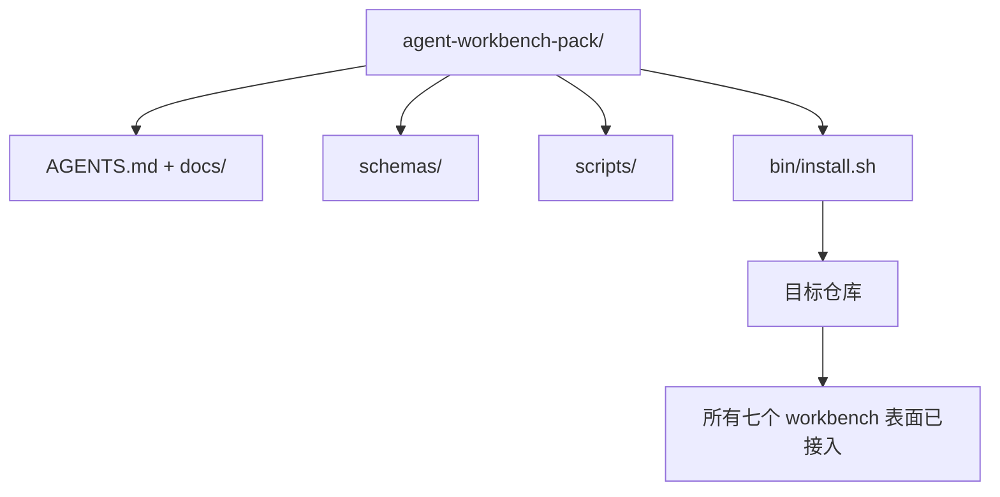

# 顶点项目：交付可复用的 Agent Workbench 包

> Mini-track 以一个你可以放入任何仓库的包结束。十一课的表面压缩到一个你可以 `cp -r` 并在第二天早上让 agent 可靠工作的目录中。顶点项目是本课程所依赖的产物。

**类型：** 构建
**语言：** Python（标准库）
**前置条件：** Phase 14 · 31 至 14 · 41
**时间：** 约 75 分钟

## 学习目标

- 将七个 workbench 表面打包到一个可直接放入的目录中。
- 固定 schema、脚本和模板，使新仓库获得已知良好的基线。
- 添加一个单一的安装脚本，幂等地放置包。
- 决定什么留在包中，什么留在外面，为每个裁剪辩护。

## 问题

一个存在于 Google Doc、聊天历史和三个半记得的脚本中的 workbench 是一个每季度都要重建的 workbench。解决方案是一个版本化的包：一个仓库或目录，包含表面、schema、脚本和一个单命令安装器。

你将以磁盘上交付的 `outputs/agent-workbench-pack/` 和一个将其放入任何目标仓库的 `bin/install.sh` 结束本课。

## 概念



### 包布局

```
outputs/agent-workbench-pack/
├── AGENTS.md
├── docs/
│   ├── agent-rules.md
│   ├── reliability-policy.md
│   ├── handoff-protocol.md
│   └── reviewer-rubric.md
├── schemas/
│   ├── agent_state.schema.json
│   ├── task_board.schema.json
│   └── scope_contract.schema.json
├── scripts/
│   ├── init_agent.py
│   ├── run_with_feedback.py
│   ├── verify_agent.py
│   └── generate_handoff.py
├── bin/
│   └── install.sh
└── README.md
```

### 什么留在里面，什么留在外面

里面：

- 表面 schema。它们是合约。
- 上述四个脚本。它们是运行时。
- 四个文档。它们是规则和评分标准。

外面：

- 项目特定任务。任务属于目标仓库的板，不属于包。
- 供应商 SDK 调用。包是框架无关的。
- 入职散文。包位于团队现有入职文档旁边，而非内部。

### 安装器

一个短的 `bin/install.sh`（或 `bin/install.py`）：

1. 拒绝在没有 `--force` 的情况下覆盖现有包。
2. 将包复制到目标仓库。
3. 如果存在 `.github/workflows/`，接入 CI。
4. 打印下一步：填写板，设置验收命令，运行初始化脚本。

### 版本控制

包携带 `VERSION` 文件。需要迁移的 schema 版本号提升和脚本变更提升主版本。仅文档变更提升补丁版本。目标仓库的 `agent_state.json` 记录它初始化时对应的包版本。

## 构建

`code/main.py` 将包组装到课程旁边的 `outputs/agent-workbench-pack/` 中，用本 mini-track 前面课程中的 schema 和脚本以及你已经编写的文档播种。

运行：

```
python3 code/main.py
```

脚本复制并固定表面，写入 README，打印包树，并退出零。重新运行是幂等的。

## 实际中的生产模式

包只有在经受分叉、更新和不友好的上游后才有价值。四个模式使其工作。

**`VERSION` 是合约，不是营销。** 主版本提升需要状态迁移。次版本提升需要检查器重新运行。补丁版本提升仅文档。安装器在每次安装时将 `.workbench-version` 写入目标仓库；如果目标的锁与包的 `VERSION` 不一致，`lint_pack.py` 拒绝交付。这就是 `npm`、`Cargo` 和 `pyproject.toml` 经受 10 年变化的方式；关于 agent 没有任何改变规则。

**跨工具分发的单一源。** Nx 提供一个 `nx ai-setup`，从单个配置放置 `AGENTS.md`、`CLAUDE.md`、`.cursor/rules/`、`.github/copilot-instructions.md` 和一个 MCP 服务器。包应该做同样的事；安装器发出符号链接（`ln -s AGENTS.md CLAUDE.md`），使单一真相源扇出到每个编码 agent。为支持一个工具而分叉包是失败模式。

**`uninstall.sh` 在非平凡状态上拒绝。** 卸载包不得删除用户的 `agent_state.json`、`task_board.json` 或 `outputs/`。卸载器删除 schema、脚本、文档和 `AGENTS.md`（带 `--keep-agents-md` 选择退出），如果状态文件有任何未提交的变更则拒绝继续。状态属于用户；包不拥有它。

**Skill 作为可发布。SkillKit 风格分发。** 包作为 SkillKit skill 交付：`skillkit install agent-workbench-pack` 从单一源跨 32 个 AI agent 放置它。包仓库是真相源；SkillKit 是分发渠道。供应商锁定崩溃；七个表面保持不变。

## 使用

包在三个地方交付：

- **作为你放入仓库的目录。** `cp -r outputs/agent-workbench-pack /path/to/repo`。
- **作为公共模板仓库。** 分叉并自定义，`VERSION` 控制漂移。
- **作为 SkillKit skill。** 接入你的 agent 产品，使单个命令放置它。

包是配方。每次安装是一份服务。

## 交付

`outputs/skill-workbench-pack.md` 生成项目调优的包：规则针对团队历史锐化，范围 glob 匹配仓库，评分标准维度扩展一个领域特定条目。

## 练习

1. 决定哪个可选的第五个文档值得提升到规范包中。为裁剪辩护。
2. 将安装器重写为带有 `--dry-run` 标志的 Python。比较与 bash 的人体工程学。
3. 添加 `bin/uninstall.sh`，安全地删除包，如果状态文件有非平凡历史则拒绝。什么算非平凡？
4. 添加 `lint_pack.py`，当包偏离 `VERSION` 时失败。将其接入包自己仓库的 CI。
5. 编写从手工 workbench 到此包的迁移运行手册。最小化停机时间的操作顺序是什么？

## 关键术语

| 术语 | 人们怎么说 | 实际含义 |
|------|----------|---------|
| Workbench 包 | "入门套件" | 携带所有七个表面的版本化目录 |
| 安装器 | "设置脚本" | 幂等放置包的 `bin/install.sh` |
| 包版本 | "VERSION" | Schema/脚本变更提升主版本，仅文档提升补丁 |
| 可直接放入的包 | "cp -r 即可" | 包在第一天无需每仓库自定义即可工作 |
| 可分叉模板 | "GitHub 模板" | GitHub 的"Use this template"可以克隆的公共仓库 |

## 扩展阅读

- Phase 14 · 31 至 14 · 41 — 此包捆绑的每个表面
- [SkillKit](https://github.com/rohitg00/skillkit) — 跨 32 个 AI agent 安装此 skill
- [Nx Blog, Teach Your AI Agent How to Work in a Monorepo](https://nx.dev/blog/nx-ai-agent-skills) — 跨六个工具的单源生成器
- [agents.md — 开放规范](https://agents.md/) — 你的包路由器必须实现的内容
- [HKUDS/OpenHarness](https://github.com/HKUDS/OpenHarness) — 包等价物的参考实现
- [andrewgarst/agentic_harness](https://github.com/andrewgarst/agentic_harness) — 带评估套件的 Redis 支持参考
- [Augment Code, A good AGENTS.md is a model upgrade](https://www.augmentcode.com/blog/how-to-write-good-agents-dot-md-files) — 包文档质量门槛
- [Anthropic, Effective harnesses for long-running agents](https://www.anthropic.com/engineering/effective-harnesses-for-long-running-agents)
- [Anthropic, Harness design for long-running application development](https://www.anthropic.com/engineering/harness-design-long-running-apps)
- Phase 14 · 30 — 消费包验证门的评估驱动 agent 开发
- Phase 14 · 41 — 此包改进的前后基准
